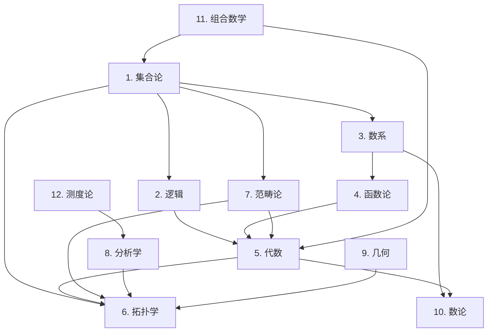

# 数学基础理论索引 (Mathematical Foundation Index)

## 📋 **目录**

### 1. [集合论](01_Set_Theory)

### 2. [逻辑](02_Logic)

### 3. [数系](03_Number_Systems)

### 4. [函数论](04_Function_Theory)

### 5. [代数](05_Algebra)

### 6. [拓扑学](06_Topology)

### 7. [范畴论](07_Category_Theory)

### 8. [分析学](08_Analysis)

### 9. [几何](09_Geometry)

### 10. [数论](10_Number_Theory)

### 11. [组合数学](11_Combinatorics)

### 12. [测度论](12_Measure_Theory)

---

## 🎯 **数学基础理论概述**

数学基础理论为形式科学体系提供严格的数学工具和结构。它建立了形式化推理的数学基础，确保所有理论在数学上的严谨性和一致性。

### 核心特征

1. **公理化严格性**：所有理论都基于严格的公理系统
2. **逻辑一致性**：确保数学结构的内在一致性
3. **抽象化能力**：提供高度抽象化的数学工具
4. **构造性方法**：支持构造性的数学证明
5. **形式化表示**：所有概念都有精确的形式化表示

### 理论层次

```text
┌─────────────────────────────────────────────────────────────────────────────┐
│                            数学理论综合                                     │
├─────────────────────────────────────────────────────────────────────────────┤
│ 几何 (09) │ 分析学 (08) │ 拓扑学 (06) │ 测度论 (12) │ 组合数学 (11) │
├─────────────────────────────────────────────────────────────────────────────┤
│ 代数 (05) │ 函数论 (04) │ 数系 (03) │ 范畴论 (07) │ 数论 (10) │
├─────────────────────────────────────────────────────────────────────────────┤
│                         逻辑 (02) │ 集合论 (01)                             │
└─────────────────────────────────────────────────────────────────────────────┘
```

---

## 🔗 **理论关联图**



---

## 📚 **详细主题结构**

### 1. [集合论1](01_Set_Theory)

- 朴素集合论
- 公理集合论
- 序数与基数
- 选择公理与连续统假设

### 2. [逻辑1](02_Logic)

- 命题逻辑
- 谓词逻辑
- 模态逻辑
- 直觉逻辑

### 3. [代数](05_Algebra)

- 关系
- 群论基础
- 环论基础
- 域论基础
- 模论基础

### 4. [拓扑学](06_Topology)

- 拓扑空间
- 连续映射
- 连通性
- 紧致性

### 5. [分析学](08_Analysis)

- 极限理论
- 连续性
- 微分学
- 积分学

### 6. [范畴论](07_Category_Theory)

- 范畴概念
- 函子理论
- 自然变换
- 极限理论

### 7. [数论](10_Number_Theory)

- 整除理论
- 同余理论
- 素数理论
- 二次剩余

### 8. [组合数学](11_Combinatorics)

- 计数原理
- 排列组合
- 生成函数
- 图论基础

---

## 🔄 **与其他理论的关联**

### 向上关联

- **哲学基础理论**：[01_Foundational_Theory](../01_Foundational_Theory/01_Philosophical_Foundation_Index.md)

### 向下关联

- **形式语言理论**：[03_Formal_Language_Theory](../03_Formal_Language_Theory/README.md)
- **类型理论**：[04_Type_Theory](../05_Type_Theory/01_Type_Theory_Index.md)

---

## 📖 **学习路径建议**

### 基础路径

1. 集合论基础 → 代数结构 → 拓扑学基础
2. 范畴论基础 → 序论基础 → 测度论基础
3. 递归论基础 → 模型论基础 → 数学理论综合

### 专业路径

- **代数方向**：代数结构 → 群论 → 环论 → 域论
- **拓扑方向**：拓扑学基础 → 代数拓扑 → 同伦论
- **逻辑方向**：集合论 → 递归论 → 模型论

---

## 🎯 **核心概念索引**

| 概念 | 定义位置 | 相关理论 |
|------|----------|----------|
| 集合 | [./01_Set_Theory/](01_Set_Theory) | 集合论 |
| 范畴 | [./07_Category_Theory/](07_Category_Theory) | 范畴论 |
| 群 | [./05_Algebra/](05_Algebra) | 代数 |
| 拓扑空间 | [./06_Topology/](06_Topology) | 拓扑学 |
| 测度 | [./12_Measure_Theory/](12_Measure_Theory) | 测度论 |
| 关系 | [./05_Algebra/](05_Algebra) | 代数 |
| 递归函数 | [./02_Logic/](02_Logic) | 逻辑 |
| 模型 | [./02_Logic/](02_Logic) | 逻辑 |

---

## 🔄 **持续更新**

**最后更新时间**：2024-12-20
**版本**：v1.0.0
**维护者**：数学基础理论重构团队

---

## 📋 **待完成任务**

- [ ] 创建所有子主题的详细文档
- [ ] 建立数学概念间的交叉引用系统
- [ ] 完善形式化证明和推导
- [ ] 构建数学理论与应用理论的桥梁

## 批判性分析

### 多元理论视角

**形式化基础视角**:

- 数学基础理论作为形式化科学的核心，需要从公理化、形式化、系统化的角度进行审视
- 集合论作为基础理论，在ZFC公理系统下存在哥德尔不完备性定理的挑战
- 范畴论提供了更抽象的数学结构描述方式，但可能过于抽象而难以直接应用

**认知科学视角**:

- 数学概念的形成与人类认知结构密切相关，需要从认知科学角度理解数学直觉
- 数学符号系统的演化反映了人类思维模式的演进
- 数学教育理论需要与认知发展理论相结合

**哲学视角**:

- 数学实在论与反实在论的争议：数学对象是否独立于人类思维存在
- 数学真理的本质：是发现的还是发明的
- 数学与逻辑的关系：数学是否可还原为逻辑

### 局限性分析

**理论基础局限性**:

- 集合论悖论（如罗素悖论）暴露了朴素集合论的局限性
- 哥德尔不完备性定理表明任何足够强的形式系统都存在不可证明的真命题
- 连续统假设的独立性表明集合论在描述无穷时的局限性

**应用局限性**:

- 抽象数学理论在实际应用中的转化困难
- 数学符号系统的复杂性增加了学习门槛
- 不同数学分支间的沟通障碍

**认知局限性**:

- 人类直觉在处理无穷概念时的局限性
- 抽象思维能力的个体差异
- 数学直觉与形式化证明之间的鸿沟

### 争议与分歧

**基础理论争议**:

- 直觉主义数学与经典数学的争议
- 构造性数学与存在性证明的争议
- 无穷小概念的严格化争议

**教育方法争议**:

- 传统演绎教学与发现式学习的争议
- 抽象理论与具体应用的平衡
- 数学史在数学教育中的作用

**应用导向争议**:

- 纯数学与应用数学的价值判断
- 数学在跨学科研究中的角色定位
- 数学工具化与理论深度的平衡

### 应用前景

**理论发展前景**:

- 范畴论在统一数学理论中的重要作用
- 同伦类型论作为新的数学基础的可能性
- 计算数学与形式化证明的结合

**跨学科应用前景**:

- 数学在人工智能和机器学习中的基础作用
- 数学在物理学、生物学等自然科学中的应用
- 数学在社会科学和经济学中的建模应用

**教育应用前景**:

- 数字化数学教育平台的发展
- 个性化数学学习系统的实现
- 数学思维能力的培养方法

### 改进建议

**理论体系改进**:

- 建立更统一的数学基础理论框架
- 发展更直观的数学概念表示方法
- 加强不同数学分支间的联系

**教学方法改进**:

- 采用多模态数学教学策略
- 结合数学史和数学哲学进行教学
- 发展基于问题的数学学习方法

**应用推广改进**:

- 建立数学理论与实际应用的桥梁
- 发展数学建模和仿真技术
- 加强数学在跨学科研究中的推广
