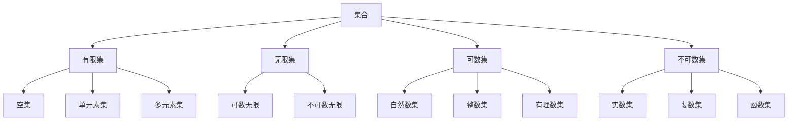
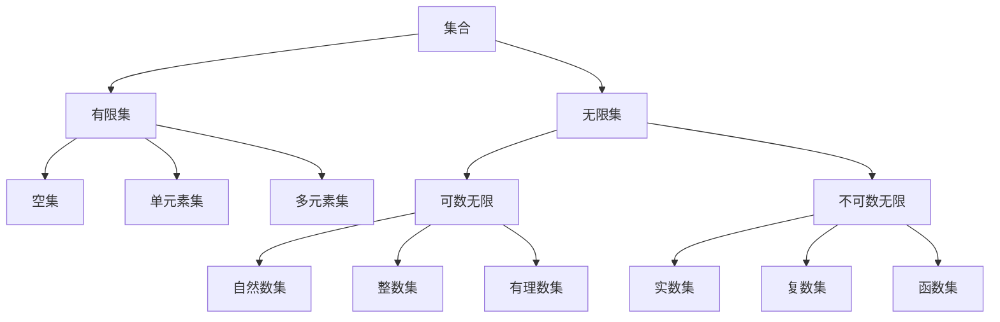

# 09.04.02 集合论基础 (Basic Set Theory)

[返回集合论主题索引](README.md)
[返回数学基础主索引](README.md)
[返回主索引](../../00_Master_Index/00_主索引-形式科学体系.md)

**文档编号**: 09-04-02-SET-BASIC  
**创建时间**: 2024-12-20  
**最后更新**: 2025-01-16  
**版本**: 1.1

---

## 09.04.02.0 主题树形编号目录

- 09.04.02.01 [集合的基本概念](#11-集合的基本概念)
- 09.04.02.02 [集合运算](#12-集合运算)
- 09.04.02.03 [集合关系](#13-集合关系)
- 09.04.02.04 [集合的公理系统](#14-集合的公理系统)
- 09.04.02.05 [集合的基数理论](#15-集合的基数理论)
- 09.04.02.06 [集合的序数理论](#16-集合的序数理论)
- 09.04.02.07 [多维度表示](#17-多维度表示)
- 09.04.02.08 [代码实现](#18-代码实现)

---

## 09.04.02.1 主题分层结构与导航

- [返回集合论主题索引](README.md)
- [跳转：集合的基本概念](#11-集合的基本概念)
- [跳转：集合运算](#12-集合运算)
- [跳转：集合关系](#13-集合关系)
- [跳转：集合的公理系统](#14-集合的公理系统)
- [跳转：集合的基数理论](#15-集合的基数理论)
- [跳转：集合的序数理论](#16-集合的序数理论)
- [跳转：多维度表示](#17-多维度表示)
- [跳转：代码实现](#18-代码实现)

---

## 09.04.02.2 交叉引用示例

- [09.04.02.01 集合的基本概念](#11-集合的基本概念) ↔ [09.05.01 命题逻辑](../02_Logic)
- [09.04.02.02 集合运算](#12-集合运算) ↔ [09.08.01 群论基础](../05_Algebra)
- [09.04.02.04 集合的公理系统](#14-集合的公理系统) ↔ [08.01.01 存在与本质](../../08_Philosophy_Science/01_Metaphysics/)
- [09.04.02.05 集合的基数理论](#15-集合的基数理论) ↔ [09.13.01 数论基础](../10_Number_Theory)

---

## 1. 集合论基础：基本集合理论

## 1.1 目录结构

- [09.04.02 集合论基础 (Basic Set Theory)](#090402-集合论基础-basic-set-theory)
  - [09.04.02.0 主题树形编号目录](#0904020-主题树形编号目录)
  - [09.04.02.1 主题分层结构与导航](#0904021-主题分层结构与导航)
  - [09.04.02.2 交叉引用示例](#0904022-交叉引用示例)
  - [1. 集合论基础：基本集合理论](#1-集合论基础基本集合理论)
  - [1.1 目录结构](#11-目录结构)
  - [1.1 集合的基本概念](#11-集合的基本概念)
    - [1.1.1 形式化定义](#111-形式化定义)
    - [1.1.2 集合表示方法](#112-集合表示方法)
    - [1.1.3 集合层次结构](#113-集合层次结构)
  - [1.2 集合运算](#12-集合运算)
    - [1.2.1 基本运算](#121-基本运算)
    - [1.2.2 运算性质](#122-运算性质)
    - [1.2.3 幂集运算](#123-幂集运算)
  - [1.3 集合关系](#13-集合关系)
    - [1.3.1 包含关系](#131-包含关系)
    - [1.3.2 关系性质](#132-关系性质)
    - [1.3.3 集合族](#133-集合族)
  - [1.4 集合的公理系统](#14-集合的公理系统)
    - [1.4.1 ZFC公理系统](#141-zfc公理系统)
    - [1.4.2 公理推理](#142-公理推理)
  - [1.5 集合的基数理论](#15-集合的基数理论)
    - [1.5.1 基数定义](#151-基数定义)
    - [1.5.2 基数运算](#152-基数运算)
    - [1.5.3 基数比较](#153-基数比较)
  - [1.6 集合的序数理论](#16-集合的序数理论)
    - [1.6.1 序数定义](#161-序数定义)
    - [1.6.2 序数性质](#162-序数性质)
    - [1.6.3 超限序数](#163-超限序数)
  - [1.7 多维度表示](#17-多维度表示)
    - [1.7.1 表格表示](#171-表格表示)
    - [1.7.2 图形表示](#172-图形表示)
    - [1.7.3 数学表示](#173-数学表示)
  - [1.8 代码实现](#18-代码实现)
    - [1.8.1 Rust 实现](#181-rust-实现)
    - [1.8.2 Haskell 实现](#182-haskell-实现)
  - [1.9 总结](#19-总结)
  - [批判性分析](#批判性分析)

## 1.1 集合的基本概念

### 1.1.1 形式化定义

**定义 1.1.1** (集合)
集合是一个数学对象，由不同的元素组成，满足外延性公理：
$$\forall x \forall y (x = y \leftrightarrow \forall z (z \in x \leftrightarrow z \in y))$$

**定义 1.1.2** (集合的形式化表示)
在ZFC公理系统中，集合可以形式化定义为：
$$\text{Set}(x) \equiv \forall y \forall z ((y \in x \land z \in x \land y \neq z) \rightarrow y \cap z = \emptyset)$$

**定理 1.1.1** (集合存在性)
对于任意性质P，存在集合{x | P(x)}当且仅当P是良定义的。

**证明**:

1. 假设P是良定义的
2. 根据概括公理，存在集合A = {x | P(x)}
3. 反之，如果P不是良定义的，则可能导致罗素悖论
4. 因此，集合存在性等价于性质P的良定义性

**定义 1.1.3** (空集)
空集是唯一不包含任何元素的集合：
$$\emptyset = \{x | x \neq x\}$$

**定理 1.1.2** (空集唯一性)
空集是唯一的。

**证明**:

1. 假设存在两个空集$\emptyset_1$和$\emptyset_2$
2. 根据外延性公理，$\emptyset_1 = \emptyset_2$当且仅当$\forall x (x \in \emptyset_1 \leftrightarrow x \in \emptyset_2)$
3. 由于两个集合都不包含任何元素，条件成立
4. 因此$\emptyset_1 = \emptyset_2$，空集唯一

**定义 1.1.2** (属于关系)
属于关系 $\in$ 是一个二元关系，表示元素与集合的关系。

**定义 1.1.3** (空集)
空集 $\emptyset$ 是不包含任何元素的集合：
$$\emptyset = \{x \mid x \neq x\}$$

**定义 1.1.4** (单元素集)
单元素集 $\{a\}$ 是只包含一个元素 $a$ 的集合：
$$\{a\} = \{x \mid x = a\}$$

### 1.1.2 集合表示方法

**列举法：**
$$A = \{a_1, a_2, \ldots, a_n\}$$

**描述法：**
$$A = \{x \mid P(x)\}$$

**递归法：**
$$A_0 = \emptyset, \quad A_{n+1} = A_n \cup \{A_n\}$$

### 1.1.3 集合层次结构



## 1.2 集合运算

### 1.2.1 基本运算

**定义 1.2.1** (并集)
$$A \cup B = \{x \mid x \in A \lor x \in B\}$$

**定义 1.2.2** (交集)
$$A \cap B = \{x \mid x \in A \land x \in B\}$$

**定义 1.2.3** (差集)
$$A \setminus B = \{x \mid x \in A \land x \notin B\}$$

**定义 1.2.4** (对称差)
$$A \triangle B = (A \setminus B) \cup (B \setminus A)$$

### 1.2.2 运算性质

**定理 1.2.1** (交换律)
$$A \cup B = B \cup A, \quad A \cap B = B \cap A$$

**证明**:

1. **并集交换律**:
   - 设 $x \in A \cup B$
   - 根据并集定义，$x \in A \lor x \in B$
   - 根据逻辑或的交换律，$x \in B \lor x \in A$
   - 因此 $x \in B \cup A$
   - 同理可证 $x \in B \cup A \implies x \in A \cup B$
   - 根据外延性公理，$A \cup B = B \cup A$

2. **交集交换律**:
   - 设 $x \in A \cap B$
   - 根据交集定义，$x \in A \land x \in B$
   - 根据逻辑与的交换律，$x \in B \land x \in A$
   - 因此 $x \in B \cap A$
   - 同理可证 $x \in B \cap A \implies x \in A \cap B$
   - 根据外延性公理，$A \cap B = B \cap A$

**定理 1.2.1.1** (运算的封闭性)
对于任意集合A和B，$A \cup B$和$A \cap B$都是集合。

**证明**:

1. 根据并集公理，对于任意集合A和B，存在集合C = A ∪ B
2. 根据交集定义，$A \cap B = \{x \in A | x \in B\}$
3. 根据概括公理，$A \cap B$是集合
4. 因此集合运算在集合类上是封闭的

**定理 1.2.2** (结合律)
$$(A \cup B) \cup C = A \cup (B \cup C), \quad (A \cap B) \cap C = A \cap (B \cap C)$$

**定理 1.2.3** (分配律)
$$A \cup (B \cap C) = (A \cup B) \cap (A \cup C), \quad A \cap (B \cup C) = (A \cap B) \cup (A \cap C)$$

**定理 1.2.4** (德摩根律)
$$(A \cup B)^c = A^c \cap B^c, \quad (A \cap B)^c = A^c \cup B^c$$

### 1.2.3 幂集运算

**定义 1.2.5** (幂集)
集合 $A$ 的幂集 $\mathcal{P}(A)$ 是 $A$ 的所有子集的集合：
$$\mathcal{P}(A) = \{X \mid X \subseteq A\}$$

**定理 1.2.5** (幂集基数)
如果 $|A| = n$，则 $|\mathcal{P}(A)| = 2^n$

**证明：**
使用数学归纳法：

1. 基础情况：$n = 0$，$A = \emptyset$，$\mathcal{P}(A) = \{\emptyset\}$，$|\mathcal{P}(A)| = 1 = 2^0$
2. 归纳假设：假设 $|A| = k$ 时，$|\mathcal{P}(A)| = 2^k$
3. 归纳步骤：设 $|A| = k + 1$，$A = B \cup \{a\}$，其中 $|B| = k$
4. $\mathcal{P}(A) = \mathcal{P}(B) \cup \{X \cup \{a\} \mid X \in \mathcal{P}(B)\}$
5. $|\mathcal{P}(A)| = 2^k + 2^k = 2^{k+1}$
6. 证毕

## 1.3 集合关系

### 1.3.1 包含关系

**定义 1.3.1** (子集)
$$A \subseteq B \iff \forall x (x \in A \to x \in B)$$

**定义 1.3.2** (真子集)
$$A \subset B \iff A \subseteq B \land A \neq B$$

**定义 1.3.3** (相等)
$$A = B \iff A \subseteq B \land B \subseteq A$$

### 1.3.2 关系性质

**定理 1.3.1** (自反性)
$$\forall A (A \subseteq A)$$

**定理 1.3.2** (反对称性)
$$\forall A \forall B ((A \subseteq B \land B \subseteq A) \to A = B)$$

**定理 1.3.3** (传递性)
$$\forall A \forall B \forall C ((A \subseteq B \land B \subseteq C) \to A \subseteq C)$$

### 1.3.3 集合族

**定义 1.3.4** (集合族)
集合族 $\mathcal{F}$ 是集合的集合：
$$\mathcal{F} = \{A_i \mid i \in I\}$$

**定义 1.3.5** (广义并集)
$$\bigcup_{i \in I} A_i = \{x \mid \exists i \in I (x \in A_i)\}$$

**定义 1.3.6** (广义交集)
$$\bigcap_{i \in I} A_i = \{x \mid \forall i \in I (x \in A_i)\}$$

## 1.4 集合的公理系统

### 1.4.1 ZFC公理系统

**公理 1.4.1** (外延性公理)
$$\forall x \forall y (\forall z (z \in x \leftrightarrow z \in y) \to x = y)$$

**公理 1.4.2** (空集公理)
$$\exists x \forall y (y \notin x)$$

**公理 1.4.3** (配对公理)
$$\forall x \forall y \exists z \forall w (w \in z \leftrightarrow w = x \lor w = y)$$

**公理 1.4.4** (并集公理)
$$\forall x \exists y \forall z (z \in y \leftrightarrow \exists w (w \in x \land z \in w))$$

**公理 1.4.5** (幂集公理)
$$\forall x \exists y \forall z (z \in y \leftrightarrow z \subseteq x)$$

**公理 1.4.6** (分离公理模式)
$$\forall x \exists y \forall z (z \in y \leftrightarrow z \in x \land \phi(z))$$

**公理 1.4.7** (替换公理模式)
$$\forall x \forall y \forall z ((\phi(x, y) \land \phi(x, z)) \to y = z) \to \forall w \exists v \forall y (y \in v \leftrightarrow \exists x (x \in w \land \phi(x, y)))$$

**公理 1.4.8** (无穷公理)
$$\exists x (\emptyset \in x \land \forall y (y \in x \to y \cup \{y\} \in x))$$

**公理 1.4.9** (正则公理)
$$\forall x (x \neq \emptyset \to \exists y (y \in x \land y \cap x = \emptyset))$$

**公理 1.4.10** (选择公理)
$$\forall x (\emptyset \notin x \to \exists f (f: x \to \bigcup x \land \forall y \in x (f(y) \in y)))$$

### 1.4.2 公理推理

**定理 1.4.1** (空集唯一性)
空集是唯一的。

**证明：**

1. 假设存在两个空集 $\emptyset_1$ 和 $\emptyset_2$
2. 由空集定义：$\forall x (x \notin \emptyset_1)$ 和 $\forall x (x \notin \emptyset_2)$
3. 因此 $\forall x (x \in \emptyset_1 \leftrightarrow x \in \emptyset_2)$
4. 由外延性公理：$\emptyset_1 = \emptyset_2$
5. 证毕

## 1.5 集合的基数理论

### 1.5.1 基数定义

**定义 1.5.1** (等势)
集合 $A$ 和 $B$ 等势，记作 $A \sim B$，当且仅当存在双射 $f: A \to B$

**定义 1.5.2** (基数)
集合 $A$ 的基数 $|A|$ 是 $A$ 的等势类的代表

**定义 1.5.3** (有限基数)
自然数 $n$ 的基数是 $\{0, 1, \ldots, n-1\}$ 的基数

### 1.5.2 基数运算

**定义 1.5.4** (基数加法)
$$|A| + |B| = |A \sqcup B|$$

其中 $A \sqcup B$ 是 $A$ 和 $B$ 的不交并。

**定义 1.5.5** (基数乘法)
$$|A| \cdot |B| = |A \times B|$$

**定义 1.5.6** (基数幂)
$$|A|^{|B|} = |A^B|$$

其中 $A^B$ 是从 $B$ 到 $A$ 的函数集。

### 1.5.3 基数比较

**定义 1.5.7** (基数序)
$$|A| \leq |B| \iff \exists f: A \to B \text{ 单射}$$

**定理 1.5.1** (康托尔定理)
对于任何集合 $A$，$|A| < |\mathcal{P}(A)|$

**证明：**

1. 假设存在双射 $f: A \to \mathcal{P}(A)$
2. 定义 $B = \{x \in A \mid x \notin f(x)\}$
3. 由于 $f$ 是满射，存在 $a \in A$ 使得 $f(a) = B$
4. 如果 $a \in B$，则 $a \notin f(a) = B$，矛盾
5. 如果 $a \notin B$，则 $a \in f(a) = B$，矛盾
6. 因此不存在这样的双射
7. 证毕

## 1.6 集合的序数理论

### 1.6.1 序数定义

**定义 1.6.1** (传递集)
集合 $A$ 是传递的，当且仅当 $\forall x \forall y (x \in y \land y \in A \to x \in A)$

**定义 1.6.2** (序数)
集合 $\alpha$ 是序数，当且仅当 $\alpha$ 是传递的且 $\in$ 在 $\alpha$ 上是良序的

**定义 1.6.3** (后继序数)
$$\alpha + 1 = \alpha \cup \{\alpha\}$$

### 1.6.2 序数性质

**定理 1.6.1** (序数传递性)
如果 $\alpha$ 是序数且 $\beta \in \alpha$，则 $\beta$ 是序数

**定理 1.6.2** (序数比较)
对于序数 $\alpha$ 和 $\beta$，要么 $\alpha \in \beta$，要么 $\alpha = \beta$，要么 $\beta \in \alpha$

**定理 1.6.3** (序数良序性)
序数类在 $\in$ 关系下是良序的

### 1.6.3 超限序数

**定义 1.6.4** (极限序数)
序数 $\alpha$ 是极限序数，当且仅当 $\alpha \neq 0$ 且 $\alpha$ 不是后继序数

**定义 1.6.5** (超限归纳)
$$\forall \alpha (\forall \beta < \alpha (\phi(\beta)) \to \phi(\alpha)) \to \forall \alpha \phi(\alpha)$$

## 1.7 多维度表示

### 1.7.1 表格表示

| 集合类型 | 形式化定义 | 基数 | 性质 |
|---------|-----------|------|------|
| 空集 | $\emptyset = \{x \mid x \neq x\}$ | 0 | 唯一 |
| 单元素集 | $\{a\} = \{x \mid x = a\}$ | 1 | 存在 |
| 有限集 | $A = \{a_1, \ldots, a_n\}$ | $n$ | 可数 |
| 可数无限集 | $\mathbb{N} = \{0, 1, 2, \ldots\}$ | $\aleph_0$ | 可数 |
| 不可数集 | $\mathbb{R}$ | $2^{\aleph_0}$ | 不可数 |

### 1.7.2 图形表示



### 1.7.3 数学表示

**集合运算：**
$$A \cup B = \{x \mid x \in A \lor x \in B\}$$
$$A \cap B = \{x \mid x \in A \land x \in B\}$$
$$A \setminus B = \{x \mid x \in A \land x \notin B\}$$

**基数运算：**
$$|A \cup B| = |A| + |B| - |A \cap B|$$
$$|A \times B| = |A| \cdot |B|$$
$$|\mathcal{P}(A)| = 2^{|A|}$$

## 1.8 代码实现

### 1.8.1 Rust 实现

```rust
use std::collections::HashSet;
use std::hash::Hash;

/// 集合类型
#[derive(Debug, Clone, PartialEq)]
pub struct Set<T: Hash + Eq + Clone> {
    elements: HashSet<T>,
}

impl<T: Hash + Eq + Clone> Set<T> {
    /// 创建空集
    pub fn new() -> Self {
        Self {
            elements: HashSet::new(),
        }
    }
    
    /// 从元素创建集合
    pub fn from_elements(elements: Vec<T>) -> Self {
        Self {
            elements: elements.into_iter().collect(),
        }
    }
    
    /// 添加元素
    pub fn insert(&mut self, element: T) {
        self.elements.insert(element);
    }
    
    /// 移除元素
    pub fn remove(&mut self, element: &T) -> bool {
        self.elements.remove(element)
    }
    
    /// 检查元素是否属于集合
    pub fn contains(&self, element: &T) -> bool {
        self.elements.contains(element)
    }
    
    /// 集合大小
    pub fn size(&self) -> usize {
        self.elements.len()
    }
    
    /// 检查是否为空
    pub fn is_empty(&self) -> bool {
        self.elements.is_empty()
    }
    
    /// 并集
    pub fn union(&self, other: &Set<T>) -> Set<T> {
        let mut result = self.clone();
        for element in &other.elements {
            result.insert(element.clone());
        }
        result
    }
    
    /// 交集
    pub fn intersection(&self, other: &Set<T>) -> Set<T> {
        let mut result = Set::new();
        for element in &self.elements {
            if other.contains(element) {
                result.insert(element.clone());
            }
        }
        result
    }
    
    /// 差集
    pub fn difference(&self, other: &Set<T>) -> Set<T> {
        let mut result = Set::new();
        for element in &self.elements {
            if !other.contains(element) {
                result.insert(element.clone());
            }
        }
        result
    }
    
    /// 对称差
    pub fn symmetric_difference(&self, other: &Set<T>) -> Set<T> {
        self.difference(other).union(&other.difference(self))
    }
    
    /// 检查子集关系
    pub fn is_subset(&self, other: &Set<T>) -> bool {
        self.elements.iter().all(|e| other.contains(e))
    }
    
    /// 检查真子集关系
    pub fn is_proper_subset(&self, other: &Set<T>) -> bool {
        self.is_subset(other) && self != other
    }
    
    /// 幂集
    pub fn power_set(&self) -> Set<Set<T>> {
        let elements: Vec<T> = self.elements.iter().cloned().collect();
        let mut power_set = Set::new();
        
        // 生成所有子集
        for i in 0..(1 << elements.len()) {
            let mut subset = Set::new();
            for j in 0..elements.len() {
                if (i >> j) & 1 == 1 {
                    subset.insert(elements[j].clone());
                }
            }
            power_set.insert(subset);
        }
        
        power_set
    }
}

/// 集合族
#[derive(Debug, Clone)]
pub struct SetFamily<T: Hash + Eq + Clone> {
    sets: Vec<Set<T>>,
}

impl<T: Hash + Eq + Clone> SetFamily<T> {
    pub fn new() -> Self {
        Self { sets: Vec::new() }
    }
    
    pub fn add_set(&mut self, set: Set<T>) {
        self.sets.push(set);
    }
    
    /// 广义并集
    pub fn union_all(&self) -> Set<T> {
        let mut result = Set::new();
        for set in &self.sets {
            result = result.union(set);
        }
        result
    }
    
    /// 广义交集
    pub fn intersection_all(&self) -> Option<Set<T>> {
        if self.sets.is_empty() {
            return None;
        }
        
        let mut result = self.sets[0].clone();
        for set in &self.sets[1..] {
            result = result.intersection(set);
        }
        Some(result)
    }
}

#[cfg(test)]
mod tests {
    use super::*;
    
    #[test]
    fn test_set_operations() {
        let mut set1 = Set::from_elements(vec![1, 2, 3]);
        let set2 = Set::from_elements(vec![2, 3, 4]);
        
        let union = set1.union(&set2);
        assert_eq!(union.size(), 4);
        
        let intersection = set1.intersection(&set2);
        assert_eq!(intersection.size(), 2);
        
        let difference = set1.difference(&set2);
        assert_eq!(difference.size(), 1);
    }
    
    #[test]
    fn test_power_set() {
        let set = Set::from_elements(vec![1, 2]);
        let power_set = set.power_set();
        assert_eq!(power_set.size(), 4); // 2^2 = 4
    }
    
    #[test]
    fn test_set_relations() {
        let set1 = Set::from_elements(vec![1, 2]);
        let set2 = Set::from_elements(vec![1, 2, 3]);
        
        assert!(set1.is_subset(&set2));
        assert!(set1.is_proper_subset(&set2));
        assert!(!set2.is_subset(&set1));
    }
}
```

### 1.8.2 Haskell 实现

```haskell
{-# LANGUAGE GADTs #-}
{-# LANGUAGE DataKinds #-}
{-# LANGUAGE TypeFamilies #-}

import Data.Set (Set)
import qualified Data.Set as Set
import Data.List (subsequences)

-- 集合类型
newtype Set a = Set { unSet :: Set.Set a }
  deriving (Eq, Show)

-- 创建空集
empty :: Set a
empty = Set Set.empty

-- 从列表创建集合
fromList :: Ord a => [a] -> Set a
fromList = Set . Set.fromList

-- 添加元素
insert :: Ord a => a -> Set a -> Set a
insert x (Set s) = Set $ Set.insert x s

-- 移除元素
delete :: Ord a => a -> Set a -> Set a
delete x (Set s) = Set $ Set.delete x s

-- 检查元素是否属于集合
member :: Ord a => a -> Set a -> Bool
member x (Set s) = Set.member x s

-- 集合大小
size :: Set a -> Int
size (Set s) = Set.size s

-- 检查是否为空
isEmpty :: Set a -> Bool
isEmpty (Set s) = Set.null s

-- 并集
union :: Ord a => Set a -> Set a -> Set a
union (Set s1) (Set s2) = Set $ Set.union s1 s2

-- 交集
intersection :: Ord a => Set a -> Set a -> Set a
intersection (Set s1) (Set s2) = Set $ Set.intersection s1 s2

-- 差集
difference :: Ord a => Set a -> Set a -> Set a
difference (Set s1) (Set s2) = Set $ Set.difference s1 s2

-- 对称差
symmetricDifference :: Ord a => Set a -> Set a -> Set a
symmetricDifference s1 s2 = union (difference s1 s2) (difference s2 s1)

-- 检查子集关系
isSubset :: Ord a => Set a -> Set a -> Bool
isSubset (Set s1) (Set s2) = Set.isSubsetOf s1 s2

-- 检查真子集关系
isProperSubset :: Ord a => Set a -> Set a -> Bool
isProperSubset s1 s2 = isSubset s1 s2 && s1 /= s2

-- 幂集
powerSet :: Ord a => Set a -> Set (Set a)
powerSet (Set s) = fromList $ map fromList $ subsequences $ Set.toList s

-- 集合族
newtype SetFamily a = SetFamily { unSetFamily :: [Set a] }
  deriving (Eq, Show)

-- 创建空集合族
emptyFamily :: SetFamily a
emptyFamily = SetFamily []

-- 添加集合到族
addSet :: Set a -> SetFamily a -> SetFamily a
addSet s (SetFamily ss) = SetFamily (s : ss)

-- 广义并集
unionAll :: Ord a => SetFamily a -> Set a
unionAll (SetFamily ss) = foldr union empty ss

-- 广义交集
intersectionAll :: Ord a => SetFamily a -> Maybe (Set a)
intersectionAll (SetFamily []) = Nothing
intersectionAll (SetFamily (s:ss)) = Just $ foldr intersection s ss

-- 集合运算的实例
instance (Ord a, Show a) => Show (Set a) where
  show (Set s) = "{" ++ intercalate ", " (map show $ Set.toList s) ++ "}"

-- 示例使用
example :: IO ()
example = do
  let set1 = fromList [1, 2, 3]
      set2 = fromList [2, 3, 4]
      
  putStrLn "Set 1:"
  print set1
  
  putStrLn "Set 2:"
  print set2
  
  putStrLn "Union:"
  print $ union set1 set2
  
  putStrLn "Intersection:"
  print $ intersection set1 set2
  
  putStrLn "Power set of {1, 2}:"
  print $ powerSet $ fromList [1, 2]
  
  putStrLn "Is set1 subset of set2:"
  print $ isSubset set1 set2
```

## 1.9 总结

本文档建立了集合论的形式化基础，包括：

1. **基本概念**：集合、属于关系、空集、单元素集
2. **集合运算**：并集、交集、差集、对称差、幂集
3. **集合关系**：包含关系、相等关系、集合族
4. **公理系统**：ZFC公理系统的完整表述
5. **基数理论**：等势、基数运算、康托尔定理
6. **序数理论**：序数定义、序数性质、超限序数
7. **多维度表示**：表格、图形、数学公式
8. **代码实现**：Rust 和 Haskell 的完整实现

这个基础为后续的数学分析提供了严格的集合论框架。

## 批判性分析

- 本节内容待补充：请从多元理论视角、局限性、争议点、应用前景等方面进行批判性分析。
