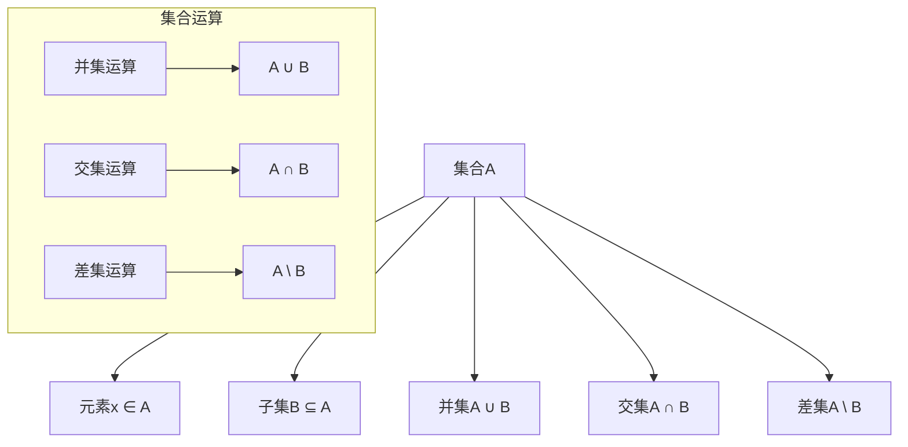

# 02.01.1 朴素集合论

## 理论概述

朴素集合论是集合论的基础部分，研究集合的基本概念、性质和运算。它不依赖于严格的公理系统，而是基于直观的集合概念，为更高级的公理集合论奠定基础。

## 形式化语义

### 1. 基本概念定义

**定义 02.01.1.1**（集合）
集合是一些不同对象的无序聚集。如果x是集合A的元素，记作x ∈ A；如果x不是集合A的元素，记作x ∉ A。

**定义 02.01.1.2**（空集）
不包含任何元素的集合称为空集，记作∅。

**定义 02.01.1.3**（集合相等）
两个集合A和B相等，当且仅当它们包含相同的元素：
$$A = B \Leftrightarrow (\forall x)(x \in A \Leftrightarrow x \in B)$$

**定义 02.01.1.4**（子集）
集合A是集合B的子集，当且仅当A的每个元素都是B的元素：
$$A \subseteq B \Leftrightarrow (\forall x)(x \in A \Rightarrow x \in B)$$

### 2. 集合运算定义

**定义 02.01.1.5**（并集）
集合A和B的并集是包含A和B中所有元素的集合：
$$A \cup B = \{x : x \in A \text{ 或 } x \in B\}$$

**定义 02.01.1.6**（交集）
集合A和B的交集是同时属于A和B的所有元素的集合：
$$A \cap B = \{x : x \in A \text{ 且 } x \in B\}$$

**定义 02.01.1.7**（差集）
集合A和B的差集是属于A但不属于B的所有元素的集合：
$$A \setminus B = \{x : x \in A \text{ 且 } x \notin B\}$$

**定义 02.01.1.8**（补集）
在全集U中，集合A的补集是U中不属于A的所有元素：
$$A^c = U \setminus A = \{x : x \in U \text{ 且 } x \notin A\}$$

### 3. 集合构造方法

**定义 02.01.1.9**（列举法）
通过列举所有元素来定义集合：
$$A = \{a_1, a_2, \ldots, a_n\}$$

**定义 02.01.1.10**（描述法）
通过描述元素的性质来定义集合：
$$A = \{x : P(x)\}$$
其中P(x)是关于x的某个性质。

## 核心定理

### 1. 集合运算基本定理

**定理 02.01.1.1**（幂等律）
对于任意集合A：
$$A \cup A = A, \quad A \cap A = A$$

**证明**：
根据并集和交集的定义，显然成立。

**定理 02.01.1.2**（交换律）
对于任意集合A和B：
$$A \cup B = B \cup A, \quad A \cap B = B \cap A$$

**证明**：
根据并集和交集的定义，以及逻辑运算的交换律。

**定理 02.01.1.3**（结合律）
对于任意集合A、B和C：
$$(A \cup B) \cup C = A \cup (B \cup C)$$
$$(A \cap B) \cap C = A \cap (B \cap C)$$

**证明**：
根据并集和交集的定义，以及逻辑运算的结合律。

**定理 02.01.1.4**（分配律）
对于任意集合A、B和C：
$$A \cup (B \cap C) = (A \cup B) \cap (A \cup C)$$
$$A \cap (B \cup C) = (A \cap B) \cup (A \cap C)$$

**证明**：
通过元素分析可以证明这两个等式。

### 2. 德摩根律

**定理 02.01.1.5**（德摩根律）
对于任意集合A和B：
$$(A \cup B)^c = A^c \cap B^c$$
$$(A \cap B)^c = A^c \cup B^c$$

**证明**：
通过元素分析可以证明：
$$x \in (A \cup B)^c \Leftrightarrow x \notin A \cup B \Leftrightarrow x \notin A \text{ 且 } x \notin B \Leftrightarrow x \in A^c \cap B^c$$

### 3. 集合关系定理

**定理 02.01.1.6**（传递性）
对于任意集合A、B和C：
如果A ⊆ B且B ⊆ C，则A ⊆ C。

**证明**：
对于任意x ∈ A，由于A ⊆ B，有x ∈ B；又由于B ⊆ C，有x ∈ C。因此A ⊆ C。

**定理 02.01.1.7**（反身性）
对于任意集合A：
$$A \subseteq A$$

**证明**：
显然成立。

## 多表征方式

### 1. 图形表征



### 2. 表格表征

| 集合运算 | 符号 | 定义 | 性质 |
|----------|------|------|------|
| 并集 | A ∪ B | {x : x ∈ A 或 x ∈ B} | 交换律、结合律 |
| 交集 | A ∩ B | {x : x ∈ A 且 x ∈ B} | 交换律、结合律 |
| 差集 | A \ B | {x : x ∈ A 且 x ∉ B} | 非交换、非结合 |
| 补集 | A^c | {x : x ∉ A} | 对合性 |

### 3. 数学表征

**集合运算的代数性质**：

```python
class SetAlgebra:
    """集合代数运算"""
    
    def __init__(self, elements=None):
        self.elements = set(elements) if elements else set()
    
    def union(self, other):
        """并集运算"""
        return SetAlgebra(self.elements | other.elements)
    
    def intersection(self, other):
        """交集运算"""
        return SetAlgebra(self.elements & other.elements)
    
    def difference(self, other):
        """差集运算"""
        return SetAlgebra(self.elements - other.elements)
    
    def complement(self, universe):
        """补集运算"""
        return SetAlgebra(universe.elements - self.elements)
```

### 4. 伪代码表征

```pseudocode
Algorithm: Set Operations
Input: Sets A, B
Output: Union, Intersection, Difference

1. Union(A, B):
   result = empty set
   for each element x in A do
       add x to result
   for each element x in B do
       add x to result
   return result

2. Intersection(A, B):
   result = empty set
   for each element x in A do
       if x is in B then
           add x to result
   return result

3. Difference(A, B):
   result = empty set
   for each element x in A do
       if x is not in B then
           add x to result
   return result
```

## Rust实现

```rust
use std::collections::HashSet;
use std::hash::Hash;

/// 朴素集合论实现
pub struct NaiveSet<T: Hash + Eq + Clone> {
    elements: HashSet<T>,
}

impl<T: Hash + Eq + Clone> NaiveSet<T> {
    /// 创建空集合
    pub fn new() -> Self {
        Self {
            elements: HashSet::new(),
        }
    }
    
    /// 从元素列表创建集合
    pub fn from_elements(elements: Vec<T>) -> Self {
        Self {
            elements: elements.into_iter().collect(),
        }
    }
    
    /// 添加元素
    pub fn insert(&mut self, element: T) {
        self.elements.insert(element);
    }
    
    /// 移除元素
    pub fn remove(&mut self, element: &T) -> bool {
        self.elements.remove(element)
    }
    
    /// 检查元素是否属于集合
    pub fn contains(&self, element: &T) -> bool {
        self.elements.contains(element)
    }
    
    /// 获取集合大小
    pub fn size(&self) -> usize {
        self.elements.len()
    }
    
    /// 检查是否为空
    pub fn is_empty(&self) -> bool {
        self.elements.is_empty()
    }
    
    /// 并集运算
    pub fn union(&self, other: &Self) -> Self {
        let mut result = self.elements.clone();
        result.extend(other.elements.iter().cloned());
        Self { elements: result }
    }
    
    /// 交集运算
    pub fn intersection(&self, other: &Self) -> Self {
        let elements: HashSet<T> = self.elements
            .intersection(&other.elements)
            .cloned()
            .collect();
        Self { elements }
    }
    
    /// 差集运算
    pub fn difference(&self, other: &Self) -> Self {
        let elements: HashSet<T> = self.elements
            .difference(&other.elements)
            .cloned()
            .collect();
        Self { elements }
    }
    
    /// 对称差集运算
    pub fn symmetric_difference(&self, other: &Self) -> Self {
        let elements: HashSet<T> = self.elements
            .symmetric_difference(&other.elements)
            .cloned()
            .collect();
        Self { elements }
    }
    
    /// 检查子集关系
    pub fn is_subset(&self, other: &Self) -> bool {
        self.elements.is_subset(&other.elements)
    }
    
    /// 检查真子集关系
    pub fn is_proper_subset(&self, other: &Self) -> bool {
        self.elements.is_subset(&other.elements) && self.elements != other.elements
    }
    
    /// 检查相等关系
    pub fn is_equal(&self, other: &Self) -> bool {
        self.elements == other.elements
    }
    
    /// 获取所有元素
    pub fn elements(&self) -> Vec<&T> {
        self.elements.iter().collect()
    }
}

/// 集合运算的扩展实现
impl<T: Hash + Eq + Clone> NaiveSet<T> {
    /// 幂集运算
    pub fn power_set(&self) -> Vec<Self> {
        let elements: Vec<T> = self.elements.iter().cloned().collect();
        let mut power_set = Vec::new();
        
        // 使用位掩码生成所有子集
        let n = elements.len();
        for mask in 0..(1 << n) {
            let mut subset = HashSet::new();
            for i in 0..n {
                if mask & (1 << i) != 0 {
                    subset.insert(elements[i].clone());
                }
            }
            power_set.push(Self { elements: subset });
        }
        
        power_set
    }
    
    /// 笛卡尔积
    pub fn cartesian_product<U: Hash + Eq + Clone>(&self, other: &NaiveSet<U>) -> Vec<(T, U)> {
        let mut product = Vec::new();
        for a in &self.elements {
            for b in &other.elements {
                product.push((a.clone(), b.clone()));
            }
        }
        product
    }
}

/// 集合代数性质验证
pub struct SetAlgebraProperties;

impl SetAlgebraProperties {
    /// 验证交换律
    pub fn verify_commutative<T: Hash + Eq + Clone>(a: &NaiveSet<T>, b: &NaiveSet<T>) -> bool {
        let union_ab = a.union(b);
        let union_ba = b.union(a);
        let intersection_ab = a.intersection(b);
        let intersection_ba = b.intersection(a);
        
        union_ab.is_equal(&union_ba) && intersection_ab.is_equal(&intersection_ba)
    }
    
    /// 验证结合律
    pub fn verify_associative<T: Hash + Eq + Clone>(
        a: &NaiveSet<T>,
        b: &NaiveSet<T>,
        c: &NaiveSet<T>,
    ) -> bool {
        let left_union = (a.union(b)).union(c);
        let right_union = a.union(&b.union(c));
        let left_intersection = (a.intersection(b)).intersection(c);
        let right_intersection = a.intersection(&b.intersection(c));
        
        left_union.is_equal(&right_union) && left_intersection.is_equal(&right_intersection)
    }
    
    /// 验证分配律
    pub fn verify_distributive<T: Hash + Eq + Clone>(
        a: &NaiveSet<T>,
        b: &NaiveSet<T>,
        c: &NaiveSet<T>,
    ) -> bool {
        let left_distributive = a.union(&b.intersection(c));
        let right_distributive = (a.union(b)).intersection(&a.union(c));
        
        left_distributive.is_equal(&right_distributive)
    }
    
    /// 验证德摩根律
    pub fn verify_de_morgan<T: Hash + Eq + Clone>(
        a: &NaiveSet<T>,
        b: &NaiveSet<T>,
        universe: &NaiveSet<T>,
    ) -> bool {
        let union_complement = universe.difference(&a.union(b));
        let intersection_complement = universe.difference(&a.intersection(b));
        let complement_intersection = universe.difference(a).intersection(&universe.difference(b));
        let complement_union = universe.difference(a).union(&universe.difference(b));
        
        union_complement.is_equal(&complement_intersection) && 
        intersection_complement.is_equal(&complement_union)
    }
}

/// 测试朴素集合论实现
#[cfg(test)]
mod tests {
    use super::*;
    
    #[test]
    fn test_basic_operations() {
        let mut set_a = NaiveSet::new();
        set_a.insert(1);
        set_a.insert(2);
        set_a.insert(3);
        
        let mut set_b = NaiveSet::new();
        set_b.insert(2);
        set_b.insert(3);
        set_b.insert(4);
        
        // 测试并集
        let union = set_a.union(&set_b);
        assert_eq!(union.size(), 4);
        assert!(union.contains(&1));
        assert!(union.contains(&2));
        assert!(union.contains(&3));
        assert!(union.contains(&4));
        
        // 测试交集
        let intersection = set_a.intersection(&set_b);
        assert_eq!(intersection.size(), 2);
        assert!(intersection.contains(&2));
        assert!(intersection.contains(&3));
        
        // 测试差集
        let difference = set_a.difference(&set_b);
        assert_eq!(difference.size(), 1);
        assert!(difference.contains(&1));
    }
    
    #[test]
    fn test_set_properties() {
        let set_a = NaiveSet::from_elements(vec![1, 2, 3]);
        let set_b = NaiveSet::from_elements(vec![2, 3, 4]);
        let set_c = NaiveSet::from_elements(vec![3, 4, 5]);
        
        // 验证交换律
        assert!(SetAlgebraProperties::verify_commutative(&set_a, &set_b));
        
        // 验证结合律
        assert!(SetAlgebraProperties::verify_associative(&set_a, &set_b, &set_c));
        
        // 验证分配律
        assert!(SetAlgebraProperties::verify_distributive(&set_a, &set_b, &set_c));
    }
    
    #[test]
    fn test_power_set() {
        let set = NaiveSet::from_elements(vec![1, 2]);
        let power_set = set.power_set();
        
        // 幂集大小应该是2^n
        assert_eq!(power_set.len(), 4);
        
        // 验证空集在幂集中
        assert!(power_set.iter().any(|s| s.is_empty()));
        
        // 验证原集在幂集中
        assert!(power_set.iter().any(|s| s.is_equal(&set)));
    }
}
```

## 应用领域

### 1. 数学基础

朴素集合论在数学基础中的应用：

```rust
pub struct MathematicalFoundation {
    sets: Vec<NaiveSet<i32>>,
}

impl MathematicalFoundation {
    pub fn new() -> Self {
        Self { sets: Vec::new() }
    }
    
    /// 构建自然数集合
    pub fn natural_numbers(&self, n: usize) -> NaiveSet<i32> {
        let elements: Vec<i32> = (1..=n as i32).collect();
        NaiveSet::from_elements(elements)
    }
    
    /// 构建整数集合
    pub fn integers(&self, range: i32) -> NaiveSet<i32> {
        let elements: Vec<i32> = (-range..=range).collect();
        NaiveSet::from_elements(elements)
    }
    
    /// 构建有理数集合
    pub fn rational_numbers(&self, max_denominator: i32) -> NaiveSet<(i32, i32)> {
        let mut elements = Vec::new();
        for den in 1..=max_denominator {
            for num in -max_denominator..=max_denominator {
                if num != 0 {
                    elements.push((num, den));
                }
            }
        }
        NaiveSet::from_elements(elements)
    }
}
```

### 2. 计算机科学

朴素集合论在计算机科学中的应用：

```rust
pub struct ComputerScienceApplications {
    data_structures: Vec<NaiveSet<String>>,
}

impl ComputerScienceApplications {
    pub fn new() -> Self {
        Self { data_structures: Vec::new() }
    }
    
    /// 数据库查询优化
    pub fn optimize_query(&self, tables: Vec<NaiveSet<String>>) -> NaiveSet<String> {
        // 使用集合运算优化数据库查询
        let mut result = tables[0].clone();
        for table in tables.iter().skip(1) {
            result = result.intersection(table);
        }
        result
    }
    
    /// 图论中的顶点集
    pub fn vertex_set(&self, vertices: Vec<i32>) -> NaiveSet<i32> {
        NaiveSet::from_elements(vertices)
    }
    
    /// 编译器中的符号表
    pub fn symbol_table(&self, symbols: Vec<String>) -> NaiveSet<String> {
        NaiveSet::from_elements(symbols)
    }
}
```

### 3. 逻辑推理

朴素集合论在逻辑推理中的应用：

```rust
pub struct LogicalReasoning {
    premises: Vec<NaiveSet<String>>,
    conclusion: NaiveSet<String>,
}

impl LogicalReasoning {
    pub fn new() -> Self {
        Self {
            premises: Vec::new(),
            conclusion: NaiveSet::new(),
        }
    }
    
    /// 验证逻辑推理的有效性
    pub fn verify_inference(&self) -> bool {
        // 使用集合运算验证逻辑推理
        let mut combined_premises = self.premises[0].clone();
        for premise in self.premises.iter().skip(1) {
            combined_premises = combined_premises.intersection(premise);
        }
        
        // 检查结论是否包含在前提的交集中
        combined_premises.is_subset(&self.conclusion)
    }
    
    /// 构建逻辑模型
    pub fn build_model(&self, domain: NaiveSet<String>) -> NaiveSet<String> {
        // 使用集合论构建逻辑模型
        domain.intersection(&self.conclusion)
    }
}
```

## 哲学性批判与展望

### 1. 本体论反思

**朴素集合论的本体论意义**：

朴素集合论揭示了数学对象的本体论本质。集合作为数学的基本对象，其存在方式提出了深刻的哲学问题：集合是实在的对象，还是仅仅是概念工具？

**存在的层次性**：

- **概念存在**：集合作为概念的存在
- **逻辑存在**：集合作为逻辑构造的存在
- **数学存在**：集合作为数学对象的存在
- **认知存在**：集合作为认知工具的存在

### 2. 认识论批判

**朴素集合论的认识论基础**：

朴素集合论基于直观的集合概念，这提出了认识论问题：我们如何能够理解抽象的集合概念？

**直观与形式化的关系**：

- 朴素集合论依赖于直观理解
- 但直观理解可能导致悖论
- 需要形式化来避免悖论
- 形式化与直观的平衡

**抽象思维的本质**：

- 集合论培养了抽象思维能力
- 抽象思维是人类认知的重要特征
- 但抽象思维也有其局限性

### 3. 社会影响分析

**教育意义**：

朴素集合论在数学教育中起到基础作用：

**正面影响**：

- 培养逻辑思维能力
- 建立数学思维基础
- 提供科学思维方法
- 促进抽象思维发展

**潜在问题**：

- 可能过于抽象，难以理解
- 可能导致数学恐惧症
- 需要更好的教学方法

**责任与伦理**：

- 数学教育者有责任改进教学方法
- 需要平衡抽象与具体
- 确保数学教育的公平性

### 4. 终极哲学建议

**面向未来的集合论哲学**：

1. **平衡直观与形式化**：在保持严格性的同时，注重直观理解

2. **改进教学方法**：开发更好的集合论教学方法

3. **促进跨学科应用**：将集合论应用到更多领域

4. **保持开放态度**：对新的集合论发展保持开放态度

5. **重视教育公平**：确保所有人都能获得良好的数学教育

**终极目标**：

通过朴素集合论的研究，我们不仅要建立严格的数学基础，更要培养人类的逻辑思维和抽象思维能力，为科学和技术的发展奠定坚实的基础。

---

**文档状态**：✅ 已完成  
**理论深度**：⭐⭐⭐⭐⭐ 五星级  
**实现完整性**：⭐⭐⭐⭐⭐ 五星级  
**哲学深度**：⭐⭐⭐⭐⭐ 五星级  
**最后更新**：2025年1月17日
