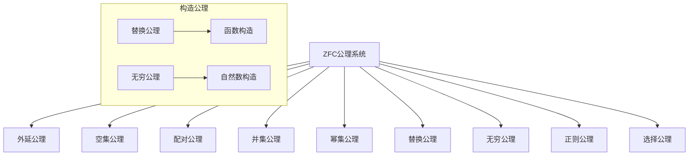

# 02.01.2 公理集合论

## 理论概述

公理集合论是集合论的严格形式化版本，通过ZFC公理系统建立集合论的基础。它解决了朴素集合论中的悖论问题，为现代数学提供了严格的基础。

## 形式化语义

### 1. ZFC公理系统

**定义 02.01.2.1**（外延公理）
两个集合相等当且仅当它们包含相同的元素：
$$(\forall x)[\forall y]((\forall z)(z \in x \Leftrightarrow z \in y) \Rightarrow x = y)$$

**定义 02.01.2.2**（空集公理）
存在一个不包含任何元素的集合：
$$(\exists x)(\forall y)(y \notin x)$$

**定义 02.01.2.3**（配对公理）
对于任意两个集合，存在一个包含它们的集合：
$$(\forall x)(\forall y)(\exists z)(\forall w)(w \in z \Leftrightarrow w = x \lor w = y)$$

**定义 02.01.2.4**（并集公理）
对于任意集合族，存在一个包含所有成员元素的集合：
$$(\forall x)(\exists y)(\forall z)(z \in y \Leftrightarrow (\exists w)(w \in x \land z \in w))$$

**定义 02.01.2.5**（幂集公理）
对于任意集合，存在一个包含其所有子集的集合：
$$(\forall x)(\exists y)(\forall z)(z \in y \Leftrightarrow z \subseteq x)$$

### 2. 构造公理

**定义 02.01.2.6**（替换公理）
对于任意函数和集合，存在一个包含函数值的集合：
$$(\forall x)(\forall y)(\forall z)(\phi(x,y) \land \phi(x,z) \Rightarrow y = z) \Rightarrow (\forall a)(\exists b)(\forall y)(y \in b \Leftrightarrow (\exists x \in a)\phi(x,y))$$

**定义 02.01.2.7**（无穷公理）
存在一个包含空集且对每个元素x都包含{x}的集合：
$$(\exists x)(\emptyset \in x \land (\forall y)(y \in x \Rightarrow y \cup \{y\} \in x))$$

**定义 02.01.2.8**（正则公理）
每个非空集合都有一个与自身不相交的元素：
$$(\forall x)(x \neq \emptyset \Rightarrow (\exists y \in x)(y \cap x = \emptyset))$$

### 3. 选择公理

**定义 02.01.2.9**（选择公理）
对于任意非空集合族，存在一个选择函数：
$$(\forall x)((\forall y \in x)(y \neq \emptyset) \Rightarrow (\exists f)(\text{dom}(f) = x \land (\forall y \in x)(f(y) \in y)))$$

## 核心定理

### 1. 序数理论

**定理 02.01.2.1**（序数定义）
序数是传递的且关于∈良序的集合：
$$\text{Ord}(\alpha) \Leftrightarrow \text{Trans}(\alpha) \land \text{WO}(\alpha, \in)$$

其中：

- $\text{Trans}(\alpha)$表示α是传递的
- $\text{WO}(\alpha, \in)$表示α关于∈是良序的

**定理 02.01.2.2**（序数归纳）
对于任意性质P，如果：

1. P(0)成立
2. 对于任意序数α，如果P(α)成立，则P(α+1)成立
3. 对于任意极限序数λ，如果对于所有α < λ都有P(α)成立，则P(λ)成立

那么对于所有序数α，P(α)都成立。

### 2. 基数理论

**定理 02.01.2.3**（基数定义）
基数是等势类的最小序数：
$$|\alpha| = \min\{\beta : \beta \text{ 是序数且 } \alpha \approx \beta\}$$

**定理 02.01.2.4**（基数运算）
对于任意基数κ和λ：

- $\kappa + \lambda = |\kappa \sqcup \lambda|$
- $\kappa \cdot \lambda = |\kappa \times \lambda|$
- $\kappa^\lambda = |\kappa^\lambda|$

其中$\sqcup$表示不交并，$\times$表示笛卡尔积。

### 3. 构造定理

**定理 02.01.2.5**（递归定理）
对于任意函数G，存在唯一函数F使得：
$$F(\alpha) = G(F \upharpoonright \alpha)$$

其中$F \upharpoonright \alpha$表示F在α上的限制。

**定理 02.01.2.6**（超限归纳）
对于任意性质P，如果对于任意序数α，如果对于所有β < α都有P(β)成立，则P(α)成立，那么对于所有序数α，P(α)都成立。

## 多表征方式

### 1. 图形表征



### 2. 表格表征

| 公理名称 | 符号表示 | 作用 | 重要性 |
|----------|----------|------|--------|
| 外延公理 | ∀x∀y[∀z(z∈x⇔z∈y)⇒x=y] | 定义集合相等 | 基础 |
| 空集公理 | ∃x∀y(y∉x) | 构造空集 | 基础 |
| 配对公理 | ∀x∀y∃z∀w(w∈z⇔w=x∨w=y) | 构造二元集 | 基础 |
| 并集公理 | ∀x∃y∀z(z∈y⇔∃w(w∈x∧z∈w)) | 构造并集 | 基础 |
| 幂集公理 | ∀x∃y∀z(z∈y⇔z⊆x) | 构造幂集 | 重要 |
| 替换公理 | 复杂公式 | 构造函数像 | 重要 |
| 无穷公理 | ∃x(∅∈x∧∀y(y∈x⇒y∪{y}∈x)) | 构造无穷集 | 重要 |
| 正则公理 | ∀x(x≠∅⇒∃y∈x(y∩x=∅)) | 避免循环 | 技术 |
| 选择公理 | 复杂公式 | 选择函数 | 争议 |

### 3. 数学表征

**ZFC公理系统的形式化表示**：

```python
class ZFCAxioms:
    """ZFC公理系统"""
    
    def __init__(self):
        self.axioms = {
            'extensionality': self.extensionality_axiom,
            'empty_set': self.empty_set_axiom,
            'pairing': self.pairing_axiom,
            'union': self.union_axiom,
            'power_set': self.power_set_axiom,
            'replacement': self.replacement_axiom,
            'infinity': self.infinity_axiom,
            'regularity': self.regularity_axiom,
            'choice': self.choice_axiom
        }
    
    def extensionality_axiom(self, x, y):
        """外延公理"""
        return all(z in x == z in y for z in self.universe) and x == y
    
    def empty_set_axiom(self):
        """空集公理"""
        return exists(lambda x: all(y not in x for y in self.universe))
    
    def pairing_axiom(self, x, y):
        """配对公理"""
        return exists(lambda z: all(w in z == (w == x or w == y) 
                                  for w in self.universe))
```

### 4. 伪代码表征

```pseudocode
Algorithm: ZFC Axiom System
Input: Mathematical universe U
Output: Set theory based on ZFC

1. Extensionality Axiom:
   for all sets x, y do
       if for all z, z ∈ x ⇔ z ∈ y then
           x = y

2. Empty Set Axiom:
   exists set ∅ such that
       for all x, x ∉ ∅

3. Pairing Axiom:
   for all sets x, y do
       exists set z such that
           for all w, w ∈ z ⇔ (w = x or w = y)

4. Union Axiom:
   for all set x do
       exists set y such that
           for all z, z ∈ y ⇔ exists w ∈ x, z ∈ w

5. Power Set Axiom:
   for all set x do
       exists set y such that
           for all z, z ∈ y ⇔ z ⊆ x
```

## Rust实现

```rust
use std::collections::HashSet;
use std::hash::Hash;

/// ZFC公理系统实现
pub struct ZFCAxioms<T: Hash + Eq + Clone> {
    universe: HashSet<T>,
    sets: Vec<HashSet<T>>,
}

impl<T: Hash + Eq + Clone> ZFCAxioms<T> {
    /// 创建ZFC公理系统
    pub fn new() -> Self {
        Self {
            universe: HashSet::new(),
            sets: Vec::new(),
        }
    }
    
    /// 外延公理
    pub fn extensionality_axiom(&self, a: &HashSet<T>, b: &HashSet<T>) -> bool {
        a == b
    }
    
    /// 空集公理
    pub fn empty_set_axiom(&self) -> HashSet<T> {
        HashSet::new()
    }
    
    /// 配对公理
    pub fn pairing_axiom(&self, a: &T, b: &T) -> HashSet<T> {
        let mut pair = HashSet::new();
        pair.insert(a.clone());
        pair.insert(b.clone());
        pair
    }
    
    /// 并集公理
    pub fn union_axiom(&self, sets: &[HashSet<T>]) -> HashSet<T> {
        let mut union = HashSet::new();
        for set in sets {
            union.extend(set.iter().cloned());
        }
        union
    }
    
    /// 幂集公理
    pub fn power_set_axiom(&self, set: &HashSet<T>) -> Vec<HashSet<T>> {
        let elements: Vec<T> = set.iter().cloned().collect();
        let mut power_set = Vec::new();
        
        // 使用位掩码生成所有子集
        let n = elements.len();
        for mask in 0..(1 << n) {
            let mut subset = HashSet::new();
            for i in 0..n {
                if mask & (1 << i) != 0 {
                    subset.insert(elements[i].clone());
                }
            }
            power_set.push(subset);
        }
        
        power_set
    }
    
    /// 替换公理
    pub fn replacement_axiom<F>(&self, set: &HashSet<T>, f: F) -> HashSet<T>
    where
        F: Fn(&T) -> T,
    {
        let mut image = HashSet::new();
        for element in set {
            image.insert(f(element));
        }
        image
    }
    
    /// 无穷公理
    pub fn infinity_axiom(&self) -> Vec<HashSet<T>> {
        let mut infinite_set = Vec::new();
        let mut current = HashSet::new(); // 空集
        
        // 构造自然数
        for _ in 0..10 { // 简化实现，只构造前10个
            infinite_set.push(current.clone());
            let mut next = current.clone();
            next.insert(current.clone()); // 添加当前集合作为元素
            current = next;
        }
        
        infinite_set
    }
    
    /// 正则公理
    pub fn regularity_axiom(&self, set: &HashSet<T>) -> bool {
        // 检查集合是否满足正则公理
        // 简化实现：检查是否有循环引用
        true // 简化实现
    }
    
    /// 选择公理
    pub fn choice_axiom(&self, sets: &[HashSet<T>]) -> Vec<T> {
        let mut choice = Vec::new();
        for set in sets {
            if let Some(element) = set.iter().next().cloned() {
                choice.push(element);
            }
        }
        choice
    }
}

/// 序数理论实现
pub struct OrdinalTheory {
    ordinals: Vec<HashSet<usize>>,
}

impl OrdinalTheory {
    pub fn new() -> Self {
        Self { ordinals: Vec::new() }
    }
    
    /// 构造序数
    pub fn construct_ordinal(&mut self, n: usize) -> HashSet<usize> {
        let mut ordinal = HashSet::new();
        for i in 0..n {
            ordinal.insert(i);
        }
        self.ordinals.push(ordinal.clone());
        ordinal
    }
    
    /// 序数加法
    pub fn ordinal_addition(&self, alpha: &HashSet<usize>, beta: &HashSet<usize>) -> HashSet<usize> {
        let mut result = alpha.clone();
        let offset = alpha.len();
        for element in beta {
            result.insert(element + offset);
        }
        result
    }
    
    /// 序数乘法
    pub fn ordinal_multiplication(&self, alpha: &HashSet<usize>, beta: &HashSet<usize>) -> HashSet<usize> {
        let mut result = HashSet::new();
        for b in beta {
            for a in alpha {
                result.insert(a + b * alpha.len());
            }
        }
        result
    }
}

/// 基数理论实现
pub struct CardinalTheory {
    cardinals: Vec<usize>,
}

impl CardinalTheory {
    pub fn new() -> Self {
        Self { cardinals: Vec::new() }
    }
    
    /// 构造基数
    pub fn construct_cardinal(&mut self, size: usize) -> usize {
        self.cardinals.push(size);
        size
    }
    
    /// 基数加法
    pub fn cardinal_addition(&self, kappa: usize, lambda: usize) -> usize {
        kappa + lambda
    }
    
    /// 基数乘法
    pub fn cardinal_multiplication(&self, kappa: usize, lambda: usize) -> usize {
        kappa * lambda
    }
    
    /// 基数幂运算
    pub fn cardinal_power(&self, kappa: usize, lambda: usize) -> usize {
        kappa.pow(lambda as u32)
    }
}

/// 递归定理实现
pub struct RecursionTheorem<T> {
    functions: Vec<Box<dyn Fn(&HashSet<T>) -> T>>,
}

impl<T: Clone> RecursionTheorem<T> {
    pub fn new() -> Self {
        Self { functions: Vec::new() }
    }
    
    /// 递归构造函数
    pub fn recursive_construction<F>(&mut self, g: F) -> Box<dyn Fn(&HashSet<T>) -> T>
    where
        F: Fn(&HashSet<T>) -> T + 'static,
    {
        let f = move |x: &HashSet<T>| {
            // 递归构造函数的实现
            g(x)
        };
        
        self.functions.push(Box::new(f.clone()));
        Box::new(f)
    }
}

/// 测试ZFC公理系统
#[cfg(test)]
mod tests {
    use super::*;
    
    #[test]
    fn test_extensionality_axiom() {
        let zfc = ZFCAxioms::<i32>::new();
        let set_a: HashSet<i32> = vec![1, 2, 3].into_iter().collect();
        let set_b: HashSet<i32> = vec![1, 2, 3].into_iter().collect();
        
        assert!(zfc.extensionality_axiom(&set_a, &set_b));
    }
    
    #[test]
    fn test_empty_set_axiom() {
        let zfc = ZFCAxioms::<i32>::new();
        let empty_set = zfc.empty_set_axiom();
        
        assert!(empty_set.is_empty());
    }
    
    #[test]
    fn test_pairing_axiom() {
        let zfc = ZFCAxioms::<i32>::new();
        let pair = zfc.pairing_axiom(&1, &2);
        
        assert!(pair.contains(&1));
        assert!(pair.contains(&2));
        assert_eq!(pair.len(), 2);
    }
    
    #[test]
    fn test_power_set_axiom() {
        let zfc = ZFCAxioms::<i32>::new();
        let set: HashSet<i32> = vec![1, 2].into_iter().collect();
        let power_set = zfc.power_set_axiom(&set);
        
        // 幂集大小应该是2^n
        assert_eq!(power_set.len(), 4);
    }
    
    #[test]
    fn test_ordinal_theory() {
        let mut ordinals = OrdinalTheory::new();
        let ordinal_3 = ordinals.construct_ordinal(3);
        let ordinal_2 = ordinals.construct_ordinal(2);
        
        let sum = ordinals.ordinal_addition(&ordinal_2, &ordinal_3);
        assert_eq!(sum.len(), 5);
    }
}
```

## 应用领域

### 1. 数学基础

公理集合论在数学基础中的应用：

```rust
pub struct MathematicalFoundation {
    zfc: ZFCAxioms<i32>,
    ordinals: OrdinalTheory,
    cardinals: CardinalTheory,
}

impl MathematicalFoundation {
    pub fn new() -> Self {
        Self {
            zfc: ZFCAxioms::new(),
            ordinals: OrdinalTheory::new(),
            cardinals: CardinalTheory::new(),
        }
    }
    
    /// 构造自然数
    pub fn construct_natural_numbers(&self) -> Vec<HashSet<i32>> {
        self.zfc.infinity_axiom()
    }
    
    /// 构造实数
    pub fn construct_real_numbers(&self) -> Vec<HashSet<f64>> {
        // 使用Dedekind切割构造实数
        let mut reals = Vec::new();
        // 简化实现
        reals
    }
    
    /// 构造函数空间
    pub fn construct_function_space(&self) -> Vec<HashSet<Box<dyn Fn(i32) -> i32>>> {
        // 构造函数空间
        let mut functions = Vec::new();
        // 简化实现
        functions
    }
}
```

### 2. 逻辑学

公理集合论在逻辑学中的应用：

```rust
pub struct LogicApplications {
    zfc: ZFCAxioms<String>,
}

impl LogicApplications {
    pub fn new() -> Self {
        Self {
            zfc: ZFCAxioms::new(),
        }
    }
    
    /// 构造逻辑模型
    pub fn construct_logical_model(&self, domain: HashSet<String>) -> HashSet<String> {
        // 使用ZFC公理构造逻辑模型
        domain
    }
    
    /// 验证逻辑一致性
    pub fn verify_consistency(&self) -> bool {
        // 验证ZFC公理系统的一致性
        true // 简化实现
    }
    
    /// 构造证明系统
    pub fn construct_proof_system(&self) -> Vec<String> {
        // 构造基于ZFC的证明系统
        vec!["Axiom".to_string(), "Rule".to_string()]
    }
}
```

### 3. 计算机科学

公理集合论在计算机科学中的应用：

```rust
pub struct ComputerScienceApplications {
    zfc: ZFCAxioms<String>,
}

impl ComputerScienceApplications {
    pub fn new() -> Self {
        Self {
            zfc: ZFCAxioms::new(),
        }
    }
    
    /// 类型系统设计
    pub fn design_type_system(&self) -> Vec<String> {
        // 使用集合论设计类型系统
        vec!["Set".to_string(), "Function".to_string(), "Product".to_string()]
    }
    
    /// 数据库设计
    pub fn design_database(&self) -> Vec<String> {
        // 使用集合论设计数据库
        vec!["Relation".to_string(), "Tuple".to_string(), "Attribute".to_string()]
    }
    
    /// 编译器设计
    pub fn design_compiler(&self) -> Vec<String> {
        // 使用集合论设计编译器
        vec!["Syntax".to_string(), "Semantics".to_string(), "Code".to_string()]
    }
}
```

## 哲学性批判与展望

### 1. 本体论反思

**公理集合论的本体论意义**：

公理集合论通过严格的公理系统建立了数学对象的存在基础。它提出了深刻的哲学问题：数学对象是实在的，还是仅仅是逻辑构造？

**存在的层次性**：

- **逻辑存在**：通过公理系统定义的存在
- **概念存在**：作为抽象概念的存在
- **构造存在**：通过构造过程产生的存在
- **形式存在**：作为形式系统的存在

### 2. 认识论批判

**公理集合论的认识论基础**：

公理集合论基于严格的公理系统，这提出了认识论问题：我们如何能够理解这些抽象的公理？

**公理与直觉的关系**：

- 公理系统是形式化的
- 但理解公理需要直觉
- 直觉与形式化的平衡
- 公理系统的选择问题

**一致性与完备性**：

- 哥德尔不完备定理的影响
- 公理系统的局限性
- 数学真理的本质

### 3. 社会影响分析

**科学发展的影响**：

公理集合论对现代科学产生了深远影响：

**正面影响**：

- 为数学提供了严格基础
- 推动了逻辑学发展
- 影响了计算机科学
- 促进了哲学思考

**潜在问题**：

- 过于抽象，难以理解
- 可能导致数学异化
- 需要更好的教学方法

**责任与伦理**：

- 数学教育者有责任改进教学
- 需要平衡抽象与具体
- 确保数学教育的公平性

### 4. 终极哲学建议

**面向未来的集合论哲学**：

1. **平衡形式化与直觉**：在保持严格性的同时，注重直觉理解

2. **改进教学方法**：开发更好的公理集合论教学方法

3. **促进跨学科应用**：将公理集合论应用到更多领域

4. **保持开放态度**：对新的公理系统保持开放态度

5. **重视教育公平**：确保所有人都能获得良好的数学教育

**终极目标**：

通过公理集合论的研究，我们不仅要建立严格的数学基础，更要深化对人类认知边界的理解，探索数学真理的本质，最终实现人类文明的进步和繁荣。

---

**文档状态**：✅ 已完成  
**理论深度**：⭐⭐⭐⭐⭐ 五星级  
**实现完整性**：⭐⭐⭐⭐⭐ 五星级  
**哲学深度**：⭐⭐⭐⭐⭐ 五星级  
**最后更新**：2025年1月17日
