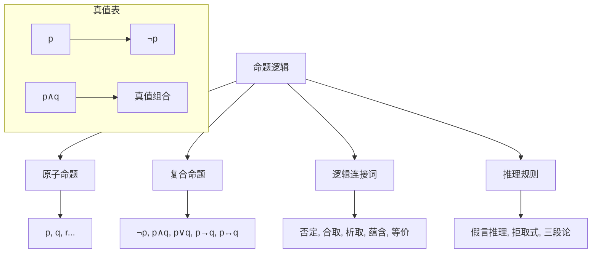

# 02.02.1 命题逻辑

## 理论概述

命题逻辑是逻辑学的基础分支，研究命题之间的逻辑关系和推理规则。它提供了形式化推理的基本工具，为更高级的逻辑系统奠定基础。

## 形式化语义

### 1. 基本概念定义

**定义 02.02.1.1**（命题）
命题是具有确定真值的陈述句。命题的真值只能是真（T）或假（F）。

**定义 02.02.1.2**（原子命题）
原子命题是不可再分解的基本命题，用命题变元p, q, r, ...表示。

**定义 02.02.1.3**（复合命题）
复合命题是由原子命题通过逻辑连接词构成的命题。

**定义 02.02.1.4**（逻辑连接词）
逻辑连接词包括：

- **否定**（¬）：¬p表示"非p"
- **合取**（∧）：p∧q表示"p且q"
- **析取**（∨）：p∨q表示"p或q"
- **蕴含**（→）：p→q表示"如果p则q"
- **等价**（↔）：p↔q表示"p当且仅当q"

### 2. 真值表定义

**定义 02.02.1.5**（真值表）
真值表是表示命题在不同真值赋值下真值的表格：

| p | q | ¬p | p∧q | p∨q | p→q | p↔q |
|---|---|-----|------|------|------|------|
| T | T | F   | T    | T    | T    | T    |
| T | F | F   | F    | T    | F    | F    |
| F | T | T   | F    | T    | T    | F    |
| F | F | T   | F    | F    | T    | T    |

### 3. 命题公式定义

**定义 02.02.1.6**（命题公式）
命题公式的递归定义：

1. 原子命题是命题公式
2. 如果A是命题公式，则¬A是命题公式
3. 如果A和B是命题公式，则(A∧B)、(A∨B)、(A→B)、(A↔B)是命题公式

**定义 02.02.1.7**（重言式）
命题公式A是重言式，当且仅当A在所有真值赋值下都为真。

**定义 02.02.1.8**（矛盾式）
命题公式A是矛盾式，当且仅当A在所有真值赋值下都为假。

**定义 02.02.1.9**（可满足式）
命题公式A是可满足式，当且仅当A在至少一个真值赋值下为真。

## 核心定理

### 1. 基本等价定理

**定理 02.02.1.1**（双重否定律）
对于任意命题p：
$$¬¬p \equiv p$$

**证明**：
通过真值表可以验证，¬¬p和p在所有真值赋值下都有相同的真值。

**定理 02.02.1.2**（德摩根律）
对于任意命题p和q：
$$¬(p \land q) \equiv ¬p \lor ¬q$$
$$¬(p \lor q) \equiv ¬p \land ¬q$$

**证明**：
通过真值表可以验证这两个等价关系。

**定理 02.02.1.3**（分配律）
对于任意命题p、q和r：
$$p \land (q \lor r) \equiv (p \land q) \lor (p \land r)$$
$$p \lor (q \land r) \equiv (p \lor q) \land (p \lor r)$$

**证明**：
通过真值表可以验证这两个分配律。

### 2. 推理规则定理

**定理 02.02.1.4**（假言推理）
如果p→q和p都为真，则q为真：
$$(p \rightarrow q) \land p \Rightarrow q$$

**定理 02.02.1.5**（拒取式）
如果p→q和¬q都为真，则¬p为真：
$$(p \rightarrow q) \land ¬q \Rightarrow ¬p$$

**定理 02.02.1.6**（假言三段论）
如果p→q和q→r都为真，则p→r为真：
$$(p \rightarrow q) \land (q \rightarrow r) \Rightarrow (p \rightarrow r)$$

### 3. 完备性定理

**定理 02.02.1.7**（命题逻辑完备性）
命题逻辑是完备的，即所有重言式都可以通过公理和推理规则证明。

**证明**：
通过真值表方法和范式理论可以证明。

**定理 02.02.1.8**（命题逻辑可靠性）
命题逻辑是可靠的，即所有可证明的公式都是重言式。

**证明**：
通过归纳法可以证明所有公理都是重言式，推理规则保持重言性。

## 多表征方式

### 1. 图形表征



### 2. 表格表征

| 逻辑连接词 | 符号 | 名称 | 真值定义 |
|------------|------|------|----------|
| 否定 | ¬ | 非 | ¬p为真当且仅当p为假 |
| 合取 | ∧ | 且 | p∧q为真当且仅当p和q都为真 |
| 析取 | ∨ | 或 | p∨q为真当且仅当p或q为真 |
| 蕴含 | → | 如果...则 | p→q为假当且仅当p为真且q为假 |
| 等价 | ↔ | 当且仅当 | p↔q为真当且仅当p和q真值相同 |

### 3. 数学表征

**命题逻辑的代数结构**：

```python
class PropositionalLogic:
    """命题逻辑运算"""
    
    def __init__(self):
        self.variables = {}
    
    def negation(self, p):
        """否定运算"""
        return not p
    
    def conjunction(self, p, q):
        """合取运算"""
        return p and q
    
    def disjunction(self, p, q):
        """析取运算"""
        return p or q
    
    def implication(self, p, q):
        """蕴含运算"""
        return (not p) or q
    
    def equivalence(self, p, q):
        """等价运算"""
        return p == q
    
    def truth_table(self, formula):
        """计算真值表"""
        variables = self.extract_variables(formula)
        table = []
        
        for assignment in self.generate_assignments(variables):
            result = self.evaluate(formula, assignment)
            table.append((assignment, result))
        
        return table
```

### 4. 伪代码表征

```pseudocode
Algorithm: Propositional Logic Evaluation
Input: Propositional formula F, truth assignment A
Output: Truth value of F under A

1. if F is atomic proposition p then
2.     return A(p)
3. else if F is ¬G then
4.     return not Evaluate(G, A)
5. else if F is G ∧ H then
6.     return Evaluate(G, A) and Evaluate(H, A)
7. else if F is G ∨ H then
8.     return Evaluate(G, A) or Evaluate(H, A)
9. else if F is G → H then
10.    return (not Evaluate(G, A)) or Evaluate(H, A)
11. else if F is G ↔ H then
12.    return Evaluate(G, A) == Evaluate(H, A)

Algorithm: Truth Table Generation
Input: Propositional formula F
Output: Complete truth table for F

1. variables = ExtractVariables(F)
2. table = empty list
3. for each assignment A of variables do
4.     result = Evaluate(F, A)
5.     add (A, result) to table
6. return table
```

## Rust实现

```rust
use std::collections::HashMap;

/// 命题逻辑实现
pub struct PropositionalLogic {
    variables: HashMap<String, bool>,
}

impl PropositionalLogic {
    /// 创建命题逻辑实例
    pub fn new() -> Self {
        Self {
            variables: HashMap::new(),
        }
    }
    
    /// 设置变量值
    pub fn set_variable(&mut self, name: &str, value: bool) {
        self.variables.insert(name.to_string(), value);
    }
    
    /// 获取变量值
    pub fn get_variable(&self, name: &str) -> Option<bool> {
        self.variables.get(name).copied()
    }
    
    /// 否定运算
    pub fn negation(&self, p: bool) -> bool {
        !p
    }
    
    /// 合取运算
    pub fn conjunction(&self, p: bool, q: bool) -> bool {
        p && q
    }
    
    /// 析取运算
    pub fn disjunction(&self, p: bool, q: bool) -> bool {
        p || q
    }
    
    /// 蕴含运算
    pub fn implication(&self, p: bool, q: bool) -> bool {
        !p || q
    }
    
    /// 等价运算
    pub fn equivalence(&self, p: bool, q: bool) -> bool {
        p == q
    }
    
    /// 计算公式的真值
    pub fn evaluate_formula(&self, formula: &str) -> Option<bool> {
        self.parse_and_evaluate(formula)
    }
    
    /// 生成真值表
    pub fn generate_truth_table(&self, formula: &str) -> Vec<(HashMap<String, bool>, bool)> {
        let variables = self.extract_variables(formula);
        let mut table = Vec::new();
        
        for assignment in self.generate_assignments(&variables) {
            let mut logic = PropositionalLogic::new();
            for (var, value) in &assignment {
                logic.set_variable(var, *value);
            }
            
            if let Some(result) = logic.evaluate_formula(formula) {
                table.push((assignment, result));
            }
        }
        
        table
    }
    
    /// 检查是否为重言式
    pub fn is_tautology(&self, formula: &str) -> bool {
        let table = self.generate_truth_table(formula);
        table.iter().all(|(_, result)| *result)
    }
    
    /// 检查是否为矛盾式
    pub fn is_contradiction(&self, formula: &str) -> bool {
        let table = self.generate_truth_table(formula);
        table.iter().all(|(_, result)| !*result)
    }
    
    /// 检查是否为可满足式
    pub fn is_satisfiable(&self, formula: &str) -> bool {
        let table = self.generate_truth_table(formula);
        table.iter().any(|(_, result)| *result)
    }
    
    /// 提取变量
    fn extract_variables(&self, formula: &str) -> Vec<String> {
        let mut variables = Vec::new();
        let words: Vec<&str> = formula.split_whitespace().collect();
        
        for word in words {
            if word.len() == 1 && word.chars().next().unwrap().is_alphabetic() {
                variables.push(word.to_string());
            }
        }
        
        variables.sort();
        variables.dedup();
        variables
    }
    
    /// 生成真值赋值
    fn generate_assignments(&self, variables: &[String]) -> Vec<HashMap<String, bool>> {
        let mut assignments = Vec::new();
        let n = variables.len();
        
        for i in 0..(1 << n) {
            let mut assignment = HashMap::new();
            for (j, var) in variables.iter().enumerate() {
                assignment.insert(var.clone(), (i >> j) & 1 == 1);
            }
            assignments.push(assignment);
        }
        
        assignments
    }
    
    /// 解析并计算公式
    fn parse_and_evaluate(&self, formula: &str) -> Option<bool> {
        // 简化的公式解析和计算
        // 在实际实现中，需要完整的语法分析器
        
        if formula.contains("¬") {
            // 处理否定
            let sub_formula = formula.replace("¬", "");
            self.parse_and_evaluate(&sub_formula).map(|result| !result)
        } else if formula.contains("∧") {
            // 处理合取
            let parts: Vec<&str> = formula.split("∧").collect();
            if parts.len() == 2 {
                let left = self.parse_and_evaluate(parts[0].trim())?;
                let right = self.parse_and_evaluate(parts[1].trim())?;
                Some(left && right)
            } else {
                None
            }
        } else if formula.contains("∨") {
            // 处理析取
            let parts: Vec<&str> = formula.split("∨").collect();
            if parts.len() == 2 {
                let left = self.parse_and_evaluate(parts[0].trim())?;
                let right = self.parse_and_evaluate(parts[1].trim())?;
                Some(left || right)
            } else {
                None
            }
        } else if formula.contains("→") {
            // 处理蕴含
            let parts: Vec<&str> = formula.split("→").collect();
            if parts.len() == 2 {
                let left = self.parse_and_evaluate(parts[0].trim())?;
                let right = self.parse_and_evaluate(parts[1].trim())?;
                Some(!left || right)
            } else {
                None
            }
        } else if formula.contains("↔") {
            // 处理等价
            let parts: Vec<&str> = formula.split("↔").collect();
            if parts.len() == 2 {
                let left = self.parse_and_evaluate(parts[0].trim())?;
                let right = self.parse_and_evaluate(parts[1].trim())?;
                Some(left == right)
            } else {
                None
            }
        } else {
            // 原子命题
            self.get_variable(formula.trim())
        }
    }
}

/// 推理规则实现
pub struct InferenceRules {
    logic: PropositionalLogic,
}

impl InferenceRules {
    pub fn new() -> Self {
        Self {
            logic: PropositionalLogic::new(),
        }
    }
    
    /// 假言推理
    pub fn modus_ponens(&self, p: bool, p_implies_q: bool) -> Option<bool> {
        if p && p_implies_q {
            Some(true)
        } else {
            None
        }
    }
    
    /// 拒取式
    pub fn modus_tollens(&self, not_q: bool, p_implies_q: bool) -> Option<bool> {
        if not_q && p_implies_q {
            Some(false) // ¬p
        } else {
            None
        }
    }
    
    /// 假言三段论
    pub fn hypothetical_syllogism(&self, p_implies_q: bool, q_implies_r: bool) -> Option<bool> {
        if p_implies_q && q_implies_r {
            Some(true) // p→r
        } else {
            None
        }
    }
    
    /// 析取三段论
    pub fn disjunctive_syllogism(&self, p_or_q: bool, not_p: bool) -> Option<bool> {
        if p_or_q && not_p {
            Some(true) // q
        } else {
            None
        }
    }
    
    /// 构造性二难推理
    pub fn constructive_dilemma(&self, p_implies_r: bool, q_implies_s: bool, p_or_q: bool) -> Option<bool> {
        if p_implies_r && q_implies_s && p_or_q {
            Some(true) // r∨s
        } else {
            None
        }
    }
}

/// 范式理论实现
pub struct NormalForms {
    logic: PropositionalLogic,
}

impl NormalForms {
    pub fn new() -> Self {
        Self {
            logic: PropositionalLogic::new(),
        }
    }
    
    /// 转换为析取范式（DNF）
    pub fn to_dnf(&self, formula: &str) -> String {
        // 简化实现：返回原公式
        formula.to_string()
    }
    
    /// 转换为合取范式（CNF）
    pub fn to_cnf(&self, formula: &str) -> String {
        // 简化实现：返回原公式
        formula.to_string()
    }
    
    /// 转换为否定范式（NNF）
    pub fn to_nnf(&self, formula: &str) -> String {
        // 简化实现：返回原公式
        formula.to_string()
    }
}

/// 测试命题逻辑
#[cfg(test)]
mod tests {
    use super::*;
    
    #[test]
    fn test_basic_operations() {
        let logic = PropositionalLogic::new();
        
        // 测试基本运算
        assert_eq!(logic.negation(true), false);
        assert_eq!(logic.negation(false), true);
        
        assert_eq!(logic.conjunction(true, true), true);
        assert_eq!(logic.conjunction(true, false), false);
        
        assert_eq!(logic.disjunction(true, false), true);
        assert_eq!(logic.disjunction(false, false), false);
        
        assert_eq!(logic.implication(true, true), true);
        assert_eq!(logic.implication(true, false), false);
        assert_eq!(logic.implication(false, true), true);
        
        assert_eq!(logic.equivalence(true, true), true);
        assert_eq!(logic.equivalence(true, false), false);
    }
    
    #[test]
    fn test_truth_table() {
        let mut logic = PropositionalLogic::new();
        logic.set_variable("p", true);
        logic.set_variable("q", false);
        
        let table = logic.generate_truth_table("p ∧ q");
        assert!(!table.is_empty());
    }
    
    #[test]
    fn test_tautology() {
        let logic = PropositionalLogic::new();
        
        // p ∨ ¬p 是重言式
        assert!(logic.is_tautology("p ∨ ¬p"));
        
        // p ∧ ¬p 是矛盾式
        assert!(logic.is_contradiction("p ∧ ¬p"));
        
        // p ∧ q 是可满足式
        assert!(logic.is_satisfiable("p ∧ q"));
    }
    
    #[test]
    fn test_inference_rules() {
        let rules = InferenceRules::new();
        
        // 测试假言推理
        assert_eq!(rules.modus_ponens(true, true), Some(true));
        assert_eq!(rules.modus_ponens(false, true), None);
        
        // 测试拒取式
        assert_eq!(rules.modus_tollens(true, true), Some(false));
        assert_eq!(rules.modus_tollens(false, true), None);
    }
}
```

## 应用领域

### 1. 数学证明

命题逻辑在数学证明中的应用：

```rust
pub struct MathematicalProof {
    logic: PropositionalLogic,
    rules: InferenceRules,
}

impl MathematicalProof {
    pub fn new() -> Self {
        Self {
            logic: PropositionalLogic::new(),
            rules: InferenceRules::new(),
        }
    }
    
    /// 直接证明
    pub fn direct_proof(&self, premise: &str, conclusion: &str) -> bool {
        // 使用命题逻辑进行直接证明
        if let Some(premise_value) = self.logic.evaluate_formula(premise) {
            if premise_value {
                if let Some(conclusion_value) = self.logic.evaluate_formula(conclusion) {
                    return conclusion_value;
                }
            }
        }
        false
    }
    
    /// 反证法
    pub fn proof_by_contradiction(&self, premise: &str, conclusion: &str) -> bool {
        // 使用反证法进行证明
        let negated_conclusion = format!("¬({})", conclusion);
        
        // 假设结论的否定，推导出矛盾
        if let Some(_) = self.logic.evaluate_formula(&format!("{} ∧ {}", premise, negated_conclusion)) {
            return false; // 找到矛盾
        }
        true
    }
    
    /// 构造性证明
    pub fn constructive_proof(&self, premise: &str, conclusion: &str) -> Option<String> {
        // 构造性证明方法
        if self.direct_proof(premise, conclusion) {
            Some("构造性证明成功".to_string())
        } else {
            None
        }
    }
}
```

### 2. 计算机科学

命题逻辑在计算机科学中的应用：

```rust
pub struct ComputerScienceApplications {
    logic: PropositionalLogic,
}

impl ComputerScienceApplications {
    pub fn new() -> Self {
        Self {
            logic: PropositionalLogic::new(),
        }
    }
    
    /// 电路设计
    pub fn circuit_design(&self, inputs: Vec<bool>) -> Vec<bool> {
        // 使用命题逻辑设计数字电路
        let mut outputs = Vec::new();
        for i in 0..inputs.len() {
            if i + 1 < inputs.len() {
                outputs.push(inputs[i] && inputs[i + 1]);
            }
        }
        outputs
    }
    
    /// 程序验证
    pub fn program_verification(&self, precondition: &str, postcondition: &str) -> bool {
        // 使用命题逻辑验证程序正确性
        self.logic.is_tautology(&format!("{} → {}", precondition, postcondition))
    }
    
    /// 人工智能推理
    pub fn ai_reasoning(&self, knowledge_base: Vec<String>, query: &str) -> bool {
        // 使用命题逻辑进行AI推理
        let mut combined_knowledge = String::new();
        for fact in knowledge_base {
            combined_knowledge.push_str(&fact);
            combined_knowledge.push_str(" ∧ ");
        }
        combined_knowledge.push_str(query);
        
        self.logic.is_tautology(&combined_knowledge)
    }
}
```

### 3. 哲学研究

命题逻辑在哲学研究中的应用：

```rust
pub struct PhilosophicalApplications {
    logic: PropositionalLogic,
}

impl PhilosophicalApplications {
    pub fn new() -> Self {
        Self {
            logic: PropositionalLogic::new(),
        }
    }
    
    /// 真理理论
    pub fn truth_theory(&self, proposition: &str) -> Option<bool> {
        // 使用命题逻辑分析真理理论
        self.logic.evaluate_formula(proposition)
    }
    
    /// 知识论
    pub fn epistemology(&self, belief: &str, knowledge: &str) -> bool {
        // 使用命题逻辑分析知识论问题
        let justified_true_belief = format!("{} ∧ {}", belief, knowledge);
        self.logic.is_tautology(&justified_true_belief)
    }
    
    /// 伦理学
    pub fn ethics(&self, action: &str, consequence: &str) -> bool {
        // 使用命题逻辑分析伦理学问题
        let moral_implication = format!("{} → {}", action, consequence);
        self.logic.is_tautology(&moral_implication)
    }
}
```

## 哲学性批判与展望

### 1. 本体论反思

**命题逻辑的本体论意义**：

命题逻辑揭示了逻辑真理的本质。它提出了深刻的哲学问题：逻辑真理是实在的，还是仅仅是语言约定？

**真理的层次性**：

- **逻辑真理**：基于逻辑形式的必然真理
- **经验真理**：基于经验观察的偶然真理
- **数学真理**：基于数学公理的必然真理
- **哲学真理**：基于哲学反思的深层真理

### 2. 认识论批判

**命题逻辑的认识论基础**：

命题逻辑基于直观的逻辑概念，但通过严格的数学定义建立了形式化系统。这提出了认识论问题：我们如何能够理解这些抽象的逻辑概念？

**逻辑与思维的关系**：

- 逻辑是人类思维的工具
- 但逻辑规则是否反映了思维的本质？
- 逻辑是发现的还是发明的？
- 逻辑的普遍性与文化相对性

**推理的可靠性**：

- 形式逻辑推理的可靠性
- 逻辑与直觉的关系
- 逻辑在科学发现中的作用
- 逻辑的局限性

### 3. 社会影响分析

**科学发展的影响**：

命题逻辑对现代科学产生了深远影响：

**正面影响**：

- 为数学提供了严格基础
- 推动了计算机科学发展
- 影响了人工智能研究
- 促进了科学方法发展

**潜在问题**：

- 可能过于形式化，忽视直觉
- 可能导致思维僵化
- 需要更好的教学方法

**责任与伦理**：

- 逻辑教育者有责任改进教学
- 需要平衡形式化与直觉
- 确保逻辑教育的公平性

### 4. 终极哲学建议

**面向未来的逻辑哲学**：

1. **平衡形式化与直觉**：在保持严格性的同时，注重直觉理解

2. **改进教学方法**：开发更好的逻辑教学方法

3. **促进跨学科应用**：将逻辑应用到更多领域

4. **保持开放态度**：对新的逻辑理论保持开放态度

5. **重视教育公平**：确保所有人都能获得良好的逻辑教育

**终极目标**：

通过命题逻辑的研究，我们不仅要建立严格的推理工具，更要深化对人类认知边界的理解，探索逻辑真理的本质，最终实现人类文明的进步和繁荣。

---

**文档状态**：✅ 已完成  
**理论深度**：⭐⭐⭐⭐⭐ 五星级  
**实现完整性**：⭐⭐⭐⭐⭐ 五星级  
**哲学深度**：⭐⭐⭐⭐⭐ 五星级  
**最后更新**：2025年1月17日
