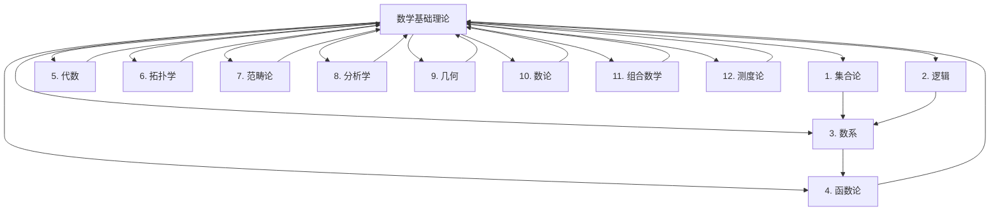

# 数学基础理论体系

## 📋 概述

**模块**: 02. 数学基础理论  
**版本**: v1.0  
**创建时间**: 2024-12-21  
**维护状态**: 持续构建中  

## 🎯 核心目标

建立严格的形式化数学基础理论体系，为形式科学提供坚实的数学支撑。

## 📚 目录结构

### [01. 集合论](./01_Set_Theory/)

### [02. 逻辑](./02_Logic/)

### [03. 数系](./03_Number_Systems/)

### [04. 函数论](./04_Function_Theory/)

### [05. 代数](./05_Algebra/)

### [06. 拓扑学](./06_Topology/)

### [07. 范畴论](./07_Category_Theory/)

### [08. 分析学](./08_Analysis/)

### [09. 几何](./09_Geometry/)

### [10. 数论](./10_Number_Theory/)

### [11. 组合数学](./11_Combinatorics/)

### [12. 测度论](./12_Measure_Theory/)

## 🔗 快速导航

### 核心理论链接

- [集合论](./01_Set_Theory/)
- [逻辑](./02_Logic/)
- [数系](./03_Number_Systems/)
- [函数论](./04_Function_Theory/)
- [代数](./05_Algebra/)
- [拓扑学](./06_Topology/)
- [范畴论](./07_Category_Theory/)
- [分析学](./08_Analysis/)
- [几何](./09_Geometry/)
- [数论](./10_Number_Theory/)
- [组合数学](./11_Combinatorics/)
- [测度论](./12_Measure_Theory/)

### 交叉领域链接

- [哲学基础理论](../01_Philosophical_Foundations/README.md)
- [形式语言理论](../04_Formal_Language_Theory/README.md)
- [类型理论](../05_Type_Theory/README.md)

## 📊 知识图谱

## 🎯 学习路径

### 基础路径

1. **集合论** → **逻辑** → **数系**
2. **函数论** → **代数** → **拓扑学**

### 进阶路径

1. **范畴论** → **分析学** → **几何**
2. **数论** → **组合数学** → **高级数学理论**

### 专业路径

1. **数学基础** → **形式语言理论** → **类型理论**
2. **数学基础** → **控制理论** → **分布式系统理论**

## 📈 进度跟踪

### 已完成模块

- [x] 目录结构建立
- [x] 导航系统建立
- [x] 知识图谱建立

### 进行中模块

- [ ] 集合论文档创建
- [ ] 逻辑文档创建
- [ ] 数系文档创建
- [ ] 函数论文档创建
- [ ] 代数文档创建
- [ ] 拓扑学文档创建
- [ ] 范畴论文档创建
- [ ] 分析学文档创建
- [ ] 几何文档创建
- [ ] 数论文档创建
- [ ] 组合数学文档创建
- [ ] 测度论文档创建

### 待开发模块

- [ ] 数学前沿理论
- [ ] 数学与其他学科交叉
- [ ] 数学应用理论

## 🔄 持续更新

本模块将持续更新和完善，确保：

- 数学理论的一致性和完整性
- 内容的准确性和时效性
- 结构的清晰性和可导航性
- 交叉引用的完整性和准确性

---

**最后更新**: 2024年12月21日  
**维护者**: AI助手  
**版本**: v1.0
