# 数学基础理论体系

## 📋 概述

**模块**: 02. 数学基础理论  
**版本**: v1.0  
**创建时间**: 2024-12-21  
**维护状态**: 持续构建中  

## 🎯 核心目标

建立严格的形式化数学基础理论体系，为形式科学提供坚实的数学支撑。

## 📚 目录结构

### 02.1 集合论基础 (01_Set_Theory)

- [02.1.1 朴素集合论](./01_Set_Theory/02.1.1_Naive_Set_Theory.md)
- [02.1.2 公理集合论](./01_Set_Theory/02.1.2_Axiomatic_Set_Theory.md)
- [02.1.3 集合运算](./01_Set_Theory/02.1.3_Set_Operations.md)
- [02.1.4 集合关系](./01_Set_Theory/02.1.4_Set_Relations.md)

### 02.2 逻辑学基础 (02_Logic)

- [02.2.1 命题逻辑](./02_Logic/02.2.1_Propositional_Logic.md)
- [02.2.2 谓词逻辑](./02_Logic/02.2.2_Predicate_Logic.md)
- [02.2.3 模态逻辑](./02_Logic/02.2.3_Modal_Logic.md)
- [02.2.4 直觉逻辑](./02_Logic/02.2.4_Intuitionistic_Logic.md)

### 02.3 数系基础 (03_Number_Systems)

- [02.3.1 自然数系统](./03_Number_Systems/02.3.1_Natural_Numbers.md)
- [02.3.2 整数系统](./03_Number_Systems/02.3.2_Integers.md)
- [02.3.3 有理数系统](./03_Number_Systems/02.3.3_Rational_Numbers.md)
- [02.3.4 实数系统](./03_Number_Systems/02.3.4_Real_Numbers.md)

### 02.4 函数论基础 (04_Function_Theory)

- [02.4.1 函数概念](./04_Function_Theory/02.4.1_Function_Concept.md)
- [02.4.2 函数性质](./04_Function_Theory/02.4.2_Function_Properties.md)
- [02.4.3 函数运算](./04_Function_Theory/02.4.3_Function_Operations.md)
- [02.4.4 函数分类](./04_Function_Theory/02.4.4_Function_Classification.md)

### 02.5 关系论基础 (05_Relation_Theory)

- [02.5.1 关系概念](./05_Relation_Theory/02.5.1_Relation_Concept.md)
- [02.5.2 关系性质](./05_Relation_Theory/02.5.2_Relation_Properties.md)
- [02.5.3 关系运算](./05_Relation_Theory/02.5.3_Relation_Operations.md)
- [02.5.4 等价关系](./05_Relation_Theory/02.5.4_Equivalence_Relations.md)

### 02.6 代数结构 (06_Algebraic_Structures)

- [02.6.1 群论基础](./06_Algebraic_Structures/02.6.1_Group_Theory.md)
- [02.6.2 环论基础](./06_Algebraic_Structures/02.6.2_Ring_Theory.md)
- [02.6.3 域论基础](./06_Algebraic_Structures/02.6.3_Field_Theory.md)
- [02.6.4 模论基础](./06_Algebraic_Structures/02.6.4_Module_Theory.md)

### 02.7 范畴论基础 (07_Category_Theory)

- [02.7.1 范畴概念](./07_Category_Theory/02.7.1_Category_Concept.md)
- [02.7.2 函子理论](./07_Category_Theory/02.7.2_Functor_Theory.md)
- [02.7.3 自然变换](./07_Category_Theory/02.7.3_Natural_Transformations.md)
- [02.7.4 极限理论](./07_Category_Theory/02.7.4_Limit_Theory.md)

### 02.8 拓扑学基础 (08_Topology)

- [02.8.1 拓扑空间](./08_Topology/02.8.1_Topological_Spaces.md)
- [02.8.2 连续映射](./08_Topology/02.8.2_Continuous_Mappings.md)
- [02.8.3 连通性](./08_Topology/02.8.3_Connectedness.md)
- [02.8.4 紧致性](./08_Topology/02.8.4_Compactness.md)

### 02.9 分析学基础 (09_Analysis)

- [02.9.1 极限理论](./09_Analysis/02.9.1_Limit_Theory.md)
- [02.9.2 连续性](./09_Analysis/02.9.2_Continuity.md)
- [02.9.3 微分学](./09_Analysis/02.9.3_Differential_Calculus.md)
- [02.9.4 积分学](./09_Analysis/02.9.4_Integral_Calculus.md)

### 02.10 数论基础 (10_Number_Theory)

- [02.10.1 整除理论](./10_Number_Theory/02.10.1_Divisibility_Theory.md)
- [02.10.2 同余理论](./10_Number_Theory/02.10.2_Congruence_Theory.md)
- [02.10.3 素数理论](./10_Number_Theory/02.10.3_Prime_Theory.md)
- [02.10.4 二次剩余](./10_Number_Theory/02.10.4_Quadratic_Residues.md)

### 02.11 组合数学基础 (11_Combinatorics)

- [02.11.1 计数原理](./11_Combinatorics/02.11.1_Counting_Principles.md)
- [02.11.2 排列组合](./11_Combinatorics/02.11.2_Permutations_Combinations.md)
- [02.11.3 生成函数](./11_Combinatorics/02.11.3_Generating_Functions.md)
- [02.11.4 图论基础](./11_Combinatorics/02.11.4_Graph_Theory_Basics.md)

## 🔗 快速导航

### 核心理论链接

- [集合论基础](./01_Set_Theory/README.md)
- [逻辑学基础](./02_Logic/README.md)
- [数系基础](./03_Number_Systems/README.md)
- [函数论基础](./04_Function_Theory/README.md)
- [关系论基础](./05_Relation_Theory/README.md)
- [代数结构](./06_Algebraic_Structures/README.md)
- [范畴论基础](./07_Category_Theory/README.md)
- [拓扑学基础](./08_Topology/README.md)
- [分析学基础](./09_Analysis/README.md)
- [数论基础](./10_Number_Theory/README.md)
- [组合数学基础](./11_Combinatorics/README.md)

### 交叉领域链接

- [哲学基础理论](../01_Philosophical_Foundation/README.md)
- [形式语言理论](../03_Formal_Language_Theory/README.md)
- [类型理论](../04_Type_Theory/README.md)

## 📊 知识图谱

```mermaid
graph TD
    A[数学基础理论] --> B[集合论基础]
    A --> C[逻辑学基础]
    A --> D[数系基础]
    A --> E[函数论基础]
    A --> F[关系论基础]
    A --> G[代数结构]
    A --> H[范畴论基础]
    A --> I[拓扑学基础]
    A --> J[分析学基础]
    A --> K[数论基础]
    A --> L[组合数学基础]
    
    B --> B1[朴素集合论]
    B --> B2[公理集合论]
    B --> B3[集合运算]
    B --> B4[集合关系]
    
    C --> C1[命题逻辑]
    C --> C2[谓词逻辑]
    C --> C3[模态逻辑]
    C --> C4[直觉逻辑]
    
    D --> D1[自然数系统]
    D --> D2[整数系统]
    D --> D3[有理数系统]
    D --> D4[实数系统]
    
    E --> E1[函数概念]
    E --> E2[函数性质]
    E --> E3[函数运算]
    E --> E4[函数分类]
    
    F --> F1[关系概念]
    F --> F2[关系性质]
    F --> F3[关系运算]
    F --> F4[等价关系]
    
    G --> G1[群论基础]
    G --> G2[环论基础]
    G --> G3[域论基础]
    G --> G4[模论基础]
    
    H --> H1[范畴概念]
    H --> H2[函子理论]
    H --> H3[自然变换]
    H --> H4[极限理论]
    
    I --> I1[拓扑空间]
    I --> I2[连续映射]
    I --> I3[连通性]
    I --> I4[紧致性]
    
    J --> J1[极限理论]
    J --> J2[连续性]
    J --> J3[微分学]
    J --> J4[积分学]
    
    K --> K1[整除理论]
    K --> K2[同余理论]
    K --> K3[素数理论]
    K --> K4[二次剩余]
    
    L --> L1[计数原理]
    L --> L2[排列组合]
    L --> L3[生成函数]
    L --> L4[图论基础]
```

## 🎯 学习路径

### 基础路径

1. **集合论基础** → **逻辑学基础** → **数系基础**
2. **函数论基础** → **关系论基础** → **代数结构**

### 进阶路径

1. **范畴论基础** → **拓扑学基础** → **分析学基础**
2. **数论基础** → **组合数学基础** → **高级数学理论**

### 专业路径

1. **数学基础** → **形式语言理论** → **类型理论**
2. **数学基础** → **控制理论** → **分布式系统理论**

## 📈 进度跟踪

### 已完成模块

- [x] 目录结构建立
- [x] 导航系统建立
- [x] 知识图谱建立

### 进行中模块

- [ ] 集合论基础文档创建
- [ ] 逻辑学基础文档创建
- [ ] 数系基础文档创建
- [ ] 函数论基础文档创建
- [ ] 关系论基础文档创建
- [ ] 代数结构文档创建
- [ ] 范畴论基础文档创建
- [ ] 拓扑学基础文档创建
- [ ] 分析学基础文档创建
- [ ] 数论基础文档创建
- [ ] 组合数学基础文档创建

### 待开发模块

- [ ] 数学前沿理论
- [ ] 数学与其他学科交叉
- [ ] 数学应用理论

## 🔄 持续更新

本模块将持续更新和完善，确保：

- 数学理论的一致性和完整性
- 内容的准确性和时效性
- 结构的清晰性和可导航性
- 交叉引用的完整性和准确性

---

**最后更新**: 2024年12月21日  
**维护者**: AI助手  
**版本**: v1.0
