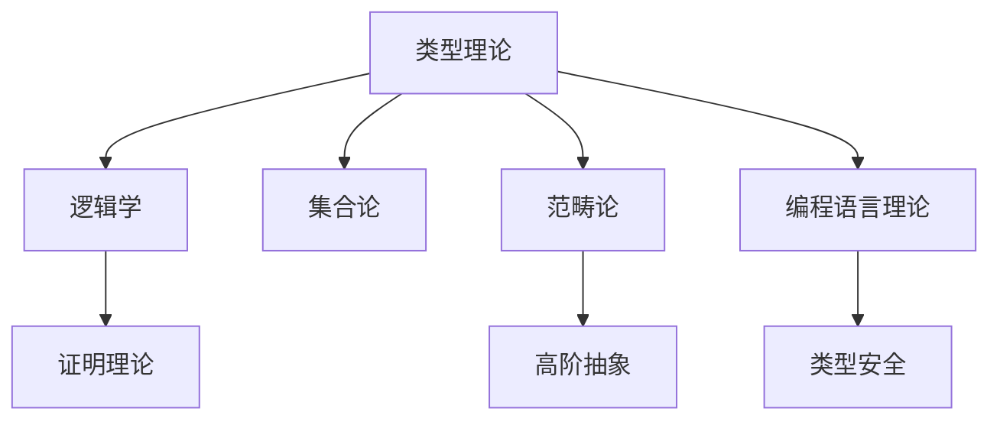

# 类型理论基础理论

(Type Theory Foundation)

## 目录

- [类型理论基础理论](#类型理论基础理论)
  - [目录](#目录)
  - [1. 引言与概述](#1-引言与概述)
    - [1.1 类型理论的历史背景](#11-类型理论的历史背景)
    - [1.2 类型理论的基本思想](#12-类型理论的基本思想)
  - [2. 形式系统基础](#2-形式系统基础)
    - [2.1 基本定义](#21-基本定义)
    - [2.2 基本类型构造子](#22-基本类型构造子)
  - [3. 简单类型λ演算](#3-简单类型λ演算)
    - [3.1 语法定义](#31-语法定义)
    - [3.2 类型推导规则](#32-类型推导规则)
    - [3.3 类型推导算法](#33-类型推导算法)
  - [4. 类型系统性质](#4-类型系统性质)
    - [4.1 类型安全性](#41-类型安全性)
    - [4.2 类型保持性](#42-类型保持性)
    - [4.3 强正规化](#43-强正规化)
  - [5. 语义理论](#5-语义理论)
    - [5.1 指称语义](#51-指称语义)
    - [5.2 操作语义](#52-操作语义)
    - [5.3 语义对应](#53-语义对应)
  - [6. 证明理论](#6-证明理论)
    - [6.1 证明系统](#61-证明系统)
    - [6.2 证明方法](#62-证明方法)
    - [6.3 证明示例](#63-证明示例)
  - [7. 应用与扩展](#7-应用与扩展)
    - [7.1 编程语言应用](#71-编程语言应用)
    - [7.2 理论扩展](#72-理论扩展)
    - [7.3 高级特性](#73-高级特性)
  - [8. 主题间关联性与哲学批判](#8-主题间关联性与哲学批判)
    - [8.1 主题关联性Mermaid图](#81-主题关联性mermaid图)
    - [8.2 主题间表格对比](#82-主题间表格对比)
    - [8.3 主题间批判性分析](#83-主题间批判性分析)
  - [9. 总结与展望](#9-总结与展望)
    - [9.1 理论总结](#91-理论总结)
    - [9.2 发展方向](#92-发展方向)
    - [9.3 挑战与机遇](#93-挑战与机遇)
  - [10. 参考文献与索引](#10-参考文献与索引)

## 1. 引言与概述

### 1.1 类型理论的历史背景

类型理论起源于20世纪初的数学基础研究，最初由Russell提出以解决集合论悖论。随着计算机科学的发展，类型理论逐渐成为程序语言设计和程序验证的核心理论基础。

**历史发展脉络**：

- **1903年**：Russell提出类型论解决悖论
- **1940年**：Church提出简单类型λ演算
- **1972年**：Martin-Löf提出直觉类型论
- **1980年**：Coquand提出构造演算
- **1990年**：同伦类型论的发展

### 1.2 类型理论的基本思想

**核心概念**：

- **类型**：值的分类和约束
- **项**：具有类型的表达式
- **类型推导**：从上下文推导项的类型
- **类型安全**：运行时类型错误的预防

**基本假设**：

- 每个项都有唯一的类型
- 类型检查在编译时进行
- 类型系统保证运行时安全

## 2. 形式系统基础

### 2.1 基本定义

**定义 2.1.1** (类型系统)
类型系统是一个四元组 $\mathcal{T} = (\mathcal{T}, \mathcal{E}, \vdash, \llbracket \cdot \rrbracket)$，其中：

- $\mathcal{T}$ 是类型集合
- $\mathcal{E}$ 是表达式集合  
- $\vdash$ 是类型推导关系
- $\llbracket \cdot \rrbracket$ 是语义解释函数

**定义 2.1.2** (类型上下文)
类型上下文是一个有限映射 $\Gamma : \text{Var} \rightarrow \mathcal{T}$，记作：
$$\Gamma = x_1 : A_1, x_2 : A_2, \ldots, x_n : A_n$$

**定义 2.1.3** (类型推导判断)
类型推导判断的形式为：
$$\Gamma \vdash M : A$$
表示在上下文 $\Gamma$ 下，项 $M$ 具有类型 $A$。

### 2.2 基本类型构造子

**定义 2.2.1** (基本类型)
基本类型集合包含：

- $\text{Bool}$：布尔类型
- $\text{Nat}$：自然数类型
- $\text{Unit}$：单位类型

**定义 2.2.2** (函数类型)
如果 $A$ 和 $B$ 是类型，则 $A \rightarrow B$ 是函数类型。

**定义 2.2.3** (积类型)
如果 $A$ 和 $B$ 是类型，则 $A \times B$ 是积类型。

**定义 2.2.4** (和类型)
如果 $A$ 和 $B$ 是类型，则 $A + B$ 是和类型。

## 3. 简单类型λ演算

### 3.1 语法定义

**定义 3.1.1** (λ项语法)
λ项的语法由以下BNF定义：
$$M ::= x \mid \lambda x : A.M \mid M N \mid \text{true} \mid \text{false} \mid \text{if } M \text{ then } N_1 \text{ else } N_2$$

**定义 3.1.2** (自由变量)
项 $M$ 的自由变量集合 $\text{FV}(M)$ 定义如下：

- $\text{FV}(x) = \{x\}$
- $\text{FV}(\lambda x : A.M) = \text{FV}(M) \setminus \{x\}$
- $\text{FV}(M N) = \text{FV}(M) \cup \text{FV}(N)$
- $\text{FV}(\text{true}) = \text{FV}(\text{false}) = \emptyset$
- $\text{FV}(\text{if } M \text{ then } N_1 \text{ else } N_2) = \text{FV}(M) \cup \text{FV}(N_1) \cup \text{FV}(N_2)$

### 3.2 类型推导规则

**定义 3.2.1** (类型推导规则)
简单类型λ演算的类型推导规则：

**变量规则：**
$$\frac{x : A \in \Gamma}{\Gamma \vdash x : A} \text{ (Var)}$$

**抽象规则：**
$$\frac{\Gamma, x : A \vdash M : B}{\Gamma \vdash \lambda x : A.M : A \rightarrow B} \text{ (Abs)}$$

**应用规则：**
$$\frac{\Gamma \vdash M : A \rightarrow B \quad \Gamma \vdash N : A}{\Gamma \vdash M N : B} \text{ (App)}$$

**布尔常量规则：**
$$\frac{}{\Gamma \vdash \text{true} : \text{Bool}} \text{ (True)} \quad \frac{}{\Gamma \vdash \text{false} : \text{Bool}} \text{ (False)}$$

**条件规则：**
$$\frac{\Gamma \vdash M : \text{Bool} \quad \Gamma \vdash N_1 : A \quad \Gamma \vdash N_2 : A}{\Gamma \vdash \text{if } M \text{ then } N_1 \text{ else } N_2 : A} \text{ (If)}$$

### 3.3 类型推导算法

**算法 3.3.1** (类型推导)

```haskell
data Type = Bool | Nat | Unit | Arrow Type Type | Product Type Type | Sum Type Type
data Term = Var String | Lambda String Type Term | App Term Term | True | False | If Term Term Term

type Context = Map String Type

inferType :: Context -> Term -> Maybe Type
inferType ctx term = case term of
  Var x -> Map.lookup x ctx
  
  Lambda x t body -> do
    let ctx' = Map.insert x t ctx
    resultType <- inferType ctx' body
    return $ Arrow t resultType
  
  App fun arg -> do
    funType <- inferType ctx fun
    argType <- inferType ctx arg
    case funType of
      Arrow domain codomain | domain == argType -> Just codomain
      _ -> Nothing
  
  True -> Just Bool
  False -> Just Bool
  
  If cond thenTerm elseTerm -> do
    condType <- inferType ctx cond
    thenType <- inferType ctx thenTerm
    elseType <- inferType ctx elseTerm
    if condType == Bool && thenType == elseType
      then Just thenType
      else Nothing
```

## 4. 类型系统性质

### 4.1 类型安全性

**定义 4.1.1** (类型安全)
类型系统是类型安全的，如果对于所有项 $M$，如果 $\Gamma \vdash M : A$，则 $M$ 不会产生类型错误。

**定理 4.1.1** (类型安全性定理)
简单类型λ演算是类型安全的。

**证明：** 通过结构归纳法：

1. **基础情况**：
   - 变量：$\Gamma \vdash x : A$，$x$ 在 $\Gamma$ 中定义，不会产生错误
   - 常量：$\text{true}$ 和 $\text{false}$ 是合法的布尔值

2. **归纳情况**：
   - 抽象：$\lambda x : A.M$ 构造一个函数，类型安全
   - 应用：$M N$ 要求 $M : A \rightarrow B$ 且 $N : A$，类型匹配
   - 条件：$\text{if } M \text{ then } N_1 \text{ else } N_2$ 要求 $M : \text{Bool}$ 且 $N_1, N_2$ 同类型

### 4.2 类型保持性

**定义 4.2.1** (类型保持)
类型系统满足类型保持，如果对于所有项 $M, N$ 和类型 $A$，如果 $\Gamma \vdash M : A$ 且 $M \rightarrow N$，则 $\Gamma \vdash N : A$。

**定理 4.2.1** (类型保持性定理)
简单类型λ演算满足类型保持性。

**证明：** 通过归约规则分析：

1. **β归约**：$(\lambda x : A.M) N \rightarrow M[N/x]$
   - 如果 $\Gamma \vdash (\lambda x : A.M) N : B$
   - 则 $\Gamma, x : A \vdash M : B$ 且 $\Gamma \vdash N : A$
   - 因此 $\Gamma \vdash M[N/x] : B$

2. **条件归约**：
   - $\text{if true then } M \text{ else } N \rightarrow M$
   - $\text{if false then } M \text{ else } N \rightarrow N$
   - 类型保持性显然成立

### 4.3 强正规化

**定义 4.3.1** (强正规化)
类型系统满足强正规化，如果所有良类型的项都是强正规化的。

**定理 4.3.1** (强正规化定理)
简单类型λ演算满足强正规化。

**证明：** 通过可约性方法：

1. **可约性定义**：定义每个类型的可约性谓词
2. **归纳证明**：证明所有良类型项都是可约的
3. **可约性蕴含强正规化**：可约的项是强正规化的

## 5. 语义理论

### 5.1 指称语义

**定义 5.1.1** (语义域)
语义域是一个三元组 $\mathcal{D} = (D, \llbracket \cdot \rrbracket, \models)$，其中：

- $D$ 是语义对象集合
- $\llbracket \cdot \rrbracket$ 是解释函数
- $\models$ 是满足关系

**定义 5.1.2** (类型语义)
类型的语义解释：

- $\llbracket \text{Bool} \rrbracket = \{\text{true}, \text{false}\}$
- $\llbracket \text{Nat} \rrbracket = \mathbb{N}$
- $\llbracket A \rightarrow B \rrbracket = \llbracket A \rrbracket \rightarrow \llbracket B \rrbracket$

**定义 5.1.3** (项语义)
项的语义解释：

- $\llbracket x \rrbracket_\rho = \rho(x)$
- $\llbracket \lambda x : A.M \rrbracket_\rho = \lambda v \in \llbracket A \rrbracket.\llbracket M \rrbracket_{\rho[x \mapsto v]}$
- $\llbracket M N \rrbracket_\rho = \llbracket M \rrbracket_\rho(\llbracket N \rrbracket_\rho)$

### 5.2 操作语义

**定义 5.2.1** (归约关系)
归约关系 $\rightarrow$ 定义如下：

**β归约：**
$$(\lambda x : A.M) N \rightarrow M[N/x]$$

**条件归约：**
$$\text{if true then } M \text{ else } N \rightarrow M$$
$$\text{if false then } M \text{ else } N \rightarrow N$$

**上下文归约：**
$$\frac{M \rightarrow M'}{M N \rightarrow M' N} \quad \frac{N \rightarrow N'}{M N \rightarrow M N'}$$
$$\frac{M \rightarrow M'}{\lambda x : A.M \rightarrow \lambda x : A.M'}$$

### 5.3 语义对应

**定理 5.3.1** (语义对应定理)
如果 $\Gamma \vdash M : A$，则 $\llbracket M \rrbracket_\rho \in \llbracket A \rrbracket$ 对于所有满足 $\Gamma$ 的环境 $\rho$。

**证明：** 通过结构归纳：

1. **变量**：$\Gamma \vdash x : A$ 且 $x : A \in \Gamma$，则 $\rho(x) \in \llbracket A \rrbracket$

2. **抽象**：$\Gamma \vdash \lambda x : A.M : A \rightarrow B$
   - 对于任意 $v \in \llbracket A \rrbracket$
   - $\llbracket M \rrbracket_{\rho[x \mapsto v]} \in \llbracket B \rrbracket$
   - 因此 $\llbracket \lambda x : A.M \rrbracket_\rho \in \llbracket A \rightarrow B \rrbracket$

3. **应用**：$\Gamma \vdash M N : B$
   - $\llbracket M \rrbracket_\rho \in \llbracket A \rightarrow B \rrbracket$
   - $\llbracket N \rrbracket_\rho \in \llbracket A \rrbracket$
   - 因此 $\llbracket M N \rrbracket_\rho \in \llbracket B \rrbracket$

## 6. 证明理论

### 6.1 证明系统

**定义 6.1.1** (证明系统)
证明系统是一个三元组 $\mathcal{P} = (\Gamma, \vdash, \pi)$，其中：

- $\Gamma$ 是假设集合
- $\vdash$ 是推导关系
- $\pi$ 是证明结构

**定义 6.1.2** (证明规则)
证明规则包括：

1. **假设规则**：$\Gamma, A \vdash A$
2. **引入规则**：从前提引入连接词
3. **消除规则**：从连接词消除到结论

### 6.2 证明方法

**方法 6.2.1** (结构归纳)
结构归纳是类型理论中的基本证明方法：

1. **基础情况**：证明对原子项成立
2. **归纳步骤**：假设对子项成立，证明对复合项成立

**方法 6.2.2** (逻辑关系)
逻辑关系是证明类型系统性质的重要工具：

1. **定义逻辑关系**：为每个类型定义逻辑关系
2. **基本性质**：证明逻辑关系的基本性质
3. **归纳性质**：证明逻辑关系的归纳性质

### 6.3 证明示例

**示例 6.3.1** (类型安全性证明)
证明项 $(\lambda x : \text{Bool}.x) \text{true}$ 的类型安全性：

1. **类型推导**：
   - $x : \text{Bool} \vdash x : \text{Bool}$ (Var)
   - $\vdash \lambda x : \text{Bool}.x : \text{Bool} \rightarrow \text{Bool}$ (Abs)
   - $\vdash \text{true} : \text{Bool}$ (True)
   - $\vdash (\lambda x : \text{Bool}.x) \text{true} : \text{Bool}$ (App)

2. **归约**：
   - $(\lambda x : \text{Bool}.x) \text{true} \rightarrow \text{true}$

3. **类型保持**：
   - $\vdash \text{true} : \text{Bool}$

## 7. 应用与扩展

### 7.1 编程语言应用

**应用 7.1.1** (类型检查器)
类型检查器是编程语言编译器的核心组件：

```haskell
typeCheck :: Context -> Term -> Either String Type
typeCheck ctx term = case term of
  Var x -> case Map.lookup x ctx of
    Just t -> Right t
    Nothing -> Left $ "Unbound variable: " ++ x
  
  Lambda x t body -> do
    let ctx' = Map.insert x t ctx
    resultType <- typeCheck ctx' body
    return $ Arrow t resultType
  
  App fun arg -> do
    funType <- typeCheck ctx fun
    argType <- typeCheck ctx arg
    case funType of
      Arrow domain codomain | domain == argType -> Right codomain
      _ -> Left $ "Type mismatch: expected " ++ show domain ++ 
                  ", got " ++ show argType
```

**应用 7.1.2** (程序验证)
类型系统用于程序验证：

1. **类型安全**：防止运行时类型错误
2. **内存安全**：通过类型系统保证内存安全
3. **并发安全**：通过类型系统保证并发安全

### 7.2 理论扩展

**扩展 7.2.1** (多态类型)
多态类型允许类型参数化：

```haskell
data PolyType = ForAll String PolyType | MonoType Type

-- 多态恒等函数
id :: forall a. a -> a
id = \x -> x
```

**扩展 7.2.2** (依赖类型)
依赖类型允许类型依赖于值：

```haskell
data Vec a n where
  Nil :: Vec a 0
  Cons :: a -> Vec a n -> Vec a (n + 1)

-- 类型安全的向量操作
head :: Vec a (n + 1) -> a
head (Cons x _) = x
```

### 7.3 高级特性

**特性 7.3.1** (类型类)
类型类提供特设多态：

```haskell
class Eq a where
  (==) :: a -> a -> Bool
  (/=) :: a -> a -> Bool

instance Eq Bool where
  True == True = True
  False == False = True
  _ == _ = False
  x /= y = not (x == y)
```

**特性 7.3.2** (高阶类型)
高阶类型允许类型构造子参数化：

```haskell
data Functor f where
  fmap :: (a -> b) -> f a -> f b

instance Functor Maybe where
  fmap f Nothing = Nothing
  fmap f (Just x) = Just (f x)
```

## 8. 主题间关联性与哲学批判

### 8.1 主题关联性Mermaid图



### 8.2 主题间表格对比

| 主题         | 主要内容           | 关联领域         |
|--------------|--------------------|------------------|
| 类型理论     | 类型、项、推导     | 逻辑学、编程语言 |
| 逻辑学       | 命题、推理、证明   | 证明理论、集合论 |
| 范畴论       | 对象、态射         | 高阶抽象         |
| 编程语言理论 | 类型系统、语义     | 类型安全         |

### 8.3 主题间批判性分析

- 类型理论作为连接逻辑学、集合论、范畴论与编程语言理论的桥梁，既是形式化基础，也是实际应用的核心。
- 类型理论的"类型本体论"与集合论的"元素本体论"在哲学上存在深刻分歧。
- 范畴论为类型理论提供了统一的结构视角，推动了高阶抽象的发展。
- 类型理论的安全性、可验证性等特性对现代编程语言和形式化验证产生了深远影响。

## 9. 总结与展望

### 9.1 理论总结

类型理论基础理论提供了：

1. **形式化基础**：严格的数学定义和证明
2. **类型安全**：运行时错误的预防
3. **程序验证**：程序正确性的保证
4. **抽象机制**：高级抽象的表达

### 9.2 发展方向

**理论方向**：

1. **同伦类型论**：类型理论与同伦论的结合
2. **量子类型论**：量子计算中的类型系统
3. **概率类型论**：概率程序中的类型系统

**应用方向**：

1. **形式化验证**：程序的形式化验证
2. **安全编程**：安全关键系统的编程
3. **并发编程**：并发系统的类型安全

### 9.3 挑战与机遇

**技术挑战**：

1. **类型推导复杂性**：复杂类型系统的类型推导
2. **性能优化**：类型检查的性能优化
3. **用户体验**：类型错误的用户友好提示

**研究机遇**：

1. **AI辅助**：AI辅助的类型推导
2. **自动化证明**：类型系统性质的自动化证明
3. **跨语言**：跨编程语言的类型系统

## 10. 参考文献与索引

1. Pierce, B. C. (2002). *Types and Programming Languages*. MIT Press.
2. Girard, J. Y., Lafont, Y., & Taylor, P. (1989). *Proofs and Types*. Cambridge University Press.
3. Martin-Löf, P. (1984). *Intuitionistic Type Theory*. Bibliopolis.
4. Coquand, T., & Huet, G. (1988). The calculus of constructions. *Information and Computation*, 76(2-3), 95-120.
5. Voevodsky, V. (2014). *Univalent Foundations and the Large-Scale Formalization of Mathematics*. Institute for Advanced Study.

| 符号 | 含义 | 定义位置 |
|------|------|----------|
| $\vdash$ | 类型推导关系 | 定义 2.1.3 |
| $\llbracket \cdot \rrbracket$ | 语义解释函数 | 定义 2.1.1 |
| $\rightarrow$ | 函数类型/归约关系 | 定义 2.2.2/5.2.1 |
| $\lambda$ | λ抽象 | 定义 3.1.1 |
| $\text{Bool}$ | 布尔类型 | 定义 2.2.1 |
| $\text{Nat}$ | 自然数类型 | 定义 2.2.1 |
| $\text{Unit}$ | 单位类型 | 定义 2.2.1 |

| 定理 | 内容 | 位置 |
|------|------|------|
| 定理 4.1.1 | 类型安全性定理 | 第4.1节 |
| 定理 4.2.1 | 类型保持性定理 | 第4.2节 |
| 定理 4.3.1 | 强正规化定理 | 第4.3节 |
| 定理 5.3.1 | 语义对应定理 | 第5.3节 |

---

**最后更新时间**：2024-12-19  
**版本**：1.0  
**状态**：已完成基础理论部分
