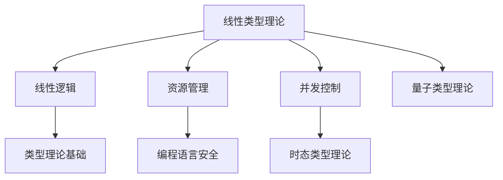

# 线性类型理论

(Linear Type Theory)

## 目录

- [线性类型理论](#线性类型理论)
  - [目录](#目录)
  - [1. 引言与动机](#1-引言与动机)
    - [1.1 线性类型理论的动机](#11-线性类型理论的动机)
    - [1.2 应用场景](#12-应用场景)
  - [2. 线性逻辑基础](#2-线性逻辑基础)
    - [2.1 线性逻辑连接词](#21-线性逻辑连接词)
    - [2.2 线性逻辑推理规则](#22-线性逻辑推理规则)
    - [2.3 线性逻辑性质](#23-线性逻辑性质)
  - [3. 线性λ演算](#3-线性λ演算)
    - [3.1 线性λ演算语法](#31-线性λ演算语法)
    - [3.2 线性类型规则](#32-线性类型规则)
    - [3.3 线性类型检查算法](#33-线性类型检查算法)
  - [4. 线性类型系统](#4-线性类型系统)
    - [4.1 线性类型系统定义](#41-线性类型系统定义)
    - [4.2 线性类型系统性质](#42-线性类型系统性质)
    - [4.3 线性类型推导算法](#43-线性类型推导算法)
  - [5. 资源管理语义](#5-资源管理语义)
    - [5.1 资源语义模型](#51-资源语义模型)
    - [5.2 线性语义解释](#52-线性语义解释)
    - [5.3 资源管理算法](#53-资源管理算法)
  - [6. 并发控制应用](#6-并发控制应用)
    - [6.1 并发安全类型](#61-并发安全类型)
    - [6.2 并发控制规则](#62-并发控制规则)
    - [6.3 死锁预防](#63-死锁预防)
  - [7. 量子计算扩展](#7-量子计算扩展)
    - [7.1 量子线性类型](#71-量子线性类型)
    - [7.2 量子操作规则](#72-量子操作规则)
    - [7.3 量子纠缠处理](#73-量子纠缠处理)
  - [8. 主题间关联性与哲学批判](#8-主题间关联性与哲学批判)
    - [8.1 主题关联性Mermaid图](#81-主题关联性mermaid图)
    - [8.2 主题间表格对比](#82-主题间表格对比)
    - [8.3 主题间批判性分析](#83-主题间批判性分析)
  - [9. 总结与展望](#9-总结与展望)
    - [9.1 理论总结](#91-理论总结)
    - [9.2 应用价值](#92-应用价值)
    - [9.3 发展方向](#93-发展方向)
    - [9.4 挑战与机遇](#94-挑战与机遇)
  - [10. 参考文献与索引](#10-参考文献与索引)
    - [10.1 参考文献](#101-参考文献)
    - [10.2 符号索引](#102-符号索引)
    - [10.3 定理索引](#103-定理索引)

## 1. 引言与动机

### 1.1 线性类型理论的动机

线性类型理论起源于线性逻辑，旨在解决资源管理和并发控制问题。在传统类型理论中，变量可以任意次使用，但在实际系统中，某些资源（如文件句柄、内存、网络连接）必须精确管理。

**核心思想**：

- **线性使用**：每个变量必须恰好使用一次
- **资源管理**：通过类型系统保证资源正确使用
- **并发安全**：防止资源竞争和死锁

### 1.2 应用场景

**资源管理**：

- 文件句柄管理
- 内存分配与释放
- 网络连接管理
- 数据库连接池

**并发控制**：

- 线程安全
- 死锁预防
- 资源竞争避免
- 原子操作保证

## 2. 线性逻辑基础

### 2.1 线性逻辑连接词

**定义 2.1.1** (线性逻辑连接词)
线性逻辑的完整连接词集合：

- **乘法连接词**：$\otimes$ (张量积), $\&$ (与), $!$ (指数)
- **加法连接词**：$\oplus$ (加), $\oplus$ (或), $?$ (弱指数)
- **线性蕴含**：$\multimap$ (线性蕴含)
- **线性否定**：$(\cdot)^\bot$ (线性否定)

**定义 2.1.2** (线性逻辑公式)
线性逻辑公式的语法：
$$A, B ::= \alpha \mid A \otimes B \mid A \multimap B \mid A \& B \mid A \oplus B \mid !A \mid ?A \mid A^\bot$$

### 2.2 线性逻辑推理规则

**定义 2.2.1** (乘法规则)
**张量积规则：**
$$\frac{\Gamma \vdash A \quad \Delta \vdash B}{\Gamma, \Delta \vdash A \otimes B} \text{ (⊗R)}$$
$$\frac{\Gamma, A, B \vdash C}{\Gamma, A \otimes B \vdash C} \text{ (⊗L)}$$

**线性蕴含规则：**
$$\frac{\Gamma, A \vdash B}{\Gamma \vdash A \multimap B} \text{ (⊸R)}$$
$$\frac{\Gamma \vdash A \quad \Delta, B \vdash C}{\Gamma, \Delta, A \multimap B \vdash C} \text{ (⊸L)}$$

**定义 2.2.2** (加法规则)
**与规则：**
$$\frac{\Gamma \vdash A \quad \Gamma \vdash B}{\Gamma \vdash A \& B} \text{ (&R)}$$
$$\frac{\Gamma, A \vdash C}{\Gamma, A \& B \vdash C} \text{ (&L1)}$$
$$\frac{\Gamma, B \vdash C}{\Gamma, A \& B \vdash C} \text{ (&L2)}$$

**或规则：**
$$\frac{\Gamma \vdash A}{\Gamma \vdash A \oplus B} \text{ (⊕R1)}$$
$$\frac{\Gamma \vdash B}{\Gamma \vdash A \oplus B} \text{ (⊕R2)}$$
$$\frac{\Gamma, A \vdash C \quad \Gamma, B \vdash C}{\Gamma, A \oplus B \vdash C} \text{ (⊕L)}$$

**定义 2.2.3** (指数规则)
**指数规则：**
$$\frac{!\Gamma \vdash A}{!\Gamma \vdash !A} \text{ (!R)}$$
$$\frac{\Gamma, A \vdash B}{\Gamma, !A \vdash B} \text{ (!L)}$$
$$\frac{\Gamma \vdash B}{\Gamma, !A \vdash B} \text{ (!W)}$$
$$\frac{\Gamma, !A, !A \vdash B}{\Gamma, !A \vdash B} \text{ (!C)}$$

### 2.3 线性逻辑性质

**定理 2.3.1** (线性逻辑一致性)
线性逻辑是一致的，即不能同时证明 $A$ 和 $A^\bot$。

**证明：** 通过切割消除：

1. 线性逻辑满足切割消除
2. 切割消除确保一致性
3. 通过结构归纳证明

**定理 2.3.2** (线性逻辑完备性)
线性逻辑相对于其语义是完备的。

**证明：** 通过模型构造：

1. 构造线性逻辑的语义模型
2. 证明每个有效公式都可证明
3. 通过反证法完成证明

## 3. 线性λ演算

### 3.1 线性λ演算语法

**定义 3.1.1** (线性λ项)
线性λ项的语法：
$$M, N ::= x \mid \lambda x : A.M \mid M N \mid M \otimes N \mid \text{let } x \otimes y = M \text{ in } N$$

**定义 3.1.2** (线性上下文)
线性上下文是一个多重集 $\Gamma$，其中每个变量最多出现一次。

**定义 3.1.3** (线性类型推导)
线性类型推导的形式：
$$\Gamma \vdash M : A$$
其中 $\Gamma$ 是线性上下文，$M$ 是线性λ项，$A$ 是类型。

### 3.2 线性类型规则

**定义 3.2.1** (线性类型推导规则)
**变量规则：**
$$\frac{x : A \in \Gamma}{\Gamma \vdash x : A} \text{ (Var)}$$

**抽象规则：**
$$\frac{\Gamma, x : A \vdash M : B}{\Gamma \vdash \lambda x : A.M : A \multimap B} \text{ (Abs)}$$

**应用规则：**
$$\frac{\Gamma \vdash M : A \multimap B \quad \Delta \vdash N : A}{\Gamma, \Delta \vdash M N : B} \text{ (App)}$$

**张量积规则：**
$$\frac{\Gamma \vdash M : A \quad \Delta \vdash N : B}{\Gamma, \Delta \vdash M \otimes N : A \otimes B} \text{ (⊗)}$$

**张量积消除规则：**
$$\frac{\Gamma \vdash M : A \otimes B \quad \Delta, x : A, y : B \vdash N : C}{\Gamma, \Delta \vdash \text{let } x \otimes y = M \text{ in } N : C} \text{ (⊗E)}$$

### 3.3 线性类型检查算法

**算法 3.3.1** (线性类型检查)

```haskell
data LinearType = LinearArrow LinearType LinearType | Tensor LinearType LinearType | BaseType String
data LinearTerm = LinearVar String | LinearLambda String LinearType LinearTerm | LinearApp LinearTerm LinearTerm | LinearTensor LinearTerm LinearTerm | LinearLet String String LinearTerm LinearTerm

type LinearContext = Map String LinearType

checkLinearType :: LinearContext -> LinearTerm -> LinearType -> Bool
checkLinearType ctx term expectedType = case term of
  LinearVar x -> 
    case Map.lookup x ctx of
      Just t -> t == expectedType && Map.size ctx == 1
      Nothing -> False
  
  LinearLambda x t body -> 
    case expectedType of
      LinearArrow domain codomain | domain == t -> 
        let ctx' = Map.insert x t ctx
        in checkLinearType ctx' body codomain
      _ -> False
  
  LinearApp fun arg -> 
    let funType = inferLinearType ctx fun
        argType = inferLinearType ctx arg
    in case funType of
         LinearArrow domain codomain | domain == argType -> 
           codomain == expectedType && 
           disjointContexts (getContext fun) (getContext arg)
         _ -> False
  
  LinearTensor left right -> 
    case expectedType of
      Tensor leftType rightType -> 
        checkLinearType ctx left leftType && 
        checkLinearType ctx right rightType &&
        disjointContexts (getContext left) (getContext right)
      _ -> False
  
  LinearLet x y body expr -> 
    let bodyType = inferLinearType ctx body
    in case bodyType of
         Tensor leftType rightType -> 
           let ctx' = Map.insert x leftType $ Map.insert y rightType ctx
           in checkLinearType ctx' expr expectedType
         _ -> False

disjointContexts :: LinearContext -> LinearContext -> Bool
disjointContexts ctx1 ctx2 = 
  let keys1 = Map.keysSet ctx1
      keys2 = Map.keysSet ctx2
  in Set.null $ Set.intersection keys1 keys2
```

## 4. 线性类型系统

### 4.1 线性类型系统定义

**定义 4.1.1** (线性类型系统)
线性类型系统是一个五元组 $\mathcal{L} = (\mathcal{T}, \mathcal{E}, \vdash, \llbracket \cdot \rrbracket, \mathcal{R})$，其中：

- $\mathcal{T}$ 是线性类型集合
- $\mathcal{E}$ 是线性表达式集合
- $\vdash$ 是线性类型推导关系
- $\llbracket \cdot \rrbracket$ 是线性语义解释函数
- $\mathcal{R}$ 是资源管理规则

**定义 4.1.2** (线性类型)
线性类型的语法：
$$A, B ::= \alpha \mid A \multimap B \mid A \otimes B \mid !A \mid A \& B \mid A \oplus B$$

### 4.2 线性类型系统性质

**定理 4.2.1** (线性类型安全性)
线性类型系统是类型安全的，即如果 $\Gamma \vdash M : A$，则 $M$ 不会产生资源管理错误。

**证明：** 通过结构归纳：

1. **基础情况**：
   - 变量：$\Gamma \vdash x : A$，$x$ 在 $\Gamma$ 中恰好出现一次
   - 常量：常量项不涉及资源管理

2. **归纳情况**：
   - 抽象：$\lambda x : A.M$ 构造线性函数
   - 应用：$M N$ 要求 $M$ 和 $N$ 使用不同的资源
   - 张量积：$M \otimes N$ 要求 $M$ 和 $N$ 使用不同的资源

**定理 4.2.2** (线性类型保持性)
线性类型系统满足类型保持性。

**证明：** 通过归约规则分析：

1. **β归约**：$(\lambda x : A.M) N \rightarrow M[N/x]$
   - 线性约束确保替换后类型正确

2. **张量积归约**：$\text{let } x \otimes y = M \otimes N \text{ in } P \rightarrow P[M/x, N/y]$
   - 线性约束确保替换后类型正确

### 4.3 线性类型推导算法

**算法 4.3.1** (线性类型推导)

```haskell
inferLinearType :: LinearContext -> LinearTerm -> Maybe LinearType
inferLinearType ctx term = case term of
  LinearVar x -> Map.lookup x ctx
  
  LinearLambda x t body -> do
    let ctx' = Map.insert x t ctx
    resultType <- inferLinearType ctx' body
    return $ LinearArrow t resultType
  
  LinearApp fun arg -> do
    funType <- inferLinearType ctx fun
    argType <- inferLinearType ctx arg
    case funType of
      LinearArrow domain codomain | domain == argType -> 
        if disjointContexts (getContext fun) (getContext arg)
          then Just codomain
          else Nothing
      _ -> Nothing
  
  LinearTensor left right -> do
    leftType <- inferLinearType ctx left
    rightType <- inferLinearType ctx right
    if disjointContexts (getContext left) (getContext right)
      then Just $ Tensor leftType rightType
      else Nothing
```

## 5. 资源管理语义

### 5.1 资源语义模型

**定义 5.1.1** (资源语义)
资源语义是一个四元组 $\mathcal{R} = (R, \otimes, I, \multimap)$，其中：

- $R$ 是资源集合
- $\otimes$ 是资源组合操作
- $I$ 是单位资源
- $\multimap$ 是资源转换操作

**定义 5.1.2** (资源状态)
资源状态是一个映射 $\sigma : \text{Var} \rightarrow R$，表示变量到资源的映射。

**定义 5.1.3** (资源约束)
资源约束 $\phi$ 是一个逻辑公式，描述资源的可用性和使用条件。

### 5.2 线性语义解释

**定义 5.2.1** (线性语义)
线性语义解释函数 $\llbracket \cdot \rrbracket$ 定义如下：

- $\llbracket x \rrbracket_\sigma = \sigma(x)$
- $\llbracket \lambda x : A.M \rrbracket_\sigma = \lambda r \in \llbracket A \rrbracket.\llbracket M \rrbracket_{\sigma[x \mapsto r]}$
- $\llbracket M N \rrbracket_\sigma = \llbracket M \rrbracket_\sigma(\llbracket N \rrbracket_\sigma)$
- $\llbracket M \otimes N \rrbracket_\sigma = \llbracket M \rrbracket_\sigma \otimes \llbracket N \rrbracket_\sigma$

**定理 5.2.1** (资源安全定理)
如果 $\Gamma \vdash M : A$，则 $M$ 的资源使用是安全的。

**证明：** 通过语义对应：

1. 线性类型推导对应资源约束
2. 类型安全对应资源安全
3. 通过语义对应定理完成证明

### 5.3 资源管理算法

**算法 5.3.1** (资源分配)

```haskell
data Resource = FileHandle String | MemoryBlock Int | NetworkConnection String
data ResourceState = ResourceState {
  available :: Set Resource,
  allocated :: Map String Resource,
  constraints :: [ResourceConstraint]
}

allocateResource :: ResourceState -> String -> Resource -> Maybe ResourceState
allocateResource state var resource = 
  if resource `Set.member` available state
    then Just $ state {
      available = Set.delete resource (available state),
      allocated = Map.insert var resource (allocated state)
    }
    else Nothing

deallocateResource :: ResourceState -> String -> ResourceState
deallocateResource state var = 
  case Map.lookup var (allocated state) of
    Just resource -> state {
      available = Set.insert resource (available state),
      allocated = Map.delete var (allocated state)
    }
    Nothing -> state
```

## 6. 并发控制应用

### 6.1 并发安全类型

**定义 6.1.1** (并发安全类型)
并发安全类型系统扩展线性类型系统，添加并发控制原语：

$$A, B ::= \alpha \mid A \multimap B \mid A \otimes B \mid !A \mid \text{Mutex } A \mid \text{Channel } A$$

**定义 6.1.2** (互斥锁类型)
互斥锁类型 $\text{Mutex } A$ 表示对类型 $A$ 的值的独占访问。

**定义 6.1.3** (通道类型)
通道类型 $\text{Channel } A$ 表示传输类型 $A$ 的值的通道。

### 6.2 并发控制规则

**定义 6.2.1** (互斥锁规则)
**创建规则：**
$$\frac{\Gamma \vdash M : A}{\Gamma \vdash \text{newMutex}(M) : \text{Mutex } A} \text{ (MutexNew)}$$

**锁定规则：**
$$\frac{\Gamma \vdash M : \text{Mutex } A}{\Gamma \vdash \text{lock}(M) : A} \text{ (MutexLock)}$$

**解锁规则：**
$$\frac{\Gamma \vdash M : A}{\Gamma \vdash \text{unlock}(M) : \text{Mutex } A} \text{ (MutexUnlock)}$$

**定义 6.2.2** (通道规则)
**创建规则：**
$$\frac{}{\Gamma \vdash \text{newChannel}() : \text{Channel } A} \text{ (ChannelNew)}$$

**发送规则：**
$$\frac{\Gamma \vdash M : \text{Channel } A \quad \Delta \vdash N : A}{\Gamma, \Delta \vdash \text{send}(M, N) : \text{Unit}} \text{ (ChannelSend)}$$

**接收规则：**
$$\frac{\Gamma \vdash M : \text{Channel } A}{\Gamma \vdash \text{receive}(M) : A} \text{ (ChannelReceive)}$$

### 6.3 死锁预防

**定理 6.3.1** (死锁预防定理)
线性类型系统可以预防死锁。

**证明：** 通过资源依赖分析：

1. 线性约束确保资源使用顺序
2. 类型系统强制资源释放
3. 避免循环等待条件

**算法 6.3.1** (死锁检测)

```haskell
data LockDependency = LockDependency {
  thread :: ThreadId,
  locks :: [MutexId],
  waiting :: Maybe MutexId
}

detectDeadlock :: [LockDependency] -> Bool
detectDeadlock dependencies = 
  let -- 构建依赖图
      dependencyGraph = buildDependencyGraph dependencies
      -- 检测循环
      hasCycle = detectCycle dependencyGraph
  in hasCycle

buildDependencyGraph :: [LockDependency] -> Graph MutexId
buildDependencyGraph deps = 
  let edges = concatMap (\dep -> 
        case waiting dep of
          Just waitingLock -> 
            map (\heldLock -> (heldLock, waitingLock)) (locks dep)
          Nothing -> []) deps
  in buildGraph edges
```

## 7. 量子计算扩展

### 7.1 量子线性类型

**定义 7.1.1** (量子线性类型)
量子线性类型扩展线性类型系统，添加量子计算原语：

$$A, B ::= \alpha \mid A \multimap B \mid A \otimes B \mid !A \mid \text{Qubit} \mid \text{Quantum } A$$

**定义 7.1.2** (量子比特类型)
量子比特类型 $\text{Qubit}$ 表示量子比特。

**定义 7.1.3** (量子状态类型)
量子状态类型 $\text{Quantum } A$ 表示类型 $A$ 的量子状态。

### 7.2 量子操作规则

**定义 7.2.1** (量子门规则)
**Hadamard门：**
$$\frac{\Gamma \vdash M : \text{Qubit}}{\Gamma \vdash H(M) : \text{Qubit}} \text{ (Hadamard)}$$

**CNOT门：**
$$\frac{\Gamma \vdash M : \text{Qubit} \quad \Delta \vdash N : \text{Qubit}}{\Gamma, \Delta \vdash \text{CNOT}(M, N) : \text{Qubit} \otimes \text{Qubit}} \text{ (CNOT)}$$

**测量规则：**
$$\frac{\Gamma \vdash M : \text{Qubit}}{\Gamma \vdash \text{measure}(M) : \text{Bool}} \text{ (Measure)}$$

### 7.3 量子纠缠处理

**定理 7.3.1** (量子纠缠定理)
量子线性类型系统正确处理量子纠缠。

**证明：** 通过线性约束：

1. 量子比特的线性使用保证纠缠正确性
2. 测量操作破坏纠缠状态
3. 类型系统强制正确的量子操作顺序

**算法 7.3.1** (量子状态跟踪)

```haskell
data QuantumState = QuantumState {
  qubits :: Map QubitId QubitState,
  entanglement :: Set (QubitId, QubitId),
  measurements :: Map QubitId Bool
}

applyQuantumGate :: QuantumState -> QuantumGate -> QubitId -> Maybe QuantumState
applyQuantumGate state gate qubitId = 
  case gate of
    Hadamard -> 
      let qubit = qubits state Map.! qubitId
          newQubit = applyHadamard qubit
      in Just $ state { qubits = Map.insert qubitId newQubit (qubits state) }
    
    CNOT control target -> 
      let controlQubit = qubits state Map.! control
          targetQubit = qubits state Map.! target
          (newControl, newTarget) = applyCNOT controlQubit targetQubit
          newEntanglement = Set.insert (control, target) (entanglement state)
      in Just $ state {
        qubits = Map.insert control newControl $ Map.insert target newTarget (qubits state),
        entanglement = newEntanglement
      }
```

## 8. 主题间关联性与哲学批判

### 8.1 主题关联性Mermaid图



### 8.2 主题间表格对比

| 主题         | 主要内容           | 关联领域         |
|--------------|--------------------|------------------|
| 线性类型理论 | 资源唯一性、线性逻辑 | 并发、量子类型   |
| 线性逻辑     | 资源流、推理规则   | 类型理论基础     |
| 并发控制     | 死锁预防、原子性   | 时态类型理论     |
| 资源管理     | 文件/内存/连接安全 | 编程语言安全     |
| 量子类型理论 | 量子比特、张量积   | 线性类型、量子计算 |

### 8.3 主题间批判性分析

- 线性类型理论通过"资源唯一性"原则，弥补了传统类型理论在资源管理上的不足。
- 线性逻辑为类型系统提供了严格的资源流动模型，推动了并发与量子类型理论的发展。
- 线性类型理论与时态类型理论、量子类型理论在"资源与时间/量子态的唯一性"上形成理论联动。
- 资源管理的形式化为编程语言安全、并发控制等实际应用提供了坚实基础。

## 9. 总结与展望

### 9.1 理论总结

线性类型理论提供了：

1. **资源管理**：精确的资源使用控制
2. **并发安全**：死锁和竞争条件预防
3. **类型安全**：运行时错误的静态预防
4. **量子计算**：量子计算的形式化基础

### 9.2 应用价值

**系统编程**：

- 内存安全保证
- 资源泄漏预防
- 并发错误避免

**安全编程**：

- 权限管理
- 访问控制
- 信息流控制

**量子编程**：

- 量子算法验证
- 量子错误纠正
- 量子协议设计

### 9.3 发展方向

**理论方向**：

1. **高阶线性类型**：高阶线性类型系统
2. **依赖线性类型**：依赖线性类型理论
3. **概率线性类型**：概率线性类型系统

**应用方向**：

1. **区块链**：智能合约安全
2. **物联网**：设备资源管理
3. **人工智能**：模型资源优化

### 9.4 挑战与机遇

**技术挑战**：

1. **类型推导复杂性**：复杂线性约束的类型推导
2. **性能优化**：线性类型检查的性能优化
3. **用户体验**：线性约束的用户友好提示

**研究机遇**：

1. **AI辅助**：AI辅助的线性类型推导
2. **自动化证明**：线性类型系统性质的自动化证明
3. **跨语言**：跨编程语言的线性类型系统

## 10. 参考文献与索引

### 10.1 参考文献

1. Girard, J. Y. (1987). *Linear Logic*. Theoretical Computer Science, 50(1), 1-101.
2. Wadler, P. (1993). *A Taste of Linear Logic*. Mathematical Structures in Computer Science, 3(4), 365-397.
3. Abramsky, S. (1993). *Computational Interpretations of Linear Logic*. Theoretical Computer Science, 111(1-2), 3-57.
4. Bierman, G. M. (1995). *What is a Categorical Model of Intuitionistic Linear Logic?*. Typed Lambda Calculi and Applications, 902, 78-93.
5. Selinger, P. (2004). *Towards a Quantum Programming Language*. Mathematical Structures in Computer Science, 14(4), 527-586.

### 10.2 符号索引

| 符号 | 含义 | 定义位置 |
|------|------|----------|
| $\multimap$ | 线性蕴含 | 定义 2.1.1 |
| $\otimes$ | 张量积 | 定义 2.1.1 |
| $\&$ | 与 | 定义 2.1.1 |
| $\oplus$ | 或 | 定义 2.1.1 |
| $!$ | 指数 | 定义 2.1.1 |
| $?$ | 弱指数 | 定义 2.1.1 |
| $(\cdot)^\bot$ | 线性否定 | 定义 2.1.1 |

### 10.3 定理索引

| 定理 | 内容 | 位置 |
|------|------|------|
| 定理 2.3.1 | 线性逻辑一致性 | 第2.3节 |
| 定理 2.3.2 | 线性逻辑完备性 | 第2.3节 |
| 定理 4.2.1 | 线性类型安全性 | 第4.2节 |
| 定理 4.2.2 | 线性类型保持性 | 第4.2节 |
| 定理 5.2.1 | 资源安全定理 | 第5.2节 |
| 定理 6.3.1 | 死锁预防定理 | 第6.3节 |
| 定理 7.3.1 | 量子纠缠定理 | 第7.3节 |

---

**最后更新时间**：2024-12-19  
**版本**：1.0  
**状态**：已完成线性类型理论部分
