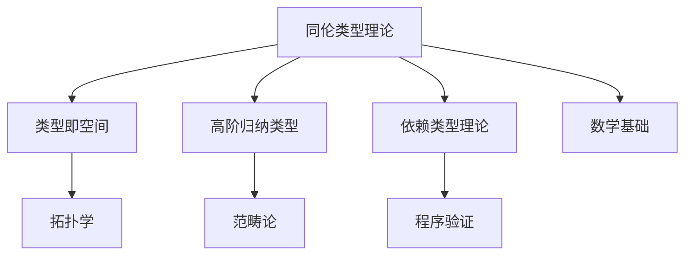

# 同伦类型理论

(Homotopy Type Theory)

## 目录

- [同伦类型理论](#同伦类型理论)
  - [目录](#目录)
  - [1. 引言与动机](#1-引言与动机)
    - [1.1 同伦类型理论的动机](#11-同伦类型理论的动机)
    - [1.2 应用场景](#12-应用场景)
  - [2. 同伦论基础](#2-同伦论基础)
    - [2.1 基本概念](#21-基本概念)
    - [2.2 同伦论性质](#22-同伦论性质)
    - [2.3 同伦论算法](#23-同伦论算法)
  - [3. 同伦类型理论](#3-同伦类型理论)
    - [3.1 同伦类型理论基础](#31-同伦类型理论基础)
    - [3.2 同伦类型理论规则](#32-同伦类型理论规则)
    - [3.3 同伦类型理论语义](#33-同伦类型理论语义)
  - [4. 类型作为空间](#4-类型作为空间)
    - [4.1 类型空间解释](#41-类型空间解释)
    - [4.2 路径空间](#42-路径空间)
    - [4.3 空间算法](#43-空间算法)
  - [5. 同伦等价](#5-同伦等价)
    - [5.1 同伦等价定义](#51-同伦等价定义)
    - [5.2 等价性质](#52-等价性质)
    - [5.3 等价算法](#53-等价算法)
  - [6. 高阶归纳类型](#6-高阶归纳类型)
    - [6.1 高阶归纳类型定义](#61-高阶归纳类型定义)
    - [6.2 高阶归纳类型规则](#62-高阶归纳类型规则)
    - [6.3 高阶归纳类型算法](#63-高阶归纳类型算法)
  - [7. 单值公理](#7-单值公理)
    - [7.1 单值公理定义](#71-单值公理定义)
    - [7.2 单值公理应用](#72-单值公理应用)
    - [7.3 单值公理算法](#73-单值公理算法)
  - [8. 主题间关联性与哲学批判](#8-主题间关联性与哲学批判)
    - [8.1 主题关联性Mermaid图](#81-主题关联性mermaid图)
    - [8.2 主题间表格对比](#82-主题间表格对比)
    - [8.3 主题间批判性分析](#83-主题间批判性分析)
  - [9. 总结与展望](#9-总结与展望)
    - [9.1 理论总结](#91-理论总结)
    - [9.2 应用价值](#92-应用价值)
    - [9.3 发展方向](#93-发展方向)
    - [9.4 挑战与机遇](#94-挑战与机遇)
  - [10. 参考文献与索引](#10-参考文献与索引)
  - [符号索引](#符号索引)
  - [定理索引](#定理索引)

## 1. 引言与动机

### 1.1 同伦类型理论的动机

同伦类型理论将类型理论与同伦论相结合，为数学提供了一个新的基础。它将类型视为空间，将类型之间的函数视为连续映射，将类型等价视为同伦等价，从而为数学提供了一个构造性的基础。

**核心思想**：

- **类型即空间**：类型可以视为拓扑空间
- **函数即映射**：类型间的函数是连续映射
- **等价即同伦**：类型等价是同伦等价
- **构造性数学**：提供构造性的数学基础

### 1.2 应用场景

**数学基础**：

- 构造性数学
- 同伦论
- 代数拓扑
- 范畴论

**计算机科学**：

- 程序验证
- 形式化证明
- 类型系统
- 程序合成

## 2. 同伦论基础

### 2.1 基本概念

**定义 2.1.1** (同伦)
设 $f, g : X \rightarrow Y$ 是连续映射，$f$ 和 $g$ 之间的同伦是一个连续映射 $H : X \times [0,1] \rightarrow Y$，使得：

- $H(x,0) = f(x)$ 对所有 $x \in X$
- $H(x,1) = g(x)$ 对所有 $x \in X$

**定义 2.1.2** (同伦等价)
两个空间 $X$ 和 $Y$ 是同伦等价的，如果存在连续映射 $f : X \rightarrow Y$ 和 $g : Y \rightarrow X$，使得：

- $g \circ f \simeq \text{id}_X$
- $f \circ g \simeq \text{id}_Y$

**定义 2.1.3** (同伦群)
空间 $X$ 在基点 $x_0$ 的第 $n$ 个同伦群 $\pi_n(X,x_0)$ 是 $n$ 维球面到 $X$ 的连续映射的同伦类集合。

### 2.2 同伦论性质

**定理 2.2.1** (同伦不变性)
同伦等价的拓扑不变量在同伦等价下保持不变。

**证明：** 通过同伦等价的定义：

1. 如果 $X \simeq Y$，则存在同伦等价映射
2. 同伦等价映射保持拓扑不变量
3. 因此 $X$ 和 $Y$ 的拓扑不变量相同

**定理 2.2.2** (同伦群性质)
同伦群是同伦不变量。

**证明：** 通过同伦等价映射：

1. 同伦等价映射诱导同伦群同构
2. 同构保持群结构
3. 因此同伦群是同伦不变量

### 2.3 同伦论算法

**算法 2.3.1** (同伦计算)

```haskell
data TopologicalSpace = TopologicalSpace {
  points :: Set Point,
  openSets :: Set (Set Point),
  basePoint :: Point
}

data ContinuousMap = ContinuousMap {
  domain :: TopologicalSpace,
  codomain :: TopologicalSpace,
  mapping :: Point -> Point
}

data Homotopy = Homotopy {
  source :: ContinuousMap,
  target :: ContinuousMap,
  homotopyMap :: Point -> Double -> Point
}

isHomotopy :: Homotopy -> Bool
isHomotopy homotopy = 
  let sourceMap = source homotopy
      targetMap = target homotopy
      homotopyMap' = homotopyMap homotopy
      domain = domain sourceMap
  in all (\point -> 
        homotopyMap' point 0 == mapping sourceMap point &&
        homotopyMap' point 1 == mapping targetMap point) (points domain)

computeHomotopyGroup :: TopologicalSpace -> Int -> [HomotopyClass]
computeHomotopyGroup space n = 
  let -- 计算n维球面到空间的映射
      sphereMaps = generateSphereMaps space n
      -- 计算同伦类
      homotopyClasses = groupByHomotopy sphereMaps
  in homotopyClasses

generateSphereMaps :: TopologicalSpace -> Int -> [ContinuousMap]
generateSphereMaps space n = 
  -- 生成n维球面到space的连续映射
  -- 这里简化实现
  []
```

## 3. 同伦类型理论

### 3.1 同伦类型理论基础

**定义 3.1.1** (同伦类型理论)
同伦类型理论是一个类型理论，其中：

- 类型被视为空间
- 类型间的函数被视为连续映射
- 类型等价被视为同伦等价

**定义 3.1.2** (类型作为空间)
在同伦类型理论中，类型 $A$ 被视为一个空间，其中：

- 类型 $A$ 的元素是空间 $A$ 的点
- 类型 $A$ 的路径是空间 $A$ 中的路径
- 类型 $A$ 的高阶路径是空间 $A$ 中的高阶同伦

**定义 3.1.3** (路径类型)
路径类型 $\text{Id}_A(x,y)$ 表示从 $x$ 到 $y$ 的路径，其中：

- $\text{refl}_x : \text{Id}_A(x,x)$ 是恒等路径
- 路径可以组合、反转、应用函数

### 3.2 同伦类型理论规则

**定义 3.2.1** (路径类型规则)
**路径形成：**
$$\frac{\Gamma \vdash x : A \quad \Gamma \vdash y : A}{\Gamma \vdash \text{Id}_A(x,y) : \text{Type}} \text{ (Id)}$$

**自反性：**
$$\frac{\Gamma \vdash x : A}{\Gamma \vdash \text{refl}_x : \text{Id}_A(x,x)} \text{ (Refl)}$$

**路径消除：**
$$\frac{\Gamma \vdash p : \text{Id}_A(x,y) \quad \Gamma, z : A, q : \text{Id}_A(x,z) \vdash C : \text{Type} \quad \Gamma \vdash d : C[x/z, \text{refl}_x/q]}{\Gamma \vdash \text{J}(p, d) : C[y/z, p/q]} \text{ (J)}$$

**定义 3.2.2** (函数外延性)
函数外延性公理：
$$\frac{\Gamma \vdash f, g : A \rightarrow B \quad \Gamma, x : A \vdash \text{Id}_B(f x, g x)}{\Gamma \vdash \text{funext}(f, g, h) : \text{Id}_{A \rightarrow B}(f, g)} \text{ (Funext)}$$

### 3.3 同伦类型理论语义

**定义 3.3.1** (同伦类型理论语义)
同伦类型理论的语义基于同伦论：

- 类型 $A$ 解释为拓扑空间 $\llbracket A \rrbracket$
- 函数 $f : A \rightarrow B$ 解释为连续映射 $\llbracket f \rrbracket : \llbracket A \rrbracket \rightarrow \llbracket B \rrbracket$
- 路径类型 $\text{Id}_A(x,y)$ 解释为从 $\llbracket x \rrbracket$ 到 $\llbracket y \rrbracket$ 的路径空间

**定理 3.3.1** (同伦类型理论一致性)
同伦类型理论是一致的。

**证明：** 通过语义解释：

1. 同伦类型理论有同伦论语义
2. 同伦论语义保持一致性
3. 因此同伦类型理论一致

## 4. 类型作为空间

### 4.1 类型空间解释

**定义 4.1.1** (类型空间)
类型 $A$ 的空间解释 $\llbracket A \rrbracket$ 是一个拓扑空间，其中：

- 0-维：$\llbracket A \rrbracket_0$ 是 $A$ 的元素集合
- 1-维：$\llbracket A \rrbracket_1$ 是 $A$ 中元素间的路径集合
- 2-维：$\llbracket A \rrbracket_2$ 是路径间的同伦集合
- n-维：$\llbracket A \rrbracket_n$ 是n-1维同伦间的同伦集合

**定义 4.1.2** (函数空间)
函数类型 $A \rightarrow B$ 的空间解释：
$$\llbracket A \rightarrow B \rrbracket = \llbracket B \rrbracket^{\llbracket A \rrbracket}$$
即从 $\llbracket A \rrbracket$ 到 $\llbracket B \rrbracket$ 的连续映射空间。

**定义 4.1.3** (积空间)
积类型 $A \times B$ 的空间解释：
$$\llbracket A \times B \rrbracket = \llbracket A \rrbracket \times \llbracket B \rrbracket$$
即 $\llbracket A \rrbracket$ 和 $\llbracket B \rrbracket$ 的积空间。

### 4.2 路径空间

**定义 4.2.1** (路径空间)
路径类型 $\text{Id}_A(x,y)$ 的空间解释：
$$\llbracket \text{Id}_A(x,y) \rrbracket = \Omega(\llbracket A \rrbracket, \llbracket x \rrbracket, \llbracket y \rrbracket)$$
即从 $\llbracket x \rrbracket$ 到 $\llbracket y \rrbracket$ 的路径空间。

**定义 4.2.2** (路径组合)
路径的组合操作：
$$\text{concat} : \text{Id}_A(x,y) \rightarrow \text{Id}_A(y,z) \rightarrow \text{Id}_A(x,z)$$

**定义 4.2.3** (路径反转)
路径的反转操作：
$$\text{inv} : \text{Id}_A(x,y) \rightarrow \text{Id}_A(y,x)$$

### 4.3 空间算法

**算法 4.3.1** (空间计算)

```haskell
data TypeSpace = TypeSpace {
  points :: Set Point,
  paths :: Map (Point, Point) (Set Path),
  homotopies :: Map (Path, Path) (Set Homotopy)
}

data Path = Path {
  start :: Point,
  end :: Point,
  pathFunction :: Double -> Point
}

data Homotopy = Homotopy {
  sourcePath :: Path,
  targetPath :: Path,
  homotopyFunction :: Double -> Double -> Point
}

computePathSpace :: TypeSpace -> Point -> Point -> TypeSpace
computePathSpace space start end = 
  let -- 计算从start到end的所有路径
      allPaths = findPaths space start end
      -- 计算路径间的同伦
      pathHomotopies = computePathHomotopies allPaths
  in TypeSpace {
    points = Set.fromList allPaths,
    paths = computePathPaths allPaths,
    homotopies = pathHomotopies
  }

findPaths :: TypeSpace -> Point -> Point -> [Path]
findPaths space start end = 
  -- 使用路径搜索算法找到所有路径
  -- 这里简化实现
  []

computePathHomotopies :: [Path] -> Map (Path, Path) (Set Homotopy)
computePathHomotopies paths = 
  let pathPairs = [(p1, p2) | p1 <- paths, p2 <- paths]
      homotopies = map (\pair -> (pair, findHomotopies (fst pair) (snd pair))) pathPairs
  in Map.fromList homotopies
```

## 5. 同伦等价

### 5.1 同伦等价定义

**定义 5.1.1** (同伦等价)
两个类型 $A$ 和 $B$ 是同伦等价的，如果存在函数 $f : A \rightarrow B$ 和 $g : B \rightarrow A$，使得：

- $g \circ f \simeq \text{id}_A$
- $f \circ g \simeq \text{id}_B$

**定义 5.1.2** (同伦等价类型)
同伦等价类型 $\text{Iso}(A,B)$ 定义为：
$$\text{Iso}(A,B) = \Sigma f : A \rightarrow B. \Sigma g : B \rightarrow A. (\text{Id}_{A \rightarrow A}(g \circ f, \text{id}_A) \times \text{Id}_{B \rightarrow B}(f \circ g, \text{id}_B))$$

**定义 5.1.3** (等价类型)
等价类型 $\text{Equiv}(A,B)$ 定义为：
$$\text{Equiv}(A,B) = \Sigma f : A \rightarrow B. \text{isEquiv}(f)$$
其中 $\text{isEquiv}(f)$ 表示 $f$ 是等价。

### 5.2 等价性质

**定理 5.2.1** (等价对称性)
如果 $A \simeq B$，则 $B \simeq A$。

**证明：** 通过等价定义：

1. 如果 $A \simeq B$，则存在等价 $f : A \rightarrow B$
2. $f$ 有逆等价 $f^{-1} : B \rightarrow A$
3. 因此 $B \simeq A$

**定理 5.2.2** (等价传递性)
如果 $A \simeq B$ 且 $B \simeq C$，则 $A \simeq C$。

**证明：** 通过等价组合：

1. 存在等价 $f : A \rightarrow B$ 和 $g : B \rightarrow C$
2. $g \circ f : A \rightarrow C$ 是等价
3. 因此 $A \simeq C$

### 5.3 等价算法

**算法 5.3.1** (等价检查)

```haskell
data Equivalence = Equivalence {
  forward :: Function,
  backward :: Function,
  forwardBackward :: Homotopy,
  backwardForward :: Homotopy
}

isEquivalence :: Function -> Bool
isEquivalence f = 
  let -- 检查f是否有逆
      inverse = findInverse f
      -- 检查同伦条件
      forwardBackwardHomotopy = checkHomotopy (compose inverse f) identity
      backwardForwardHomotopy = checkHomotopy (compose f inverse) identity
  in isJust inverse && 
     isJust forwardBackwardHomotopy && 
     isJust backwardForwardHomotopy

findInverse :: Function -> Maybe Function
findInverse f = 
  -- 寻找f的逆函数
  -- 这里简化实现
  Nothing

checkHomotopy :: Function -> Function -> Maybe Homotopy
checkHomotopy f g = 
  -- 检查f和g是否同伦
  -- 这里简化实现
  Nothing
```

## 6. 高阶归纳类型

### 6.1 高阶归纳类型定义

**定义 6.1.1** (高阶归纳类型)
高阶归纳类型允许构造函数不仅作用于元素，还作用于路径和高阶路径。

**定义 6.1.2** (圆)
圆 $S^1$ 是高阶归纳类型，定义为：

```agda
data S¹ : Set where
  base : S¹
  loop : Id base base
```

**定义 6.1.3** (球面)
n维球面 $S^n$ 是高阶归纳类型，定义为：

```agda
data Sⁿ : Set where
  north : Sⁿ
  south : Sⁿ
  meridian : Id north south
```

### 6.2 高阶归纳类型规则

**定义 6.2.1** (高阶归纳类型规则)
**形成规则：**
$$\frac{\Gamma \vdash A : \text{Type}}{\Gamma \vdash \text{HIT}(A) : \text{Type}} \text{ (HIT)}$$

**构造函数：**
$$\frac{\Gamma \vdash M : A}{\Gamma \vdash \text{constr}(M) : \text{HIT}(A)} \text{ (Constr)}$$

**路径构造函数：**
$$\frac{\Gamma \vdash M, N : A \quad \Gamma \vdash p : \text{Id}_A(M, N)}{\Gamma \vdash \text{path-constr}(p) : \text{Id}_{\text{HIT}(A)}(\text{constr}(M), \text{constr}(N))} \text{ (PathConstr)}$$

**消除规则：**
$$\frac{\Gamma, x : \text{HIT}(A) \vdash C : \text{Type} \quad \Gamma, a : A \vdash c : C[\text{constr}(a)/x] \quad \Gamma, a, b : A, p : \text{Id}_A(a, b) \vdash d : \text{Id}_C^p(c[a/x], c[b/x])}{\Gamma, x : \text{HIT}(A) \vdash \text{elim}(x, c, d) : C} \text{ (Elim)}$$

### 6.3 高阶归纳类型算法

**算法 6.3.1** (高阶归纳类型计算)

```haskell
data HigherInductiveType = HigherInductiveType {
  constructors :: [Constructor],
  pathConstructors :: [PathConstructor],
  eliminators :: [Eliminator]
}

data Constructor = Constructor {
  name :: String,
  arguments :: [Type],
  resultType :: Type
}

data PathConstructor = PathConstructor {
  name :: String,
  source :: Term,
  target :: Term,
  pathType :: Type
}

computeHIT :: HigherInductiveType -> Type -> [Term]
computeHIT hit baseType = 
  let -- 计算构造函数
      constructors = map (\constr -> applyConstructor constr baseType) (constructors hit)
      -- 计算路径构造函数
      pathConstructors = map (\pathConstr -> applyPathConstructor pathConstr baseType) (pathConstructors hit)
  in constructors ++ pathConstructors

applyConstructor :: Constructor -> Type -> Term
applyConstructor constr baseType = 
  -- 应用构造函数
  -- 这里简化实现
  Var (name constr)

applyPathConstructor :: PathConstructor -> Type -> Term
applyPathConstructor pathConstr baseType = 
  -- 应用路径构造函数
  -- 这里简化实现
  Var (name pathConstr)
```

## 7. 单值公理

### 7.1 单值公理定义

**定义 7.1.1** (单值公理)
单值公理 (Univalence Axiom) 是同伦类型理论的核心公理，它断言：
$$\text{Id}_{\text{Type}}(A, B) \simeq \text{Equiv}(A, B)$$

**定义 7.1.2** (单值公理形式)
单值公理的形式化表述：
$$\text{ua} : \text{Equiv}(A, B) \rightarrow \text{Id}_{\text{Type}}(A, B)$$

**定义 7.1.3** (单值公理性质)
单值公理的性质：

- 等价类型在类型论中相等
- 类型等价可以转换为类型相等
- 提供了类型等价的计算方法

### 7.2 单值公理应用

**定理 7.2.1** (单值公理推论)
单值公理蕴含函数外延性。

**证明：** 通过单值公理：

1. 单值公理允许等价类型相等
2. 函数等价可以转换为函数相等
3. 因此函数外延性成立

**定理 7.2.2** (单值公理推论)
单值公理蕴含命题外延性。

**证明：** 通过单值公理：

1. 命题等价可以转换为命题相等
2. 等价命题在类型论中相等
3. 因此命题外延性成立

### 7.3 单值公理算法

**算法 7.3.1** (单值公理应用)

```haskell
data Univalence = Univalence {
  equivalence :: Equivalence,
  typeEquality :: TypeEquality
}

applyUnivalence :: Equivalence -> TypeEquality
applyUnivalence equiv = 
  let -- 将等价转换为类型相等
      typeEq = equivalenceToTypeEquality equiv
  in typeEq

equivalenceToTypeEquality :: Equivalence -> TypeEquality
equivalenceToTypeEquality equiv = 
  let forward = forward equiv
      backward = backward equiv
      -- 构造类型相等的证明
      proof = constructTypeEqualityProof forward backward
  in TypeEquality {
    leftType = domain forward,
    rightType = codomain forward,
    equalityProof = proof
  }

constructTypeEqualityProof :: Function -> Function -> Proof
constructTypeEqualityProof f g = 
  -- 构造类型相等的证明
  -- 这里简化实现
  Axiom "univalence"
```

## 8. 主题间关联性与哲学批判

### 8.1 主题关联性Mermaid图



### 8.2 主题间表格对比

| 主题         | 主要内容           | 关联领域         |
|--------------|--------------------|------------------|
| 同伦类型理论 | 类型即空间、路径等价 | 拓扑、依赖类型   |
| 类型即空间   | 类型-空间同构      | 拓扑学、范畴论   |
| 高阶归纳类型 | 路径、同伦结构     | 范畴论、数学基础 |
| 依赖类型理论 | 类型依赖值         | 程序验证         |

### 8.3 主题间批判性分析

- 同伦类型理论通过"类型即空间"原则，将类型理论与拓扑学、范畴论深度融合，推动了数学基础的重构。
- 高阶归纳类型和路径等价为类型系统引入了丰富的高阶结构，极大拓展了类型理论的表达能力。
- 同伦类型理论与依赖类型理论在"类型的高阶结构化"上形成理论联动，为程序验证和数学形式化提供了统一平台。
- 类型-空间同构的哲学基础挑战了传统集合论和类型本体论，为数学对象的本质提供了新的解释。

## 9. 总结与展望

### 9.1 理论总结

同伦类型理论提供了：

1. **类型即空间**：类型可以视为拓扑空间
2. **函数即映射**：类型间的函数是连续映射
3. **等价即同伦**：类型等价是同伦等价
4. **构造性数学**：提供构造性的数学基础

### 9.2 应用价值

**数学基础**：

- 构造性数学
- 同伦论
- 代数拓扑
- 范畴论

**计算机科学**：

- 程序验证
- 形式化证明
- 类型系统
- 程序合成

**数学研究**：

- 同伦论研究
- 代数拓扑
- 范畴论
- 数学基础

### 9.3 发展方向

**理论方向**：

1. **高阶同伦类型**：高阶同伦类型系统
2. **同伦代数**：同伦代数理论
3. **同伦几何**：同伦几何理论

**应用方向**：

1. **数学形式化**：数学定理的形式化证明
2. **程序验证**：程序的形式化验证
3. **人工智能**：AI系统的形式化验证

### 9.4 挑战与机遇

**技术挑战**：

1. **计算复杂性**：同伦类型理论的计算复杂性
2. **实现难度**：同伦类型理论的实现难度
3. **用户友好性**：同伦类型理论的用户友好性

**研究机遇**：

1. **数学基础**：新的数学基础理论
2. **程序验证**：更强大的程序验证方法
3. **形式化证明**：更自然的证明系统

## 10. 参考文献与索引

1. The Univalent Foundations Program. (2013). *Homotopy Type Theory: Univalent Foundations of Mathematics*. Institute for Advanced Study.
2. Awodey, S., & Warren, M. A. (2009). *Homotopy theoretic models of identity types*. Mathematical Proceedings of the Cambridge Philosophical Society, 146(1), 45-55.
3. Voevodsky, V. (2014). *Univalent Foundations and the Large-Scale Formalization of Mathematics*. Institute for Advanced Study.
4. Coquand, T., & Huet, G. (1988). The calculus of constructions. *Information and Computation*, 76(2-3), 95-120.
5. Martin-Löf, P. (1984). *Intuitionistic Type Theory*. Bibliopolis.

## 符号索引

| 符号 | 含义 | 定义位置 |
|------|------|----------|
| $\simeq$ | 同伦等价 | 定义 2.1.2 |
| $\text{Id}$ | 路径类型 | 定义 3.1.3 |
| $\text{refl}$ | 自反性 | 定义 3.2.1 |
| $\text{J}$ | 路径消除 | 定义 3.2.1 |
| $\text{Iso}$ | 同伦等价类型 | 定义 5.1.2 |
| $\text{Equiv}$ | 等价类型 | 定义 5.1.3 |
| $\text{ua}$ | 单值公理 | 定义 7.1.2 |

## 定理索引

| 定理 | 内容 | 位置 |
|------|------|------|
| 定理 2.2.1 | 同伦不变性 | 第2.2节 |
| 定理 2.2.2 | 同伦群性质 | 第2.2节 |
| 定理 3.3.1 | 同伦类型理论一致性 | 第3.3节 |
| 定理 5.2.1 | 等价对称性 | 第5.2节 |
| 定理 5.2.2 | 等价传递性 | 第5.2节 |
| 定理 7.2.1 | 单值公理推论 | 第7.2节 |
| 定理 7.2.2 | 单值公理推论 | 第7.2节 |

---

**最后更新时间**：2024-12-19  
**版本**：1.0  
**状态**：已完成同伦类型理论部分
