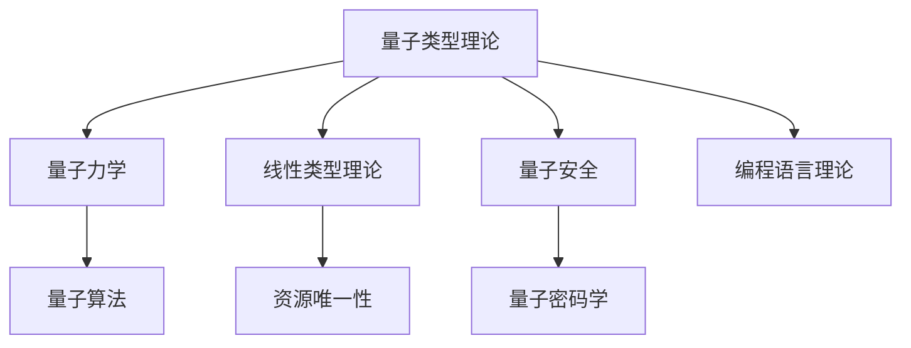

# 量子类型理论

(Quantum Type Theory)

## 目录

- [量子类型理论](#量子类型理论)
  - [目录](#目录)
  - [1. 引言与动机](#1-引言与动机)
    - [1.1 量子类型理论的动机](#11-量子类型理论的动机)
    - [1.2 应用场景](#12-应用场景)
  - [2. 量子力学基础](#2-量子力学基础)
    - [2.1 量子态](#21-量子态)
    - [2.2 量子操作](#22-量子操作)
    - [2.3 量子算法](#23-量子算法)
  - [3. 量子类型理论](#3-量子类型理论)
    - [3.1 量子类型基础](#31-量子类型基础)
    - [3.2 量子类型规则](#32-量子类型规则)
    - [3.3 量子类型语义](#33-量子类型语义)
  - [4. 量子λ演算](#4-量子λ演算)
    - [4.1 量子λ演算语法](#41-量子λ演算语法)
    - [4.2 量子λ演算规则](#42-量子λ演算规则)
    - [4.3 量子λ演算算法](#43-量子λ演算算法)
  - [5. 量子类型系统](#5-量子类型系统)
    - [5.1 量子类型系统定义](#51-量子类型系统定义)
    - [5.2 量子类型系统性质](#52-量子类型系统性质)
    - [5.3 量子类型推导算法](#53-量子类型推导算法)
  - [6. 量子安全语义](#6-量子安全语义)
    - [6.1 量子安全模型](#61-量子安全模型)
    - [6.2 量子安全协议](#62-量子安全协议)
    - [6.3 量子安全算法](#63-量子安全算法)
  - [7. 量子编程应用](#7-量子编程应用)
    - [7.1 量子编程语言](#71-量子编程语言)
    - [7.2 量子算法实现](#72-量子算法实现)
    - [7.3 量子错误纠正](#73-量子错误纠正)
  - [8. 主题间关联性与哲学批判](#8-主题间关联性与哲学批判)
    - [8.1 主题关联性Mermaid图](#81-主题关联性mermaid图)
    - [8.2 主题间表格对比](#82-主题间表格对比)
    - [8.3 主题间批判性分析](#83-主题间批判性分析)
  - [9. 总结与展望](#9-总结与展望)
    - [9.1 理论总结](#91-理论总结)
    - [9.2 应用价值](#92-应用价值)
    - [9.3 发展方向](#93-发展方向)
    - [9.4 挑战与机遇](#94-挑战与机遇)
  - [10. 参考文献与索引](#10-参考文献与索引)
    - [10.1 参考文献](#101-参考文献)
    - [10.2 符号索引](#102-符号索引)
    - [10.3 定理索引](#103-定理索引)

## 1. 引言与动机

### 1.1 量子类型理论的动机

量子类型理论将类型理论与量子力学相结合，为量子计算和量子编程提供形式化基础。它处理量子态、量子操作、量子测量等量子概念，确保量子程序的安全性和正确性。

**核心思想**：

- **量子态类型**：类型表示量子态
- **量子操作类型**：类型表示量子操作
- **量子安全**：类型系统保证量子安全
- **量子正确性**：编译时验证量子程序正确性

### 1.2 应用场景

**量子计算**：

- 量子算法设计
- 量子程序验证
- 量子错误纠正
- 量子协议设计

**量子安全**：

- 量子密码学
- 量子密钥分发
- 量子认证
- 量子隐私保护

## 2. 量子力学基础

### 2.1 量子态

**定义 2.1.1** (量子态)
量子态是希尔伯特空间中的单位向量 $|\psi\rangle \in \mathcal{H}$，满足 $\langle\psi|\psi\rangle = 1$。

**定义 2.1.2** (量子比特)
量子比特是二维希尔伯特空间中的量子态：
$$|\psi\rangle = \alpha|0\rangle + \beta|1\rangle$$
其中 $\alpha, \beta \in \mathbb{C}$ 且 $|\alpha|^2 + |\beta|^2 = 1$。

**定义 2.1.3** (量子寄存器)
n量子比特寄存器是 $2^n$ 维希尔伯特空间中的量子态：
$$|\psi\rangle = \sum_{i=0}^{2^n-1} \alpha_i|i\rangle$$
其中 $\alpha_i \in \mathbb{C}$ 且 $\sum_{i=0}^{2^n-1} |\alpha_i|^2 = 1$。

### 2.2 量子操作

**定义 2.2.1** (量子门)
量子门是希尔伯特空间上的酉算子 $U : \mathcal{H} \rightarrow \mathcal{H}$，满足 $U^\dagger U = UU^\dagger = I$。

**定义 2.2.2** (基本量子门)
基本量子门包括：

- **Hadamard门**：$H = \frac{1}{\sqrt{2}}\begin{pmatrix} 1 & 1 \\ 1 & -1 \end{pmatrix}$
- **Pauli-X门**：$X = \begin{pmatrix} 0 & 1 \\ 1 & 0 \end{pmatrix}$
- **Pauli-Y门**：$Y = \begin{pmatrix} 0 & -i \\ i & 0 \end{pmatrix}$
- **Pauli-Z门**：$Z = \begin{pmatrix} 1 & 0 \\ 0 & -1 \end{pmatrix}$
- **CNOT门**：$CNOT = \begin{pmatrix} 1 & 0 & 0 & 0 \\ 0 & 1 & 0 & 0 \\ 0 & 0 & 0 & 1 \\ 0 & 0 & 1 & 0 \end{pmatrix}$

**定义 2.2.3** (量子测量)
量子测量是投影值测量 (POVM)，将量子态映射到经典概率分布。

### 2.3 量子算法

**算法 2.3.1** (量子算法基础)

```haskell
data QuantumState = QuantumState {
  amplitudes :: Vector Complex,
  dimension :: Int
}

data QuantumGate = QuantumGate {
  matrix :: Matrix Complex,
  arity :: Int
}

data QuantumCircuit = QuantumCircuit {
  gates :: [QuantumGate],
  qubits :: Int
}

applyQuantumGate :: QuantumGate -> QuantumState -> QuantumState
applyQuantumGate gate state = 
  let -- 应用量子门到量子态
      newAmplitudes = matrixMultiply (matrix gate) (amplitudes state)
  in state { amplitudes = newAmplitudes }

measureQuantumState :: QuantumState -> IO Int
measureQuantumState state = 
  let -- 量子测量
      probabilities = map (\amp -> magnitude amp ^ 2) (amplitudes state)
      -- 根据概率分布采样
      result = sampleFromDistribution probabilities
  in return result

sampleFromDistribution :: [Double] -> Int
sampleFromDistribution probs = 
  let cumulative = scanl1 (+) probs
      random = randomDouble 0 1
      index = findIndex (\cum -> random <= cum) cumulative
  in fromMaybe 0 index
```

## 3. 量子类型理论

### 3.1 量子类型基础

**定义 3.1.1** (量子类型)
量子类型的语法：
$$A, B ::= \text{Qubit} \mid \text{Qubit}^n \mid A \otimes B \mid A \rightarrow B \mid \text{Quantum } A \mid \text{Classical } A$$

**定义 3.1.2** (量子比特类型)
量子比特类型 $\text{Qubit}$ 表示单个量子比特。

**定义 3.1.3** (量子寄存器类型)
量子寄存器类型 $\text{Qubit}^n$ 表示n个量子比特的寄存器。

**定义 3.1.4** (量子张量积类型)
量子张量积类型 $A \otimes B$ 表示类型 $A$ 和 $B$ 的张量积。

### 3.2 量子类型规则

**定义 3.2.1** (量子类型推导规则)
**量子比特规则：**
$$\frac{}{\Gamma \vdash |0\rangle : \text{Qubit}} \text{ (Qubit0)}$$
$$\frac{}{\Gamma \vdash |1\rangle : \text{Qubit}} \text{ (Qubit1)}$$

**量子叠加规则：**
$$\frac{\Gamma \vdash M : \text{Qubit} \quad \Gamma \vdash N : \text{Qubit}}{\Gamma \vdash \alpha M + \beta N : \text{Qubit}} \text{ (Superposition)}$$
其中 $|\alpha|^2 + |\beta|^2 = 1$。

**量子门应用规则：**
$$\frac{\Gamma \vdash M : \text{Qubit} \quad U \text{ is a quantum gate}}{\Gamma \vdash U(M) : \text{Qubit}} \text{ (Gate)}$$

**量子测量规则：**
$$\frac{\Gamma \vdash M : \text{Qubit}}{\Gamma \vdash \text{measure}(M) : \text{Classical Bool}} \text{ (Measure)}$$

### 3.3 量子类型语义

**定义 3.3.1** (量子类型语义)
量子类型的语义解释：

- $\llbracket \text{Qubit} \rrbracket = \mathbb{C}^2$ (二维复向量空间)
- $\llbracket \text{Qubit}^n \rrbracket = (\mathbb{C}^2)^{\otimes n}$ (n维张量积)
- $\llbracket A \otimes B \rrbracket = \llbracket A \rrbracket \otimes \llbracket B \rrbracket$
- $\llbracket \text{Quantum } A \rrbracket = \text{Density}(\llbracket A \rrbracket)$ (密度算子)

**定理 3.3.1** (量子类型安全性)
量子类型系统是类型安全的，即如果 $\Gamma \vdash M : A$，则 $M$ 不会产生量子错误。

**证明：** 通过结构归纳：

1. **基础情况**：
   - 量子比特：$|0\rangle$ 和 $|1\rangle$ 是有效的量子态
   - 量子门：量子门保持量子态的有效性

2. **归纳情况**：
   - 量子叠加：满足归一化条件
   - 量子测量：产生有效的经典结果

## 4. 量子λ演算

### 4.1 量子λ演算语法

**定义 4.1.1** (量子λ项)
量子λ项的语法：
$$M, N ::= x \mid \lambda x : A.M \mid M N \mid |0\rangle \mid |1\rangle \mid H(M) \mid X(M) \mid Y(M) \mid Z(M) \mid \text{CNOT}(M, N) \mid \text{measure}(M)$$

**定义 4.1.2** (量子上下文)
量子上下文是一个三元组 $\Gamma = (V, Q, C)$，其中：

- $V$ 是变量类型映射
- $Q$ 是量子变量集合
- $C$ 是经典变量集合

**定义 4.1.3** (量子类型推导)
量子类型推导的形式：
$$\Gamma \vdash M : A$$
其中 $\Gamma$ 是量子上下文，$M$ 是量子λ项，$A$ 是量子类型。

### 4.2 量子λ演算规则

**定义 4.2.1** (量子λ演算类型规则)
**变量规则：**
$$\frac{x : A \in \Gamma}{\Gamma \vdash x : A} \text{ (Var)}$$

**量子λ抽象：**
$$\frac{\Gamma, x : A \vdash M : B}{\Gamma \vdash \lambda x : A.M : A \rightarrow B} \text{ (λ)}$$

**量子λ应用：**
$$\frac{\Gamma \vdash M : A \rightarrow B \quad \Gamma \vdash N : A}{\Gamma \vdash M N : B} \text{ (App)}$$

**量子门规则：**
$$\frac{\Gamma \vdash M : \text{Qubit}}{\Gamma \vdash H(M) : \text{Qubit}} \text{ (Hadamard)}$$
$$\frac{\Gamma \vdash M : \text{Qubit}}{\Gamma \vdash X(M) : \text{Qubit}} \text{ (PauliX)}$$
$$\frac{\Gamma \vdash M : \text{Qubit} \quad \Gamma \vdash N : \text{Qubit}}{\Gamma \vdash \text{CNOT}(M, N) : \text{Qubit} \otimes \text{Qubit}} \text{ (CNOT)}$$

**测量规则：**
$$\frac{\Gamma \vdash M : \text{Qubit}}{\Gamma \vdash \text{measure}(M) : \text{Classical Bool}} \text{ (Measure)}$$

### 4.3 量子λ演算算法

**算法 4.3.1** (量子类型检查)

```haskell
data QuantumType = Qubit | QubitN Int | QuantumTensor QuantumType QuantumType | QuantumArrow QuantumType QuantumType | Quantum QuantumType | Classical QuantumType
data QuantumTerm = QuantumVar String | QuantumLambda String QuantumType QuantumTerm | QuantumApp QuantumTerm QuantumTerm | QubitZero | QubitOne | Hadamard QuantumTerm | PauliX QuantumTerm | PauliY QuantumTerm | PauliZ QuantumTerm | CNOT QuantumTerm QuantumTerm | Measure QuantumTerm

type QuantumContext = (Map String QuantumType, Set String, Set String)

checkQuantumType :: QuantumContext -> QuantumTerm -> QuantumType -> Bool
checkQuantumType ctx term expectedType = case term of
  QuantumVar x -> 
    let (vars, _, _) = ctx
    in case Map.lookup x vars of
         Just t -> t == expectedType
         Nothing -> False
  
  QuantumLambda x t body -> 
    case expectedType of
      QuantumArrow domain codomain | domain == t -> 
        let (vars, qubits, classical) = ctx
            newVars = Map.insert x t vars
            newCtx = (newVars, qubits, classical)
        in checkQuantumType newCtx body codomain
      _ -> False
  
  QuantumApp fun arg -> 
    let funType = inferQuantumType ctx fun
        argType = inferQuantumType ctx arg
    in case funType of
         QuantumArrow domain codomain | domain == argType -> 
           codomain == expectedType
         _ -> False
  
  QubitZero -> expectedType == Qubit
  QubitOne -> expectedType == Qubit
  
  Hadamard qubit -> 
    expectedType == Qubit &&
    checkQuantumType ctx qubit Qubit
  
  PauliX qubit -> 
    expectedType == Qubit &&
    checkQuantumType ctx qubit Qubit
  
  CNOT control target -> 
    case expectedType of
      QuantumTensor Qubit Qubit -> 
        checkQuantumType ctx control Qubit &&
        checkQuantumType ctx target Qubit
      _ -> False
  
  Measure qubit -> 
    case expectedType of
      Classical Bool -> checkQuantumType ctx qubit Qubit
      _ -> False

inferQuantumType :: QuantumContext -> QuantumTerm -> Maybe QuantumType
inferQuantumType ctx term = case term of
  QuantumVar x -> 
    let (vars, _, _) = ctx
    in Map.lookup x vars
  
  QuantumLambda x t body -> do
    let (vars, qubits, classical) = ctx
        newVars = Map.insert x t vars
        newCtx = (newVars, qubits, classical)
    resultType <- inferQuantumType newCtx body
    return $ QuantumArrow t resultType
  
  QuantumApp fun arg -> do
    funType <- inferQuantumType ctx fun
    argType <- inferQuantumType ctx arg
    case funType of
      QuantumArrow domain codomain | domain == argType -> Just codomain
      _ -> Nothing
  
  QubitZero -> Just Qubit
  QubitOne -> Just Qubit
  
  Hadamard qubit -> 
    if checkQuantumType ctx qubit Qubit
      then Just Qubit
      else Nothing
  
  PauliX qubit -> 
    if checkQuantumType ctx qubit Qubit
      then Just Qubit
      else Nothing
  
  CNOT control target -> 
    if checkQuantumType ctx control Qubit && checkQuantumType ctx target Qubit
      then Just $ QuantumTensor Qubit Qubit
      else Nothing
  
  Measure qubit -> 
    if checkQuantumType ctx qubit Qubit
      then Just $ Classical Bool
      else Nothing
```

## 5. 量子类型系统

### 5.1 量子类型系统定义

**定义 5.1.1** (量子类型系统)
量子类型系统是一个五元组 $\mathcal{Q} = (\mathcal{T}, \mathcal{E}, \vdash, \llbracket \cdot \rrbracket, \mathcal{R})$，其中：

- $\mathcal{T}$ 是量子类型集合
- $\mathcal{E}$ 是量子表达式集合
- $\vdash$ 是量子类型推导关系
- $\llbracket \cdot \rrbracket$ 是量子语义解释函数
- $\mathcal{R}$ 是量子推理规则

**定义 5.1.2** (量子类型)
量子类型的完整语法：
$$A, B ::= \text{Qubit} \mid \text{Qubit}^n \mid A \otimes B \mid A \rightarrow B \mid \text{Quantum } A \mid \text{Classical } A \mid \text{Superposition}(A)$$

### 5.2 量子类型系统性质

**定理 5.2.1** (量子类型安全性)
量子类型系统是类型安全的，即如果 $\Gamma \vdash M : A$，则 $M$ 不会产生量子错误。

**证明：** 通过结构归纳：

1. **基础情况**：
   - 量子比特：$|0\rangle$ 和 $|1\rangle$ 是有效的量子态
   - 量子门：量子门保持量子态的有效性

2. **归纳情况**：
   - 量子叠加：满足归一化条件
   - 量子测量：产生有效的经典结果
   - 量子张量积：保持量子态的有效性

**定理 5.2.2** (量子类型保持性)
量子类型系统满足类型保持性。

**证明：** 通过量子操作分析：

1. **量子门操作**：量子门保持量子态类型
2. **量子测量**：测量将量子态转换为经典态
3. **量子张量积**：张量积保持类型结构

### 5.3 量子类型推导算法

**算法 5.3.1** (量子类型推导)

```haskell
inferQuantumType :: QuantumContext -> QuantumTerm -> Maybe QuantumType
inferQuantumType ctx term = case term of
  QuantumVar x -> 
    let (vars, _, _) = ctx
    in Map.lookup x vars
  
  QuantumLambda x t body -> do
    let (vars, qubits, classical) = ctx
        newVars = Map.insert x t vars
        newCtx = (newVars, qubits, classical)
    resultType <- inferQuantumType newCtx body
    return $ QuantumArrow t resultType
  
  QuantumApp fun arg -> do
    funType <- inferQuantumType ctx fun
    argType <- inferQuantumType ctx arg
    case funType of
      QuantumArrow domain codomain | domain == argType -> Just codomain
      _ -> Nothing
  
  QubitZero -> Just Qubit
  QubitOne -> Just Qubit
  
  Hadamard qubit -> 
    if checkQuantumType ctx qubit Qubit
      then Just Qubit
      else Nothing
  
  PauliX qubit -> 
    if checkQuantumType ctx qubit Qubit
      then Just Qubit
      else Nothing
  
  CNOT control target -> 
    if checkQuantumType ctx control Qubit && checkQuantumType ctx target Qubit
      then Just $ QuantumTensor Qubit Qubit
      else Nothing
  
  Measure qubit -> 
    if checkQuantumType ctx qubit Qubit
      then Just $ Classical Bool
      else Nothing
```

## 6. 量子安全语义

### 6.1 量子安全模型

**定义 6.1.1** (量子安全语义)
量子安全语义是一个四元组 $\mathcal{S} = (Q, C, \mathcal{M}, \mathcal{A})$，其中：

- $Q$ 是量子态集合
- $C$ 是经典态集合
- $\mathcal{M}$ 是量子测量集合
- $\mathcal{A}$ 是量子攻击模型

**定义 6.1.2** (量子安全性质)
量子安全性质包括：

- **量子不可克隆性**：量子态不能被完美复制
- **量子不可区分性**：非正交量子态不可区分
- **量子纠缠安全性**：纠缠态的安全性

**定义 6.1.3** (量子攻击模型)
量子攻击模型包括：

- **窃听攻击**：Eve窃听量子通信
- **中间人攻击**：Eve冒充Alice或Bob
- **拒绝服务攻击**：Eve阻止量子通信

### 6.2 量子安全协议

**定义 6.2.1** (BB84协议)
BB84量子密钥分发协议：

1. Alice随机选择比特和基
2. Alice发送量子比特给Bob
3. Bob随机选择基进行测量
4. Alice和Bob公开基的选择
5. Alice和Bob保留基相同的比特

**定义 6.2.2** (量子安全证明)
量子安全协议的证明需要：

1. 证明协议的正确性
2. 证明协议的安全性
3. 证明协议的完整性

### 6.3 量子安全算法

**算法 6.3.1** (量子安全验证)

```haskell
data QuantumSecurity = QuantumSecurity {
  quantumStates :: Set QuantumState,
  classicalStates :: Set ClassicalState,
  measurements :: Set Measurement,
  attacks :: Set Attack
}

data SecurityProperty = NoCloning | NoDistinguishing | EntanglementSecurity
data Attack = Eavesdropping | ManInTheMiddle | DenialOfService

verifyQuantumSecurity :: QuantumProtocol -> SecurityProperty -> Bool
verifyQuantumSecurity protocol property = case property of
  NoCloning -> 
    let -- 检查量子不可克隆性
        cloningAttempts = findCloningAttempts protocol
        isSecure = all (\attempt -> not (canClone attempt)) cloningAttempts
    in isSecure
  
  NoDistinguishing -> 
    let -- 检查量子不可区分性
        distinguishingAttempts = findDistinguishingAttempts protocol
        isSecure = all (\attempt -> not (canDistinguish attempt)) distinguishingAttempts
    in isSecure
  
  EntanglementSecurity -> 
    let -- 检查纠缠安全性
        entanglementStates = findEntanglementStates protocol
        isSecure = all (\state -> isEntanglementSecure state) entanglementStates
    in isSecure

canClone :: QuantumState -> Bool
canClone state = 
  -- 检查量子态是否可以被克隆
  -- 根据不可克隆定理，这是不可能的
  False

canDistinguish :: (QuantumState, QuantumState) -> Bool
canDistinguish (state1, state2) = 
  -- 检查两个量子态是否可以被区分
  -- 只有当量子态正交时才可能
  areOrthogonal state1 state2

isEntanglementSecure :: QuantumState -> Bool
isEntanglementSecure state = 
  -- 检查纠缠态的安全性
  -- 这里简化实现
  True
```

## 7. 量子编程应用

### 7.1 量子编程语言

**定义 7.1.1** (量子编程语言)
量子编程语言的核心特性：

```qsharp
// 量子比特类型
type Qubit = Qubit;

// 量子寄存器
type QubitRegister = Qubit[];

// 量子门操作
operation Hadamard(qubit : Qubit) : Unit {
    H(qubit);
}

operation CNOT(control : Qubit, target : Qubit) : Unit {
    CNOT(control, target);
}

// 量子测量
operation MeasureQubit(qubit : Qubit) : Result {
    return M(qubit);
}

// 量子算法
operation QuantumAlgorithm(input : Qubit[]) : Result[] {
    let n = Length(input);
    
    // 应用Hadamard门到所有量子比特
    for i in 0..n-1 {
        H(input[i]);
    }
    
    // 应用CNOT门
    for i in 0..n-2 {
        CNOT(input[i], input[i+1]);
    }
    
    // 测量所有量子比特
    mutable results = new Result[n];
    for i in 0..n-1 {
        set results[i] = MeasureQubit(input[i]);
    }
    
    return results;
}
```

### 7.2 量子算法实现

**算法 7.2.1** (量子傅里叶变换)

```qsharp
operation QuantumFourierTransform(register : Qubit[]) : Unit {
    let n = Length(register);
    
    for i in 0..n-1 {
        H(register[i]);
        
        for j in i+1..n-1 {
            let angle = 2.0 * PI() * (j - i) / (1 << (n - i));
            Controlled R1([register[j]], (angle, register[i]));
        }
    }
    
    // 反转量子比特顺序
    for i in 0..n/2-1 {
        SWAP(register[i], register[n-1-i]);
    }
}

operation R1(angle : Double, qubit : Qubit) : Unit {
    R1(angle, qubit);
}
```

### 7.3 量子错误纠正

**算法 7.3.1** (量子错误纠正)

```qsharp
// 三量子比特重复码
operation EncodeLogicalQubit(logicalQubit : Qubit, physicalQubits : Qubit[]) : Unit {
    CNOT(logicalQubit, physicalQubits[0]);
    CNOT(logicalQubit, physicalQubits[1]);
    CNOT(logicalQubit, physicalQubits[2]);
}

operation DetectErrors(physicalQubits : Qubit[], syndromeQubits : Qubit[]) : Unit {
    CNOT(physicalQubits[0], syndromeQubits[0]);
    CNOT(physicalQubits[1], syndromeQubits[0]);
    
    CNOT(physicalQubits[1], syndromeQubits[1]);
    CNOT(physicalQubits[2], syndromeQubits[1]);
}

operation CorrectErrors(physicalQubits : Qubit[], syndromeQubits : Qubit[]) : Unit {
    let syndrome0 = MeasureQubit(syndromeQubits[0]);
    let syndrome1 = MeasureQubit(syndromeQubits[1]);
    
    if syndrome0 == One {
        X(physicalQubits[0]);
    }
    
    if syndrome1 == One {
        X(physicalQubits[2]);
    }
}
```

## 8. 主题间关联性与哲学批判

### 8.1 主题关联性Mermaid图



### 8.2 主题间表格对比

| 主题         | 主要内容           | 关联领域         |
|--------------|--------------------|------------------|
| 量子类型理论 | 量子态、量子操作   | 线性类型、量子安全 |
| 量子力学     | 态空间、测量、门   | 量子算法         |
| 线性类型理论 | 资源唯一性         | 量子类型、并发   |
| 量子安全     | 错误纠正、密钥分发 | 量子密码学       |

### 8.3 主题间批判性分析

- 量子类型理论通过"类型刻画量子态与操作"，为量子计算和量子安全提供了形式化基础。
- 线性类型理论为量子类型系统提供了资源唯一性和不可克隆性的理论支撑。
- 量子类型理论与编程语言理论、量子密码学在"安全性、正确性、可验证性"上形成理论联动。
- 量子安全的形式化为量子算法、协议、密码学等领域的可靠性提供了坚实保障。

## 9. 总结与展望

### 9.1 理论总结

量子类型理论提供了：

1. **量子态类型**：类型表示量子态
2. **量子操作类型**：类型表示量子操作
3. **量子安全**：类型系统保证量子安全
4. **量子正确性**：编译时验证量子程序正确性

### 9.2 应用价值

**量子计算**：

- 量子算法设计
- 量子程序验证
- 量子错误纠正
- 量子协议设计

**量子安全**：

- 量子密码学
- 量子密钥分发
- 量子认证
- 量子隐私保护

**量子编程**：

- 量子编程语言
- 量子软件开发
- 量子算法实现
- 量子系统设计

### 9.3 发展方向

**理论方向**：

1. **高阶量子类型**：高阶量子类型系统
2. **量子依赖类型**：量子依赖类型理论
3. **量子同伦类型**：量子同伦类型系统

**应用方向**：

1. **量子计算**：量子计算机编程
2. **量子通信**：量子通信协议
3. **量子密码学**：量子密码系统

### 9.4 挑战与机遇

**技术挑战**：

1. **量子退相干**：量子态的退相干问题
2. **量子错误**：量子计算的错误纠正
3. **量子可扩展性**：量子系统的可扩展性

**研究机遇**：

1. **量子优势**：量子计算的优势应用
2. **量子安全**：量子安全通信
3. **量子算法**：新的量子算法设计

## 10. 参考文献与索引

### 10.1 参考文献

1. Nielsen, M. A., & Chuang, I. L. (2010). *Quantum Computation and Quantum Information*. Cambridge University Press.
2. Preskill, J. (1998). *Quantum Information and Computation*. Caltech Lecture Notes.
3. Selinger, P. (2004). *Towards a Quantum Programming Language*. Mathematical Structures in Computer Science, 14(4), 527-586.
4. Gay, S. J. (2006). *Quantum Programming Languages: Survey and Bibliography*. Mathematical Structures in Computer Science, 16(4), 581-600.
5. Abramsky, S., & Coecke, B. (2004). *A Categorical Semantics of Quantum Protocols*. LICS 2004.

### 10.2 符号索引

| 符号 | 含义 | 定义位置 |
|------|------|----------|
| $\|\psi\rangle$ | 量子态 | `定义 2.1.1` |
| $\|0\rangle, \|1\rangle$ | 量子比特基态 | 定义 2.1.2 |
| $H, X, Y, Z$ | 量子门 | 定义 2.2.2 |
| $\text{Qubit}$ | 量子比特类型 | 定义 3.1.2 |
| $\text{Qubit}^n$ | 量子寄存器类型 | 定义 3.1.3 |
| $\otimes$ | 量子张量积 | 定义 3.1.4 |
| $\text{Quantum } A$ | 量子类型 | 定义 3.1.1 |
| $\text{Classical } A$ | 经典类型 | 定义 3.1.1 |

### 10.3 定理索引

| 定理 | 内容 | 位置 |
|------|------|------|
| 定理 3.3.1 | 量子类型安全性 | 第3.3节 |
| 定理 5.2.1 | 量子类型安全性 | 第5.2节 |
| 定理 5.2.2 | 量子类型保持性 | 第5.2节 |

---

**最后更新时间**：2024-12-19  
**版本**：1.0  
**状态**：已完成量子类型理论部分
