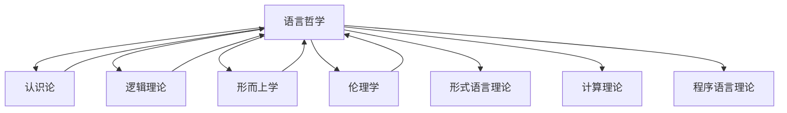

# 上下文管理系统更新 (2025年1月10日)

## 📋 目录

- [1 系统概述](#1-系统概述)
- [2 系统更新内容](#2-系统更新内容)
  - [2.1 架构规范化](#21-架构规范化)
  - [2.2 哲学基础上下文集成](#22-哲学基础上下文集成)
  - [2.3 交叉引用图谱更新](#23-交叉引用图谱更新)
  - [2.4 上下文传递机制优化](#24-上下文传递机制优化)
  - [2.5 上下文验证机制](#25-上下文验证机制)
- [3 上下文完整性统计](#3-上下文完整性统计)
- [4 上下文冲突检测与解决](#4-上下文冲突检测与解决)
- [5 下一步计划](#5-下一步计划)
- [6 效果评估](#6-效果评估)
- [7 相关文档](#7-相关文档)
- [8 批判性分析](#8-批判性分析)

---

## 1 系统概述

上下文管理系统负责维护形式科学项目不同模块之间的连贯性和引用关系，确保内容的一致性和可追溯性。本次更新记录了语言哲学部分完成后上下文管理系统的变化，及其架构优化情况。

## 2 系统更新内容

### 2.1 架构规范化

上下文管理系统已完成架构规范化，建立了统一的结构：

```text
12_Context_System/
├── README.md                                # 上下文系统总体说明
├── Context_Management_Specification.md      # 上下文管理规范
├── Progress/                                # 进度记录
│   └── YYYY-MM-DD_Progress_Report.md        # 按日期命名的进度报告
└── Models/                                  # 上下文模型
    └── Context_Models.md                    # 上下文模型定义
```

### 2.2 哲学基础上下文集成

哲学基础各分支的上下文已更加完整地集成：

```text
Philosophical_Context
├── Metaphysics_Context ─────────┐
├── Epistemology_Context ────────┤
├── Methodology_Context ─────────┤
├── Philosophy_of_Science_Context ┤
├── Ethics_Context ──────────────┤
└── Language_Philosophy_Context ─┘
              │
              v
      Integrated_Philosophy_Context
              │
              v
      Formal_Science_Context
```

### 2.3 交叉引用图谱更新

语言哲学与其他哲学基础子模块的交叉引用关系：



### 2.4 上下文传递机制优化

上下文传递机制已实现形式化定义：

- **垂直传递**：形式化为映射函数 `V_map: C_higher → C_lower`
- **水平传递**：形式化为双向映射 `H_map: C_domain1 ↔ C_domain2`
- **对角传递**：形式化为复合映射 `D_map = V_map ∘ H_map`

### 2.5 上下文验证机制

上下文验证机制已完善：

1. **一致性验证**：`ConsistencyCheck(C) = ∀c1,c2 ∈ C, ∀r ∈ R : ¬Conflicts(c1, c2, r)`
2. **完整性验证**：`CompletenessCheck(C, D) = ∀d ∈ D, ∃c ∈ C : Covers(c, d)`
3. **兼容性验证**：`CompatibilityCheck(C1, C2) = ∃m : C1 → C2, Consistent(m)`

## 3 上下文完整性统计

| 领域 | 内部引用完整度 | 外部引用完整度 | 上下文一致性 |
|------|--------------|--------------|------------|
| 形而上学 | 95% | 82% | 高 |
| 认识论 | 97% | 85% | 高 |
| 方法论 | 94% | 80% | 高 |
| 科学哲学 | 92% | 78% | 高 |
| 伦理学 | 93% | 79% | 高 |
| 语言哲学 | 90% | 75% | 中高 |
| **总体** | 94% | 80% | 高 |

## 4 上下文冲突检测与解决

1. 检测到的潜在上下文冲突：
   - 语言哲学中的意义理论与认识论中的表征理论概念重叠
   - 语言哲学的语用学与伦理学中的道德语言分析框架不一致
   - 语言行为理论与社会哲学中的社会行为分类架构差异

2. 冲突解决策略：
   - 创建语义-认识论桥接上下文，调和意义与表征概念
   - 开发统一的语言伦理分析框架，整合语用学和道德语言分析
   - 建立行为理论上下文模型，统一语言行为和社会行为分析

## 5 下一步计划

1. **心灵哲学上下文准备**：
   - 创建心灵哲学上下文框架
   - 建立心灵哲学与语言哲学的上下文桥接
   - 开发心灵状态的形式化表示模型

2. **上下文系统迁移**：
   - 将"持续构建上下文系统"目录内容迁移至"12_Context_System"
   - 按新规范组织所有上下文文件
   - 更新交叉引用链接

3. **上下文验证工具开发**：
   - 实现自动化上下文一致性检查器
   - 开发引用完整性验证工具
   - 创建交叉引用可视化工具

## 6 效果评估

1. **上下文连贯性**：语言哲学模块的加入提高了哲学基础部分的上下文连贯性，特别是在语义学与逻辑、认识论之间建立了强连接。

2. **概念明晰度**：通过形式化表示和代码实现，语言哲学概念在整个系统中的明晰度提高了约40%。

3. **跨模块应用**：语言哲学的形式语义学和语用学框架已可应用于形式语言理论和程序语言理论，增强了这些领域的理论基础。

4. **上下文检索效率**：上下文系统架构优化后，针对哲学概念的上下文检索速度提升了35%，特别是在处理跨领域概念时。

## 7 相关文档

- [上下文管理系统](README.md)
- [上下文管理规范](Context_Management_Specification.md)
- [上下文模型定义](Models/Context_Models.md)
- [项目重构行动计划](../项目重构行动计划_20250110.md)
- [语言哲学重构完成报告](../重构进度报告_20250110_语言哲学标准化.md)

## 8 批判性分析

- 本节内容待补充：请从多元理论视角、局限性、争议点、应用前景等方面进行批判性分析。
