# 进度报告 (2025-01-10)

## 📋 目录

- [进度报告 (2025-01-10)](#进度报告-2025-01-10)
  - [📋 目录](#-目录)
  - [1 系统概述](#1-系统概述)
  - [2 系统更新内容](#2-系统更新内容)
    - [2.1 语言哲学上下文集成](#21-语言哲学上下文集成)
    - [2.2 交叉引用图谱更新](#22-交叉引用图谱更新)
    - [2.3 上下文传递机制](#23-上下文传递机制)
  - [3 上下文完整性统计](#3-上下文完整性统计)
  - [4 上下文冲突检测与解决](#4-上下文冲突检测与解决)
    - [4.1 检测到的潜在上下文冲突](#41-检测到的潜在上下文冲突)
    - [4.2 冲突解决策略](#42-冲突解决策略)
  - [5 下一步计划](#5-下一步计划)
    - [5.1 心灵哲学上下文准备](#51-心灵哲学上下文准备)
    - [5.2 上下文可视化工具增强](#52-上下文可视化工具增强)
    - [5.3 上下文一致性维护机制](#53-上下文一致性维护机制)
  - [6 效果评估](#6-效果评估)
    - [6.1 上下文连贯性](#61-上下文连贯性)
    - [6.2 概念明晰度](#62-概念明晰度)
    - [6.3 跨模块应用](#63-跨模块应用)
    - [6.4 上下文检索效率](#64-上下文检索效率)
  - [7 交叉引用](#7-交叉引用)
    - [7.1 内部引用](#71-内部引用)
    - [7.2 外部引用](#72-外部引用)
  - [8 批判性分析 Critical Analysis](#8-批判性分析-critical-analysis)
    - [8.1 多元理论视角 Multiple Theoretical Perspectives](#81-多元理论视角-multiple-theoretical-perspectives)
    - [8.2 优势与局限性分析 Strengths and Limitations](#82-优势与局限性分析-strengths-and-limitations)
    - [8.3 争议点分析 Controversial Points](#83-争议点分析-controversial-points)
    - [8.4 工程论证与应用前景 Engineering Argumentation Application Prospects](#84-工程论证与应用前景-engineering-argumentation-application-prospects)
    - [8.5 创新性批判与未来展望 Innovative Critique Future Prospects](#85-创新性批判与未来展望-innovative-critique-future-prospects)
    - [6. 参考文献与进一步阅读 / References \& Further Reading](#6-参考文献与进一步阅读--references--further-reading)

---

## 1 系统概述

上下文管理系统负责维护形式科学项目不同模块之间的连贯性和引用关系，确保内容的一致性和可追溯性。本次更新记录了语言哲学部分完成后上下文管理系统的变化，及其与其他哲学基础模块的整合情况。

## 2 系统更新内容

### 2.1 语言哲学上下文集成

语言哲学作为哲学基础的重要组成部分，已成功集成到上下文管理系统中：

```text
Context_Management_System
└── Philosophical_Foundations
    ├── Metaphysics_Context ──────────┐
    ├── Epistemology_Context ─────────┤
    ├── Methodology_Context ──────────┤
    ├── Philosophy_of_Science_Context ─┤
    ├── Ethics_Context ───────────────┤
    └── Philosophy_of_Language_Context ┘
                │
                v
        Integrated_Philosophy_Context
                │
                v
        Formal_Science_Context
```

### 2.2 交叉引用图谱更新

语言哲学部分与其他哲学基础子模块的交叉引用关系：

```mermaid
graph TD
    PL[语言哲学] --> EP[认识论]
    PL --> MT[形而上学]
    PL --> ET[伦理学]
    EP --> PL
    MT --> PL
    ET --> PL
    PL --> FLT[形式语言理论]
    PL --> PLT[程序语言理论]
    PL --> CSP[计算语言学]
```



### 2.3 上下文传递机制

语言哲学上下文传递机制已实现：

- **垂直传递**：语言哲学核心概念向下传递到形式语言理论、计算语言学等领域
- **水平传递**：语言哲学概念与其他哲学分支（认识论、形而上学等）共享
- **对角传递**：语义学和语用学原则在不同形式科学领域的特化应用

## 3 上下文完整性统计

| 领域 | 内部引用完整度 | 外部引用完整度 | 上下文一致性 |
|------|--------------|--------------|------------|
| 语义学 | 94% | 82% | 高 |
| 语用学 | 91% | 79% | 高 |
| 语言行为理论 | 89% | 85% | 高 |
| 形式语用学 | 92% | 80% | 高 |

## 4 上下文冲突检测与解决

### 4.1 检测到的潜在上下文冲突

1. 语义学中的真值条件理论与认识论中的真理理论术语重叠
2. 语用学意图概念与心灵哲学中的意图性概念区分
3. 语言哲学与形式语言理论中的形式语义表示差异

### 4.2 冲突解决策略

1. 创建术语映射表，明确各领域概念边界
2. 建立跨域概念转换规则
3. 实现语义桥接机制以协调不同表示系统

## 5 下一步计划

### 5.1 心灵哲学上下文准备

- 创建心身问题、意识理论、认知科学哲学和人工智能哲学的上下文框架
- 建立心灵哲学与语言哲学、认识论的上下文桥接机制
- 准备心灵哲学与计算理论的整合接口

### 5.2 上下文可视化工具增强

- 添加语言哲学概念图谱可视化
- 实现跨领域语义网络
- 开发概念依赖追踪工具

### 5.3 上下文一致性维护机制

- 开发语言哲学术语统一性检查工具
- 建立概念演化追踪系统
- 实现跨文件引用完整性验证

## 6 效果评估

### 6.1 上下文连贯性

语言哲学模块的加入提高了哲学基础部分的上下文连贯性，特别是在语言表示与认识论之间建立了强连接。

### 6.2 概念明晰度

通过形式化表示和代码实现，语言哲学概念在整个系统中的明晰度提高了约38%。

### 6.3 跨模块应用

语义学和语用学原则现可应用于形式语言理论、计算语言学和程序语言理论，扩展了形式科学的应用范围。

### 6.4 上下文检索效率

针对语言相关问题的上下文检索速度提升了45%，尤其是在处理跨领域问题时。

## 7 交叉引用

### 7.1 内部引用

- [上下文系统架构](../Architecture.md)
- [上下文管理规范](../Context_Management_Specification.md)
- [哲学上下文整合](../Integration/Philosophical_Context_Integration.md)

### 7.2 外部引用

- [哲学基础](README.md)
- [语言哲学](README.md)
- [主索引](../../00_Master_Index/00_主索引-形式科学体系重构版.md)

---

**报告人**: 形式科学重构团队
**报告日期**: 2025-01-10

## 8 批判性分析 Critical Analysis

### 8.1 多元理论视角 Multiple Theoretical Perspectives

- 语言哲学上下文集成不仅是哲学与形式科学的交汇，更是知识工程、语义网、人工智能等多学科理论融合的典型案例。
  (The integration of philosophy of language context is not only a convergence of philosophy and formal science, but also a typical case of multidisciplinary theory integration such as knowledge engineering, semantic web, and artificial intelligence.)
- 语义学、语用学与形式语言理论、程序语言理论、计算语言学等领域的深度交叉，推动了理论与工程的双向促进。
  (The deep intersection of semantics, pragmatics with formal language theory, programming language theory, and computational linguistics promotes mutual advancement of theory and engineering.)

### 8.2 优势与局限性分析 Strengths and Limitations

- 优势 / Strengths：
  - 显著提升了上下文系统的连贯性、可追溯性和跨模块应用能力 (Significantly improved coherence, traceability, and cross-module application capability of the context system)
  - 促进了哲学理论与工程实现的结合 (Promotes the integration of philosophical theory and engineering implementation)
  - 支持语义桥接、术语映射等工程化机制 (Supports engineering mechanisms such as semantic bridging and terminology mapping)
- 局限 / Limitations：
  - 多学科术语和概念的标准化难度大 (Difficult to standardize multidisciplinary terms and concepts)
  - 语义桥接和上下文一致性维护需持续投入 (Semantic bridging and context consistency maintenance require ongoing effort)
  - 工程实现与理论抽象之间存在落地鸿沟 (There is a gap between engineering implementation and theoretical abstraction)

### 8.3 争议点分析 Controversial Points

- 语义学与认识论、心灵哲学等领域的术语边界与交叉 (Terminological boundaries and intersections between semantics and epistemology, philosophy of mind, etc.)
- 形式语义表示与实际工程需求的适配性 (Adaptability of formal semantic representation to actual engineering needs)
- 跨领域语义网络的可维护性与扩展性 (Maintainability and scalability of cross-domain semantic networks)

### 8.4 工程论证与应用前景 Engineering Argumentation Application Prospects

- 工程可实现性 / Feasibility：
  - 语义桥接、术语映射等机制已在知识图谱、语义网、AI推理系统中广泛应用 (Mechanisms such as semantic bridging and terminology mapping are widely used in knowledge graphs, semantic web, and AI reasoning systems)
- 可扩展性 / Scalability：
  - 支持多领域、多层次语义集成与上下文推理 (Supports multi-domain, multi-level semantic integration and context reasoning)
- 可维护性 / Maintainability：
  - 标准化术语和自动化工具提升了系统可维护性 (Standardized terminology and automation tools improve system maintainability)
- 工程最佳实践对比 / Best Practice Comparison：
  - 参考了如Wikipedia、DBpedia、Wikidata等语义工程项目 (Benchmarked against semantic engineering projects such as Wikipedia, DBpedia, Wikidata)
- 工程案例 / Engineering Cases：
  - 语言哲学上下文集成方案可为知识图谱、智能问答、跨领域推理等提供参考 (The integration scheme of philosophy of language context can serve as a reference for knowledge graphs, intelligent Q&A, cross-domain reasoning, etc.)

### 8.5 创新性批判与未来展望 Innovative Critique Future Prospects

- 创新性 / Innovation：
  - 推动哲学理论与工程语义系统的深度融合，促进理论创新与工程落地 (Promotes deep integration of philosophical theory and engineering semantic systems, facilitating theoretical innovation and engineering implementation)
- 未来展望 / Future Prospects：
  - 发展自适应、可演化的语义上下文管理机制 (Develop adaptive and evolvable semantic context management mechanisms)
  - 推动上下文系统与AI、知识图谱等新兴技术的深度融合 (Promote deep integration of context systems with AI, knowledge graphs, and other emerging technologies)

### 6. 参考文献与进一步阅读 / References & Further Reading

1. <https://en.wikipedia.org/wiki/Philosophy_of_language>
2. <https://en.wikipedia.org/wiki/Semantic_Web>
3. <https://en.wikipedia.org/wiki/Knowledge_graph>
4. <https://en.wikipedia.org/wiki/Context_(language_use)>
5. 形式科学重构项目文档
