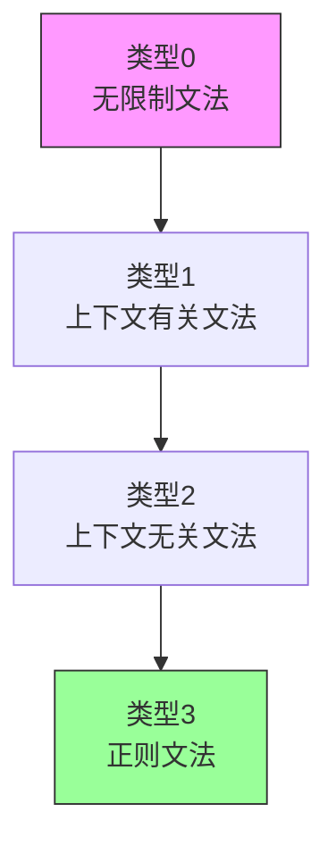
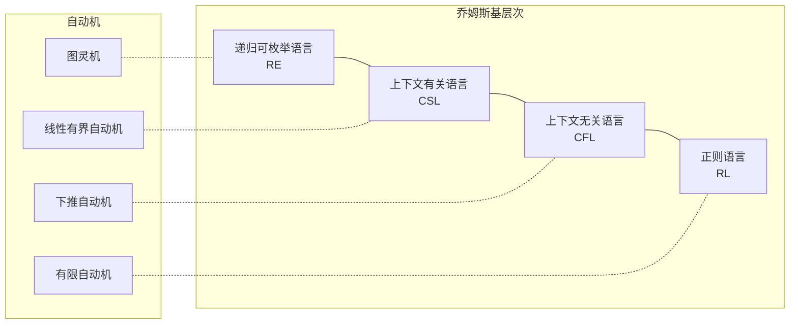
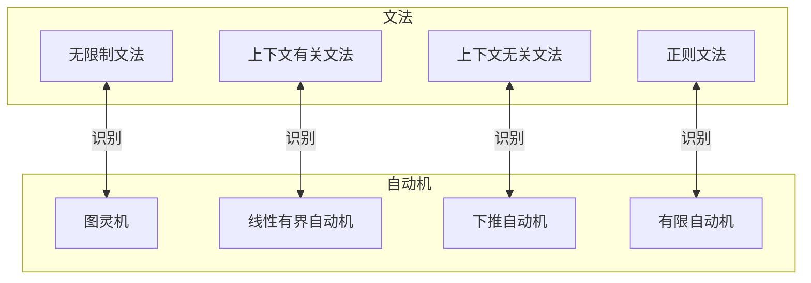

# 1.1 形式语法 (Formal Syntax)

---

📌 **内容摘要**

本文档深入探讨形式语法的核心原理和关键方法。内容涵盖形式语言基础领域的主要知识点，包括形式文法, Chomsky层次, 形式语法等关键主题。适合初学者建立基础知识体系。

**关键词**: 形式语言基础, 形式文法, Chomsky层次, 形式语法

📚 **学习目标**
- 理解形式语法的基本概念和核心原理
- 掌握相关术语和符号表示
- 建立该领域的系统性知识框架

🎯 **难度级别**: 初级

⏱️ **预计阅读时间**: 15分钟

**前置知识**: 基础数学知识, 离散数学

---


## 目录

- [1.1 形式语法 (Formal Syntax)](#11-形式语法-formal-syntax)
  - [目录](#目录)
  - [1.1.1 引言](#111-引言)
  - [1.1.2 形式文法基础](#112-形式文法基础)
    - [1.1.2.1 文法的形式定义](#1121-文法的形式定义)
    - [1.1.2.2 推导与语言](#1122-推导与语言)
  - [1.1.3 乔姆斯基体系](#113-乔姆斯基体系)
    - [1.1.3.1 类型0：无限制文法](#1131-类型0无限制文法)
    - [1.1.3.2 类型1：上下文有关文法](#1132-类型1上下文有关文法)
    - [1.1.3.3 类型2：上下文无关文法](#1133-类型2上下文无关文法)
    - [1.1.3.4 类型3：正则文法](#1134-类型3正则文法)
    - [1.1.3.5 乔姆斯基层次关系](#1135-乔姆斯基层次关系)
  - [1.1.4 自动机理论](#114-自动机理论)
    - [1.1.4.1 有限自动机](#1141-有限自动机)
    - [1.1.4.2 下推自动机](#1142-下推自动机)
    - [1.1.4.3 线性有界自动机](#1143-线性有界自动机)
    - [1.1.4.4 图灵机](#1144-图灵机)
  - [1.1.5 文法与自动机的对应](#115-文法与自动机的对应)
  - [1.1.6 形式化证明](#116-形式化证明)
    - [Lean 4 证明示例：正则语言的封闭性](#lean-4-证明示例正则语言的封闭性)
    - [Haskell 实现：上下文无关文法解析](#haskell-实现上下文无关文法解析)
  - [1.1.7 总结](#117-总结)

---

## 1.1.1 引言

形式语法是形式语言理论的核心，研究如何通过严格的数学规则定义和生成形式语言。
文法(Grammar)提供了一种系统化的方法来描述语言的结构，而自动机(Automaton)则提供了识别这些语言的计算模型。

形式语法的研究源于以下基本问题：

1. **可描述性**：哪些语言可以被有限的规则描述？
2. **可识别性**：哪些语言可以被计算设备识别？
3. **可判定性**：关于这些语言的性质是否可以被算法判定？

> **引用**: 形式语义相关内容见 [01.2_形式语义.md](./01.2_形式语义.md)，λ演算见 [01.3_λ演算.md](./01.3_λ演算.md)。

---

## 1.1.2 形式文法基础

### 1.1.2.1 文法的形式定义

**定义 1.1.1 (形式文法)** 一个形式文法 $G$ 是一个四元组：

$$G = (V, \Sigma, R, S)$$

其中：

| 符号 | 名称 | 说明 |
|------|------|------|
| $V$ | 非终结符集 | 变量符号的有限集合，表示语法范畴 |
| $\Sigma$ | 终结符集 | 实际出现符号的有限集合，$V \cap \Sigma = \emptyset$ |
| $R$ | 产生式规则集 | $R \subseteq (V \cup \Sigma)^* V (V \cup \Sigma)^* \times (V \cup \Sigma)^*$ |
| $S$ | 开始符号 | $S \in V$，语言生成的起点 |

**定义 1.1.2 (产生式)** 产生式(或称规则)记作 $\alpha \rightarrow \beta$，其中：

- $\alpha \in (V \cup \Sigma)^* V (V \cup \Sigma)^*$ 称为左部（至少包含一个非终结符）
- $\beta \in (V \cup \Sigma)^*$ 称为右部（可以为空串 $\varepsilon$）

**示例**：简单算术表达式文法

```
E → E + T | T
T → T * F | F
F → ( E ) | id
```

形式化表示：

- $V = \{E, T, F\}$
- $\Sigma = \{+, *, (, ), \text{id}\}$
- $S = E$

### 1.1.2.2 推导与语言

**定义 1.1.3 (直接推导)** 若 $\alpha \rightarrow \beta \in R$，则对于任意 $\gamma, \delta \in (V \cup \Sigma)^*$：

$$\gamma \alpha \delta \Rightarrow_G \gamma \beta \delta$$

称为在文法 $G$ 中从 $\gamma \alpha \delta$ 到 $\gamma \beta \delta$ 的**直接推导**。

**定义 1.1.4 (推导)** $\Rightarrow_G^*$ 是 $\Rightarrow_G$ 的自反传递闭包。若 $w_0 \Rightarrow_G w_1 \Rightarrow_G \cdots \Rightarrow_G w_n$，则称 $w_0 \Rightarrow_G^* w_n$。

**定义 1.1.5 (文法生成的语言)** 文法 $G$ 生成的语言 $L(G)$ 定义为：

$$L(G) = \{w \in \Sigma^* \mid S \Rightarrow_G^* w\}$$

**定理 1.1.1 (语言的封闭性)** 若 $L_1, L_2$ 是上下文无关语言，则 $L_1 \cup L_2$、$L_1 L_2$、$L_1^*$ 也是上下文无关语言。

**证明概要**：通过构造性证明，给定 $L_1$ 和 $L_2$ 的文法，可以构造出并集、连接和闭包的文法。$\square$

---

## 1.1.3 乔姆斯基体系

乔姆斯基体系(Chomsky Hierarchy)根据产生式规则的约束条件，将形式文法分为四个层次。



### 1.1.3.1 类型0：无限制文法

**定义 1.1.6 (无限制文法)** 产生式形式为：

$$\alpha \rightarrow \beta, \quad \text{其中 } \alpha \in (V \cup \Sigma)^* V (V \cup \Sigma)^*, \beta \in (V \cup \cup \Sigma)^*$$

无任何限制，左部只需包含至少一个非终结符。

**定理 1.1.2 (类型0语言的识别)** 类型0语言恰好是被图灵机识别的语言（递归可枚举语言）。

**证明**：

- ($\Rightarrow$) 给定无限制文法，构造非确定性图灵机模拟推导过程
- ($\Leftarrow$) 给定图灵机，构造文法模拟其计算历史

$\square$

### 1.1.3.2 类型1：上下文有关文法

**定义 1.1.7 (上下文有关文法, CSG)** 产生式形式为：

$$\alpha A \beta \rightarrow \alpha \gamma \beta, \quad \text{其中 } A \in V, \gamma \neq \varepsilon$$

或等价地，要求 $|\alpha| \leq |\beta|$（单调性），但允许 $S \rightarrow \varepsilon$（若 $S$ 不出现在任何右部）。

**定义 1.1.8 (上下文有关语言)** 被上下文有关文法生成的语言，或被线性有界自动机识别的语言。

**定理 1.1.3 (CSL的判定性)** 上下文有关语言的成员问题是可判定的（但可能是PSPACE完全的）。

### 1.1.3.3 类型2：上下文无关文法

**定义 1.1.9 (上下文无关文法, CFG)** 产生式形式为：

$$A \rightarrow \alpha, \quad \text{其中 } A \in V, \alpha \in (V \cup \Sigma)^*$$

左部必须是单个非终结符。

**定义 1.1.10 (上下文无关语言)** 被上下文无关文法生成的语言，或被下推自动机识别的语言。

**定理 1.1.4 (CFG的范式)** 每个CFG都可以转化为：

1. **乔姆斯基范式(CNF)**：产生式为 $A \rightarrow BC$ 或 $A \rightarrow a$
2. **格雷巴赫范式(GNF)**：产生式为 $A \rightarrow a\alpha$，其中 $\alpha \in V^*$

**证明**(CNF构造)：

1. 消除$\varepsilon$-产生式
2. 消除单位产生式($A \rightarrow B$)
3. 将长产生式 $A \rightarrow B_1 B_2 \cdots B_k$ 分解为多个二元产生式
4. 将终结符移到单独的产生式

$\square$

### 1.1.3.4 类型3：正则文法

**定义 1.1.11 (正则文法)** 产生式形式为：

**右线性文法**：$A \rightarrow aB$ 或 $A \rightarrow a$ 或 $A \rightarrow \varepsilon$

**左线性文法**：$A \rightarrow Ba$ 或 $A \rightarrow a$ 或 $A \rightarrow \varepsilon$

其中 $A, B \in V$, $a \in \Sigma$。

**定理 1.1.5 (正则语言的等价刻画)** 以下概念等价：

1. 被右线性文法生成的语言
2. 被左线性文法生成的语言
3. 被有限自动机识别的语言
4. 被正则表达式描述的语言

**证明概要**：通过构造性证明在文法、自动机和正则表达式之间转换。$\square$

### 1.1.3.5 乔姆斯基层次关系



**层次包含关系**：$\mathcal{L}_3 \subset \mathcal{L}_2 \subset \mathcal{L}_1 \subset \mathcal{L}_0$

| 类型 | 文法 | 自动机 | 复杂度 |
|------|------|--------|--------|
| 类型0 | 无限制 | 图灵机 | 半可判定 |
| 类型1 | 上下文有关 | 线性有界自动机 | PSPACE |
| 类型2 | 上下文无关 | 下推自动机 | P |
| 类型3 | 正则 | 有限自动机 | O(n) |

---

## 1.1.4 自动机理论

### 1.1.4.1 有限自动机

**定义 1.1.12 (确定性有限自动机, DFA)** 一个DFA是一个五元组：

$$M = (Q, \Sigma, \delta, q_0, F)$$

其中：

- $Q$：有限状态集
- $\Sigma$：输入字母表
- $\delta: Q \times \Sigma \rightarrow Q$：转移函数
- $q_0 \in Q$：初始状态
- $F \subseteq Q$：接受状态集

**定义 1.1.13 (扩展转移函数)** $\delta^*: Q \times \Sigma^* \rightarrow Q$ 递归定义为：

$$\delta^*(q, \varepsilon) = q$$
$$\delta^*(q, wa) = \delta(\delta^*(q, w), a)$$

**定义 1.1.14 (DFA识别的语言)** $L(M) = \{w \in \Sigma^* \mid \delta^*(q_0, w) \in F\}$

**定理 1.1.6 (NFA与DFA等价)** 对于每个NFA，存在等价的DFA（通过子集构造法）。

### 1.1.4.2 下推自动机

**定义 1.1.15 (下推自动机, PDA)** 一个PDA是一个七元组：

$$M = (Q, \Sigma, \Gamma, \delta, q_0, Z_0, F)$$

其中：

- $Q$：状态集
- $\Sigma$：输入字母表
- $\Gamma$：栈字母表
- $\delta: Q \times (\Sigma \cup \{\varepsilon\}) \times \Gamma \rightarrow 2^{Q \times \Gamma^*}$：转移函数
- $q_0$：初始状态
- $Z_0 \in \Gamma$：初始栈符号
- $F$：接受状态集（或空栈接受）

**定理 1.1.7 (PDA与CFG等价)** 语言 $L$ 被某个PDA识别当且仅当 $L$ 是上下文无关语言。

### 1.1.4.3 线性有界自动机

**定义 1.1.16 (线性有界自动机, LBA)** 受限的图灵机，其读写头只能在输入占据的有限区域内移动。

形式化：对于输入 $w$，可使用空间为 $O(|w|)$。

### 1.1.4.4 图灵机

**定义 1.1.17 (图灵机, TM)** 一个TM是一个七元组：

$$M = (Q, \Sigma, \Gamma, \delta, q_0, B, F)$$

其中：

- $Q$：有限状态集
- $\Sigma$：输入字母表
- $\Gamma$：带字母表，$\Sigma \subset \Gamma$
- $\delta: Q \times \Gamma \rightarrow Q \times \Gamma \times \{L, R, S\}$：转移函数（部分函数）
- $q_0$：初始状态
- $B \in \Gamma \setminus \Sigma$：空白符号
- $F$：接受状态集

**定理 1.1.8 (丘奇-图灵论题)** 任何可计算的函数都可以被图灵机计算。

---

## 1.1.5 文法与自动机的对应



**对应关系总结**：

| 文法类型 | 自动机 | 关键特性 |
|---------|--------|---------|
| 类型3 | DFA/NFA | 有限状态，无内存 |
| 类型2 | PDA | 无限栈，后进先出 |
| 类型1 | LBA | 线性有界存储 |
| 类型0 | TM | 无限带，通用计算 |

---

## 1.1.6 形式化证明

### Lean 4 证明示例：正则语言的封闭性

```lean4
-- 定义正则语言的正则表达式表示
inductive Regex (α : Type) : Type
  | empty : Regex α        -- 空集
  | epsilon : Regex α      -- 空串
  | char : α → Regex α     -- 单个字符
  | union : Regex α → Regex α → Regex α  -- 并集
  | concat : Regex α → Regex α → Regex α -- 连接
  | star : Regex α → Regex α             -- Kleene闭包

-- 定义正则表达式匹配的语言
def regexLang {α : Type} : Regex α → Set (List α)
  | .empty => ∅
  | .epsilon => {[]}
  | .char a => {[a]}
  | .union r s => regexLang r ∪ regexLang s
  | .concat r s => {w₁ ++ w₂ | w₁ ∈ regexLang r ∧ w₂ ∈ regexLang s}
  | .star r => ⋃ n, (regexLang r)^n

-- 定理：正则语言对并集封闭
theorem regular_union_closed {α : Type} (r s : Regex α) :
  ∃ t : Regex α, regexLang t = regexLang r ∪ regexLang s := by
  use Regex.union r s
  rfl
```

### Haskell 实现：上下文无关文法解析

```haskell
{-# LANGUAGE GADTs #-}

-- 文法符号
data Symbol nt t where
  NonTerm :: nt -> Symbol nt t
  Term :: t -> Symbol nt t
  deriving (Eq, Show)

-- 产生式
data Production nt t = Prod nt [Symbol nt t]
  deriving (Show)

-- 文法
data Grammar nt t = Grammar {
    nonTerms :: [nt],
    terms :: [t],
    productions :: [Production nt t],
    startSymbol :: nt
}

-- 简单的递归下降解析器
type Parser t a = [t] -> [(a, [t])]

-- 基本组合子
item :: Parser t t
item [] = []
item (x:xs) = [(x, xs)]

satisfy :: (t -> Bool) -> Parser t t
satisfy p = do
  x <- item
  if p x then return x else []

-- 应用示例：算术表达式文法
-- E → E + T | T
-- T → T * F | F
-- F → ( E ) | n
data Expr = Add Expr Expr | Mul Expr Expr | Num Int | Var String
  deriving Show
```

---

## 1.1.7 总结

| 概念 | 关键特性 |
|------|---------|
| **形式文法** | 通过产生式规则定义语言结构 |
| **乔姆斯基体系** | 四个层次：无限制、上下文有关、上下文无关、正则 |
| **自动机** | 识别文法生成的语言的计算模型 |
| **对应关系** | 文法类型与自动机能力一一对应 |

**延伸阅读**：

- [01.2_形式语义.md](./01.2_形式语义.md) - 探讨语法结构的语义解释
- [01.3_λ演算.md](./01.3_λ演算.md) - 函数式计算模型
- [../02_类型论/02.1_简单类型论.md](../02_类型论/02.1_简单类型论.md) - 类型化文法系统
- [../04_范畴论/04.1_范畴基础.md](../04_范畴论/04.1_范畴基础.md) - 语法结构的范畴论视角

---

_文档版本: 1.0 | 最后更新: 2026-04-11_
---

## 📚 延伸阅读

- [04.1 范畴基本概念](../04_范畴论/04.1_范畴基本概念.md)
- [4.1 范畴基础 (Category Theory Foundations)](../04_范畴论/04.1_范畴基础.md)
- [1.2 形式语义 (Formal Semantics)](../01_形式语言基础/01.2_形式语义.md)
- [04.1 自动机理论](./05_形式化理论/04_计算理论/04.1_自动机理论.md)
- [02.4 类型论与逻辑](../02_类型论/02.4_类型论与逻辑.md)
