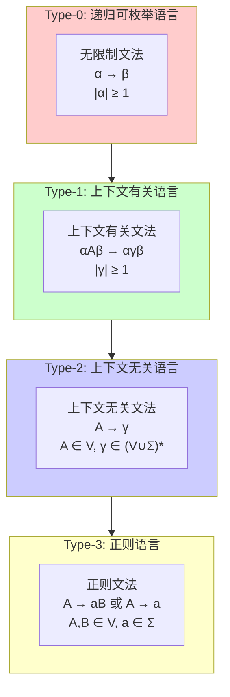

# 01.1 文法与语言

## 1. 形式文法基础

### 1.1 文法的形式化定义

**定义 1.1.1** (形式文法). 一个形式文法 $G$ 是一个四元组 $G = (V, \Sigma, R, S)$，其中：

- $V$ 是**非终结符**的有限集合
- $\Sigma$ 是**终结符**的有限集合，且 $V \cap \Sigma = \emptyset$
- $R$ 是**产生式规则**的有限集合，每条规则形如 $\alpha \rightarrow \beta$，其中 $\alpha \in (V \cup \Sigma)^* V (V \cup \Sigma)^*$，$\beta \in (V \cup \Sigma)^*$
- $S \in V$ 是**开始符号**

**定义 1.1.2** (推导关系). 设 $G = (V, \Sigma, R, S)$ 为文法，定义**直接推导**关系 $\Rightarrow_G$：

对于 $u, v \in (V \cup \Sigma)^*$，$u \Rightarrow_G v$ 当且仅当存在分解 $u = x\alpha y$，$v = x\beta y$，且 $\alpha \rightarrow \beta \in R$。

**定义 1.1.3** (生成的语言). 文法 $G$ 生成的语言为：

$$L(G) = \{w \in \Sigma^* \mid S \Rightarrow_G^* w\}$$

其中 $\Rightarrow_G^*$ 是 $\Rightarrow_G$ 的自反传递闭包。

### 1.2 文法的Chomsky层次

**定理 1.1.4** (Chomsky层次). 形式语言按照文法的限制程度可分为四个层次：

| 类型 | 语言类 | 文法类型 | 自动机 | 产生式限制 |
|:---:|:---:|:---:|:---:|:---|
| Type-0 | 递归可枚举 | 无限制 | 图灵机 | $\alpha \rightarrow \beta$，$\|\alpha\| \geq 1$ |
| Type-1 | 上下文有关 | 上下文有关 | 线性有界自动机 | $\alpha A \beta \rightarrow \alpha \gamma \beta$，$\|\gamma\| \geq 1$ |
| Type-2 | 上下文无关 | 上下文无关 | 下推自动机 | $A \rightarrow \gamma$，$A \in V$ |
| Type-3 | 正则 | 正则 | 有限自动机 | $A \rightarrow aB$ 或 $A \rightarrow a$ |

**定理 1.1.5** (层次包含关系). 四个语言类满足严格包含关系：

$$\mathcal{L}_3 \subsetneq \mathcal{L}_2 \subsetneq \mathcal{L}_1 \subsetneq \mathcal{L}_0$$

**证明**. 包含关系的证明：

1. **$\mathcal{L}_3 \subseteq \mathcal{L}_2$**：任何正则文法都是上下文无关文法的特例
2. **$\mathcal{L}_2 \subseteq \mathcal{L}_1$**：上下文无关产生式 $A \rightarrow \gamma$ 满足 $\|\gamma\| \geq 1$ 时是上下文有关的
3. **$\mathcal{L}_1 \subseteq \mathcal{L}_0$**：上下文有关文法是无限制文法的特例

严格性的证明：

- $L_1 = \{a^n b^n \mid n \geq 0\} \in \mathcal{L}_2 \setminus \mathcal{L}_3$
- $L_2 = \{a^n b^n c^n \mid n \geq 0\} \in \mathcal{L}_1 \setminus \mathcal{L}_2$
- $L_3 = \{w w \mid w \in \{a, b\}^*\} \in \mathcal{L}_0 \setminus \mathcal{L}_1$（需适当构造）

## 2. 正则文法与正则语言

### 2.1 正则文法的等价形式

**定义 1.2.1** (右线性文法). 文法 $G = (V, \Sigma, R, S)$ 是**右线性**的，如果所有产生式形如：

- $A \rightarrow aB$（其中 $A, B \in V$，$a \in \Sigma$）
- $A \rightarrow a$ 或 $A \rightarrow \varepsilon$

**定义 1.2.2** (左线性文法). 文法 $G$ 是**左线性**的，如果所有产生式形如：

- $A \rightarrow Ba$（其中 $A, B \in V$，$a \in \Sigma$）
- $A \rightarrow a$ 或 $A \rightarrow \varepsilon$

**定理 1.2.3** (正则文法等价性). 右线性文法、左线性文法和正则文法生成的语言类相同。

### 2.2 正则表达式

**定义 1.2.4** (正则表达式). 字母表 $\Sigma$ 上的正则表达式归纳定义为：

1. $\emptyset$ 是正则表达式，表示空语言
2. $\varepsilon$ 是正则表达式，表示 $\{\varepsilon\}$
3. 对任意 $a \in \Sigma$，$a$ 是正则表达式，表示 $\{a\}$
4. 若 $r, s$ 是正则表达式，则 $(r + s)$、$(rs)$、$(r^*)$ 也是正则表达式

**定理 1.2.5** (Kleene定理). 语言 $L$ 是正则的当且仅当存在正则表达式 $r$ 使得 $L = L(r)$。

## 3. 上下文无关文法

### 3.1 范式形式

**定义 1.3.1** (Chomsky范式). 上下文无关文法 $G$ 处于**Chomsky范式**，如果所有产生式形如：

- $A \rightarrow BC$（其中 $A, B, C \in V$）
- $A \rightarrow a$（其中 $A \in V$，$a \in \Sigma$）

**定理 1.3.2** (Chomsky范式转换). 任何不含 $\varepsilon$ 的上下文无关语言都可以由Chomsky范式的文法生成。

**定义 1.3.3** (Greibach范式). 上下文无关文法 $G$ 处于**Greibach范式**，如果所有产生式形如：
$$A \rightarrow a\alpha$$
其中 $A \in V$，$a \in \Sigma$，$\alpha \in V^*$。

**定理 1.3.4** (Greibach范式转换). 任何不含 $\varepsilon$ 的上下文无关语言都可以由Greibach范式的文法生成。

### 3.2 歧义性

**定义 1.3.5** (派生树). 对于上下文无关文法 $G$ 和字符串 $w \in L(G)$，$w$ 的**派生树**是满足以下条件的树：

- 根节点标记为 $S$
- 内部节点标记为非终结符
- 叶节点标记为终结符或 $\varepsilon$
- 若节点 $A$ 的子节点为 $X_1, X_2, \ldots, X_k$，则 $A \rightarrow X_1 X_2 \cdots X_k$ 是产生式

**定义 1.3.6** (歧义文法). 上下文无关文法 $G$ 是**歧义的**，如果存在 $w \in L(G)$ 有两棵不同的派生树。

**定义 1.3.7** (固有歧义语言). 语言 $L$ 是**固有歧义**的，如果所有生成 $L$ 的上下文无关文法都是歧义的。

**定理 1.3.8**. 语言 $L = \{a^n b^n c^m \mid n, m \geq 0\} \cup \{a^n b^m c^m \mid n, m \geq 0\}$ 是固有歧义的。

## 4. 上下文有关文法

### 4.1 单调文法

**定义 1.4.1** (单调文法). 文法 $G = (V, \Sigma, R, S)$ 是**单调**的，如果对所有产生式 $\alpha \rightarrow \beta$，有 $|\alpha| \leq |\beta|$。

**定理 1.4.2** (单调与上下文有关等价). 语言 $L$ 可由单调文法生成当且仅当 $L$ 可由上下文有关文法生成（假设 $S$ 不出现在任何产生式右侧）。

### 4.2 空间复杂性

**定理 1.4.3** (线性空间可识别性). 语言 $L$ 是上下文有关的当且仅当 $L$ 可被非确定性线性有界自动机识别。

## 5. 无限制文法与可计算性

### 5.1 图灵完备性

**定理 1.5.1** (生成能力与图灵机等价). 语言 $L$ 可由无限制文法生成当且仅当 $L$ 是递归可枚举的（即被图灵机接受）。

**定理 1.5.2** (半Thue系统). 无限制文法与半Thue系统（字符串重写系统）计算等价。

## 参考

- [01.2 有限自动机](./01.2_有限自动机.md) - 正则语言的自动机理论
- [01.3 下推自动机](./01.3_下推自动机.md) - 上下文无关语言的自动机理论
- [01.4 图灵机与计算](./01.4_图灵机与计算.md) - 可计算性理论基础
