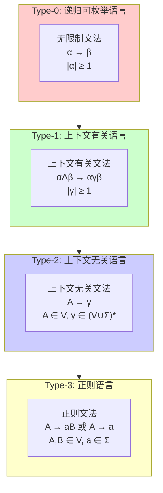

# 01.1 文法与语言

## 1. 形式文法基础

### 1.1 文法的形式化定义

**定义 1.1.1** (形式文法). 一个形式文法 $G$ 是一个四元组 $G = (V, \Sigma, R, S)$，其中：

- $V$ 是**非终结符**的有限集合
- $\Sigma$ 是**终结符**的有限集合，且 $V \cap \Sigma = \emptyset$
- $R$ 是**产生式规则**的有限集合，每条规则形如 $\alpha \rightarrow \beta$，其中 $\alpha \in (V \cup \Sigma)^* V (V \cup \Sigma)^*$，$\beta \in (V \cup \Sigma)^*$
- $S \in V$ 是**开始符号**

**定义 1.1.2** (推导关系). 设 $G = (V, \Sigma, R, S)$ 为文法，定义**直接推导**关系 $\Rightarrow_G$：

对于 $u, v \in (V \cup \Sigma)^*$，$u \Rightarrow_G v$ 当且仅当存在分解 $u = x\alpha y$，$v = x\beta y$，且 $\alpha \rightarrow \beta \in R$。

**定义 1.1.3** (生成的语言). 文法 $G$ 生成的语言为：

$$L(G) = \{w \in \Sigma^* \mid S \Rightarrow_G^* w\}$$

其中 $\Rightarrow_G^*$ 是 $\Rightarrow_G$ 的自反传递闭包。

### 1.2 文法的Chomsky层次

**定理 1.1.4** (Chomsky层次). 形式语言按照文法的限制程度可分为四个层次：



| 类型 | 语言类 | 文法类型 | 自动机 | 产生式限制 |
|:---:|:---:|:---:|:---:|:---|
| Type-0 | 递归可枚举 | 无限制 | 图灵机 | $\alpha \rightarrow \beta$，$\|\alpha\| \geq 1$ |
| Type-1 | 上下文有关 | 上下文有关 | 线性有界自动机 | $\alpha A \beta \rightarrow \alpha \gamma \beta$，$\|\gamma\| \geq 1$ |
| Type-2 | 上下文无关 | 上下文无关 | 下推自动机 | $A \rightarrow \gamma$，$A \in V$ |
| Type-3 | 正则 | 正则 | 有限自动机 | $A \rightarrow aB$ 或 $A \rightarrow a$ |

**定理 1.1.5** (层次包含关系). 四个语言类满足严格包含关系：

$$\mathcal{L}_3 \subsetneq \mathcal{L}_2 \subsetneq \mathcal{L}_1 \subsetneq \mathcal{L}_0$$

**证明**. 包含关系的证明：

1. **$\mathcal{L}_3 \subseteq \mathcal{L}_2$**：任何正则文法都是上下文无关文法的特例
2. **$\mathcal{L}_2 \subseteq \mathcal{L}_1$**：上下文无关产生式 $A \rightarrow \gamma$ 满足 $\|\gamma\| \geq 1$ 时是上下文有关的
3. **$\mathcal{L}_1 \subseteq \mathcal{L}_0$**：上下文有关文法是无限制文法的特例

严格性的证明：

- $L_1 = \{a^n b^n \mid n \geq 0\} \in \mathcal{L}_2 \setminus \mathcal{L}_3$
- $L_2 = \{a^n b^n c^n \mid n \geq 0\} \in \mathcal{L}_1 \setminus \mathcal{L}_2$
- $L_3 = \{w w \mid w \in \{a, b\}^*\} \in \mathcal{L}_0 \setminus \mathcal{L}_1$（需适当构造）

## 2. 正则文法与正则语言

### 2.1 正则文法的等价形式

**定义 1.2.1** (右线性文法). 文法 $G = (V, \Sigma, R, S)$ 是**右线性**的，如果所有产生式形如：

- $A \rightarrow aB$（其中 $A, B \in V$，$a \in \Sigma$）
- $A \rightarrow a$ 或 $A \rightarrow \varepsilon$

**定义 1.2.2** (左线性文法). 文法 $G$ 是**左线性**的，如果所有产生式形如：

- $A \rightarrow Ba$（其中 $A, B \in V$，$a \in \Sigma$）
- $A \rightarrow a$ 或 $A \rightarrow \varepsilon$

**定理 1.2.3** (正则文法等价性). 右线性文法、左线性文法和正则文法生成的语言类相同。

### 2.2 正则表达式

**定义 1.2.4** (正则表达式). 字母表 $\Sigma$ 上的正则表达式归纳定义为：

1. $\emptyset$ 是正则表达式，表示空语言
2. $\varepsilon$ 是正则表达式，表示 $\{\varepsilon\}$
3. 对任意 $a \in \Sigma$，$a$ 是正则表达式，表示 $\{a\}$
4. 若 $r, s$ 是正则表达式，则 $(r + s)$、$(rs)$、$(r^*)$ 也是正则表达式

**定理 1.2.5** (Kleene定理). 语言 $L$ 是正则的当且仅当存在正则表达式 $r$ 使得 $L = L(r)$。

## 3. 上下文无关文法

### 3.1 范式形式

**定义 1.3.1** (Chomsky范式). 上下文无关文法 $G$ 处于**Chomsky范式**，如果所有产生式形如：

- $A \rightarrow BC$（其中 $A, B, C \in V$）
- $A \rightarrow a$（其中 $A \in V$，$a \in \Sigma$）

**定理 1.3.2** (Chomsky范式转换). 任何不含 $\varepsilon$ 的上下文无关语言都可以由Chomsky范式的文法生成。

**定义 1.3.3** (Greibach范式). 上下文无关文法 $G$ 处于**Greibach范式**，如果所有产生式形如：
$$A \rightarrow a\alpha$$
其中 $A \in V$，$a \in \Sigma$，$\alpha \in V^*$。

**定理 1.3.4** (Greibach范式转换). 任何不含 $\varepsilon$ 的上下文无关语言都可以由Greibach范式的文法生成。

### 3.2 歧义性

**定义 1.3.5** (派生树). 对于上下文无关文法 $G$ 和字符串 $w \in L(G)$，$w$ 的**派生树**是满足以下条件的树：

- 根节点标记为 $S$
- 内部节点标记为非终结符
- 叶节点标记为终结符或 $\varepsilon$
- 若节点 $A$ 的子节点为 $X_1, X_2, \ldots, X_k$，则 $A \rightarrow X_1 X_2 \cdots X_k$ 是产生式

**定义 1.3.6** (歧义文法). 上下文无关文法 $G$ 是**歧义的**，如果存在 $w \in L(G)$ 有两棵不同的派生树。

**定义 1.3.7** (固有歧义语言). 语言 $L$ 是**固有歧义**的，如果所有生成 $L$ 的上下文无关文法都是歧义的。

**定理 1.3.8**. 语言 $L = \{a^n b^n c^m \mid n, m \geq 0\} \cup \{a^n b^m c^m \mid n, m \geq 0\}$ 是固有歧义的。

## 4. 上下文有关文法

### 4.1 单调文法

**定义 1.4.1** (单调文法). 文法 $G = (V, \Sigma, R, S)$ 是**单调**的，如果对所有产生式 $\alpha \rightarrow \beta$，有 $|\alpha| \leq |\beta|$。

**定理 1.4.2** (单调与上下文有关等价). 语言 $L$ 可由单调文法生成当且仅当 $L$ 可由上下文有关文法生成（假设 $S$ 不出现在任何产生式右侧）。

### 4.2 空间复杂性

**定理 1.4.3** (线性空间可识别性). 语言 $L$ 是上下文有关的当且仅当 $L$ 可被非确定性线性有界自动机识别。

## 5. 无限制文法与可计算性

### 5.1 图灵完备性

**定理 1.5.1** (生成能力与图灵机等价). 语言 $L$ 可由无限制文法生成当且仅当 $L$ 是递归可枚举的（即被图灵机接受）。

**定理 1.5.2** (半Thue系统). 无限制文法与半Thue系统（字符串重写系统）计算等价。

## 6. 代码实现

### 6.1 Python 文法解析器

```python
"""
文法解析器实现 - 形式语言基础
包含：文法表示、推导、Chomsky层次判定
"""

from typing import Set, Dict, List, Tuple, Optional, FrozenSet
from dataclasses import dataclass, field
from enum import Enum, auto


class ChomskyType(Enum):
    """Chomsky层次类型"""
    TYPE_0 = auto()  # 无限制文法 (递归可枚举)
    TYPE_1 = auto()  # 上下文有关
    TYPE_2 = auto()  # 上下文无关
    TYPE_3 = auto()  # 正则文法


@dataclass(frozen=True)
class Production:
    """产生式规则: left -> right"""
    left: str
    right: Tuple[str, ...]

    def __str__(self) -> str:
        right_str = ''.join(self.right) if self.right else 'ε'
        return f"{self.left} → {right_str}"


class Grammar:
    """形式文法 G = (V, Σ, R, S)"""

    def __init__(self,
                 non_terminals: Set[str],
                 terminals: Set[str],
                 productions: List[Production],
                 start_symbol: str):
        self.V = non_terminals          # 非终结符
        self.Sigma = terminals          # 终结符
        self.R = productions            # 产生式规则
        self.S = start_symbol           # 开始符号

        # 验证
        self._validate()

    def _validate(self):
        """验证文法的合法性"""
        assert self.S in self.V, "开始符号必须是非终结符"
        assert self.V & self.Sigma == set(), "V 和 Σ 必须不相交"
        for p in self.R:
            assert p.left in self.V, f"产生式左侧 {p.left} 必须是非终结符"
            for symbol in p.right:
                if symbol not in self.V and symbol not in self.Sigma:
                    raise ValueError(f"未知符号: {symbol}")

    def derive(self, current: str, max_steps: int = 10) -> Set[str]:
        """
        计算从current出发所有可能的推导结果（一步）
        返回: 所有可达的字符串集合
        """
        results = set()

        # 找到所有可以应用产生式的位置
        for p in self.R:
            start = 0
            while True:
                idx = current.find(p.left, start)
                if idx == -1:
                    break
                # 应用产生式
                new_str = current[:idx] + ''.join(p.right) + current[idx + len(p.left):]
                results.add(new_str)
                start = idx + 1

        return results

    def generate_language(self, max_depth: int = 5) -> Set[str]:
        """
        生成语言样本（有限深度限制）
        返回: 所有完全由终结符组成的字符串
        """
        language = set()
        current_level = {self.S}

        for _ in range(max_depth):
            next_level = set()
            for s in current_level:
                # 如果全是终结符，加入语言
                if all(c in self.Sigma or c == '' for c in s):
                    language.add(s)
                    continue
                # 否则继续推导
                next_level.update(self.derive(s))
            current_level = next_level
            if not current_level:
                break

        return language

    def __str__(self) -> str:
        lines = ["形式文法 G = (V, Σ, R, S):"]
        lines.append(f"  V = {{{', '.join(sorted(self.V))}}}")
        lines.append(f"  Σ = {{{', '.join(sorted(self.Sigma))}}}")
        lines.append(f"  S = {self.S}")
        lines.append("  R = {")
        for p in self.R:
            lines.append(f"    {p}")
        lines.append("  }")
        return '\n'.join(lines)


class ChomskyClassifier:
    """Chomsky层次分类器"""

    @staticmethod
    def classify(grammar: Grammar) -> ChomskyType:
        """判定文法的Chomsky层次类型"""

        # 检查Type-3 (正则文法)
        if ChomskyClassifier._is_type3(grammar):
            return ChomskyType.TYPE_3

        # 检查Type-2 (上下文无关)
        if ChomskyClassifier._is_type2(grammar):
            return ChomskyType.TYPE_2

        # 检查Type-1 (上下文有关)
        if ChomskyClassifier._is_type1(grammar):
            return ChomskyType.TYPE_1

        # 否则是Type-0
        return ChomskyType.TYPE_0

    @staticmethod
    def _is_type3(grammar: Grammar) -> bool:
        """
        检查是否为正则文法 (Type-3)
        规则形式: A → aB 或 A → a 或 A → ε
        """
        for p in grammar.R:
            # 左侧必须是非终结符
            if len(p.left) != 1 or p.left not in grammar.V:
                return False

            if not p.right:  # A → ε
                continue

            # 右线性: A → a 或 A → aB
            if len(p.right) == 1:
                if p.right[0] not in grammar.Sigma:
                    return False
            elif len(p.right) == 2:
                if p.right[0] not in grammar.Sigma or p.right[1] not in grammar.V:
                    return False
            else:
                return False

        return True

    @staticmethod
    def _is_type2(grammar: Grammar) -> bool:
        """
        检查是否为上下文无关文法 (Type-2)
        规则形式: A → γ, 其中 A ∈ V, γ ∈ (V ∪ Σ)*
        """
        for p in grammar.R:
            if len(p.left) != 1 or p.left not in grammar.V:
                return False
        return True

    @staticmethod
    def _is_type1(grammar: Grammar) -> bool:
        """
        检查是否为上下文有关文法 (Type-1)
        规则形式: αAβ → αγβ, 其中 |γ| ≥ 1
        等价于单调文法: |α| ≤ |β|
        """
        for p in grammar.R:
            # 特殊情况: S → ε，此时S不能出现在任何产生式右侧
            if not p.right and p.left == grammar.S:
                # 检查S是否出现在右侧
                for p2 in grammar.R:
                    if grammar.S in p2.right:
                        return False
                continue

            # 单调性: |left| ≤ |right|
            if len(p.left) > len(p.right):
                return False

        return True


# ============ 使用示例 ============

def example_grammar_a_nb_n():
    """
    示例: 上下文无关文法 L = {a^n b^n | n ≥ 0}
    文法:
        S → aSb | ε
    """
    productions = [
        Production('S', ('a', 'S', 'b')),
        Production('S', tuple())  # ε
    ]
    return Grammar(
        non_terminals={'S'},
        terminals={'a', 'b'},
        productions=productions,
        start_symbol='S'
    )


def example_regular_grammar():
    """
    示例: 正则文法 L = a*b
    文法:
        S → aS | b
    """
    productions = [
        Production('S', ('a', 'S')),
        Production('S', ('b',))
    ]
    return Grammar(
        non_terminals={'S'},
        terminals={'a', 'b'},
        productions=productions,
        start_symbol='S'
    )


def example_context_sensitive():
    """
    示例: 上下文有关文法 L = {a^n b^n c^n | n ≥ 1}
    简化的文法形式
    """
    productions = [
        Production('S', ('a', 'S', 'B', 'C')),
        Production('S', ('a', 'B', 'C')),
        Production('C', ('B', 'C')),
        Production('a', ('a',)),  # 终结符处理
    ]
    # 注意: 实际的a^n b^n c^n需要更复杂的规则
    # 这里简化为演示
    return Grammar(
        non_terminals={'S', 'B', 'C'},
        terminals={'a', 'b', 'c'},
        productions=productions,
        start_symbol='S'
    )


if __name__ == "__main__":
    print("=" * 60)
    print("形式文法与 Chomsky 层次 - 代码演示")
    print("=" * 60)

    # 示例1: 上下文无关文法 a^n b^n
    print("\n【示例1】上下文无关文法: L = {a^n b^n | n ≥ 0}")
    g1 = example_grammar_a_nb_n()
    print(g1)

    ch_type = ChomskyClassifier.classify(g1)
    print(f"\nChomsky层次: Type-{ch_type.name.split('_')[1]} (上下文无关)")

    print("\n生成的语言样本:")
    lang = g1.generate_language(max_depth=4)
    for s in sorted(lang, key=len):
        print(f"  '{s}'" if s else "  ε (空串)")

    # 示例2: 正则文法
    print("\n" + "=" * 60)
    print("【示例2】正则文法: L = a*b")
    g2 = example_regular_grammar()
    print(g2)

    ch_type = ChomskyClassifier.classify(g2)
    print(f"\nChomsky层次: Type-{ch_type.name.split('_')[1]} (正则文法)")

    print("\n生成的语言样本:")
    lang = g2.generate_language(max_depth=5)
    for s in sorted(lang, key=len)[:8]:
        print(f"  '{s}'")

    # Chomsky层次总结
    print("\n" + "=" * 60)
    print("Chomsky层次总结:")
    print("  Type-3: 正则文法 ⊆ Type-2: 上下文无关 ⊆ Type-1: 上下文有关 ⊆ Type-0: 无限制")
    print("  包含关系: L₃ ⊂ L₂ ⊂ L₁ ⊂ L₀")
```

### 6.2 上下文无关文法的范式转换

```python
"""
上下文无关文法范式转换
包含: 消除ε产生式、消除单位产生式、转换为Chomsky范式
"""

from typing import Set, Dict, List, Tuple
from dataclasses import dataclass, field
import itertools


@dataclass
class CFG:
    """上下文无关文法"""
    variables: Set[str]
    terminals: Set[str]
    productions: Dict[str, List[Tuple[str, ...]]]
    start: str

    def __str__(self):
        lines = [f"CFG: 开始符号 = {self.start}"]
        for var in sorted(self.variables):
            rhs_list = [''.join(rhs) if rhs else 'ε'
                       for rhs in self.productions.get(var, [])]
            lines.append(f"  {var} → {' | '.join(rhs_list)}")
        return '\n'.join(lines)

    def copy(self):
        """创建副本"""
        return CFG(
            self.variables.copy(),
            self.terminals.copy(),
            {k: [list(r) for r in v] for k, v in self.productions.items()},
            self.start
        )


class CFGNormalizer:
    """CFG范式转换器"""

    @staticmethod
    def eliminate_epsilon(cfg: CFG) -> CFG:
        """
        步骤1: 消除ε产生式
        保留: 若S本身可推导出ε，则添加新开始符号S' → S | ε
        """
        result = cfg.copy()

        # 找到所有可推导出ε的非终结符
        nullable = set()
        changed = True
        while changed:
            changed = False
            for var, productions in result.productions.items():
                if var in nullable:
                    continue
                for rhs in productions:
                    # 如果rhs全由nullable符号组成（包括空产生式）
                    if all(s in nullable or s == var for s in rhs) and not rhs:
                        nullable.add(var)
                        changed = True
                        break

        # 扩展产生式，处理nullable符号
        new_productions = {}
        for var, productions in result.productions.items():
            new_prods = []
            for rhs in productions:
                if not rhs:  # 跳过ε产生式
                    continue
                # 生成所有可能的组合（去掉nullable符号）
                positions = [i for i, s in enumerate(rhs) if s in nullable]
                for r in range(len(positions) + 1):
                    for combo in itertools.combinations(positions, r):
                        new_rhs = tuple(s for i, s in enumerate(rhs) if i not in combo)
                        if new_rhs and new_rhs not in new_prods:
                            new_prods.append(new_rhs)
            new_productions[var] = new_prods

        result.productions = new_productions

        # 处理开始符号可推导出ε的情况
        if cfg.start in nullable:
            new_start = cfg.start + "'"
            result.variables.add(new_start)
            result.productions[new_start] = [(cfg.start,), tuple()]
            result.start = new_start

        return result

    @staticmethod
    def eliminate_unit(cfg: CFG) -> CFG:
        """
        步骤2: 消除单位产生式 (A → B)
        """
        result = cfg.copy()

        # 计算单位对
        unit_pairs = set()
        for var in result.variables:
            unit_pairs.add((var, var))

        changed = True
        while changed:
            changed = False
            for a, b in list(unit_pairs):
                for rhs in result.productions.get(b, []):
                    if len(rhs) == 1 and rhs[0] in result.variables:
                        if (a, rhs[0]) not in unit_pairs:
                            unit_pairs.add((a, rhs[0]))
                            changed = True

        # 替换单位产生式
        new_productions = {}
        for var in result.variables:
            new_prods = []
            for rhs in result.productions.get(var, []):
                if len(rhs) == 1 and rhs[0] in result.variables:
                    continue  # 跳过单位产生式
                new_prods.append(rhs)

            # 添加单位闭包的展开
            for a, b in unit_pairs:
                if a == var and a != b:
                    for rhs in result.productions.get(b, []):
                        if not (len(rhs) == 1 and rhs[0] in result.variables):
                            if rhs not in new_prods:
                                new_prods.append(rhs)

            new_productions[var] = new_prods

        result.productions = new_productions
        return result

    @staticmethod
    def to_cnf(cfg: CFG) -> CFG:
        """
        转换为Chomsky范式
        所有产生式形式: A → BC 或 A → a
        """
        result = cfg.copy()

        # 先消除ε和单位产生式
        result = CFGNormalizer.eliminate_epsilon(result)
        result = CFGNormalizer.eliminate_unit(result)

        new_var_counter = [0]
        def new_var():
            new_var_counter[0] += 1
            var = f"X{new_var_counter[0]}"
            result.variables.add(var)
            return var

        # 步骤3: 确保所有产生式右侧长度为2或1（终结符）
        final_productions = {}

        for var, productions in result.productions.items():
            final_productions[var] = []
            for rhs in productions:
                if len(rhs) == 1 and rhs[0] in result.terminals:
                    # A → a 形式，保留
                    final_productions[var].append(rhs)
                elif len(rhs) == 2 and all(s in result.variables for s in rhs):
                    # A → BC 形式，保留
                    final_productions[var].append(rhs)
                else:
                    # 需要转换
                    # 1. 替换所有终结符为新非终结符
                    symbols = list(rhs)
                    for i, s in enumerate(symbols):
                        if s in result.terminals:
                            new_v = new_var()
                            final_productions[new_v] = [(s,)]
                            symbols[i] = new_v

                    # 2. 拆分为二元产生式
                    while len(symbols) > 2:
                        new_v = new_var()
                        final_productions[new_v] = [(symbols[0], symbols[1])]
                        symbols = [new_v] + symbols[2:]

                    final_productions[var].append(tuple(symbols))

        result.productions = final_productions
        return result


# ============ 使用示例 ============

if __name__ == "__main__":
    print("=" * 60)
    print("上下文无关文法范式转换")
    print("=" * 60)

    # 示例文法
    cfg = CFG(
        variables={'S', 'A', 'B'},
        terminals={'a', 'b'},
        productions={
            'S': [('A', 'B'), ('a',)],
            'A': [('a', 'A'), tuple()],  # ε产生式
            'B': [('b', 'B'), ('S',), ('b',)]  # 包含单位产生式
        },
        start='S'
    )

    print("\n【原始文法】")
    print(cfg)

    # 消除ε产生式
    print("\n【消除ε产生式后】")
    cfg_no_epsilon = CFGNormalizer.eliminate_epsilon(cfg)
    print(cfg_no_epsilon)

    # 消除单位产生式
    print("\n【消除单位产生式后】")
    cfg_no_unit = CFGNormalizer.eliminate_unit(cfg_no_epsilon)
    print(cfg_no_unit)

    # 转换为Chomsky范式
    print("\n【Chomsky范式】")
    cfg_cnf = CFGNormalizer.to_cnf(cfg)
    print(cfg_cnf)
```

## 参考

- [01.2 有限自动机](./01.2_有限自动机.md) - 正则语言的自动机理论
- [01.3 下推自动机](./01.3_下推自动机.md) - 上下文无关语言的自动机理论
- [01.4 图灵机与计算](./01.4_图灵机与计算.md) - 可计算性理论基础
