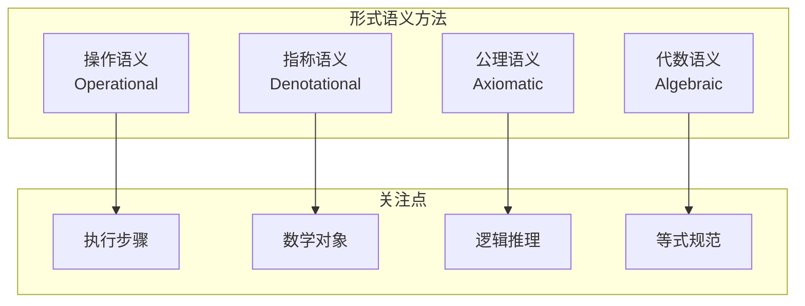

# 1.2 形式语义 (Formal Semantics)

---

📌 **内容摘要**

本文档深入探讨形式语义的核心原理和关键方法。内容涵盖形式语言基础领域的主要知识点，包括Hoare逻辑, 大步语义, 最弱前置条件, 不动点等关键主题。适合初学者建立基础知识体系。

**关键词**: 形式语言基础, Hoare逻辑, 大步语义, 最弱前置条件, 不动点, 公理语义, 小步语义, 形式语义

📚 **学习目标**

- 理解形式语义的基本概念和核心原理
- 掌握相关术语和符号表示
- 建立该领域的系统性知识框架

🎯 **难度级别**: 初级

⏱️ **预计阅读时间**: 15分钟

**前置知识**: 基础数学知识, 离散数学

---


## 目录

- [1.2 形式语义 (Formal Semantics)](#12-形式语义-formal-semantics)
  - [目录](#目录)
  - [1.2.1 引言](#121-引言)
  - [1.2.2 操作语义](#122-操作语义)
    - [1.2.2.1 大步语义](#1221-大步语义)
    - [1.2.2.2 小步语义](#1222-小步语义)
    - [1.2.2.3 结构化操作语义(SOS)](#1223-结构化操作语义sos)
  - [1.2.3 指称语义](#123-指称语义)
    - [1.2.3.1 数学基础](#1231-数学基础)
    - [1.2.3.2 表达式的指称](#1232-表达式的指称)
    - [1.2.3.3 不动点语义](#1233-不动点语义)
  - [1.2.4 公理语义](#124-公理语义)
    - [1.2.4.1 霍尔逻辑](#1241-霍尔逻辑)
    - [1.2.4.2 最弱前置条件](#1242-最弱前置条件)
    - [1.2.4.3 最强后置条件](#1243-最强后置条件)
  - [1.2.5 代数语义](#125-代数语义)
  - [1.2.6 语义方法的比较](#126-语义方法的比较)
  - [1.2.7 形式化证明](#127-形式化证明)
    - [Lean 4：霍尔逻辑的公理化](#lean-4霍尔逻辑的公理化)
    - [Haskell：指称语义的简单实现](#haskell指称语义的简单实现)
  - [1.2.8 总结](#128-总结)
  - [_文档版本: 1.0 | 最后更新: 2026-04-11_](#文档版本-10--最后更新-2026-04-11)
  - [📋 前置知识](#-前置知识)
  - [📚 延伸阅读](#-延伸阅读)

---

## 1.2.1 引言

形式语义学研究编程语言和形式系统的**意义(Meaning)**，回答"程序执行什么计算？"这一核心问题。
与形式语法关注"什么程序是合法的"不同，形式语义关注"合法程序的含义是什么"。

主要的形式语义方法包括：

| 语义方法 | 核心思想 | 主要应用 |
|---------|---------|---------|
| **操作语义** | 定义执行步骤 | 语言实现、类型系统 |
| **指称语义** | 映射到数学对象 | 程序验证、编译器正确性 |
| **公理语义** | 逻辑推理规则 | 程序正确性证明 |
| **代数语义** | 代数规范 | 抽象数据类型 |

> **引用**: 语法基础见 [01.1_形式语法.md](./01.1_形式语法.md)，类型系统见 [../02_类型论/02.1_简单类型论.md](../02_类型论/02.1_简单类型论.md)。

---

## 1.2.2 操作语义

操作语义通过定义程序的执行步骤来描述其含义。

### 1.2.2.1 大步语义

大步语义(Big-Step Semantics)或自然语义描述从初始状态到最终状态的完整求值过程。

**定义 1.2.1 (大步语义关系)** 关系 $\Downarrow \subseteq \text{Config} \times \text{Value}$ 定义为：

对于算术表达式：

$$\frac{n \in \mathbb{Z}}{n \Downarrow n} \text{(NUM)}$$

$$\frac{e_1 \Downarrow n_1 \quad e_2 \Downarrow n_2}{e_1 + e_2 \Downarrow n_1 + n_2} \text{(ADD)}$$

$$\frac{e_1 \Downarrow n_1 \quad e_2 \Downarrow n_2}{e_1 \times e_2 \Downarrow n_1 \times n_2} \text{(MUL)}$$

**示例**：$(3 + 4) \times 5 \Downarrow 35$ 的推导树：

```
        3 ↓ 3    4 ↓ 4
        ───────────── (ADD)
3+4 ↓ 7          5 ↓ 5
───────────────────────── (MUL)
    (3+4)×5 ↓ 35
```

### 1.2.2.2 小步语义

小步语义(Small-Step Semantics)或结构化操作语义定义单步转换关系。

**定义 1.2.2 (小步语义关系)** 关系 $\rightarrow \subseteq \text{Config} \times \text{Config}$：

$$\frac{e_1 \rightarrow e_1'}{e_1 + e_2 \rightarrow e_1' + e_2} \text{(L-ADD)}$$

$$\frac{e_2 \rightarrow e_2'}{n_1 + e_2 \rightarrow n_1 + e_2'} \text{(R-ADD)}$$

$$\frac{n_1, n_2 \in \mathbb{Z}}{n_1 + n_2 \rightarrow n} \text{其中 } n = n_1 + n_2 \text{(ADD-EVAL)}$$

**示例**：$(3 + 4) \times 5$ 的小步求值：

$$(3 + 4) \times 5 \rightarrow 7 \times 5 \rightarrow 35$$

### 1.2.2.3 结构化操作语义(SOS)

**定义 1.2.3 (SOS规则格式)** Plotkin风格的SOS规则：

$$\frac{\text{前提}_1 \quad \cdots \quad \text{前提}_n}{\text{结论}} \text{(规则名)}$$

其中结论是一个转换判断 $\langle \text{程序}, \sigma \rangle \rightarrow \langle \text{程序}', \sigma' \rangle$。

**命令式语言的SOS规则**：

$$\frac{\langle e, \sigma \rangle \Downarrow n}{\langle x := e, \sigma \rangle \rightarrow \langle \text{skip}, \sigma[x \mapsto n] \rangle} \text{(ASSIGN)}$$

$$\frac{\langle c_1, \sigma \rangle \rightarrow \langle c_1', \sigma' \rangle}{\langle c_1; c_2, \sigma \rangle \rightarrow \langle c_1'; c_2, \sigma' \rangle} \text{(SEQ-1)}$$

$$\frac{}{\langle \text{skip}; c, \sigma \rangle \rightarrow \langle c, \sigma \rangle} \text{(SEQ-SKIP)}$$

---

## 1.2.3 指称语义

指称语义(Denotational Semantics)将程序片段映射到数学对象（通常是域论中的元素）。

### 1.2.3.1 数学基础

**定义 1.2.4 (完全偏序, CPO)** 集合 $D$ 上的偏序 $\sqsubseteq$ 是完全的，如果每个有向子集都有最小上界：

$$\forall X \subseteq D. X \text{ 有向} \Rightarrow \bigsqcup X \in D$$

**定义 1.2.5 (连续函数)** 函数 $f: D \rightarrow E$ 是连续的，如果：

$$f(\bigsqcup X) = \bigsqcup_{x \in X} f(x) \text{ 对所有有向集 } X$$

**定理 1.2.1 (Tarski不动点定理)** 设 $D$ 是带有底元 $\bot$ 的CPO，$f: D \rightarrow D$ 连续，则 $f$ 有最小不动点：

$$\text{fix}(f) = \bigsqcup_{n \geq 0} f^n(\bot)$$

### 1.2.3.2 表达式的指称

**定义 1.2.6 (算术表达式的指称)**

$$\llbracket \cdot \rrbracket : \text{Aexp} \rightarrow (\text{State} \rightarrow \mathbb{Z})$$

$$\llbracket n \rrbracket(\sigma) = n$$

$$\llbracket x \rrbracket(\sigma) = \sigma(x)$$

$$\llbracket e_1 + e_2 \rrbracket(\sigma) = \llbracket e_1 \rrbracket(\sigma) + \llbracket e_2 \rrbracket(\sigma)$$

**定义 1.2.7 (布尔表达式的指称)**

$$\llbracket \cdot \rrbracket : \text{Bexp} \rightarrow (\text{State} \rightarrow \mathbb{B})$$

$$\llbracket \text{true} \rrbracket(\sigma) = \top$$

$$\llbracket e_1 = e_2 \rrbracket(\sigma) = (\llbracket e_1 \rrbracket(\sigma) = \llbracket e_2 \rrbracket(\sigma))$$

### 1.2.3.3 不动点语义

**定义 1.2.8 (命令的指称)** 命令的指称是从状态到状态的偏函数：

$$\llbracket \cdot \rrbracket : \text{Com} \rightarrow (\text{State} \rightharpoonup \text{State})$$

**序列**：$\llbracket c_1; c_2 \rrbracket = \llbracket c_2 \rrbracket \circ \llbracket c_1 \rrbracket$

**条件**：

$$
\llbracket \text{if } b \text{ then } c_1 \text{ else } c_2 \rrbracket(\sigma) =
\begin{cases}
\llbracket c_1 \rrbracket(\sigma) & \text{if } \llbracket b \rrbracket(\sigma) = \top \\
\llbracket c_2 \rrbracket(\sigma) & \text{if } \llbracket b \rrbracket(\sigma) = \bot
\end{cases}
$$

**循环**（使用不动点）：

$$\llbracket \text{while } b \text{ do } c \rrbracket = \text{fix}(F)$$

其中：

$$
F(f)(\sigma) = \begin{cases}
f(\llbracket c \rrbracket(\sigma)) & \text{if } \llbracket b \rrbracket(\sigma) = \top \\
\sigma & \text{if } \llbracket b \rrbracket(\sigma) = \bot
\end{cases}
$$

**定理 1.2.2 (操作语义与指称语义的等价性)** 对于所有命令 $c$ 和状态 $\sigma, \sigma'$：

$$\langle c, \sigma \rangle \Downarrow \sigma' \iff \llbracket c \rrbracket(\sigma) = \sigma'$$

---

## 1.2.4 公理语义

公理语义(Axiomatic Semantics)通过逻辑断言描述程序行为，以霍尔逻辑(Hoare Logic)为代表。

### 1.2.4.1 霍尔逻辑

**定义 1.2.9 (霍尔三元组)** 形如 $\{P\} C \{Q\}$，其中：

- $P$：前置条件（Precondition）
- $C$：程序命令
- $Q$：后置条件（Postcondition）

语义：如果在满足 $P$ 的状态下执行 $C$ 且 $C$ 终止，则结果状态满足 $Q$。

**公理与推理规则**：

$$\overline{\{Q[e/x]\} x := e \{Q\}} \text{(赋值公理)}$$

$$\frac{\{P\} C_1 \{R\} \quad \{R\} C_2 \{Q\}}{\{P\} C_1; C_2 \{Q\}} \text{(顺序规则)}$$

$$\frac{\{P \land b\} C_1 \{Q\} \quad \{P \land \neg b\} C_2 \{Q\}}{\{P\} \text{ if } b \text{ then } C_1 \text{ else } C_2 \{Q\}} \text{(条件规则)}$$

$$\frac{\{P \land b\} C \{P\}}{\{P\} \text{ while } b \text{ do } C \{P \land \neg b\}} \text{(循环规则)}$$

$$\frac{P' \Rightarrow P \quad \{P\} C \{Q\} \quad Q \Rightarrow Q'}{\{P'\} C \{Q'\}} \text{(结果规则)}$$

**定义 1.2.10 (循环不变式)** 谓词 $P$ 是循环 $\text{while } b \text{ do } C$ 的不变式，如果：

$$\{P \land b\} C \{P\}$$

### 1.2.4.2 最弱前置条件

**定义 1.2.11 (最弱前置条件, WP)** 对于命令 $C$ 和后置条件 $Q$，最弱前置条件 $\text{wp}(C, Q)$ 是最弱的谓词 $P$ 使得：

$$\{P\} C \{Q\}$$

**WP计算规则**：

| 命令 $C$ | $\text{wp}(C, Q)$ |
|---------|------------------|
| $\text{skip}$ | $Q$ |
| $x := e$ | $Q[e/x]$ |
| $C_1; C_2$ | $\text{wp}(C_1, \text{wp}(C_2, Q))$ |
| $\text{if } b \text{ then } C_1 \text{ else } C_2$ | $(b \Rightarrow \text{wp}(C_1, Q)) \land (\neg b \Rightarrow \text{wp}(C_2, Q))$ |
| $\text{while } b \text{ do } C$ | 最大不动点解 |

**定理 1.2.3 (WP的正确性)** 对于所有 $C$ 和 $Q$：

$$\{\text{wp}(C, Q)\} C \{Q\}$$

且对于任何使得 $\{P\} C \{Q\}$ 的 $P$，有 $P \Rightarrow \text{wp}(C, Q)$。

### 1.2.4.3 最强后置条件

**定义 1.2.12 (最强后置条件, SP)** $\text{sp}(P, C)$ 是最强的 $Q$ 使得：

$$\{P\} C \{Q\}$$

---

## 1.2.5 代数语义

代数语义通过代数规范描述抽象数据类型的行为。

**定义 1.2.13 (多类代数)** 多类代数 $\mathcal{A}$ 包括：

- 类集合 $S$
- 每个类 $s \in S$ 对应的载体集 $A_s$
- 操作符的解释 $f^{\mathcal{A}}: A_{s_1} \times \cdots \times A_{s_n} \rightarrow A_s$

**定义 1.2.14 (等式规范)** 形如 $\forall x_1: s_1, \ldots, x_n: s_n. t_1 = t_2$，其中 $t_1, t_2$ 是合适类型的项。

---

## 1.2.6 语义方法的比较



| 维度 | 操作语义 | 指称语义 | 公理语义 | 代数语义 |
|------|---------|---------|---------|---------|
| **定义方式** | 转换关系 | 数学函数 | 逻辑规则 | 等式规范 |
| **主要应用** | 解释器实现 | 编译器验证 | 程序验证 | ADT设计 |
| **可组合性** | 中等 | 高 | 中等 | 高 |
| **数学工具** | 关系 | 域论 | 逻辑 | 代数 |
| **表达能力** | 通用 | 通用 | 部分正确性 | 等式性质 |

**语义一致性**：

**定理 1.2.4 (语义等价)** 对于适当的程序片段：

- 操作语义与指称语义等价（对于终止程序）
- 公理语义与指称语义一致（霍尔逻辑相对于指称语义是可靠的）

---

## 1.2.7 形式化证明

### Lean 4：霍尔逻辑的公理化

```lean4
-- 定义程序的抽象语法
def State := String → ℕ

inductive Com where
  | skip : Com
  | assign (x : String) (e : ℕ → ℕ) : Com
  | seq (c₁ c₂ : Com) : Com
  | ifThenElse (b : State → Prop) (c₁ c₂ : Com) : Com
  | while (b : State → Prop) (c : Com) : Com

-- 霍尔三元组
def HoareTriple (P : State → Prop) (c : Com) (Q : State → Prop) : Prop :=
  ∀ σ σ', P σ → eval c σ σ' → Q σ'

-- 赋值公理
theorem hoare_assign (x : String) (e : ℕ → ℕ) (Q : State → Prop) :
  HoareTriple (fun σ => Q (fun y => if y = x then e (σ x) else σ y))
    (Com.assign x e) Q := by
  unfold HoareTriple eval
  intros σ σ' h₁ h₂
  simp [Com.assign] at h₂
  rw [←h₂]
  exact h₁

-- 顺序规则
theorem hoare_seq (c₁ c₂ : Com) (P Q R : State → Prop)
  (h₁ : HoareTriple P c₁ R) (h₂ : HoareTriple R c₂ Q) :
  HoareTriple P (Com.seq c₁ c₂) Q := by
  unfold HoareTriple at *
  intros σ σ' hp heval
  simp [eval] at heval
  rcases heval with ⟨σ₁, h₃, h₄⟩
  have hr : R σ₁ := h₁ σ σ₁ hp h₃
  exact h₂ σ₁ σ' hr h₄
```

### Haskell：指称语义的简单实现

```haskell
{-# LANGUAGE GADTs #-}

import Data.Map (Map)
import qualified Data.Map as Map

type State = Map String Int

-- 表达式的指称
data Expr = Num Int
          | Var String
          | Add Expr Expr
          | Mul Expr Expr

-- 表达式的指称语义：State -> Maybe Int
evalExpr :: Expr -> State -> Maybe Int
evalExpr (Num n) _ = Just n
evalExpr (Var x) σ = Map.lookup x σ
evalExpr (Add e1 e2) σ = do
  n1 <- evalExpr e1 σ
  n2 <- evalExpr e2 σ
  return (n1 + n2)
evalExpr (Mul e1 e2) σ = do
  n1 <- evalExpr e1 σ
  n2 <- evalExpr e2 σ
  return (n1 * n2)

-- 命令的指称：State -> Maybe State
data Com = Skip
         | Assign String Expr
         | Seq Com Com
         | If Expr Com Com
         | While Expr Com

evalCom :: Com -> State -> Maybe State
evalCom Skip σ = Just σ
evalCom (Assign x e) σ = do
  v <- evalExpr e σ
  return (Map.insert x v σ)
evalCom (Seq c1 c2) σ = do
  σ' <- evalCom c1 σ
  evalCom c2 σ'
evalCom (If b c1 c2) σ = do
  bv <- evalExpr b σ
  if bv /= 0 then evalCom c1 σ else evalCom c2 σ
evalCom w@(While b c) σ = do
  bv <- evalExpr b σ
  if bv == 0
    then Just σ
    else evalCom c σ >>= evalCom w
```

---

## 1.2.8 总结

形式语义提供了多种理解程序含义的数学框架：

| 语义类型 | 核心公式/概念 | 关键定理 |
|---------|--------------|---------|
| **操作语义** | $\langle c, \sigma \rangle \rightarrow \langle c', \sigma' \rangle$ | 确定性/合流性 |
| **指称语义** | $\llbracket c \rrbracket : \text{State} \rightharpoonup \text{State}$ | 不动点存在性 |
| **公理语义** | $\{P\} C \{Q\}$ | 霍尔逻辑的可靠性/完备性 |
| **代数语义** | 等式理论 + 代数模型 | 初始代数唯一性 |

**延伸阅读**：

- [01.3_λ演算.md](./01.3_λ演算.md) - λ演算的语义
- [../02_类型论/02.1_简单类型论.md](../02_类型论/02.1_简单类型论.md) - 类型化语义
- [../04_范畴论/04.4_范畴论语义.md](../04_范畴论/04.4_范畴论语义.md) - 指称语义的范畴论基础

---

_文档版本: 1.0 | 最后更新: 2026-04-11_
---

## 📋 前置知识

- [1.1 形式语法 (Formal Syntax)](../01_形式语言基础/01.1_形式语法.md)

---

## 📚 延伸阅读

- [04.1 范畴基本概念](../04_范畴论/04.1_范畴基本概念.md)
- [4.1 范畴基础 (Category Theory Foundations)](../04_范畴论/04.1_范畴基础.md)
- [01.3 公理语义](../../03_编程范式/01_编程语言理论/01.3_公理语义.md)
- [02.4 类型论与逻辑](../02_类型论/02.4_类型论与逻辑.md)
- [2.4 类型论进阶 (Advanced Type Theory)](../02_类型论/02.4_类型论进阶.md)
