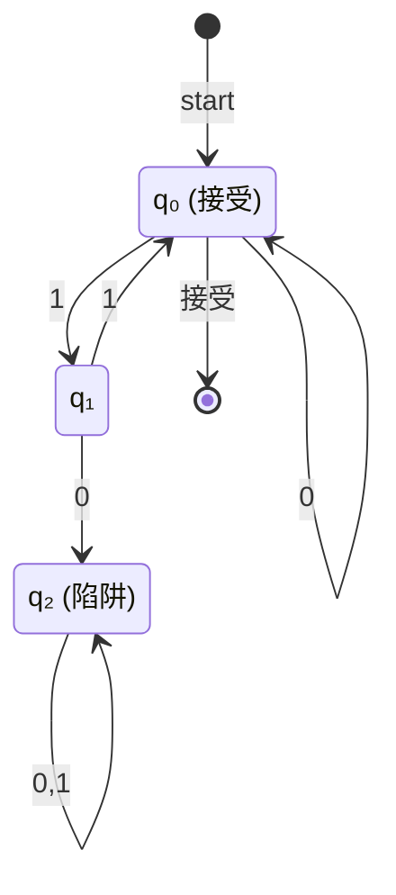
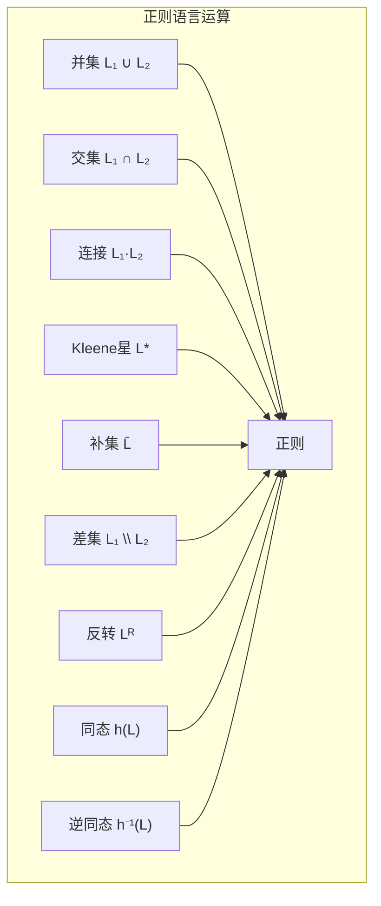

# 01.2 有限自动机

## 1. 确定性有限自动机 (DFA)

### 1.1 形式化定义

**定义 2.1.1** (DFA). 一个确定性有限自动机 (DFA) 是一个五元组 $M = (Q, \Sigma, \delta, q_0, F)$，其中：

- $Q$ 是**状态**的有限集合
- $\Sigma$ 是**输入字母表**
- $\delta: Q \times \Sigma \rightarrow Q$ 是**转移函数**
- $q_0 \in Q$ 是**初始状态**
- $F \subseteq Q$ 是**接受状态**集合

**定义 2.1.2** (扩展转移函数). 定义 $\hat{\delta}: Q \times \Sigma^* \rightarrow Q$：

- $\hat{\delta}(q, \varepsilon) = q$
- $\hat{\delta}(q, wa) = \delta(\hat{\delta}(q, w), a)$，其中 $w \in \Sigma^*$，$a \in \Sigma$

**定义 2.1.3** (DFA接受的语言). DFA $M$ 接受的语言为：
$$L(M) = \{w \in \Sigma^* \mid \hat{\delta}(q_0, w) \in F\}$$

### 1.2 DFA的计算模型

**例 2.1.4**. 识别偶数个1的DFA：

| 当前状态 | 输入0 | 输入1 |
|:---:|:---:|:---:|
| $q_0$ (偶) | $q_0$ | $q_1$ |
| $q_1$ (奇) | $q_1$ | $q_0$ |

## 2. 非确定性有限自动机 (NFA)

### 2.1 NFA的形式化定义

**定义 2.2.1** (NFA). 一个非确定性有限自动机 (NFA) 是一个五元组 $N = (Q, \Sigma, \delta, q_0, F)$，其中：

- $\delta: Q \times (\Sigma \cup \{\varepsilon\}) \rightarrow \mathcal{P}(Q)$ 是转移函数

**定义 2.2.2** ($\varepsilon$-闭包). 对 $S \subseteq Q$，定义$\varepsilon$-闭包 $E(S)$：

- $S \subseteq E(S)$
- 若 $q \in E(S)$ 且 $p \in \delta(q, \varepsilon)$，则 $p \in E(S)$

**定义 2.2.3** (NFA接受的语言). NFA $N$ 接受的语言为：
$$L(N) = \{w \in \Sigma^* \mid \hat{\delta}(\{q_0\}, w) \cap F \neq \emptyset\}$$

### 2.2 DFA与NFA的等价性

**定理 2.2.4** (子集构造). 对任意NFA $N$，存在DFA $D$ 使得 $L(D) = L(N)$。

**证明**. 构造 $D = (Q', \Sigma, \delta', q_0', F')$：

- $Q' = \mathcal{P}(Q)$
- $q_0' = E(\{q_0\})$
- $\delta'(S, a) = \bigcup_{q \in S} E(\delta(q, a))$
- $F' = \{S \in Q' \mid S \cap F \neq \emptyset\}$

对 $|w|$ 归纳证明 $\hat{\delta}'(q_0', w) = \hat{\delta}(\{q_0\}, w)$。

**定理 2.2.5** (状态数下界). 存在被 $n$ 状态NFA接受但需要 $2^n$ 状态DFA接受的语言。

## 3. 正则语言的性质

### 3.1 闭包性质

**定理 2.3.1** (正则语言闭包). 正则语言类在以下运算下封闭：

**证明**. 关键构造：

- **并**：DFA的乘积构造，接受状态为 $F_1 \times Q_2 \cup Q_1 \times F_2$
- **补**：交换接受与非接受状态
- **交**：利用德摩根律或乘积构造

### 3.2 泵引理

**定理 2.3.2** (正则语言泵引理). 若 $L$ 是正则语言，则存在泵长度 $p$，使得对任意 $w \in L$ 且 $|w| \geq p$，存在分解 $w = xyz$ 满足：

1. $|xy| \leq p$
2. $|y| \geq 1$
3. 对所有 $i \geq 0$，$xy^iz \in L$

**证明**. 设 $L$ 被具有 $p$ 个状态的DFA接受。对 $|w| \geq p$，根据鸽巢原理，处理前 $p$ 个字符时必有状态重复。

**例 2.3.3**. 证明 $L = \{a^n b^n \mid n \geq 0\}$ 不是正则的：

假设 $L$ 正则，取 $w = a^p b^p$。由泵引理，$w = xyz$ 且 $|xy| \leq p$，故 $y = a^k$ ($k \geq 1$)。则 $xy^2z = a^{p+k}b^p \notin L$，矛盾。

### 3.3 Myhill-Nerode定理

**定义 2.3.4** (不可区分关系). 对语言 $L \subseteq \Sigma^*$，定义关系 $\equiv_L$：
$$x \equiv_L y \iff \forall z \in \Sigma^*, xz \in L \leftrightarrow yz \in L$$

**定理 2.3.5** ($\equiv_L$ 是等价关系). 关系 $\equiv_L$ 是右不变等价关系。

**定理 2.3.6** (Myhill-Nerode). 语言 $L$ 是正则的当且仅当 $\equiv_L$ 具有有限指数（即等价类有限）。

**证明**.

- ($\Rightarrow$): 若 $L$ 被DFA $M$ 接受，则 $x \equiv_L y$ 当且仅当 $\hat{\delta}(q_0, x) = \hat{\delta}(q_0, y)$。状态数有限故指数有限。
- ($\Leftarrow$): 构造DFA，状态为等价类，转移为 $[x] \xrightarrow{a} [xa]$。

## 4. 正则语言的判定问题

### 4.1 基本判定算法

**定理 2.4.1** (成员问题). 对正则语言 $L$ 和字符串 $w$，判定 $w \in L$ 可在 $O(|w|)$ 时间完成。

**定理 2.4.2** (空性判定). 对正则语言 $L$，可在多项式时间判定 $L = \emptyset$。

**定理 2.4.3** (有限性判定). 对正则语言 $L$，可在多项式时间判定 $L$ 是否有限。

**定理 2.4.4** (等价性判定). 对两个正则语言 $L_1, L_2$，可在多项式时间判定 $L_1 = L_2$。

### 4.2 状态最小化

**定义 2.4.5** (DFA最小化). DFA $M$ 是**最小**的，如果不存在状态数更少的DFA接受 $L(M)$。

**算法 2.4.6** (状态最小化). 使用填表算法：

1. 标记所有 $(p, q)$ 对，其中 $p \in F$，$q \notin F$（或反之）
2. 重复：若存在未标记对 $(p, q)$ 和输入 $a$ 使得 $(\delta(p, a), \delta(q, a))$ 已标记，则标记 $(p, q)$
3. 直到无变化，合并所有未标记对

**定理 2.4.7** (最小DFA唯一性). 在同构意义下，最小DFA唯一。

## 5. 正则语言与文法的等价

### 5.1 三形式等价定理

**定理 2.5.1** (Kleene定理完整版). 对语言 $L \subseteq \Sigma^*$，以下等价：

1. $L$ 被某个DFA接受
2. $L$ 被某个NFA接受
3. $L$ 可由正则表达式表示
4. $L$ 可由正则文法生成

**证明概要**. 已证 (1)$\Leftrightarrow$(2)，其余：

- (2)$\Rightarrow$(3): 状态消去法
- (3)$\Rightarrow$(4): 结构归纳
- (4)$\Rightarrow$(2): 构造NFA模拟产生式

## 参考

- [01.1 文法与语言](./01.1_文法与语言.md) - 形式文法基础理论
- [01.3 下推自动机](./01.3_下推自动机.md) - 更强大的自动机模型
- [01.4 图灵机与计算](./01.4_图灵机与计算.md) - 通用计算模型
