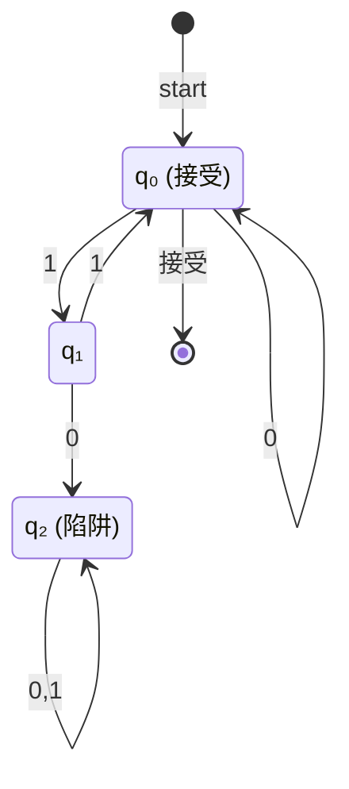
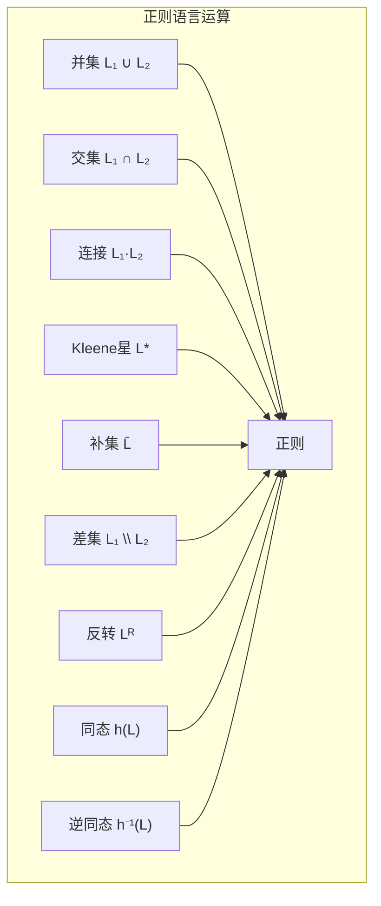

# 01.2 有限自动机

## 1. 确定性有限自动机 (DFA)

### 1.1 形式化定义

**定义 2.1.1** (DFA). 一个确定性有限自动机 (DFA) 是一个五元组 $M = (Q, \Sigma, \delta, q_0, F)$，其中：

- $Q$ 是**状态**的有限集合
- $\Sigma$ 是**输入字母表**
- $\delta: Q \times \Sigma \rightarrow Q$ 是**转移函数**
- $q_0 \in Q$ 是**初始状态**
- $F \subseteq Q$ 是**接受状态**集合

**定义 2.1.2** (扩展转移函数). 定义 $\hat{\delta}: Q \times \Sigma^* \rightarrow Q$：

- $\hat{\delta}(q, \varepsilon) = q$
- $\hat{\delta}(q, wa) = \delta(\hat{\delta}(q, w), a)$，其中 $w \in \Sigma^*$，$a \in \Sigma$

**定义 2.1.3** (DFA接受的语言). DFA $M$ 接受的语言为：
$$L(M) = \{w \in \Sigma^* \mid \hat{\delta}(q_0, w) \in F\}$$

### 1.2 DFA的计算模型



**例 2.1.4**. 识别偶数个1的DFA：

| 当前状态 | 输入0 | 输入1 |
|:---:|:---:|:---:|
| $q_0$ (偶) | $q_0$ | $q_1$ |
| $q_1$ (奇) | $q_1$ | $q_0$ |

## 2. 非确定性有限自动机 (NFA)

### 2.1 NFA的形式化定义

**定义 2.2.1** (NFA). 一个非确定性有限自动机 (NFA) 是一个五元组 $N = (Q, \Sigma, \delta, q_0, F)$，其中：

- $\delta: Q \times (\Sigma \cup \{\varepsilon\}) \rightarrow \mathcal{P}(Q)$ 是转移函数

**定义 2.2.2** ($\varepsilon$-闭包). 对 $S \subseteq Q$，定义$\varepsilon$-闭包 $E(S)$：

- $S \subseteq E(S)$
- 若 $q \in E(S)$ 且 $p \in \delta(q, \varepsilon)$，则 $p \in E(S)$

**定义 2.2.3** (NFA接受的语言). NFA $N$ 接受的语言为：
$$L(N) = \{w \in \Sigma^* \mid \hat{\delta}(\{q_0\}, w) \cap F \neq \emptyset\}$$

### 2.2 DFA与NFA的等价性

**定理 2.2.4** (子集构造). 对任意NFA $N$，存在DFA $D$ 使得 $L(D) = L(N)$。

**证明**. 构造 $D = (Q', \Sigma, \delta', q_0', F')$：

- $Q' = \mathcal{P}(Q)$
- $q_0' = E(\{q_0\})$
- $\delta'(S, a) = \bigcup_{q \in S} E(\delta(q, a))$
- $F' = \{S \in Q' \mid S \cap F \neq \emptyset\}$

对 $|w|$ 归纳证明 $\hat{\delta}'(q_0', w) = \hat{\delta}(\{q_0\}, w)$。

**定理 2.2.5** (状态数下界). 存在被 $n$ 状态NFA接受但需要 $2^n$ 状态DFA接受的语言。

## 3. 正则语言的性质

### 3.1 闭包性质

**定理 2.3.1** (正则语言闭包). 正则语言类在以下运算下封闭：



**证明**. 关键构造：

- **并**：DFA的乘积构造，接受状态为 $F_1 \times Q_2 \cup Q_1 \times F_2$
- **补**：交换接受与非接受状态
- **交**：利用德摩根律或乘积构造

### 3.2 泵引理

**定理 2.3.2** (正则语言泵引理). 若 $L$ 是正则语言，则存在泵长度 $p$，使得对任意 $w \in L$ 且 $|w| \geq p$，存在分解 $w = xyz$ 满足：

1. $|xy| \leq p$
2. $|y| \geq 1$
3. 对所有 $i \geq 0$，$xy^iz \in L$

**证明**. 设 $L$ 被具有 $p$ 个状态的DFA接受。对 $|w| \geq p$，根据鸽巢原理，处理前 $p$ 个字符时必有状态重复。

**例 2.3.3**. 证明 $L = \{a^n b^n \mid n \geq 0\}$ 不是正则的：

假设 $L$ 正则，取 $w = a^p b^p$。由泵引理，$w = xyz$ 且 $|xy| \leq p$，故 $y = a^k$ ($k \geq 1$)。则 $xy^2z = a^{p+k}b^p \notin L$，矛盾。

### 3.3 Myhill-Nerode定理

**定义 2.3.4** (不可区分关系). 对语言 $L \subseteq \Sigma^*$，定义关系 $\equiv_L$：
$$x \equiv_L y \iff \forall z \in \Sigma^*, xz \in L \leftrightarrow yz \in L$$

**定理 2.3.5** ($\equiv_L$ 是等价关系). 关系 $\equiv_L$ 是右不变等价关系。

**定理 2.3.6** (Myhill-Nerode). 语言 $L$ 是正则的当且仅当 $\equiv_L$ 具有有限指数（即等价类有限）。

**证明**.

- ($\Rightarrow$): 若 $L$ 被DFA $M$ 接受，则 $x \equiv_L y$ 当且仅当 $\hat{\delta}(q_0, x) = \hat{\delta}(q_0, y)$。状态数有限故指数有限。
- ($\Leftarrow$): 构造DFA，状态为等价类，转移为 $[x] \xrightarrow{a} [xa]$。

## 4. 正则语言的判定问题

### 4.1 基本判定算法

**定理 2.4.1** (成员问题). 对正则语言 $L$ 和字符串 $w$，判定 $w \in L$ 可在 $O(|w|)$ 时间完成。

**定理 2.4.2** (空性判定). 对正则语言 $L$，可在多项式时间判定 $L = \emptyset$。

**定理 2.4.3** (有限性判定). 对正则语言 $L$，可在多项式时间判定 $L$ 是否有限。

**定理 2.4.4** (等价性判定). 对两个正则语言 $L_1, L_2$，可在多项式时间判定 $L_1 = L_2$。

### 4.2 状态最小化

**定义 2.4.5** (DFA最小化). DFA $M$ 是**最小**的，如果不存在状态数更少的DFA接受 $L(M)$。

**算法 2.4.6** (状态最小化). 使用填表算法：

1. 标记所有 $(p, q)$ 对，其中 $p \in F$，$q \notin F$（或反之）
2. 重复：若存在未标记对 $(p, q)$ 和输入 $a$ 使得 $(\delta(p, a), \delta(q, a))$ 已标记，则标记 $(p, q)$
3. 直到无变化，合并所有未标记对

**定理 2.4.7** (最小DFA唯一性). 在同构意义下，最小DFA唯一。

## 5. 正则语言与文法的等价

### 5.1 三形式等价定理

**定理 2.5.1** (Kleene定理完整版). 对语言 $L \subseteq \Sigma^*$，以下等价：

1. $L$ 被某个DFA接受
2. $L$ 被某个NFA接受
3. $L$ 可由正则表达式表示
4. $L$ 可由正则文法生成

**证明概要**. 已证 (1)$\Leftrightarrow$(2)，其余：

- (2)$\Rightarrow$(3): 状态消去法
- (3)$\Rightarrow$(4): 结构归纳
- (4)$\Rightarrow$(2): 构造NFA模拟产生式

## 6. 代码实现

### 6.1 Rust 实现的 DFA/NFA

```rust
/*!
 * 有限自动机的 Rust 实现
 * 包含 DFA、NFA、正则表达式到 NFA 转换、状态最小化
 */

use std::collections::{HashMap, HashSet, VecDeque, BTreeSet};
use std::hash::Hash;

// ==================== DFA 实现 ====================

/// 确定性有限自动机 (DFA)
/// M = (Q, Σ, δ, q₀, F)
#[derive(Debug, Clone)]
pub struct DFA<S: Eq + Hash + Clone, A: Eq + Hash + Clone> {
    /// 状态集合 Q
    states: HashSet<S>,
    /// 输入字母表 Σ
    alphabet: HashSet<A>,
    /// 转移函数 δ: Q × Σ → Q
    transitions: HashMap<(S, A), S>,
    /// 初始状态 q₀
    start_state: S,
    /// 接受状态集合 F
    accept_states: HashSet<S>,
}

impl<S: Eq + Hash + Clone, A: Eq + Hash + Clone> DFA<S, A> {
    /// 创建新的 DFA
    pub fn new(
        states: HashSet<S>,
        alphabet: HashSet<A>,
        transitions: HashMap<(S, A), S>,
        start_state: S,
        accept_states: HashSet<S>,
    ) -> Self {
        DFA {
            states,
            alphabet,
            transitions,
            start_state,
            accept_states,
        }
    }

    /// 执行单步转移
    pub fn transition(&self, state: &S, input: &A) -> Option<&S> {
        self.transitions.get(&(state.clone(), input.clone()))
    }

    /// 扩展转移函数: 处理整个字符串
    pub fn delta_hat(&self, input: &[A]) -> Option<&S> {
        let mut current = &self.start_state;

        for symbol in input {
            match self.transition(current, symbol) {
                Some(next) => current = next,
                None => return None,
            }
        }

        Some(current)
    }

    /// 接受测试
    pub fn accepts(&self, input: &[A]) -> bool {
        match self.delta_hat(input) {
            Some(state) => self.accept_states.contains(state),
            None => false,
        }
    }

    /// 获取当前状态集合
    pub fn states(&self) -> &HashSet<S> {
        &self.states
    }

    pub fn accept_states(&self) -> &HashSet<S> {
        &self.accept_states
    }
}

/// DFA 构建器 (方便构建 DFA)
pub struct DFABuilder<S: Eq + Hash + Clone, A: Eq + Hash + Clone> {
    states: HashSet<S>,
    alphabet: HashSet<A>,
    transitions: HashMap<(S, A), S>,
    start_state: Option<S>,
    accept_states: HashSet<S>,
}

impl<S: Eq + Hash + Clone, A: Eq + Hash + Clone> DFABuilder<S, A> {
    pub fn new() -> Self {
        DFABuilder {
            states: HashSet::new(),
            alphabet: HashSet::new(),
            transitions: HashMap::new(),
            start_state: None,
            accept_states: HashSet::new(),
        }
    }

    pub fn add_state(mut self, state: S) -> Self {
        self.states.insert(state);
        self
    }

    pub fn add_transition(mut self, from: S, input: A, to: S) -> Self {
        self.states.insert(from.clone());
        self.states.insert(to.clone());
        self.alphabet.insert(input.clone());
        self.transitions.insert((from, input), to);
        self
    }

    pub fn set_start(mut self, state: S) -> Self {
        self.start_state = Some(state);
        self
    }

    pub fn add_accept(mut self, state: S) -> Self {
        self.accept_states.insert(state);
        self
    }

    pub fn build(self) -> Option<DFA<S, A>> {
        let start = self.start_state?;
        Some(DFA::new(
            self.states,
            self.alphabet,
            self.transitions,
            start,
            self.accept_states,
        ))
    }
}

// ==================== NFA 实现 ====================

/// 非确定性有限自动机 (NFA)
#[derive(Debug, Clone)]
pub struct NFA<S: Eq + Hash + Clone, A: Eq + Hash + Clone> {
    states: HashSet<S>,
    alphabet: HashSet<A>,
    /// 转移函数: δ: Q × (Σ ∪ {ε}) → P(Q)
    transitions: HashMap<(S, Option<A>), HashSet<S>>,
    start_state: S,
    accept_states: HashSet<S>,
}

impl<S: Eq + Hash + Clone, A: Eq + Hash + Clone> NFA<S, A> {
    pub fn new(
        states: HashSet<S>,
        alphabet: HashSet<A>,
        transitions: HashMap<(S, Option<A>), HashSet<S>>,
        start_state: S,
        accept_states: HashSet<S>,
    ) -> Self {
        NFA {
            states,
            alphabet,
            transitions,
            start_state,
            accept_states,
        }
    }

    /// ε-闭包: 从给定状态集合出发，仅通过ε转移可达的所有状态
    pub fn epsilon_closure(&self, states: &HashSet<S>) -> HashSet<S> {
        let mut closure = states.clone();
        let mut queue: VecDeque<S> = states.iter().cloned().collect();

        while let Some(state) = queue.pop_front() {
            if let Some(next_states) = self.transitions.get(&(state, None)) {
                for next in next_states {
                    if closure.insert(next.clone()) {
                        queue.push_back(next.clone());
                    }
                }
            }
        }

        closure
    }

    /// 单步转移（含ε闭包）
    pub fn move_set(&self, states: &HashSet<S>, input: &A) -> HashSet<S> {
        let mut result = HashSet::new();

        for state in states {
            if let Some(next_states) = self.transitions.get(&(state.clone(), Some(input.clone()))) {
                result.extend(next_states.iter().cloned());
            }
        }

        self.epsilon_closure(&result)
    }

    /// 接受测试
    pub fn accepts(&self, input: &[A]) -> bool {
        let mut current = self.epsilon_closure(&{
            let mut s = HashSet::new();
            s.insert(self.start_state.clone());
            s
        });

        for symbol in input {
            current = self.move_set(&current, symbol);
            if current.is_empty() {
                return false;
            }
        }

        !current.is_disjoint(&self.accept_states)
    }

    /// 使用子集构造转换为 DFA
    pub fn to_dfa(&self) -> DFA<BTreeSet<S>, A> {
        let mut dfa_states: HashSet<BTreeSet<S>> = HashSet::new();
        let mut dfa_transitions: HashMap<(BTreeSet<S>, A), BTreeSet<S>> = HashMap::new();

        // 初始状态的 ε-闭包
        let start_closure = self.epsilon_closure(&{
            let mut s = HashSet::new();
            s.insert(self.start_state.clone());
            s
        });
        let dfa_start: BTreeSet<S> = start_closure.into_iter().collect();

        let mut queue = VecDeque::new();
        queue.push_back(dfa_start.clone());
        dfa_states.insert(dfa_start.clone());

        while let Some(current) = queue.pop_front() {
            let current_set: HashSet<S> = current.iter().cloned().collect();

            for symbol in &self.alphabet {
                let next = self.move_set(&current_set, symbol);
                if next.is_empty() {
                    continue;
                }

                let next_bt: BTreeSet<S> = next.into_iter().collect();
                dfa_transitions.insert((current.clone(), symbol.clone()), next_bt.clone());

                if dfa_states.insert(next_bt.clone()) {
                    queue.push_back(next_bt);
                }
            }
        }

        // 确定接受状态（包含NFA接受状态的DFA状态）
        let dfa_accepts: HashSet<BTreeSet<S>> = dfa_states
            .iter()
            .filter(|s| !s.is_disjoint(&self.accept_states))
            .cloned()
            .collect();

        DFA::new(
            dfa_states,
            self.alphabet.clone(),
            dfa_transitions,
            dfa_start,
            dfa_accepts,
        )
    }
}

// ==================== 使用示例 ====================

fn example_even_ones_dfa() -> DFA<i32, char> {
    // 识别偶数个1的DFA
    // 状态0: 偶数个1 (接受)
    // 状态1: 奇数个1
    let transitions: HashMap<(i32, char), i32> = [
        ((0, '0'), 0),
        ((0, '1'), 1),
        ((1, '0'), 1),
        ((1, '1'), 0),
    ].into_iter().collect();

    DFA::new(
        [0, 1].into_iter().collect(),
        ['0', '1'].into_iter().collect(),
        transitions,
        0,
        [0].into_iter().collect(),
    )
}

fn main() {
    println!("=== DFA 示例: 识别偶数个1 ===");
    let dfa = example_even_ones_dfa();

    let test_strings = vec!["", "0", "1", "11", "101", "111", "1010"];
    for s in test_strings {
        let chars: Vec<char> = s.chars().collect();
        let accepted = dfa.accepts(&chars);
        println!("输入 '{}': {}", s, if accepted { "接受 ✓" } else { "拒绝 ✗" });
    }
}
```

### 6.2 正则表达式到 NFA 的转换 (Thompson构造)

```rust
/*!
 * 正则表达式到 NFA 的 Thompson 构造法
 *
 * 支持的正则表达式语法:
 *   - 基本字符: a, b, c, ...
 *   - 连接: ab (简写)
 *   - 选择: a|b
 *   - 闭包: a*
 *   - 分组: (a|b)c
 */

use std::collections::{HashMap, HashSet};

/// 正则表达式 AST
#[derive(Debug, Clone)]
pub enum Regex {
    Empty,           // ε
    Symbol(char),    // 单个字符
    Concat(Box<Regex>, Box<Regex>),  // 连接
    Union(Box<Regex>, Box<Regex>),   // 选择 |
    Star(Box<Regex>),                // 闭包 *
}

/// 状态ID使用整数
pub type StateId = usize;

/// Thompson NFA 构造结果
pub struct ThompsonNFA {
    pub start: StateId,
    pub accept: StateId,
    pub transitions: HashMap<(StateId, Option<char>), HashSet<StateId>>,
    pub next_state: StateId,
}

impl ThompsonNFA {
    pub fn new() -> Self {
        ThompsonNFA {
            start: 0,
            accept: 0,
            transitions: HashMap::new(),
            next_state: 0,
        }
    }

    fn new_state(&mut self) -> StateId {
        let s = self.next_state;
        self.next_state += 1;
        s
    }

    fn add_transition(&mut self, from: StateId, input: Option<char>, to: StateId) {
        self.transitions
            .entry((from, input))
            .or_insert_with(HashSet::new)
            .insert(to);
    }

    /// Thompson 构造: 将正则表达式转换为 NFA
    pub fn construct(&mut self, regex: &Regex) -> (StateId, StateId) {
        match regex {
            Regex::Empty => {
                let s = self.new_state();
                let a = self.new_state();
                self.add_transition(s, None, a);  // ε转移
                (s, a)
            }

            Regex::Symbol(c) => {
                let s = self.new_state();
                let a = self.new_state();
                self.add_transition(s, Some(*c), a);
                (s, a)
            }

            Regex::Concat(r1, r2) => {
                let (s1, a1) = self.construct(r1);
                let (s2, a2) = self.construct(r2);
                self.add_transition(a1, None, s2);  // 连接两个NFA
                (s1, a2)
            }

            Regex::Union(r1, r2) => {
                let s = self.new_state();
                let a = self.new_state();
                let (s1, a1) = self.construct(r1);
                let (s2, a2) = self.construct(r2);

                // 新开始状态 ε转移到两个子NFA的开始
                self.add_transition(s, None, s1);
                self.add_transition(s, None, s2);

                // 两个子NFA的接受状态 ε转移到新接受状态
                self.add_transition(a1, None, a);
                self.add_transition(a2, None, a);

                (s, a)
            }

            Regex::Star(r) => {
                let s = self.new_state();
                let a = self.new_state();
                let (s1, a1) = self.construct(r);

                // 新开始直接到新接受（对应ε）
                self.add_transition(s, None, a);
                // 新开始到子NFA开始
                self.add_transition(s, None, s1);
                // 子NFA接受回到子NFA开始（循环）
                self.add_transition(a1, None, s1);
                // 子NFA接受到新接受
                self.add_transition(a1, None, a);

                (s, a)
            }
        }
    }

    /// 转换为通用的 NFA 结构
    pub fn to_nfa(&self, start: StateId, accept: StateId) -> NFA<StateId, char> {
        let mut states: HashSet<StateId> = HashSet::new();
        let mut alphabet: HashSet<char> = HashSet::new();

        for ((from, input), tos) in &self.transitions {
            states.insert(*from);
            states.extend(tos.iter());
            if let Some(c) = input {
                alphabet.insert(*c);
            }
        }
        states.insert(start);
        states.insert(accept);

        NFA::new(
            states,
            alphabet,
            self.transitions.clone(),
            start,
            [accept].into_iter().collect(),
        )
    }
}

/// 简化的 NFA 结构
#[derive(Debug, Clone)]
pub struct NFA<S: Eq + std::hash::Hash + Clone, A: Eq + std::hash::Hash + Clone> {
    states: HashSet<S>,
    alphabet: HashSet<A>,
    transitions: HashMap<(S, Option<A>), HashSet<S>>,
    start_state: S,
    accept_states: HashSet<S>,
}

impl<S: Eq + std::hash::Hash + Clone, A: Eq + std::hash::Hash + Clone> NFA<S, A> {
    pub fn new(
        states: HashSet<S>,
        alphabet: HashSet<A>,
        transitions: HashMap<(S, Option<A>), HashSet<S>>,
        start_state: S,
        accept_states: HashSet<S>,
    ) -> Self {
        NFA {
            states,
            alphabet,
            transitions,
            start_state,
            accept_states,
        }
    }

    /// ε-闭包
    pub fn epsilon_closure(&self, states: &HashSet<S>) -> HashSet<S> {
        let mut closure = states.clone();
        let mut queue: std::collections::VecDeque<S> =
            states.iter().cloned().collect();

        while let Some(state) = queue.pop_front() {
            if let Some(next_states) = self.transitions.get(&(state, None)) {
                for next in next_states {
                    if closure.insert(next.clone()) {
                        queue.push_back(next.clone());
                    }
                }
            }
        }

        closure
    }

    /// 接受测试
    pub fn accepts(&self, input: &[A]) -> bool {
        let mut current = self.epsilon_closure(&{
            let mut s = HashSet::new();
            s.insert(self.start_state.clone());
            s
        });

        for symbol in input {
            let mut next = HashSet::new();
            for state in &current {
                if let Some(states) = self.transitions.get(&(state.clone(), Some(symbol.clone()))) {
                    next.extend(states.iter().cloned());
                }
            }
            current = self.epsilon_closure(&next);
            if current.is_empty() {
                return false;
            }
        }

        !current.is_disjoint(&self.accept_states)
    }
}

/// 解析简单正则表达式
pub fn parse_regex(s: &str) -> Result<Regex, String> {
    // 简化的解析器，仅用于演示
    // 实际应用应使用递归下降或shunting-yard算法
    let chars: Vec<char> = s.chars().collect();
    parse_union(&chars, &mut 0)
}

fn parse_union(chars: &[char], pos: &mut usize) -> Result<Regex, String> {
    let mut left = parse_concat(chars, pos)?;

    while *pos < chars.len() && chars[*pos] == '|' {
        *pos += 1;
        let right = parse_concat(chars, pos)?;
        left = Regex::Union(Box::new(left), Box::new(right));
    }

    Ok(left)
}

fn parse_concat(chars: &[char], pos: &mut usize) -> Result<Regex, String> {
    let mut result = parse_star(chars, pos)?;

    while *pos < chars.len() && chars[*pos] != '|' && chars[*pos] != ')' {
        let next = parse_star(chars, pos)?;
        result = Regex::Concat(Box::new(result), Box::new(next));
    }

    Ok(result)
}

fn parse_star(chars: &[char], pos: &mut usize) -> Result<Regex, String> {
    let base = parse_atom(chars, pos)?;

    if *pos < chars.len() && chars[*pos] == '*' {
        *pos += 1;
        Ok(Regex::Star(Box::new(base)))
    } else {
        Ok(base)
    }
}

fn parse_atom(chars: &[char], pos: &mut usize) -> Result<Regex, String> {
    if *pos >= chars.len() {
        return Err("Unexpected end of input".to_string());
    }

    match chars[*pos] {
        '(' => {
            *pos += 1;
            let inner = parse_union(chars, pos)?;
            if *pos >= chars.len() || chars[*pos] != ')' {
                return Err("Expected ')'".to_string());
            }
            *pos += 1;
            Ok(inner)
        }
        'ε' | 'e' => {
            *pos += 1;
            Ok(Regex::Empty)
        }
        c => {
            *pos += 1;
            Ok(Regex::Symbol(c))
        }
    }
}

fn main() {
    println!("=== Thompson 构造: 正则表达式到 NFA ===\n");

    // 测试: (a|b)*a
    let regex_str = "(a|b)*a";
    println!("正则表达式: {}", regex_str);

    let regex = parse_regex(regex_str).expect("解析失败");
    println!("AST: {:?}", regex);

    let mut builder = ThompsonNFA::new();
    let (start, accept) = builder.construct(&regex);
    println!("构造完成: 开始状态={}, 接受状态={}", start, accept);

    let nfa = builder.to_nfa(start, accept);

    // 测试字符串
    let tests = vec!["a", "aa", "ba", "aba", "bbba", "b", ""];
    for s in tests {
        let chars: Vec<char> = s.chars().collect();
        let accepted = nfa.accepts(&chars);
        println!("  '{}' → {}", s, if accepted { "✓" } else { "✗" });
    }
}
```

### 6.3 状态最小化算法 (Hopcroft算法)

```rust
/*!
 * DFA 状态最小化算法
 * 使用 Hopcroft 算法 (O(n log n)) 或简单的填表算法 (O(n²))
 */

use std::collections::{HashMap, HashSet, VecDeque};

/// Hopcroft DFA 状态最小化
pub struct DFAMinimizer<S: Eq + std::hash::Hash + Clone + Ord, A: Eq + std::hash::Hash + Clone> {
    /// 原始DFA的转移表: state × input → state
    transitions: HashMap<(S, A), S>,
    /// 所有状态
    states: Vec<S>,
    /// 字母表
    alphabet: Vec<A>,
    /// 接受状态集合
    accepts: HashSet<S>,
}

impl<S: Eq + std::hash::Hash + Clone + Ord, A: Eq + std::hash::Hash + Clone>
    DFAMinimizer<S, A> {

    pub fn new(
        transitions: HashMap<(S, A), S>,
        states: Vec<S>,
        alphabet: Vec<A>,
        accepts: HashSet<S>,
    ) -> Self {
        DFAMinimizer {
            transitions,
            states,
            alphabet,
            accepts,
        }
    }

    /// 简单的填表算法 (Table-filling algorithm)
    /// 时间复杂度: O(n² × |Σ|)
    pub fn minimize_table(&self) -> HashMap<S, S> {
        let n = self.states.len();

        // 不可区分表: table[i][j] = true 表示状态i和j可区分
        let mut table = vec![vec![false; n]; n];
        let mut worklist = VecDeque::new();

        // 步骤1: 标记 (接受, 非接受) 对
        for (i, s1) in self.states.iter().enumerate() {
            for (j, s2) in self.states.iter().enumerate() {
                if i >= j {
                    continue;
                }
                let s1_accept = self.accepts.contains(s1);
                let s2_accept = self.accepts.contains(s2);

                if s1_accept != s2_accept {
                    table[i][j] = true;
                    table[j][i] = true;
                    worklist.push_back((i, j));
                }
            }
        }

        // 步骤2: 迭代标记
        while let Some((i, j)) = worklist.pop_front() {
            for a in &self.alphabet {
                // 找到所有通过a转移到(i,j)的状态对
                for (p_idx, p) in self.states.iter().enumerate() {
                    for (q_idx, q) in self.states.iter().enumerate() {
                        if p_idx >= q_idx {
                            continue;
                        }
                        if table[p_idx][q_idx] {
                            continue;
                        }

                        // 检查转移
                        let p_next = self.transitions.get(&(p.clone(), a.clone()));
                        let q_next = self.transitions.get(&(q.clone(), a.clone()));

                        let should_mark = match (p_next, q_next) {
                            (Some(pi), Some(qi)) => {
                                let pi_idx = self.state_index(pi);
                                let qi_idx = self.state_index(qi);
                                if pi_idx == i && qi_idx == j ||
                                   pi_idx == j && qi_idx == i {
                                    true
                                } else {
                                    false
                                }
                            }
                            (None, None) => false,
                            _ => true,  // 一个有转移一个没有，可区分
                        };

                        if should_mark {
                            table[p_idx][q_idx] = true;
                            table[q_idx][p_idx] = true;
                            worklist.push_back((p_idx, q_idx));
                        }
                    }
                }
            }
        }

        // 步骤3: 构建等价类
        let mut visited = vec![false; n];
        let mut equivalence = HashMap::new();

        for i in 0..n {
            if visited[i] {
                continue;
            }

            let mut class = vec![i];
            visited[i] = true;

            for j in (i + 1)..n {
                if !table[i][j] {
                    class.push(j);
                    visited[j] = true;
                }
            }

            // 每个等价类的代表是索引最小的状态
            let representative = self.states[class[0]].clone();
            for idx in class {
                equivalence.insert(self.states[idx].clone(), representative.clone());
            }
        }

        equivalence
    }

    fn state_index(&self, state: &S) -> usize {
        self.states.iter().position(|s| s == state).unwrap()
    }

    /// 打印等价类
    pub fn print_equivalence(&self, equiv: &HashMap<S, S>) {
        println!("状态等价类:");
        let mut classes: HashMap<S, Vec<S>> = HashMap::new();

        for (state, rep) in equiv {
            classes.entry(rep.clone()).or_insert_with(Vec::new)
                   .push(state.clone());
        }

        for (rep, states) in classes {
            let states_str: Vec<String> = states.iter()
                .map(|s| format!("{:?}", s))
                .collect();
            let is_accept = if self.accepts.contains(&rep) { " (接受)" } else { "" };
            println!("  [{}]{}: {}", format!("{:?}", rep), is_accept, states_str.join(", "));
        }
    }
}

fn main() {
    println!("=== DFA 状态最小化 (填表算法) ===\n");

    // 示例DFA: 识别包含子串 "01" 的语言
    // 状态: 0=初始, 1=已见0, 2=已见01(接受), 3=陷阱
    let transitions: HashMap<(i32, char), i32> = [
        ((0, '0'), 1),
        ((0, '1'), 0),
        ((1, '0'), 1),
        ((1, '1'), 2),
        ((2, '0'), 2),
        ((2, '1'), 2),
    ].into_iter().collect();

    let states = vec![0, 1, 2];
    let alphabet = vec!['0', '1'];
    let accepts: HashSet<i32> = [2].into_iter().collect();

    let minimizer = DFAMinimizer::new(transitions, states, alphabet, accepts);
    let equivalence = minimizer.minimize_table();

    minimizer.print_equivalence(&equivalence);
}
```

## 参考

- [01.1 文法与语言](./01.1_文法与语言.md) - 形式文法基础理论
- [01.3 下推自动机](./01.3_下推自动机.md) - 更强大的自动机模型
- [01.4 图灵机与计算](./01.4_图灵机与计算.md) - 通用计算模型
