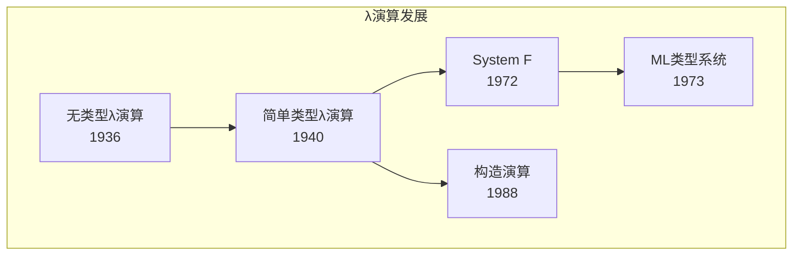
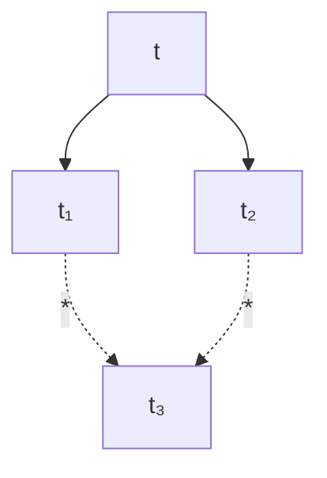

# 1.3 λ演算 (Lambda Calculus)

## 目录

- [1.3 λ演算 (Lambda Calculus)](#13-λ演算-lambda-calculus)
  - [目录](#目录)
  - [1.3.1 引言](#131-引言)
  - [1.3.2 无类型λ演算](#132-无类型λ演算)
    - [1.3.2.1 语法定义](#1321-语法定义)
    - [1.3.2.2 变量绑定与作用域](#1322-变量绑定与作用域)
    - [1.3.2.3 β归约](#1323-β归约)
    - [1.3.2.4 η归约](#1324-η归约)
    - [1.3.2.5 Church-Rosser定理](#1325-church-rosser定理)
  - [1.3.3 计算能力](#133-计算能力)
    - [1.3.3.1 Church数](#1331-church数)
    - [1.3.3.2 算术运算](#1332-算术运算)
    - [1.3.3.3 递归与不动点](#1333-递归与不动点)
  - [1.3.4 简单类型λ演算](#134-简单类型λ演算)
    - [1.3.4.1 类型语法](#1341-类型语法)
    - [1.3.4.2 类型推导](#1342-类型推导)
    - [1.3.4.3 类型安全性](#1343-类型安全性)
  - [1.3.5 多态与系统F](#135-多态与系统f)
  - [1.3.6 形式化证明](#136-形式化证明)
    - [Lean 4：λ演算的形式化](#lean-4λ演算的形式化)
    - [Haskell：λ演算解释器](#haskellλ演算解释器)
  - [1.3.7 总结](#137-总结)

---

## 1.3.1 引言

λ演算(Lambda Calculus)由阿隆佐·邱奇(Alonzo Church)于1930年代提出，是一种简洁而强大的函数式编程理论基础。
它仅通过函数定义和函数应用两个基本操作，就能表达任意可计算函数。



> **引用**: 组合逻辑见 [01.4_组合逻辑.md](./01.4_组合逻辑.md)，简单类型论见 [../02_类型论/02.1_简单类型论.md](../02_类型论/02.1_简单类型论.md)。

---

## 1.3.2 无类型λ演算

### 1.3.2.1 语法定义

**定义 1.3.1 (λ项)** λ项的抽象语法：

$$t ::= x \mid \lambda x.t \mid t\, t$$

| 形式 | 名称 | 说明 |
|------|------|------|
| $x$ | 变量 | 来自可数无限变量集 |
| $\lambda x.t$ | λ抽象 | 函数定义，$x$ 为参数，$t$ 为函数体 |
| $t_1\, t_2$ | 应用 | 函数应用 |

**约定**：

- 应用左结合：$f\, x\, y = ((f\, x)\, y)$
- 抽象右延伸：$\lambda x. x\, y = \lambda x. (x\, y)$
- 多重抽象：$\lambda x y. t = \lambda x. \lambda y. t$

### 1.3.2.2 变量绑定与作用域

**定义 1.3.2 (自由变量, FV)** 递归定义：

$$\text{FV}(x) = \{x\}$$
$$\text{FV}(\lambda x.t) = \text{FV}(t) \setminus \{x\}$$
$$\text{FV}(t_1\, t_2) = \text{FV}(t_1) \cup \text{FV}(t_2)$$

**定义 1.3.3 (绑定变量)** 在 $\lambda x.t$ 中，$x$ 是绑定变量，$t$ 是 $x$ 的作用域。

**定义 1.3.4 (α等价)** 通过一致重命名绑定变量得到的项等价：

$$\lambda x.t =_\alpha \lambda y.t[y/x] \quad \text{若 } y \notin \text{FV}(t)$$

其中 $t[y/x]$ 表示将 $t$ 中自由出现的 $x$ 替换为 $y$。

### 1.3.2.3 β归约

**定义 1.3.5 (β归约)** 基本归约规则：

$$(\lambda x.t_1)\, t_2 \rightarrow_\beta t_1[t_2/x]$$

其中 $t_1[t_2/x]$ 是将 $t_1$ 中自由 $x$ 替换为 $t_2$（需避免变量捕获）。

**定义 1.3.6 (捕获避免替换)** 形式定义：

$$x[t/x] = t$$
$$y[t/x] = y \quad \text{若 } x \neq y$$
$$(t_1\, t_2)[t/x] = (t_1[t/x])\, (t_2[t/x])$$
$$(\lambda y.t_1)[t/x] = \lambda y.(t_1[t/x]) \quad \text{若 } y \neq x, y \notin \text{FV}(t)$$

**归约策略**：

| 策略 | 规则 | 特性 |
|------|------|------|
| **正规序** | 最左最外优先 | 若存在范式必找到，但效率低 |
| **应用序** | 先求值参数 | 可能发散即使存在范式 |
| **惰性求值** | 按需求值 | 现代函数式语言采用 |

### 1.3.2.4 η归约

**定义 1.3.7 (η归约)** 扩展性归约：

$$\lambda x.(f\, x) \rightarrow_\eta f \quad \text{若 } x \notin \text{FV}(f)$$

η等价表达"外延相等"：两个函数对所有参数给出相同结果，则它们相等。

### 1.3.2.5 Church-Rosser定理

**定理 1.3.1 (Church-Rosser / 合流性)** 若 $t \rightarrow^* t_1$ 且 $t \rightarrow^* t_2$，则存在 $t_3$ 使得 $t_1 \rightarrow^* t_3$ 且 $t_2 \rightarrow^* t_3$。



**推论 1.3.1 (范式的唯一性)** 若 $t$ 有范式，则范式在α等价意义下唯一。

**定理 1.3.2 (标准归约定理)** 若 $t$ 有范式，则正规序归约必找到它。

---

## 1.3.3 计算能力

### 1.3.3.1 Church数

**定义 1.3.8 (Church数)** 自然数编码为高阶函数：

$$\overline{n} = \lambda f. \lambda x. f^n\, x$$

即：

- $\overline{0} = \lambda f. \lambda x. x$
- $\overline{1} = \lambda f. \lambda x. f\, x$
- $\overline{2} = \lambda f. \lambda x. f\, (f\, x)$

### 1.3.3.2 算术运算

**后继函数**：

$$\text{succ} = \lambda n. \lambda f. \lambda x. f\, (n\, f\, x)$$

**加法**：

$$\text{add} = \lambda m. \lambda n. \lambda f. \lambda x. m\, f\, (n\, f\, x)$$

**乘法**：

$$\text{mul} = \lambda m. \lambda n. \lambda f. \lambda x. m\, (n\, f)\, x$$

**验证**：$\text{add}\, \overline{2}\, \overline{3} =_\beta \overline{5}$

### 1.3.3.3 递归与不动点

**定理 1.3.3 (不动点组合子)** 存在项 $Y$ 使得对所有 $F$：

$$Y\, F =_\beta F\, (Y\, F)$$

**Curry的Y组合子**：

$$Y = \lambda f. (\lambda x. f\, (x\, x))\, (\lambda x. f\, (x\, x))$$

**验证**：

$$
\begin{aligned}
Y\, F &= (\lambda x. F\, (x\, x))\, (\lambda x. F\, (x\, x)) \\
&= F\, ((\lambda x. F\, (x\, x))\, (\lambda x. F\, (x\, x))) \\
&= F\, (Y\, F)
\end{aligned}
$$

**Turing不动点组合子**：

$$\Theta = (\lambda x. \lambda y. y\, (x\, x\, y))\, (\lambda x. \lambda y. y\, (x\, x\, y))$$

**示例**：阶乘函数

$$\text{fact} = Y\, (\lambda f. \lambda n. \text{if}\, (n = 0)\, \overline{1}\, (\text{mul}\, n\, (f\, (\text{pred}\, n))))$$

---

## 1.3.4 简单类型λ演算

### 1.3.4.1 类型语法

**定义 1.3.9 (简单类型)** 类型语法：

$$\tau ::= \iota \mid \tau \rightarrow \tau$$

其中：

- $\iota$：基类型（如 $\text{Bool}$, $\text{Nat}$）
- $\tau_1 \rightarrow \tau_2$：函数类型

### 1.3.4.2 类型推导

**定义 1.3.10 (类型上下文)** 类型上下文 $\Gamma$ 是从变量到类型的有限映射，记作 $x_1:\tau_1, \ldots, x_n:\tau_n$。

**类型推导规则**：

$$\frac{}{(\Gamma, x:\tau) \vdash x : \tau} \text{(T-VAR)}$$

$$\frac{\Gamma, x:\tau_1 \vdash t : \tau_2}{\Gamma \vdash \lambda x.t : \tau_1 \rightarrow \tau_2} \text{(T-ABS)}$$

$$\frac{\Gamma \vdash t_1 : \tau_1 \rightarrow \tau_2 \quad \Gamma \vdash t_2 : \tau_1}{\Gamma \vdash t_1\, t_2 : \tau_2} \text{(T-APP)}$$

**定理 1.3.4 (类型唯一性)** 若 $\Gamma \vdash t : \tau_1$ 且 $\Gamma \vdash t : \tau_2$，则 $\tau_1 = \tau_2$。

### 1.3.4.3 类型安全性

**定义 1.3.11 (范式)** 不含β可归约子项的项称为范式。

**定理 1.3.5 (强正规化)** 良类型的简单类型λ项必然归约到范式。

**定理 1.3.6 (类型安全性 / 类型保持)** 若 $\Gamma \vdash t : \tau$ 且 $t \rightarrow t'$，则 $\Gamma \vdash t' : \tau$。

**定理 1.3.7 (进展性)** 若 $\vdash t : \tau$ 且 $t$ 不是范式，则存在 $t'$ 使得 $t \rightarrow t'$。

---

## 1.3.5 多态与系统F

**定义 1.3.12 (系统F / 多态λ演算)** 扩展类型语法：

$$\tau ::= \alpha \mid \tau \rightarrow \tau \mid \forall \alpha. \tau$$

其中 $\forall \alpha. \tau$ 是多态类型（全称量化）。

**类型抽象与应用**：

$$t ::= \cdots \mid \Lambda \alpha.t \mid t\, [\tau]$$

**类型推导规则**：

$$\frac{\Gamma \vdash t : \tau}{\Gamma \vdash \Lambda \alpha.t : \forall \alpha. \tau} \text{(T-TABS)} \quad \text{(α ∉ FV(Γ))}$$

$$\frac{\Gamma \vdash t : \forall \alpha. \tau_1}{\Gamma \vdash t\, [\tau_2] : \tau_1[\tau_2/\alpha]} \text{(T-TAPP)}$$

**定理 1.3.8 (系统F的表达能力)** 系统F可编码：

- 积类型（二元组）
- 和类型（互斥并）
- 归纳类型（自然数、列表等）
- 存在类型（抽象数据类型）

---

## 1.3.6 形式化证明

### Lean 4：λ演算的形式化

```lean4
-- λ项的归纳定义
inductive Term where
  | var : String → Term
  | abs : String → Term → Term
  | app : Term → Term → Term
  deriving Repr, BEq

-- 自由变量计算
def fv : Term → List String
  | .var x => [x]
  | .abs x t => (fv t).erase x
  | .app t₁ t₂ => fv t₁ ++ fv t₂

-- 捕获避免替换
def subst (t : Term) (x : String) (s : Term) : Term :=
  match t with
  | .var y => if x = y then s else .var y
  | .abs y t₁ =>
      if x = y then .abs y t₁
      else if y ∈ fv s then
        let y' := y ++ "'"
        .abs y' (subst (subst t₁ y (.var y')) x s)
      else .abs y (subst t₁ x s)
  | .app t₁ t₂ => .app (subst t₁ x s) (subst t₂ x s)

-- β归约关系
inductive Beta : Term → Term → Prop where
  | beta (x : String) (t s : Term) :
      Beta (.app (.abs x t) s) (subst t x s)
  | appL {t₁ t₁' t₂ : Term} :
      Beta t₁ t₁' → Beta (.app t₁ t₂) (.app t₁' t₂)
  | appR {t₁ t₂ t₂' : Term} :
      Beta t₂ t₂' → Beta (.app t₁ t₂) (.app t₁ t₂')
  | abs (x : String) {t t' : Term} :
      Beta t t' → Beta (.abs x t) (.abs x t')

-- Church-Rosser定理的陈述
def Confluence (R : Term → Term → Prop) : Prop :=
  ∀ t t₁ t₂,
    Relation.ReflTransGen R t t₁ →
    Relation.ReflTransGen R t t₂ →
    ∃ t₃, Relation.ReflTransGen R t₁ t₃ ∧
          Relation.ReflTransGen R t₂ t₃

theorem church_rosser : Confluence Beta := by
  -- 证明涉及并行归约和Tait-Martin-Löf方法
  sorry
```

### Haskell：λ演算解释器

```haskell
{-# LANGUAGE GADTs #-}

import Data.List (elemIndex)
import qualified Data.Map as Map

type Name = String

-- λ项
data Term = Var Name
          | Abs Name Term
          | App Term Term
          deriving (Eq, Show)

-- 捕获避免替换
subst :: Name -> Term -> Term -> Term
subst x s (Var y)
  | x == y    = s
  | otherwise = Var y
subst x s (Abs y t)
  | x == y    = Abs y t
  | y `elem` fv s = let y' = fresh y (fv s ++ fv t)
                        t' = subst y (Var y') t
                    in Abs y' (subst x s t')
  | otherwise = Abs y (subst x s t)
  where
    fv (Var z) = [z]
    fv (Abs z t') = filter (/= z) (fv t')
    fv (App t1 t2) = fv t1 ++ fv t2

    fresh y vars = if y `elem` vars
                   then fresh (y ++ "'") vars
                   else y
subst x s (App t1 t2) = App (subst x s t1) (subst x s t2)

-- 一步β归约
tryBeta :: Term -> Maybe Term
tryBeta (App (Abs x t) s) = Just (subst x s t)
tryBeta _ = Nothing

-- 正规序归约（最左最外）
normalOrder :: Term -> Maybe Term
normalOrder t = case t of
  App (Abs x t1) t2 -> Just (subst x t2 t1)  -- β归约
  App t1 t2 -> case normalOrder t1 of
    Just t1' -> Just (App t1' t2)
    Nothing -> App t1 <$> normalOrder t2
  Abs x t1 -> Abs x <$> normalOrder t1
  _ -> Nothing

-- Church数
churchN :: Int -> Term
churchN n = Abs "f" (Abs "x" (iterate (App (Var "f")) (Var "x") !! n))

-- 后继
churchSucc :: Term
churchSucc = Abs "n" (Abs "f" (Abs "x" (App (Var "f") (App (App (Var "n") (Var "f")) (Var "x")))))
```

---

## 1.3.7 总结

| 概念 | 无类型λ演算 | 简单类型λ演算 | 系统F |
|------|------------|--------------|-------|
| **计算能力** | 图灵完全 | 非图灵完全 | 图灵完全 |
| **正规化** | 否（存在发散项） | 是 | 是 |
| **类型推断** | N/A | 可判定 | 不可判定 |
| **多态性** | 无 | 无 | 参数多态 |

**λ演算核心定理**：

| 定理 | 陈述 |
|------|------|
| **Church-Rosser** | β归约是合流的 |
| **标准化** | 正规序策略是完备的 |
| **不动点** | 存在Y组合子实现递归 |
| **类型安全性** | 类型保持 + 进展性 |

**延伸阅读**：

- [01.4_组合逻辑.md](./01.4_组合逻辑.md) - 无变量的函数计算
- [../02_类型论/02.1_简单类型论.md](../02_类型论/02.1_简单类型论.md) - 类型系统的理论基础
- [../02_类型论/02.2_多态类型论.md](../02_类型论/02.2_多态类型论.md) - 系统F的深入探讨

---

_文档版本: 1.0 | 最后更新: 2026-04-11_
