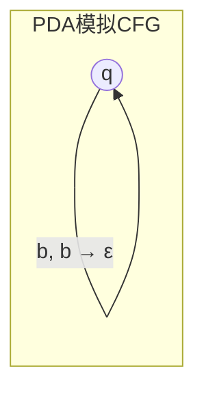
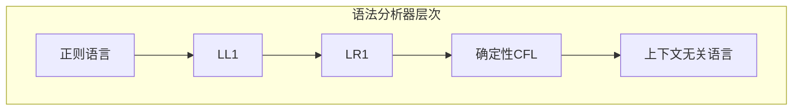

# 01.3 下推自动机

---

📌 **内容摘要**

本文档深入探讨下推自动机的核心原理和关键方法。内容涵盖形式语言基础领域的主要知识点，包括PDA, 下推自动机, 上下文无关等关键主题。适合初学者建立基础知识体系。

**关键词**: 形式语言基础, PDA, 下推自动机, 上下文无关

📚 **学习目标**
- 理解下推自动机的基本概念和核心原理
- 掌握相关术语和符号表示
- 建立该领域的系统性知识框架

🎯 **难度级别**: 初级

⏱️ **预计阅读时间**: 15分钟

**前置知识**: 基础数学知识, 离散数学

---


## 1. 下推自动机的定义

### 1.1 PDA的形式化定义

**定义 3.1.1** (下推自动机). 一个下推自动机 (PDA) 是一个七元组 $P = (Q, \Sigma, \Gamma, \delta, q_0, Z_0, F)$，其中：

- $Q$：状态的有限集合
- $\Sigma$：输入字母表
- $\Gamma$：栈字母表
- $\delta: Q \times (\Sigma \cup \{\varepsilon\}) \times \Gamma \rightarrow \mathcal{P}_{\text{fin}}(Q \times \Gamma^*)$：转移函数
- $q_0 \in Q$：初始状态
- $Z_0 \in \Gamma$：初始栈符号
- $F \subseteq Q$：接受状态集合

**定义 3.1.2** (格局). PDA的**格局**是一个三元组 $(q, w, \gamma) \in Q \times \Sigma^* \times \Gamma^*$，表示：

- $q$：当前状态
- $w$：剩余输入
- $\gamma$：栈内容（栈顶在左）

**定义 3.1.3** (格局转移). $(q, aw, X\alpha) \vdash (q', w, \beta\alpha)$ 当且仅当 $(q', \beta) \in \delta(q, a, X)$。

### 1.2 两种接受方式

**定义 3.1.4** (终态接受). PDA $P$ 以终态方式接受的语言：
$$L(P) = \{w \in \Sigma^* \mid (q_0, w, Z_0) \vdash^* (q, \varepsilon, \gamma), q \in F, \gamma \in \Gamma^*\}$$

**定义 3.1.5** (空栈接受). PDA $P$ 以空栈方式接受的语言：
$$N(P) = \{w \in \Sigma^* \mid (q_0, w, Z_0) \vdash^* (q, \varepsilon, \varepsilon), q \in Q\}$$

**定理 3.1.6** (接受方式等价). 语言 $L$ 被某个PDA以终态接受当且仅当 $L$ 被某个PDA以空栈接受。

## 2. PDA与上下文无关文法

### 2.1 CFG到PDA的转换

**定理 3.2.1** (CFG生成PDA). 对任意CFG $G$，存在PDA $P$ 使得 $L(G) = N(P)$。

**构造**. 对 $G = (V, \Sigma, R, S)$，构造 $P = (\{q\}, \Sigma, V \cup \Sigma, \delta, q, S, \emptyset)$：

- 对每个产生式 $A \rightarrow \alpha$，添加 $\delta(q, \varepsilon, A) \ni (q, \alpha)$
- 对每个 $a \in \Sigma$，添加 $\delta(q, a, a) = \{(q, \varepsilon)\}$



### 2.2 PDA到CFG的转换

**定理 3.2.2** (PDA生成CFG). 对任意PDA $P$，存在CFG $G$ 使得 $N(P) = L(G)$。

**构造**. 设 $P = (Q, \Sigma, \Gamma, \delta, q_0, Z_0, \emptyset)$，构造 $G$：

- 非终结符：$[qXp]$ 形式，表示从状态 $q$ 到 $p$ 弹出 $X$
- 产生式：
  - 若 $(r, Y_1Y_2\cdots Y_k) \in \delta(q, a, X)$，则对所有状态序列 $r_0=r, r_1, \ldots, r_k=p$：
    $$[qXp] \rightarrow a[r_0Y_1r_1][r_1Y_2r_2]\cdots[r_{k-1}Y_kr_k]$$

### 2.3 确定性PDA

**定义 3.2.3** (DPDA). PDA $P$ 是**确定性**的，如果：

1. $\delta(q, a, X)$ 对每个 $(q, a, X)$ 至多有一个元素
2. 若 $\delta(q, \varepsilon, X) \neq \emptyset$，则对所有 $a \in \Sigma$，$\delta(q, a, X) = \emptyset$

**定理 3.2.4** (DPDA与LR文法). 语言 $L$ 被DPDA以终态接受当且仅当 $L$ 有LR(1)文法。

**定理 3.2.5** (DPDA的限制). 确定性上下文无关语言类真包含于上下文无关语言类。

**例 3.2.6**. $L = \{ww^R \mid w \in \{a,b\}^*\}$ 是CFL但非DCFL。

## 3. 上下文无关语言的性质

### 3.1 闭包性质

**定理 3.3.1** (CFL闭包). 上下文无关语言类在以下运算下封闭：

- 并集、连接、Kleene星、同态、逆同态

**定理 3.3.2** (CFL不封闭). 上下文无关语言类在以下运算下不封闭：

- 交集、补集、差集

**证明**. $L_1 = \{a^n b^n c^m\}$ 和 $L_2 = \{a^m b^n c^n\}$ 都是CFL，但 $L_1 \cap L_2 = \{a^n b^n c^n\}$ 不是。

### 3.2 泵引理

**定理 3.3.3** (上下文无关泵引理). 若 $L$ 是CFL，则存在泵长度 $p$，使得对任意 $z \in L$ 且 $|z| \geq p$，存在分解 $z = uvwxy$ 满足：

1. $|vwx| \leq p$
2. $|vx| \geq 1$
3. 对所有 $i \geq 0$，$uv^iwx^iy \in L$

**证明**. 考虑Chomsky范式的派生树。高度为 $h$ 的树生成的字符串长度 $\leq 2^{h-1}$。取 $p = 2^{|V|}$，则高度 $> |V|$ 的派生树必有重复非终结符。

**例 3.3.4**. 证明 $L = \{a^n b^n c^n \mid n \geq 0\}$ 不是CFL：

取 $z = a^p b^p c^p$。任何满足 $|vwx| \leq p$ 的子串 $vwx$ 只能包含至多两种符号。 pumped后破坏平衡。

**定理 3.3.5** (Ogden引理). CFL的更强泵引理，允许指定"标记"位置。

### 3.3 判定问题

**定理 3.3.6** (CFL判定问题). 对CFL：

- 成员问题：可判定（CYK算法，$O(n^3)$）
- 空性：可判定
- 有限性：可判定
- **歧义性：不可判定**
- 等价性：不可判定
- 包含性：不可判定

## 4. 分析算法

### 4.1 CYK算法

**算法 3.4.1** (CYK). 对Chomsky范式文法 $G$ 和字符串 $w = a_1\cdots a_n$：

初始化表格 $T[i,j]$ 为可生成子串 $a_i\cdots a_j$ 的非终结符集合。

```
for i = 1 to n:
    T[i,i] = {A | A → a_i ∈ R}

for length = 2 to n:
    for i = 1 to n-length+1:
        j = i + length - 1
        for k = i to j-1:
            if A → BC ∈ R, B ∈ T[i,k], C ∈ T[k+1,j]:
                T[i,j] = T[i,j] ∪ {A}

return S ∈ T[1,n]
```

**定理 3.4.2** (CYK复杂度). CYK算法时间复杂度 $O(n^3 \cdot |G|)$。

### 4.2 LL与LR分析

**定义 3.4.3** (LL(k)). 文法 $G$ 是**LL(k)**的，如果任何派生可由从左到右扫描输入、最左派生、向前看 $k$ 个符号确定。

**定义 3.4.4** (LR(k)). 文法 $G$ 是**LR(k)**的，如果任何派生可由从左到右扫描输入、最右派导、向前看 $k$ 个符号确定。



## 5. 应用与扩展

### 5.1 语法分析器生成

**定理 3.5.1** (YACC理论). 任何LR(1)文法可被YACC/Bison类工具处理。

### 5.2 Visibly Pushdown Languages

**定义 3.5.2** (VPL). 对输入字母表 $\Sigma = \Sigma_c \cup \Sigma_r \cup \Sigma_i$（调用、返回、内部），可见下推自动机只根据输入符号类型进行栈操作。

**定理 3.5.3** (VPL封闭性). VPL类在交、并、补、连接下封闭。

## 6. 代码实现

### 6.1 Python PDA 模拟器

```python
"""
下推自动机 (PDA) 模拟器
支持: 终态接受和空栈接受两种模式
支持: 非确定性PDA (NFA-based backtracking)
"""

from typing import Set, Dict, List, Tuple, Optional, FrozenSet
from dataclasses import dataclass
from enum import Enum, auto
import itertools


class AcceptanceMode(Enum):
    """接受模式"""
    FINAL_STATE = auto()  # 终态接受
    EMPTY_STACK = auto()  # 空栈接受


@dataclass(frozen=True)
class PDATransition:
    """
    PDA转移规则
    (q, a, X) → (p, γ)
    - q: 当前状态
    - a: 输入符号 (None表示ε转移)
    - X: 栈顶符号
    - p: 下一状态
    - gamma: 替换栈顶的符号串 (空串表示弹出)
    """
    current_state: str
    input_symbol: Optional[str]  # None = ε
    stack_top: str
    next_state: str
    push_symbols: Tuple[str, ...]  # 空元组 = 弹出栈顶

    def __str__(self) -> str:
        input_str = self.input_symbol if self.input_symbol else 'ε'
        push_str = ''.join(self.push_symbols) if self.push_symbols else 'ε'
        return f"δ({self.current_state}, {input_str}, {self.stack_top}) = " \
               f"({self.next_state}, {push_str})"


@dataclass(frozen=True)
class PDAConfiguration:
    """
    PDA格局 (Configuration)
    (q, w, γ)
    - q: 当前状态
    - remaining_input: 剩余输入
    - stack: 栈内容 (栈顶在列表末尾，便于操作)
    """
    state: str
    remaining_input: str
    stack: Tuple[str, ...]

    def __str__(self) -> str:
        stack_str = ''.join(reversed(self.stack)) if self.stack else 'ε'
        return f"({self.state}, {self.remaining_input if self.remaining_input else 'ε'}, {stack_str})"


class PDA:
    """
    下推自动机 P = (Q, Σ, Γ, δ, q₀, Z₀, F)
    """

    def __init__(self,
                 states: Set[str],
                 input_alphabet: Set[str],
                 stack_alphabet: Set[str],
                 transitions: List[PDATransition],
                 start_state: str,
                 initial_stack: str,
                 accept_states: Set[str],
                 acceptance_mode: AcceptanceMode = AcceptanceMode.FINAL_STATE):
        self.Q = states
        self.Sigma = input_alphabet
        self.Gamma = stack_alphabet
        self.delta = transitions
        self.q0 = start_state
        self.Z0 = initial_stack
        self.F = accept_states
        self.mode = acceptance_mode

        # 构建转移表以加速查找
        self._transition_table: Dict[Tuple[str, Optional[str], str], List[PDATransition]] = {}
        for t in transitions:
            key = (t.current_state, t.input_symbol, t.stack_top)
            if key not in self._transition_table:
                self._transition_table[key] = []
            self._transition_table[key].append(t)

    def get_transitions(self, state: str, input_sym: Optional[str], stack_top: str) -> List[PDATransition]:
        """获取所有适用的转移规则"""
        results = []

        # 精确匹配
        key = (state, input_sym, stack_top)
        if key in self._transition_table:
            results.extend(self._transition_table[key])

        # ε转移 (当input_sym不为None时)
        if input_sym is not None:
            key_eps = (state, None, stack_top)
            if key_eps in self._transition_table:
                results.extend(self._transition_table[key_eps])

        return results

    def step(self, config: PDAConfiguration) -> List[PDAConfiguration]:
        """
        执行一步转移，返回所有可能的下一格局
        """
        results = []

        # 栈顶符号
        if not config.stack:
            stack_top = None
        else:
            stack_top = config.stack[-1]

        # 当前输入符号
        current_input = config.remaining_input[0] if config.remaining_input else None

        # 获取所有适用转移
        if stack_top:
            # 消耗输入的转移
            if current_input:
                for t in self.get_transitions(config.state, current_input, stack_top):
                    new_stack = list(config.stack)
                    new_stack.pop()  # 弹出栈顶
                    # 压入新符号 (压入顺序: 先压入的放前面，后压入的在栈顶)
                    new_stack.extend(reversed(t.push_symbols))

                    new_config = PDAConfiguration(
                        state=t.next_state,
                        remaining_input=config.remaining_input[1:],
                        stack=tuple(new_stack)
                    )
                    results.append(new_config)

            # ε转移
            for t in self.get_transitions(config.state, None, stack_top):
                new_stack = list(config.stack)
                new_stack.pop()
                new_stack.extend(reversed(t.push_symbols))

                new_config = PDAConfiguration(
                    state=t.next_state,
                    remaining_input=config.remaining_input,  # 输入不变
                    stack=tuple(new_stack)
                )
                results.append(new_config)

        return results

    def accepts(self, input_string: str, max_depth: int = 1000) -> Tuple[bool, List[PDAConfiguration]]:
        """
        使用BFS判断输入是否被接受
        返回: (是否接受, 接受路径)
        """
        initial_config = PDAConfiguration(
            state=self.q0,
            remaining_input=input_string,
            stack=(self.Z0,)
        )

        # BFS
        queue = [(initial_config, [initial_config])]
        visited = set()
        visited.add((initial_config.state, initial_config.remaining_input, initial_config.stack))

        steps = 0
        while queue and steps < max_depth:
            steps += 1
            config, path = queue.pop(0)

            # 检查接受条件
            if self._is_accepting(config):
                return True, path

            # 生成下一格局
            for next_config in self.step(config):
                key = (next_config.state, next_config.remaining_input, next_config.stack)
                if key not in visited:
                    visited.add(key)
                    new_path = path + [next_config]
                    queue.append((next_config, new_path))

        return False, []

    def _is_accepting(self, config: PDAConfiguration) -> bool:
        """检查格局是否满足接受条件"""
        if self.mode == AcceptanceMode.FINAL_STATE:
            # 终态接受: 到达接受状态，输入已读完
            return config.state in self.F and not config.remaining_input
        else:
            # 空栈接受: 栈为空，输入已读完
            return not config.stack and not config.remaining_input

    def __str__(self) -> str:
        lines = ["下推自动机 PDA:"]
        lines.append(f"  状态集 Q = {{{', '.join(sorted(self.Q))}}}")
        lines.append(f"  输入字母表 Σ = {{{', '.join(sorted(self.Sigma))}}}")
        lines.append(f"  栈字母表 Γ = {{{', '.join(sorted(self.Gamma))}}}")
        lines.append(f"  初始状态 q₀ = {self.q0}")
        lines.append(f"  初始栈符号 Z₀ = {self.Z0}")
        if self.mode == AcceptanceMode.FINAL_STATE:
            lines.append(f"  接受状态 F = {{{', '.join(sorted(self.F))}}}")
        lines.append(f"  接受模式: {self.mode.name}")
        lines.append("  转移函数 δ:")
        for t in self.delta:
            lines.append(f"    {t}")
        return '\n'.join(lines)


# ==================== 常用PDA构造 ====================

def pda_an_bn() -> PDA:
    """
    构造识别 L = {a^n b^n | n ≥ 0} 的PDA
    使用空栈接受
    """
    transitions = [
        # 读a，压入A到栈
        PDATransition('q0', 'a', 'Z0', 'q0', ('A', 'Z0')),
        PDATransition('q0', 'a', 'A', 'q0', ('A', 'A')),
        # 读b，弹出A
        PDATransition('q0', 'b', 'A', 'q1', ()),  # 弹出A
        PDATransition('q1', 'b', 'A', 'q1', ()),
        # ε转移: 栈顶Z0弹出（接受空串）
        PDATransition('q0', None, 'Z0', 'qf', ()),
        PDATransition('q1', None, 'Z0', 'qf', ()),
    ]

    return PDA(
        states={'q0', 'q1', 'qf'},
        input_alphabet={'a', 'b'},
        stack_alphabet={'Z0', 'A'},
        transitions=transitions,
        start_state='q0',
        initial_stack='Z0',
        accept_states={'qf'},
        acceptance_mode=AcceptanceMode.EMPTY_STACK
    )


def pda_balanced_parentheses() -> PDA:
    """
    构造识别平衡括号的PDA
    括号类型: (), [], {}
    """
    transitions = [
        # 压入开括号
        PDATransition('q', '(', 'Z0', 'q', ('(', 'Z0')),
        PDATransition('q', '[', 'Z0', 'q', ('[', 'Z0')),
        PDATransition('q', '{', 'Z0', 'q', ('{', 'Z0')),
        PDATransition('q', '(', '(', 'q', ('(', '(')),
        PDATransition('q', '(', '[', 'q', ('(', '[')),
        PDATransition('q', '(', '{', 'q', ('(', '{')),
        PDATransition('q', '[', '(', 'q', ('[', '(')),
        PDATransition('q', '[', '[', 'q', ('[', '[')),
        PDATransition('q', '[', '{', 'q', ('[', '{')),
        PDATransition('q', '{', '(', 'q', ('{', '(')),
        PDATransition('q', '{', '[', 'q', ('{', '[')),
        PDATransition('q', '{', '{', 'q', ('{', '{')),
        # 弹出匹配的闭括号
        PDATransition('q', ')', '(', 'q', ()),
        PDATransition('q', ']', '[', 'q', ()),
        PDATransition('q', '}', '{', 'q', ()),
        # 空栈接受
        PDATransition('q', None, 'Z0', 'qf', ()),
    ]

    return PDA(
        states={'q', 'qf'},
        input_alphabet={'(', ')', '[', ']', '{', '}'},
        stack_alphabet={'Z0', '(', '[', '{'},
        transitions=transitions,
        start_state='q',
        initial_stack='Z0',
        accept_states={'qf'},
        acceptance_mode=AcceptanceMode.EMPTY_STACK
    )


# ==================== 演示 ====================

if __name__ == "__main__":
    print("=" * 70)
    print("下推自动机 (PDA) 模拟器")
    print("=" * 70)

    # 示例1: a^n b^n
    print("\n【示例1】识别 L = {a^n b^n | n ≥ 0}")
    pda1 = pda_an_bn()
    print(pda1)

    test_strings = ["", "ab", "aabb", "aaabbb", "aab", "ba", "aba"]
    print("\n测试字符串:")
    for s in test_strings:
        accepted, path = pda1.accepts(s)
        status = "✓ 接受" if accepted else "✗ 拒绝"
        print(f"  '{s}' → {status}")
        if accepted and path:
            print(f"    路径: {' ⊢ '.join(str(c) for c in path[:5])}", end="")
            if len(path) > 5:
                print(" ...")
            else:
                print()

    # 示例2: 平衡括号
    print("\n" + "=" * 70)
    print("【示例2】识别平衡括号")
    pda2 = pda_balanced_parentheses()
    print(pda2)

    test_strings2 = ["", "()", "([])", "{[()]}", "(()", ")(", "([)]"]
    print("\n测试字符串:")
    for s in test_strings2:
        accepted, _ = pda2.accepts(s)
        status = "✓ 接受" if accepted else "✗ 拒绝"
        print(f"  '{s}' → {status}")
```

### 6.2 CFG 到 PDA 的转换

```python
"""
上下文无关文法 (CFG) 到下推自动机 (PDA) 的转换
构造方法: 使用单个状态，通过栈模拟最左派生
"""

from typing import Set, Dict, List, Tuple
from dataclasses import dataclass


@dataclass
class CFG:
    """上下文无关文法"""
    variables: Set[str]  # 非终结符
    terminals: Set[str]  # 终结符
    productions: Dict[str, List[str]]  # A -> α
    start: str

    def __str__(self):
        lines = [f"CFG: 开始符号 = {self.start}"]
        for var in sorted(self.variables):
            prods = self.productions.get(var, [])
            rhs = ' | '.join(p if p else 'ε' for p in prods)
            lines.append(f"  {var} → {rhs}")
        return '\n'.join(lines)


class CFGtoPDAConverter:
    """CFG 到 PDA 的转换器"""

    @staticmethod
    def convert(cfg: CFG) -> 'PDA':
        """
        将CFG转换为PDA (空栈接受)
        构造 P = ({q}, Σ, V ∪ Σ, δ, q, S, ∅)

        转移函数:
        1. 对每个产生式 A → α: δ(q, ε, A) 包含 (q, α)
        2. 对每个终结符 a ∈ Σ: δ(q, a, a) = {(q, ε)}
        """
        from pda_simulator import PDA, PDATransition, AcceptanceMode

        transitions = []
        stack_alphabet = cfg.variables | cfg.terminals | {cfg.start}

        # 产生式转移: 将非终结符替换为产生式右侧
        for var in cfg.variables:
            for prod in cfg.productions.get(var, []):
                # ε产生式
                if not prod:
                    transitions.append(PDATransition(
                        'q', None, var, 'q', tuple()
                    ))
                else:
                    # 将产生式右侧作为符号串压入栈
                    # 注意: 由于栈是LIFO，需要逆序压入
                    symbols = tuple(reversed(prod))
                    transitions.append(PDATransition(
                        'q', None, var, 'q', symbols
                    ))

        # 终结符匹配转移
        for term in cfg.terminals:
            transitions.append(PDATransition(
                'q', term, term, 'q', tuple()
            ))

        return PDA(
            states={'q'},
            input_alphabet=cfg.terminals,
            stack_alphabet=stack_alphabet,
            transitions=transitions,
            start_state='q',
            initial_stack=cfg.start,
            accept_states=set(),  # 空栈接受
            acceptance_mode=AcceptanceMode.EMPTY_STACK
        )


def example_cfg_anbn():
    """L = {a^n b^n | n ≥ 0} 的CFG"""
    return CFG(
        variables={'S'},
        terminals={'a', 'b'},
        productions={
            'S': ['aSb', '']  # '' 表示 ε
        },
        start='S'
    )


def example_cfg_palindrome():
    """回文语言的CFG: L = {ww^R | w ∈ {a,b}*}"""
    return CFG(
        variables={'S'},
        terminals={'a', 'b'},
        productions={
            'S': ['aSa', 'bSb', 'a', 'b', '']
        },
        start='S'
    )


def example_cfg_arith_expr():
    """简单算术表达式的CFG"""
    return CFG(
        variables={'E', 'T', 'F'},
        terminals={'+', '*', '(', ')', 'id'},
        productions={
            'E': ['E+T', 'T'],
            'T': ['T*F', 'F'],
            'F': ['(E)', 'id']
        },
        start='E'
    )


# ==================== 演示 ====================

if __name__ == "__main__":
    print("=" * 70)
    print("CFG 到 PDA 的转换")
    print("=" * 70)

    # 示例1: a^n b^n
    print("\n【示例1】L = {a^n b^n | n ≥ 0}")
    cfg1 = example_cfg_anbn()
    print(cfg1)

    print("\n转换为PDA...")
    pda1 = CFGtoPDAConverter.convert(cfg1)

    # 测试转换后的PDA
    test_strings = ["", "ab", "aabb", "aaabbb", "aab"]
    print("\n测试PDA:")
    for s in test_strings:
        from pda_simulator import PDAConfiguration
        accepted, path = pda1.accepts(s)
        status = "✓" if accepted else "✗"
        print(f"  '{s}' → {status}")

    # 示例2: 算术表达式
    print("\n" + "=" * 70)
    print("【示例2】简单算术表达式")
    cfg2 = example_cfg_arith_expr()
    print(cfg2)

    print("\n转换为PDA...")
    pda2 = CFGtoPDAConverter.convert(cfg2)

    # 使用简化输入测试 (将 'id' 作为单个符号)
    test_exprs = ["id", "id+id", "id*id", "(id)", "id+id*id"]
    print("\n测试PDA (id作为单个符号):")
    for expr in test_exprs:
        accepted, _ = pda2.accepts(expr)
        status = "✓" if accepted else "✗"
        print(f"  '{expr}' → {status}")
```

### 6.3 CYK 算法实现

```python
"""
CYK 算法 (Cocke-Younger-Kasami)
用于判断字符串是否被上下文无关文法生成
时间复杂度: O(n³ × |G|)
要求: 文法必须是 Chomsky 范式 (CNF)
"""

from typing import Set, Dict, List, Tuple
from dataclasses import dataclass


@dataclass
class CNF:
    """Chomsky范式文法"""
    variables: Set[str]
    terminals: Set[str]
    # 产生式分为两类:
    # 1. A → BC (二元产生式)
    # 2. A → a (终结符产生式)
    binary_prods: Dict[str, List[Tuple[str, str]]]  # A -> [(B,C), ...]
    terminal_prods: Dict[str, Set[str]]  # A -> {a, b, ...}
    start: str

    def __str__(self):
        lines = [f"CNF文法: 开始符号 = {self.start}"]
        for var in sorted(self.variables):
            prods = []
            if var in self.terminal_prods:
                for t in self.terminal_prods[var]:
                    prods.append(f"'{t}'")
            if var in self.binary_prods:
                for b, c in self.binary_prods[var]:
                    prods.append(f"{b}{c}")
            if prods:
                lines.append(f"  {var} → {' | '.join(prods)}")
        return '\n'.join(lines)


class CYKParser:
    """CYK算法解析器"""

    def __init__(self, grammar: CNF):
        self.grammar = grammar
        # 构建反向查找表: (B,C) -> {A | A → BC ∈ R}
        self.binary_reverse: Dict[Tuple[str, str], Set[str]] = {}
        for var, prods in grammar.binary_prods.items():
            for b, c in prods:
                key = (b, c)
                if key not in self.binary_reverse:
                    self.binary_reverse[key] = set()
                self.binary_reverse[key].add(var)

    def parse(self, input_string: str) -> Tuple[bool, List[List[Set[str]]]]:
        """
        CYK算法主函数
        返回: (是否属于语言, 解析表)
        """
        n = len(input_string)
        if n == 0:
            # 检查开始符号能否推导出ε
            return (self.grammar.start in self._nullable(), [])

        # 初始化解析表
        # table[i][j] 表示生成子串 input[i:j+1] 的非终结符集合
        table: List[List[Set[str]]] = [[set() for _ in range(n)] for _ in range(n)]

        # 步骤1: 填充对角线 (长度为1的子串)
        for i, char in enumerate(input_string):
            # 找到所有能生成该终结符的非终结符
            for var in self.grammar.variables:
                if var in self.grammar.terminal_prods:
                    if char in self.grammar.terminal_prods[var]:
                        table[i][i].add(var)

        # 步骤2: 填充长度为l的子串 (l从2到n)
        for length in range(2, n + 1):
            for i in range(n - length + 1):
                j = i + length - 1

                # 尝试所有可能的分割点k
                for k in range(i, j):
                    # 左侧 table[i][k], 右侧 table[k+1][j]
                    left_vars = table[i][k]
                    right_vars = table[k + 1][j]

                    # 查找所有能生成 BC 的 A
                    for b in left_vars:
                        for c in right_vars:
                            if (b, c) in self.binary_reverse:
                                table[i][j].update(self.binary_reverse[(b, c)])

        # 检查开始符号是否在table[0][n-1]中
        accepted = self.grammar.start in table[0][n - 1]
        return accepted, table

    def _nullable(self) -> Set[str]:
        """计算所有可推导出ε的非终结符"""
        # 对于CNF，只有特殊情况才可能有ε产生式
        nullable = set()
        # 这里简化处理，实际需要更复杂的计算
        return nullable

    def print_table(self, table: List[List[Set[str]]], input_string: str):
        """打印解析表"""
        n = len(input_string)
        print(f"\nCYK解析表 (输入: '{input_string}'):")
        print("  " + " ".join(f"{c:8}" for c in input_string))

        for i in range(n):
            row = []
            for j in range(n):
                if table[i][j]:
                    row.append("{" + ",".join(sorted(table[i][j])) + "}")
                else:
                    row.append("∅")
            print(f"{i} " + " ".join(f"{cell:8}" for cell in row))


def example_cnf_anbn():
    """
    L = {a^n b^n | n ≥ 1} 的CNF
    原始: S → aSb | ab
    CNF:
        S → AX | AB
        X → SB
        A → a
        B → b
    """
    return CNF(
        variables={'S', 'X', 'A', 'B'},
        terminals={'a', 'b'},
        binary_prods={
            'S': [('A', 'X'), ('A', 'B')],
            'X': [('S', 'B')],
        },
        terminal_prods={
            'A': {'a'},
            'B': {'b'},
        },
        start='S'
    )


def example_cnf_simple():
    """简单示例: S → AB | a, A → a, B → b"""
    return CNF(
        variables={'S', 'A', 'B'},
        terminals={'a', 'b'},
        binary_prods={
            'S': [('A', 'B')],
        },
        terminal_prods={
            'S': {'a'},
            'A': {'a'},
            'B': {'b'},
        },
        start='S'
    )


# ==================== 演示 ====================

if __name__ == "__main__":
    print("=" * 70)
    print("CYK 算法 - 上下文无关文法成员测试")
    print("=" * 70)

    # 示例1
    print("\n【示例1】简单文法")
    cnf1 = example_cnf_simple()
    print(cnf1)

    parser1 = CYKParser(cnf1)
    test_strings = ["a", "ab", "b", "aa"]
    print("\n解析测试:")
    for s in test_strings:
        accepted, table = parser1.parse(s)
        status = "✓ 接受" if accepted else "✗ 拒绝"
        print(f"  '{s}' → {status}")
        if len(s) <= 3 and table:
            parser1.print_table(table, s)

    # 示例2: a^n b^n
    print("\n" + "=" * 70)
    print("【示例2】L = {a^n b^n | n ≥ 1}")
    cnf2 = example_cnf_anbn()
    print(cnf2)

    parser2 = CYKParser(cnf2)
    test_strings2 = ["ab", "aabb", "aaabbb", "aab", "abab"]
    print("\n解析测试:")
    for s in test_strings2:
        accepted, table = parser2.parse(s)
        status = "✓ 接受" if accepted else "✗ 拒绝"
        print(f"  '{s}' → {status}")
```

## 参考

- [01.1 文法与语言](./01.1_文法与语言.md) - 文法基础理论
- [01.2 有限自动机](./01.2_有限自动机.md) - 受限自动机模型
- [01.4 图灵机与计算](./01.4_图灵机与计算.md) - 通用计算模型
- [02.1 简单类型系统](../02_类型论/02.1_简单类型系统.md) - 类型理论基础

---

## 📚 延伸阅读

- [02.4 类型论与逻辑](../02_类型论/02.4_类型论与逻辑.md)
- [2.4 类型论进阶 (Advanced Type Theory)](../02_类型论/02.4_类型论进阶.md)
- [02.1 简单类型系统](../02_类型论/02.1_简单类型系统.md)
- [2.1 简单类型论 (Simply Typed Lambda Calculus)](../02_类型论/02.1_简单类型论.md)
- [01.4 图灵机与计算](../01_形式语言基础/01.4_图灵机与计算.md)
