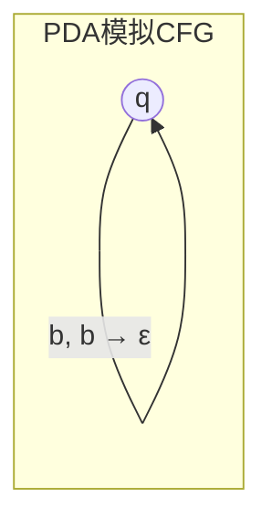
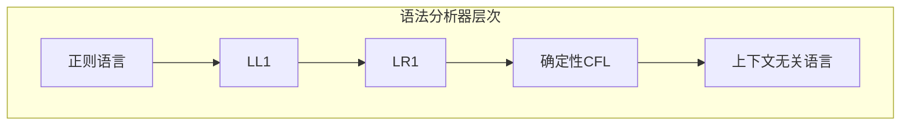

# 01.3 下推自动机

## 1. 下推自动机的定义

### 1.1 PDA的形式化定义

**定义 3.1.1** (下推自动机). 一个下推自动机 (PDA) 是一个七元组 $P = (Q, \Sigma, \Gamma, \delta, q_0, Z_0, F)$，其中：

- $Q$：状态的有限集合
- $\Sigma$：输入字母表
- $\Gamma$：栈字母表
- $\delta: Q \times (\Sigma \cup \{\varepsilon\}) \times \Gamma \rightarrow \mathcal{P}_{\text{fin}}(Q \times \Gamma^*)$：转移函数
- $q_0 \in Q$：初始状态
- $Z_0 \in \Gamma$：初始栈符号
- $F \subseteq Q$：接受状态集合

**定义 3.1.2** (格局). PDA的**格局**是一个三元组 $(q, w, \gamma) \in Q \times \Sigma^* \times \Gamma^*$，表示：

- $q$：当前状态
- $w$：剩余输入
- $\gamma$：栈内容（栈顶在左）

**定义 3.1.3** (格局转移). $(q, aw, X\alpha) \vdash (q', w, \beta\alpha)$ 当且仅当 $(q', \beta) \in \delta(q, a, X)$。

### 1.2 两种接受方式

**定义 3.1.4** (终态接受). PDA $P$ 以终态方式接受的语言：
$$L(P) = \{w \in \Sigma^* \mid (q_0, w, Z_0) \vdash^* (q, \varepsilon, \gamma), q \in F, \gamma \in \Gamma^*\}$$

**定义 3.1.5** (空栈接受). PDA $P$ 以空栈方式接受的语言：
$$N(P) = \{w \in \Sigma^* \mid (q_0, w, Z_0) \vdash^* (q, \varepsilon, \varepsilon), q \in Q\}$$

**定理 3.1.6** (接受方式等价). 语言 $L$ 被某个PDA以终态接受当且仅当 $L$ 被某个PDA以空栈接受。

## 2. PDA与上下文无关文法

### 2.1 CFG到PDA的转换

**定理 3.2.1** (CFG生成PDA). 对任意CFG $G$，存在PDA $P$ 使得 $L(G) = N(P)$。

**构造**. 对 $G = (V, \Sigma, R, S)$，构造 $P = (\{q\}, \Sigma, V \cup \Sigma, \delta, q, S, \emptyset)$：

- 对每个产生式 $A \rightarrow \alpha$，添加 $\delta(q, \varepsilon, A) \ni (q, \alpha)$
- 对每个 $a \in \Sigma$，添加 $\delta(q, a, a) = \{(q, \varepsilon)\}$



### 2.2 PDA到CFG的转换

**定理 3.2.2** (PDA生成CFG). 对任意PDA $P$，存在CFG $G$ 使得 $N(P) = L(G)$。

**构造**. 设 $P = (Q, \Sigma, \Gamma, \delta, q_0, Z_0, \emptyset)$，构造 $G$：

- 非终结符：$[qXp]$ 形式，表示从状态 $q$ 到 $p$ 弹出 $X$
- 产生式：
  - 若 $(r, Y_1Y_2\cdots Y_k) \in \delta(q, a, X)$，则对所有状态序列 $r_0=r, r_1, \ldots, r_k=p$：
    $$[qXp] \rightarrow a[r_0Y_1r_1][r_1Y_2r_2]\cdots[r_{k-1}Y_kr_k]$$

### 2.3 确定性PDA

**定义 3.2.3** (DPDA). PDA $P$ 是**确定性**的，如果：

1. $\delta(q, a, X)$ 对每个 $(q, a, X)$ 至多有一个元素
2. 若 $\delta(q, \varepsilon, X) \neq \emptyset$，则对所有 $a \in \Sigma$，$\delta(q, a, X) = \emptyset$

**定理 3.2.4** (DPDA与LR文法). 语言 $L$ 被DPDA以终态接受当且仅当 $L$ 有LR(1)文法。

**定理 3.2.5** (DPDA的限制). 确定性上下文无关语言类真包含于上下文无关语言类。

**例 3.2.6**. $L = \{ww^R \mid w \in \{a,b\}^*\}$ 是CFL但非DCFL。

## 3. 上下文无关语言的性质

### 3.1 闭包性质

**定理 3.3.1** (CFL闭包). 上下文无关语言类在以下运算下封闭：

- 并集、连接、Kleene星、同态、逆同态

**定理 3.3.2** (CFL不封闭). 上下文无关语言类在以下运算下不封闭：

- 交集、补集、差集

**证明**. $L_1 = \{a^n b^n c^m\}$ 和 $L_2 = \{a^m b^n c^n\}$ 都是CFL，但 $L_1 \cap L_2 = \{a^n b^n c^n\}$ 不是。

### 3.2 泵引理

**定理 3.3.3** (上下文无关泵引理). 若 $L$ 是CFL，则存在泵长度 $p$，使得对任意 $z \in L$ 且 $|z| \geq p$，存在分解 $z = uvwxy$ 满足：

1. $|vwx| \leq p$
2. $|vx| \geq 1$
3. 对所有 $i \geq 0$，$uv^iwx^iy \in L$

**证明**. 考虑Chomsky范式的派生树。高度为 $h$ 的树生成的字符串长度 $\leq 2^{h-1}$。取 $p = 2^{|V|}$，则高度 $> |V|$ 的派生树必有重复非终结符。

**例 3.3.4**. 证明 $L = \{a^n b^n c^n \mid n \geq 0\}$ 不是CFL：

取 $z = a^p b^p c^p$。任何满足 $|vwx| \leq p$ 的子串 $vwx$ 只能包含至多两种符号。 pumped后破坏平衡。

**定理 3.3.5** (Ogden引理). CFL的更强泵引理，允许指定"标记"位置。

### 3.3 判定问题

**定理 3.3.6** (CFL判定问题). 对CFL：

- 成员问题：可判定（CYK算法，$O(n^3)$）
- 空性：可判定
- 有限性：可判定
- **歧义性：不可判定**
- 等价性：不可判定
- 包含性：不可判定

## 4. 分析算法

### 4.1 CYK算法

**算法 3.4.1** (CYK). 对Chomsky范式文法 $G$ 和字符串 $w = a_1\cdots a_n$：

初始化表格 $T[i,j]$ 为可生成子串 $a_i\cdots a_j$ 的非终结符集合。

```
for i = 1 to n:
    T[i,i] = {A | A → a_i ∈ R}

for length = 2 to n:
    for i = 1 to n-length+1:
        j = i + length - 1
        for k = i to j-1:
            if A → BC ∈ R, B ∈ T[i,k], C ∈ T[k+1,j]:
                T[i,j] = T[i,j] ∪ {A}

return S ∈ T[1,n]
```

**定理 3.4.2** (CYK复杂度). CYK算法时间复杂度 $O(n^3 \cdot |G|)$。

### 4.2 LL与LR分析

**定义 3.4.3** (LL(k)). 文法 $G$ 是**LL(k)**的，如果任何派生可由从左到右扫描输入、最左派生、向前看 $k$ 个符号确定。

**定义 3.4.4** (LR(k)). 文法 $G$ 是**LR(k)**的，如果任何派生可由从左到右扫描输入、最右派导、向前看 $k$ 个符号确定。



## 5. 应用与扩展

### 5.1 语法分析器生成

**定理 3.5.1** (YACC理论). 任何LR(1)文法可被YACC/Bison类工具处理。

### 5.2 Visibly Pushdown Languages

**定义 3.5.2** (VPL). 对输入字母表 $\Sigma = \Sigma_c \cup \Sigma_r \cup \Sigma_i$（调用、返回、内部），可见下推自动机只根据输入符号类型进行栈操作。

**定理 3.5.3** (VPL封闭性). VPL类在交、并、补、连接下封闭。

## 参考

- [01.1 文法与语言](./01.1_文法与语言.md) - 文法基础理论
- [01.2 有限自动机](./01.2_有限自动机.md) - 受限自动机模型
- [01.4 图灵机与计算](./01.4_图灵机与计算.md) - 通用计算模型
- [02.1 简单类型系统](../02_类型论/02.1_简单类型系统.md) - 类型理论基础
