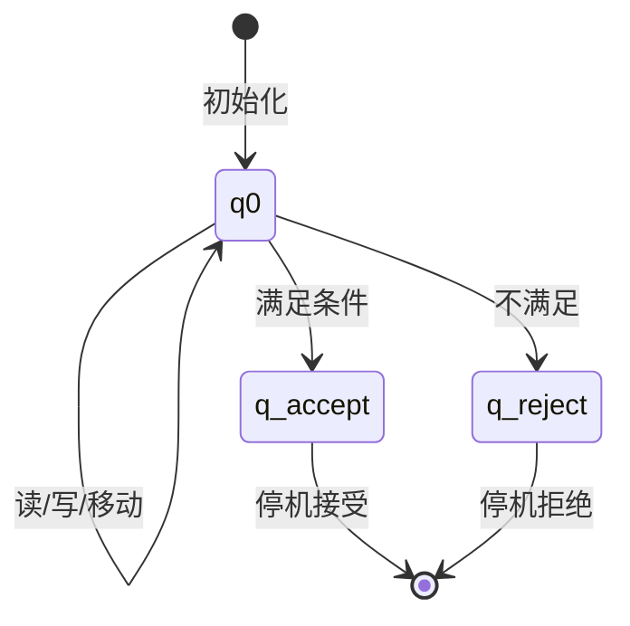
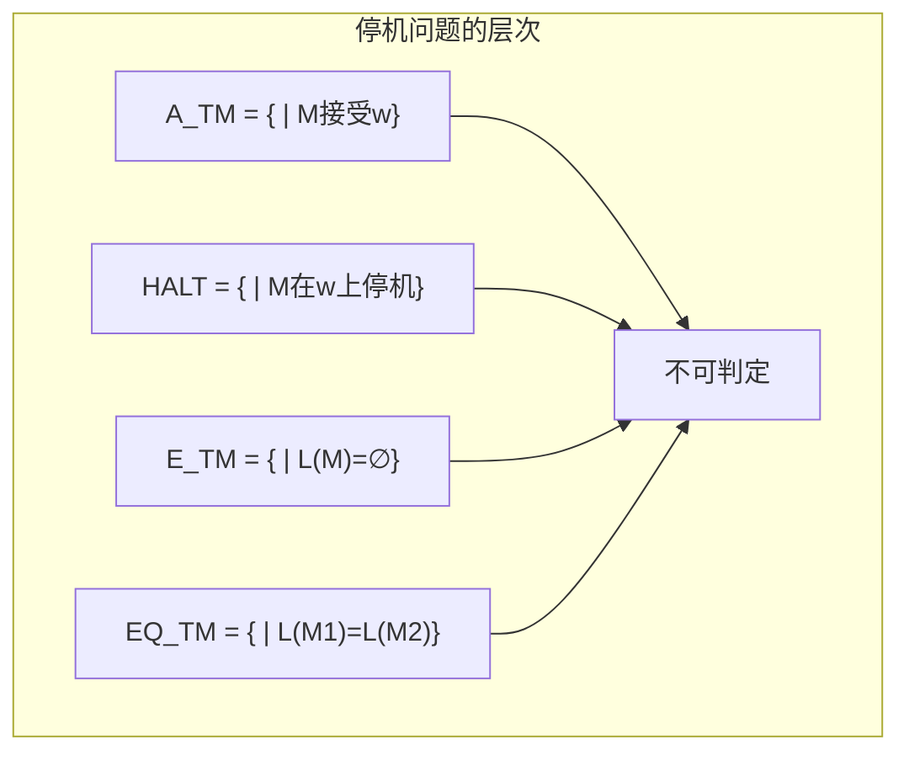
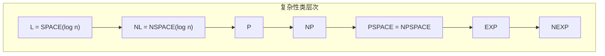

# 01.4 图灵机与计算

## 1. 图灵机的形式化定义

### 1.1 基本图灵机

**定义 4.1.1** (图灵机). 一个图灵机 (TM) 是一个七元组 $M = (Q, \Sigma, \Gamma, \delta, q_0, q_{\text{accept}}, q_{\text{reject}})$，其中：

- $Q$：状态的有限集合
- $\Sigma$：输入字母表，不含空白符 $\sqcup$
- $\Gamma$：带字母表，$\Sigma \subset \Gamma$ 且 $\sqcup \in \Gamma$
- $\delta: Q \times \Gamma \rightarrow Q \times \Gamma \times \{L, R\}$：转移函数（部分函数）
- $q_0 \in Q$：初始状态
- $q_{\text{accept}} \in Q$：接受状态
- $q_{\text{reject}} \in Q$：拒绝状态，$q_{\text{reject}} \neq q_{\text{accept}}$

**定义 4.1.2** (格局). TM的**格局**是一个三元组 $(q, u, v) \in Q \times \Gamma^* \times \Gamma^+$，表示：

- $q$：当前状态
- $u$：带头左侧内容（从左边第一个非空白符开始）
- $v$：带头位置及右侧内容

**定义 4.1.3** (格局转移). 格局 $C_1$ 转移到 $C_2$：

- 若 $\delta(q, a) = (q', b, R)$，则 $(q, u, av) \vdash (q', ub, v_1)$，其中 $v = v_1 v_2$ 且 $|v_1| = 1$
- 类似定义左移

**定义 4.1.4** (接受与拒绝). TM $M$：

- **接受**输入 $w$：若存在格局序列 $C_0 \vdash C_1 \vdash \cdots \vdash C_k$，其中 $C_0 = (q_0, \varepsilon, w)$ 且 $C_k = (q_{\text{accept}}, u, v)$
- **拒绝**输入 $w$：类似地到达 $q_{\text{reject}}$
- **循环**输入 $w$：既不接受也不拒绝

### 1.2 识别的语言类

**定义 4.1.5** (递归可枚举语言). 语言 $L$ 是**递归可枚举**的（r.e.），如果存在TM $M$ 使得 $L = L(M)$。

**定义 4.1.6** (递归语言/可判定语言). 语言 $L$ 是**递归**的（或可判定的），如果存在TM $M$ 使得 $L = L(M)$ 且 $M$ 在所有输入上停机。

**定理 4.1.7** (包含关系). 递归语言类 $\mathcal{R}$ 是递归可枚举语言类 $\mathcal{RE}$ 的真子集：
$$\mathcal{R} \subsetneq \mathcal{RE}$$

## 2. 图灵机变种

### 2.1 多带图灵机

**定义 4.2.1** (k-带TM). k-带图灵机有 $k$ 条带，每条带有独立的读写头。转移函数：
$$\delta: Q \times \Gamma^k \rightarrow Q \times \Gamma^k \times \{L, R, S\}^k$$

**定理 4.2.2** (多带等价性). 任何 $k$-带TM可被单带TM模拟，时间复杂度至多多项式增加。

### 2.2 非确定性图灵机

**定义 4.2.3** (NTM). 非确定性图灵机的转移函数：
$$\delta: Q \times \Gamma \rightarrow \mathcal{P}(Q \times \Gamma \times \{L, R\})$$

**定义 4.2.4** (NTM接受). NTM接受输入 $w$ 如果存在接受格局的计算路径。

**定理 4.2.5** (NTM与DTM等价). 任何NTM可被确定型TM模拟。

### 2.3 通用图灵机

**定理 4.3.1** (通用图灵机). 存在通用图灵机 $U$，它以 $\langle M \rangle w$ 为输入（$M$ 的编码和输入 $w$），模拟 $M$ 在 $w$ 上的计算。

**推论 4.3.2**. 递归可枚举语言类对交、并、连接、Kleene星、同态封闭。

## 3. 不可判定性

### 3.1 停机问题

**定理 4.3.3** (停机问题不可判定). 语言
$$A_{\text{TM}} = \{\langle M, w \rangle \mid M \text{ 是TM且 } M \text{ 接受 } w\}$$
是不可判定的。

**证明** (对角线法). 假设 $H$ 判定 $A_{\text{TM}}$。构造TM $D$：

- 输入 $\langle M \rangle$
- 运行 $H$ 在 $\langle M, \langle M \rangle \rangle$ 上
- 若 $H$ 接受则拒绝，若 $H$ 拒绝则接受

则 $D$ 接受 $\langle D \rangle$ 当且仅当 $D$ 拒绝 $\langle D \rangle$，矛盾。

### 3.2 Rice定理

**定理 4.3.4** (Rice定理). 对任何非平凡的语言性质 $P$（即存在TM满足 $P$，也存在TM不满足 $P$），判定 $L(M)$ 是否满足 $P$ 是不可判定的。

**例 4.3.5**. 以下问题均不可判定：

- $L(M)$ 是否有限？
- $L(M)$ 是否正则？
- $L(M) = \Sigma^*$？
- $|L(M)| \geq 1$？

### 3.3 归约与完备性

**定义 4.3.6** (多一归约). $A \leq_m B$ 如果存在可计算函数 $f$ 使得 $w \in A \Leftrightarrow f(w) \in B$。

**定理 4.3.7** (归约保持不可判定性). 若 $A \leq_m B$ 且 $A$ 不可判定，则 $B$ 不可判定。

**定义 4.3.8** (r.e.-完备). 语言 $B$ 是 **r.e.-完备**的，如果 $B \in \mathcal{RE}$ 且对所有 $A \in \mathcal{RE}$，$A \leq_m B$。

**定理 4.3.9**. $A_{\text{TM}}$ 是 r.e.-完备的。

## 4. 计算复杂性

### 4.1 时间复杂性

**定义 4.4.1** (时间复杂度). TM $M$ 在输入 $w$ 上的**时间复杂度** $t_M(w)$ 是 $M$ 在 $w$ 上停机的步数（若停机，否则无定义）。

**定义 4.4.2** (时间复杂类). 对函数 $f: \mathbb{N} \rightarrow \mathbb{N}$：
$$\text{TIME}(f(n)) = \{L \mid \text{存在TM } M \text{ 判定 } L \text{ 且 } t_M(n) = O(f(n))\}$$

**定义 4.4.3**.

- $\text{P} = \bigcup_{k \geq 0} \text{TIME}(n^k)$
- $\text{EXP} = \bigcup_{k \geq 0} \text{TIME}(2^{n^k})$

**定理 4.4.4** (层次定理). 若 $f(n) = o(g(n))$，则 $\text{TIME}(f(n)) \subsetneq \text{TIME}(g(n))$。

**推论 4.4.5**. $\text{P} \subsetneq \text{EXP}$

### 4.2 空间复杂性

**定义 4.4.6** (空间复杂度). TM $M$ 在输入 $w$ 上的**空间复杂度** $s_M(w)$ 是 $M$ 在 $w$ 上停机前使用过的带单元数。

**定义 4.4.7**.

- $\text{SPACE}(f(n))$：空间复杂度 $O(f(n))$ 可判定的语言类
- $\text{L} = \text{SPACE}(\log n)$
- $\text{PSPACE} = \bigcup_{k \geq 0} \text{SPACE}(n^k)$

**定理 4.4.8** (Savitch). $\text{NSPACE}(s(n)) \subseteq \text{SPACE}(s(n)^2)$ 对 $s(n) \geq \log n$。

### 4.3 复杂性类关系

**定理 4.4.9**.
$$\text{L} \subseteq \text{NL} \subseteq \text{P} \subseteq \text{NP} \subseteq \text{PSPACE} \subseteq \text{EXP}$$

### 4.4 P vs NP

**定义 4.4.10** (NP). $L \in \text{NP}$ 如果存在多项式 $p$ 和多项式时间验证器 $V$ 使得：
$$w \in L \iff \exists c, |c| \leq p(|w)|: V(w, c) = 1$$

**定义 4.4.11** (NP-完备). 语言 $L$ 是 **NP-完备**的，如果：

1. $L \in \text{NP}$
2. 对所有 $A \in \text{NP}$，$A \leq_p L$（多项式时间归约）

**定理 4.4.12** (Cook-Levin). SAT 是 NP-完备的。

**开放问题 4.4.13** (P vs NP). 是否 $\text{P} = \text{NP}$？

## 5. 高级主题

### 5.1 交替图灵机

**定义 4.5.1** (ATM). 交替图灵机有存在状态 ($\exists$) 和全称状态 ($\forall$)。

**定理 4.5.2**.

- $\text{AP} = \text{PSPACE}$
- $\text{AL} = \text{P}$

### 5.2 概率图灵机

**定义 4.5.3** (BPP). $L \in \text{BPP}$ 如果存在概率多项式时间TM $M$ 使得：
$$w \in L \Rightarrow \Pr[M(w) = 1] \geq \frac{2}{3}$$
$$w \notin L \Rightarrow \Pr[M(w) = 1] \leq \frac{1}{3}$$

**定理 4.5.4**. $\text{P} \subseteq \text{BPP} \subseteq \text{PSPACE}$

## 参考

- [01.1 文法与语言](./01.1_文法与语言.md) - 文法层次理论
- [01.2 有限自动机](./01.2_有限自动机.md) - 受限计算模型
- [01.3 下推自动机](./01.3_下推自动机.md) - 上下文无关计算
- [02.1 简单类型系统](../02_类型论/02.1_简单类型系统.md) - 类型化计算
