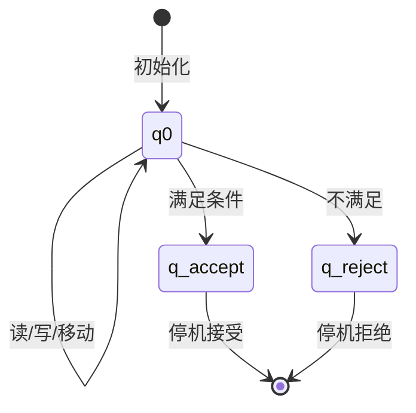
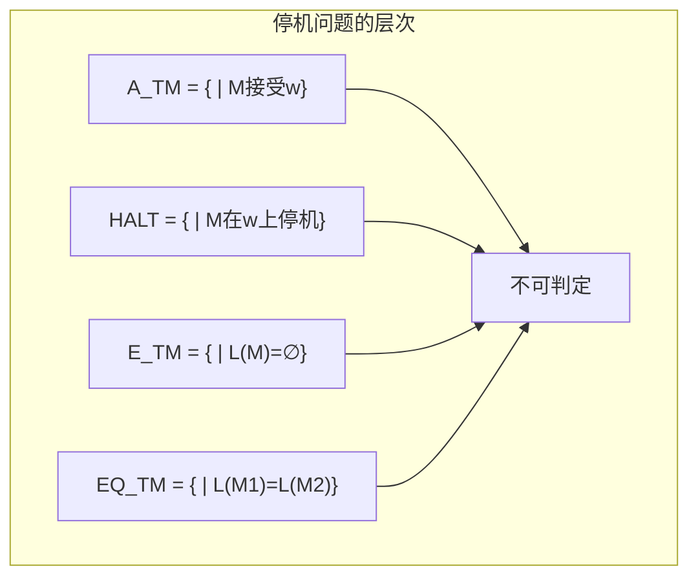
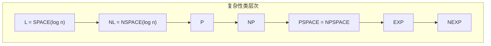

# 01.4 图灵机与计算

## 1. 图灵机的形式化定义

### 1.1 基本图灵机

**定义 4.1.1** (图灵机). 一个图灵机 (TM) 是一个七元组 $M = (Q, \Sigma, \Gamma, \delta, q_0, q_{\text{accept}}, q_{\text{reject}})$，其中：

- $Q$：状态的有限集合
- $\Sigma$：输入字母表，不含空白符 $\sqcup$
- $\Gamma$：带字母表，$\Sigma \subset \Gamma$ 且 $\sqcup \in \Gamma$
- $\delta: Q \times \Gamma \rightarrow Q \times \Gamma \times \{L, R\}$：转移函数（部分函数）
- $q_0 \in Q$：初始状态
- $q_{\text{accept}} \in Q$：接受状态
- $q_{\text{reject}} \in Q$：拒绝状态，$q_{\text{reject}} \neq q_{\text{accept}}$

**定义 4.1.2** (格局). TM的**格局**是一个三元组 $(q, u, v) \in Q \times \Gamma^* \times \Gamma^+$，表示：

- $q$：当前状态
- $u$：带头左侧内容（从左边第一个非空白符开始）
- $v$：带头位置及右侧内容

**定义 4.1.3** (格局转移). 格局 $C_1$ 转移到 $C_2$：

- 若 $\delta(q, a) = (q', b, R)$，则 $(q, u, av) \vdash (q', ub, v_1)$，其中 $v = v_1 v_2$ 且 $|v_1| = 1$
- 类似定义左移

**定义 4.1.4** (接受与拒绝). TM $M$：

- **接受**输入 $w$：若存在格局序列 $C_0 \vdash C_1 \vdash \cdots \vdash C_k$，其中 $C_0 = (q_0, \varepsilon, w)$ 且 $C_k = (q_{\text{accept}}, u, v)$
- **拒绝**输入 $w$：类似地到达 $q_{\text{reject}}$
- **循环**输入 $w$：既不接受也不拒绝



### 1.2 识别的语言类

**定义 4.1.5** (递归可枚举语言). 语言 $L$ 是**递归可枚举**的（r.e.），如果存在TM $M$ 使得 $L = L(M)$。

**定义 4.1.6** (递归语言/可判定语言). 语言 $L$ 是**递归**的（或可判定的），如果存在TM $M$ 使得 $L = L(M)$ 且 $M$ 在所有输入上停机。

**定理 4.1.7** (包含关系). 递归语言类 $\mathcal{R}$ 是递归可枚举语言类 $\mathcal{RE}$ 的真子集：
$$\mathcal{R} \subsetneq \mathcal{RE}$$

## 2. 图灵机变种

### 2.1 多带图灵机

**定义 4.2.1** (k-带TM). k-带图灵机有 $k$ 条带，每条带有独立的读写头。转移函数：
$$\delta: Q \times \Gamma^k \rightarrow Q \times \Gamma^k \times \{L, R, S\}^k$$

**定理 4.2.2** (多带等价性). 任何 $k$-带TM可被单带TM模拟，时间复杂度至多多项式增加。

### 2.2 非确定性图灵机

**定义 4.2.3** (NTM). 非确定性图灵机的转移函数：
$$\delta: Q \times \Gamma \rightarrow \mathcal{P}(Q \times \Gamma \times \{L, R\})$$

**定义 4.2.4** (NTM接受). NTM接受输入 $w$ 如果存在接受格局的计算路径。

**定理 4.2.5** (NTM与DTM等价). 任何NTM可被确定型TM模拟。

### 2.3 通用图灵机

**定理 4.3.1** (通用图灵机). 存在通用图灵机 $U$，它以 $\langle M \rangle w$ 为输入（$M$ 的编码和输入 $w$），模拟 $M$ 在 $w$ 上的计算。

**推论 4.3.2**. 递归可枚举语言类对交、并、连接、Kleene星、同态封闭。

## 3. 不可判定性

### 3.1 停机问题

**定理 4.3.3** (停机问题不可判定). 语言
$$A_{\text{TM}} = \{\langle M, w \rangle \mid M \text{ 是TM且 } M \text{ 接受 } w\}$$
是不可判定的。

**证明** (对角线法). 假设 $H$ 判定 $A_{\text{TM}}$。构造TM $D$：

- 输入 $\langle M \rangle$
- 运行 $H$ 在 $\langle M, \langle M \rangle \rangle$ 上
- 若 $H$ 接受则拒绝，若 $H$ 拒绝则接受

则 $D$ 接受 $\langle D \rangle$ 当且仅当 $D$ 拒绝 $\langle D \rangle$，矛盾。



### 3.2 Rice定理

**定理 4.3.4** (Rice定理). 对任何非平凡的语言性质 $P$（即存在TM满足 $P$，也存在TM不满足 $P$），判定 $L(M)$ 是否满足 $P$ 是不可判定的。

**例 4.3.5**. 以下问题均不可判定：

- $L(M)$ 是否有限？
- $L(M)$ 是否正则？
- $L(M) = \Sigma^*$？
- $|L(M)| \geq 1$？

### 3.3 归约与完备性

**定义 4.3.6** (多一归约). $A \leq_m B$ 如果存在可计算函数 $f$ 使得 $w \in A \Leftrightarrow f(w) \in B$。

**定理 4.3.7** (归约保持不可判定性). 若 $A \leq_m B$ 且 $A$ 不可判定，则 $B$ 不可判定。

**定义 4.3.8** (r.e.-完备). 语言 $B$ 是 **r.e.-完备**的，如果 $B \in \mathcal{RE}$ 且对所有 $A \in \mathcal{RE}$，$A \leq_m B$。

**定理 4.3.9**. $A_{\text{TM}}$ 是 r.e.-完备的。

## 4. 计算复杂性

### 4.1 时间复杂性

**定义 4.4.1** (时间复杂度). TM $M$ 在输入 $w$ 上的**时间复杂度** $t_M(w)$ 是 $M$ 在 $w$ 上停机的步数（若停机，否则无定义）。

**定义 4.4.2** (时间复杂类). 对函数 $f: \mathbb{N} \rightarrow \mathbb{N}$：
$$\text{TIME}(f(n)) = \{L \mid \text{存在TM } M \text{ 判定 } L \text{ 且 } t_M(n) = O(f(n))\}$$

**定义 4.4.3**.

- $\text{P} = \bigcup_{k \geq 0} \text{TIME}(n^k)$
- $\text{EXP} = \bigcup_{k \geq 0} \text{TIME}(2^{n^k})$

**定理 4.4.4** (层次定理). 若 $f(n) = o(g(n))$，则 $\text{TIME}(f(n)) \subsetneq \text{TIME}(g(n))$。

**推论 4.4.5**. $\text{P} \subsetneq \text{EXP}$

### 4.2 空间复杂性

**定义 4.4.6** (空间复杂度). TM $M$ 在输入 $w$ 上的**空间复杂度** $s_M(w)$ 是 $M$ 在 $w$ 上停机前使用过的带单元数。

**定义 4.4.7**.

- $\text{SPACE}(f(n))$：空间复杂度 $O(f(n))$ 可判定的语言类
- $\text{L} = \text{SPACE}(\log n)$
- $\text{PSPACE} = \bigcup_{k \geq 0} \text{SPACE}(n^k)$

**定理 4.4.8** (Savitch). $\text{NSPACE}(s(n)) \subseteq \text{SPACE}(s(n)^2)$ 对 $s(n) \geq \log n$。

### 4.3 复杂性类关系



**定理 4.4.9**.
$$\text{L} \subseteq \text{NL} \subseteq \text{P} \subseteq \text{NP} \subseteq \text{PSPACE} \subseteq \text{EXP}$$

### 4.4 P vs NP

**定义 4.4.10** (NP). $L \in \text{NP}$ 如果存在多项式 $p$ 和多项式时间验证器 $V$ 使得：
$$w \in L \iff \exists c, |c| \leq p(|w)|: V(w, c) = 1$$

**定义 4.4.11** (NP-完备). 语言 $L$ 是 **NP-完备**的，如果：

1. $L \in \text{NP}$
2. 对所有 $A \in \text{NP}$，$A \leq_p L$（多项式时间归约）

**定理 4.4.12** (Cook-Levin). SAT 是 NP-完备的。

**开放问题 4.4.13** (P vs NP). 是否 $\text{P} = \text{NP}$？

## 5. 高级主题

### 5.1 交替图灵机

**定义 4.5.1** (ATM). 交替图灵机有存在状态 ($\exists$) 和全称状态 ($\forall$)。

**定理 4.5.2**.

- $\text{AP} = \text{PSPACE}$
- $\text{AL} = \text{P}$

### 5.2 概率图灵机

**定义 4.5.3** (BPP). $L \in \text{BPP}$ 如果存在概率多项式时间TM $M$ 使得：
$$w \in L \Rightarrow \Pr[M(w) = 1] \geq \frac{2}{3}$$
$$w \notin L \Rightarrow \Pr[M(w) = 1] \leq \frac{1}{3}$$

**定理 4.5.4**. $\text{P} \subseteq \text{BPP} \subseteq \text{PSPACE}$

## 6. 代码实现

### 6.1 Python 图灵机模拟器

```python
"""
图灵机 (Turing Machine) 模拟器
支持: 单带确定性图灵机，可扩展为多带/非确定性
"""

from typing import Dict, Tuple, Optional, List
from dataclasses import dataclass
from enum import Enum, auto


class Direction(Enum):
    """带头移动方向"""
    LEFT = auto()
    RIGHT = auto()
    STAY = auto()


@dataclass(frozen=True)
class Transition:
    """
    图灵机转移规则
    (state, read) → (next_state, write, direction)
    """
    state: str
    read: str
    next_state: str
    write: str
    direction: Direction

    def __str__(self) -> str:
        dir_char = {Direction.LEFT: 'L', Direction.RIGHT: 'R', Direction.STAY: 'S'}
        return f"δ({self.state}, {self.read}) = ({self.next_state}, {self.write}, {dir_char[self.direction]})"


@dataclass
class TMConfiguration:
    """
    图灵机格局 (Configuration)
    - state: 当前状态
    - left_tape: 带头左侧内容 (最右是离带头最近的)
    - right_tape: 带头位置及右侧内容 (最左是当前读取的)
    - head_position: 带头位置索引 (用于显示)
    """
    state: str
    left_tape: List[str]  # 左侧内容，索引越大离带头越近
    right_tape: List[str]  # 带头及右侧内容
    step_count: int = 0

    def get_current_symbol(self) -> str:
        """获取当前读取的符号"""
        return self.right_tape[0] if self.right_tape else '_'

    def format_tape(self, window: int = 20) -> str:
        """格式化显示带内容"""
        left = ''.join(reversed(self.left_tape[:window]))
        right = ''.join(self.right_tape[:window])
        return f"{left}[{self.get_current_symbol()}]{right[1:] if len(right) > 1 else ''}"

    def __str__(self) -> str:
        return f"({self.state}, {self.format_tape()}, step={self.step_count})"


class TuringMachine:
    """
    确定性单带图灵机
    M = (Q, Σ, Γ, δ, q₀, q_accept, q_reject)
    """

    BLANK = '_'  # 空白符号

    def __init__(self,
                 states: List[str],
                 input_alphabet: List[str],
                 tape_alphabet: List[str],
                 transitions: List[Transition],
                 start_state: str,
                 accept_state: str,
                 reject_state: str,
                 max_steps: int = 10000):
        self.Q = set(states)
        self.Sigma = set(input_alphabet)
        self.Gamma = set(tape_alphabet) | {self.BLANK}
        self.delta: Dict[Tuple[str, str], Transition] = {}

        for t in transitions:
            self.delta[(t.state, t.read)] = t

        self.q0 = start_state
        self.q_accept = accept_state
        self.q_reject = reject_state
        self.max_steps = max_steps

    def step(self, config: TMConfiguration) -> Optional[TMConfiguration]:
        """执行单步转移"""
        current_symbol = config.get_current_symbol()
        key = (config.state, current_symbol)

        if key not in self.delta:
            # 无转移规则，进入拒绝状态
            return None

        t = self.delta[key]

        # 创建新的带内容
        new_left = config.left_tape.copy()
        new_right = config.right_tape.copy()

        # 写入符号
        if new_right:
            new_right[0] = t.write
        else:
            new_right = [t.write]

        # 移动带头
        if t.direction == Direction.RIGHT:
            # 向右移动
            if new_right:
                symbol = new_right.pop(0)
                new_left.insert(0, symbol)
            if not new_right:
                new_right = [self.BLANK]

        elif t.direction == Direction.LEFT:
            # 向左移动
            if new_left:
                symbol = new_left.pop(0)
                new_right.insert(0, symbol)
            else:
                new_right.insert(0, self.BLANK)

        # 清理空白 (可选)
        # 移除左侧多余空白
        while len(new_left) > 1 and new_left[-1] == self.BLANK:
            new_left.pop()
        # 移除右侧多余空白
        while len(new_right) > 1 and new_right[-1] == self.BLANK:
            new_right.pop()

        return TMConfiguration(
            state=t.next_state,
            left_tape=new_left,
            right_tape=new_right,
            step_count=config.step_count + 1
        )

    def run(self, input_string: str, verbose: bool = False) -> Tuple[str, TMConfiguration, List[TMConfiguration]]:
        """
        运行图灵机
        返回: (结果, 最终格局, 完整路径)
        结果: 'accept', 'reject', 'loop'(超时)
        """
        # 初始化格局
        right = list(input_string) if input_string else [self.BLANK]
        config = TMConfiguration(
            state=self.q0,
            left_tape=[],
            right_tape=right,
            step_count=0
        )

        path = [config]

        if verbose:
            print(f"初始: {config}")

        while config.step_count < self.max_steps:
            # 检查是否到达接受或拒绝状态
            if config.state == self.q_accept:
                if verbose:
                    print(f"接受! 共 {config.step_count} 步")
                return 'accept', config, path

            if config.state == self.q_reject:
                if verbose:
                    print(f"拒绝! 共 {config.step_count} 步")
                return 'reject', config, path

            # 执行一步
            next_config = self.step(config)

            if next_config is None:
                if verbose:
                    print(f"无转移规则，拒绝! 共 {config.step_count} 步")
                return 'reject', config, path

            config = next_config
            path.append(config)

            if verbose:
                print(f"步骤 {config.step_count}: {config}")

        if verbose:
            print(f"超时! 超过 {self.max_steps} 步")
        return 'loop', config, path

    def __str__(self) -> str:
        lines = ["图灵机 M = (Q, Σ, Γ, δ, q₀, q_accept, q_reject):"]
        lines.append(f"  Q = {{{', '.join(sorted(self.Q))}}}")
        lines.append(f"  Σ = {{{', '.join(sorted(self.Sigma))}}}")
        lines.append(f"  Γ = {{{', '.join(sorted(self.Gamma))}}}")
        lines.append(f"  q₀ = {self.q0}")
        lines.append(f"  q_accept = {self.q_accept}")
        lines.append(f"  q_reject = {self.q_reject}")
        lines.append("  δ:")
        for t in self.delta.values():
            lines.append(f"    {t}")
        return '\n'.join(lines)


# ==================== 常用图灵机构造 ====================

def tm_anbn() -> TuringMachine:
    """
    构造识别 L = {a^n b^n | n ≥ 0} 的图灵机
    算法: 交替标记a和b，检查数量相等
    """
    transitions = [
        # 状态q0: 寻找未标记的a
        Transition('q0', 'a', 'q1', 'X', Direction.RIGHT),  # 标记第一个a
        Transition('q0', 'Y', 'q3', 'Y', Direction.RIGHT),  # 所有a已处理，检查b
        Transition('q0', '_', 'q_accept', '_', Direction.STAY),  # 空串接受

        # 状态q1: 向右寻找对应的b
        Transition('q1', 'a', 'q1', 'a', Direction.RIGHT),
        Transition('q1', 'Y', 'q1', 'Y', Direction.RIGHT),
        Transition('q1', 'b', 'q2', 'Y', Direction.LEFT),   # 标记对应的b
        Transition('q1', '_', 'q_reject', '_', Direction.STAY),  # 没有对应的b

        # 状态q2: 返回左端寻找下一个a
        Transition('q2', 'a', 'q2', 'a', Direction.LEFT),
        Transition('q2', 'Y', 'q2', 'Y', Direction.LEFT),
        Transition('q2', 'X', 'q0', 'X', Direction.RIGHT),  # 回到q0

        # 状态q3: 检查是否还有未标记的b
        Transition('q3', 'Y', 'q3', 'Y', Direction.RIGHT),
        Transition('q3', '_', 'q_accept', '_', Direction.STAY),  # 全部匹配
        Transition('q3', 'b', 'q_reject', 'b', Direction.STAY),   # 有多余的b
    ]

    return TuringMachine(
        states=['q0', 'q1', 'q2', 'q3', 'q_accept', 'q_reject'],
        input_alphabet=['a', 'b'],
        tape_alphabet=['a', 'b', 'X', 'Y', '_'],
        transitions=transitions,
        start_state='q0',
        accept_state='q_accept',
        reject_state='q_reject'
    )


def tm_palindrome() -> TuringMachine:
    """
    构造识别回文的图灵机 (a,b上的回文)
    """
    transitions = [
        # 状态q0: 读取最左符号
        Transition('q0', 'a', 'q_a', '_', Direction.RIGHT),  # 记住a，擦除
        Transition('q0', 'b', 'q_b', '_', Direction.RIGHT),  # 记住b，擦除
        Transition('q0', '_', 'q_accept', '_', Direction.STAY),  # 空串或单个符号

        # 状态q_a: 寻找最右的a
        Transition('q_a', 'a', 'q_a', 'a', Direction.RIGHT),
        Transition('q_a', 'b', 'q_a', 'b', Direction.RIGHT),
        Transition('q_a', '_', 'q_back', '_', Direction.LEFT),

        # 状态q_b: 寻找最右的b
        Transition('q_b', 'a', 'q_b', 'a', Direction.RIGHT),
        Transition('q_b', 'b', 'q_b', 'b', Direction.RIGHT),
        Transition('q_b', '_', 'q_back_b', '_', Direction.LEFT),

        # 匹配a
        Transition('q_back', 'a', 'q_return', '_', Direction.LEFT),
        Transition('q_back', 'b', 'q_reject', 'b', Direction.STAY),
        Transition('q_back', '_', 'q_accept', '_', Direction.STAY),

        # 匹配b
        Transition('q_back_b', 'b', 'q_return', '_', Direction.LEFT),
        Transition('q_back_b', 'a', 'q_reject', 'a', Direction.STAY),
        Transition('q_back_b', '_', 'q_accept', '_', Direction.STAY),

        # 返回左端
        Transition('q_return', 'a', 'q_return', 'a', Direction.LEFT),
        Transition('q_return', 'b', 'q_return', 'b', Direction.LEFT),
        Transition('q_return', '_', 'q0', '_', Direction.RIGHT),
    ]

    return TuringMachine(
        states=['q0', 'q_a', 'q_b', 'q_back', 'q_back_b', 'q_return', 'q_accept', 'q_reject'],
        input_alphabet=['a', 'b'],
        tape_alphabet=['a', 'b', '_'],
        transitions=transitions,
        start_state='q0',
        accept_state='q_accept',
        reject_state='q_reject'
    )


# ==================== 演示 ====================

if __name__ == "__main__":
    print("=" * 70)
    print("图灵机 (Turing Machine) 模拟器")
    print("=" * 70)

    # 示例1: a^n b^n
    print("\n【示例1】识别 L = {a^n b^n | n ≥ 0}")
    tm1 = tm_anbn()
    print(tm1)

    test_strings = ["", "ab", "aabb", "aaabbb", "aab", "ba", "abb"]
    print("\n测试:")
    for s in test_strings:
        result, final, _ = tm1.run(s, verbose=False)
        status = {"accept": "✓ 接受", "reject": "✗ 拒绝", "loop": "∞ 循环"}[result]
        print(f"  '{s}' → {status} (步数: {final.step_count})")

    # 详细演示
    print("\n详细演示 'aabb':")
    tm1.run("aabb", verbose=True)

    # 示例2: 回文
    print("\n" + "=" * 70)
    print("【示例2】识别 {a,b} 上的回文")
    tm2 = tm_palindrome()

    test_strings2 = ["", "a", "aba", "abba", "aab", "ab"]
    print("\n测试:")
    for s in test_strings2:
        result, final, _ = tm2.run(s, verbose=False)
        status = {"accept": "✓ 接受", "reject": "✗ 拒绝", "loop": "∞ 循环"}[result]
        print(f"  '{s}' → {status}")
```

### 6.2 通用图灵机 (UTM) 实现

```python
"""
通用图灵机 (Universal Turing Machine) 实现
UTM 可以模拟任何其他图灵机

图灵机编码方案:
- 状态编码: q_i 编码为 0^i+1 (i+1个0)
- 符号编码: a_j 编码为 0^j+1
- 方向编码: L=1, R=11, S=111
- 转移 δ(q_i, a_j) = (q_k, a_l, D) 编码为:
  0^i+1 1 0^j+1 1 0^k+1 1 0^l+1 1 D*
"""

from typing import List, Tuple
from dataclasses import dataclass


class UniversalTM:
    """
    通用图灵机简化实现
    使用高级数据结构模拟，非纯图灵机实现
    """

    BLANK = '0'  # 使用0作为空白符号

    def __init__(self):
        self.tape: List[str] = []
        self.head = 0
        self.state = 1  # 内部状态

    def encode_symbol(self, sym: str, symbol_map: dict) -> str:
        """编码符号为0^n格式"""
        n = symbol_map.get(sym, 1)
        return '0' * n

    def decode_number(self, code: str) -> int:
        """解码0^n为数字n"""
        return len(code)

    def encode_transition(self,
                         from_state: int,
                         read: int,
                         to_state: int,
                         write: int,
                         direction: str) -> str:
        """编码单个转移规则"""
        dir_code = {'L': '1', 'R': '11', 'S': '111'}[direction]
        parts = [
            '0' * from_state,
            '1',
            '0' * read,
            '1',
            '0' * to_state,
            '1',
            '0' * write,
            '1',
            dir_code
        ]
        return ''.join(parts)

    def encode_tm(self, tm_description: dict) -> str:
        """
        将图灵机编码为字符串

        tm_description格式:
        {
            'num_states': N,
            'alphabet': ['a', 'b', ...],
            'transitions': [
                (from_state, read_sym, to_state, write_sym, direction),
                ...
            ],
            'input': 'aab...'
        }
        """
        # 符号映射
        symbol_map = {sym: i+1 for i, sym in enumerate(tm_description['alphabet'])}
        symbol_map['_'] = 0  # 空白

        encoded_parts = []

        # 编码转移函数
        for t in tm_description['transitions']:
            from_s, read_s, to_s, write_s, dir_s = t
            enc = self.encode_transition(
                from_s,
                symbol_map.get(read_s, 1),
                to_s,
                symbol_map.get(write_s, 1),
                dir_s
            )
            encoded_parts.append(enc)

        # 用11分隔转移
        program = '11'.join(encoded_parts)

        # 编码输入
        input_encoded = ''.join(self.encode_symbol(c, symbol_map)
                               for c in tm_description['input'])

        return program, input_encoded, symbol_map

    def simulate(self, tm_description: dict, verbose: bool = False) -> str:
        """
        模拟给定的图灵机
        返回: 'accept' 或 'reject'
        """
        # 解析TM描述
        num_states = tm_description['num_states']
        transitions = {}

        for t in tm_description['transitions']:
            from_s, read_s, to_s, write_s, dir_s = t
            transitions[(from_s, read_s)] = (to_s, write_s, dir_s)

        # 初始化带
        tape = list(tm_description['input']) if tm_description['input'] else ['_']
        head = 0
        state = 0  # 开始状态

        max_steps = 10000
        steps = 0

        if verbose:
            print(f"开始模拟...")
            print(f"初始带: {''.join(tape)}")

        while steps < max_steps:
            # 读取当前符号
            if head < 0:
                tape.insert(0, '_')
                head = 0
            if head >= len(tape):
                tape.append('_')

            current_sym = tape[head]

            # 检查接受/拒绝
            if state == num_states - 2:  # 假设倒数第二是接受
                if verbose:
                    print(f"接受! 步数: {steps}")
                return 'accept'
            if state == num_states - 1:  # 假设最后是拒绝
                if verbose:
                    print(f"拒绝! 步数: {steps}")
                return 'reject'

            # 查找转移
            key = (state, current_sym)
            if key not in transitions:
                if verbose:
                    print(f"无转移，拒绝! 步数: {steps}")
                return 'reject'

            to_s, write_s, dir_s = transitions[key]

            # 执行转移
            tape[head] = write_s
            state = to_s

            if dir_s == 'L':
                head -= 1
            elif dir_s == 'R':
                head += 1

            steps += 1

            if verbose and steps <= 10:
                tape_str = ''.join(tape).strip('_')
                print(f"  步骤{steps}: 状态{state}, 带'{tape_str}', 头@{head}")

        return 'loop'


# ==================== 演示 ====================

def example_tm_anbn():
    """a^n b^n 图灵机描述"""
    return {
        'num_states': 6,  # q0,q1,q2,q3,q_accept,q_reject
        'alphabet': ['a', 'b'],
        'transitions': [
            # (from, read, to, write, dir)
            (0, 'a', 1, 'X', 'R'),   # q0->q1: 标记a
            (0, 'Y', 3, 'Y', 'R'),   # q0->q3: 处理Y
            (0, '_', 4, '_', 'S'),   # q0->accept: 空串
            (1, 'a', 1, 'a', 'R'),   # q1循环
            (1, 'Y', 1, 'Y', 'R'),
            (1, 'b', 2, 'Y', 'L'),   # q1->q2: 标记b
            (1, '_', 5, '_', 'S'),   # q1->reject
            (2, 'a', 2, 'a', 'L'),
            (2, 'Y', 2, 'Y', 'L'),
            (2, 'X', 0, 'X', 'R'),   # q2->q0
            (3, 'Y', 3, 'Y', 'R'),
            (3, '_', 4, '_', 'S'),   # q3->accept
            (3, 'b', 5, 'b', 'S'),   # q3->reject
        ],
        'input': 'aabb'
    }


if __name__ == "__main__":
    print("=" * 70)
    print("通用图灵机 (UTM) 模拟器")
    print("=" * 70)

    utm = UniversalTM()

    # 测试a^n b^n
    tm_desc = example_tm_anbn()

    print("\n图灵机描述:")
    print(f"  状态数: {tm_desc['num_states']}")
    print(f"  字母表: {tm_desc['alphabet']}")
    print(f"  转移数: {len(tm_desc['transitions'])}")

    # 编码演示
    program, input_enc, sym_map = utm.encode_tm(tm_desc)
    print(f"\n编码后的程序长度: {len(program)} 符号")
    print(f"编码后的输入: {input_enc[:50]}...")

    # 模拟
    print("\n模拟执行:")
    test_inputs = ['', 'ab', 'aabb', 'aab', 'aaabbb']
    for inp in test_inputs:
        tm_desc['input'] = inp
        result = utm.simulate(tm_desc, verbose=False)
        status = {'accept': '✓ 接受', 'reject': '✗ 拒绝', 'loop': '∞ 循环'}[result]
        print(f"  输入 '{inp}' → {status}")

    # 详细模拟
    print("\n详细模拟 'aabb':")
    tm_desc['input'] = 'aabb'
    utm.simulate(tm_desc, verbose=True)
```

### 6.3 停机问题演示

```python
"""
停机问题 (Halting Problem) 演示
展示停机问题的不可判定性
"""

from typing import Callable, Any
import time


class HaltingProblemDemo:
    """停机问题演示类"""

    def __init__(self, timeout: float = 2.0):
        self.timeout = timeout  # 超时时间(秒)

    def always_halt(self, n: int) -> int:
        """总是停机的函数"""
        result = 0
        for i in range(n):
            result += i
        return result

    def never_halt(self, n: int) -> int:
        """永不停机的函数 (无限循环)"""
        while True:
            n = n + 1
        return n  # 永远不会执行到这里

    def conditional_halt(self, n: int) -> int:
        """条件停机: n>0时停机，n<=0时不停机"""
        if n > 0:
            return n * n
        else:
            while True:
                pass

    def paradoxical(self, halt_checker: Callable) -> None:
        """
        停机问题的悖论构造

        如果存在一个halt_checker(P, I)能判定程序P在输入I上是否停机,
        那么可以构造paradoxical程序:
        - 如果halt_checker(paradoxical, paradoxical) 说"停机", 则paradoxical无限循环
        - 如果halt_checker说"不停机", 则paradoxical立即停机

        这导致矛盾，因此halt_checker不可能存在。
        """
        # 这个函数模拟悖论
        # 实际上无法真正实现，因为需要调用halt_checker
        print("悖论构造:")
        print("  定义 P = '如果Halt(P,P)返回True则循环，否则停机'")
        print("  那么 Halt(P,P) = ?")
        print("  - 如果为True，P会循环，矛盾")
        print("  - 如果为False，P会停机，矛盾")
        print("  因此，Halt函数不存在!")

    def naive_halt_checker(self, func: Callable, input_val: Any) -> bool:
        """
        简单的停机检查器 (不可靠)
        使用超时机制模拟
        返回: True(停机), False(可能不停机)
        """
        import threading
        import sys

        result = [None]
        exception = [None]

        def target():
            try:
                result[0] = func(input_val)
            except Exception as e:
                exception[0] = e

        thread = threading.Thread(target=target)
        thread.daemon = True

        start_time = time.time()
        thread.start()
        thread.join(timeout=self.timeout)

        if thread.is_alive():
            # 超时，可能不停机
            return False
        else:
            # 已停机
            return True

    def demonstrate_undecidability(self):
        """演示停机问题的不可判定性"""
        print("=" * 70)
        print("停机问题 (Halting Problem) - 不可判定性演示")
        print("=" * 70)

        print("\n【定义】")
        print("  停机问题: 给定程序P和输入I，判定P(I)是否会停机")
        print("  定理: 停机问题是不可判定的 (Turing, 1936)")

        print("\n【证明思路 - 对角线论证】")
        print("  1. 假设存在一个完美的停机判定器 Halt(P, I)")
        print("  2. 构造悖论程序 P(X):")
        print("       如果 Halt(X, X) = True: 无限循环")
        print("       否则: 立即停机")
        print("  3. 考虑 P(P):")
        print("       - 如果 Halt(P,P) = True, 则P(P)循环, 矛盾!")
        print("       - 如果 Halt(P,P) = False, 则P(P)停机, 矛盾!")
        print("  4. 因此假设错误，Halt不存在")

        print("\n【模拟演示】")

        # 测试1: 确定停机的函数
        print("\n  测试1: always_halt(100)")
        print(f"    预期: 停机")
        halts = self.naive_halt_checker(self.always_halt, 100)
        print(f"    检测结果: {'停机 ✓' if halts else '可能不停机 ?'}")

        # 测试2: 确定不停机的函数
        print("\n  测试2: never_halt(1)")
        print(f"    预期: 不停机")
        halts = self.naive_halt_checker(self.never_halt, 1)
        print(f"    检测结果: {'停机 ✓' if halts else '超时，可能不停机 ?'}")

        # 测试3: 条件停机的函数
        print("\n  测试3: conditional_halt(10)")
        halts = self.naive_halt_checker(self.conditional_halt, 10)
        print(f"    检测结果: {'停机 ✓' if halts else '可能不停机 ?'}")

        print("\n  测试4: conditional_halt(-1)")
        halts = self.naive_halt_checker(self.conditional_halt, -1)
        print(f"    检测结果: {'停机 ✓' if halts else '超时，可能不停机 ?'}")

        print("\n【关键观察】")
        print("  1. 对于某些程序，我们可以证明它们会停机或不会停机")
        print("  2. 但不存在通用的算法能对所有程序做出正确判定")
        print("  3. 停机问题是半可判定的: 如果程序停机，我们最终能发现")
        print("     (通过模拟执行)")
        print("  4. 但如果不存在停机，我们可能永远无法确认")

    def demonstrate_rice_theorem(self):
        """演示Rice定理"""
        print("\n" + "=" * 70)
        print("Rice 定理 - 语义性质的不可判定性")
        print("=" * 70)

        print("\n【Rice定理】")
        print("  任何关于程序行为的非平凡性质都是不可判定的")
        print("  (非平凡 = 存在程序满足，也存在程序不满足)")

        print("\n【不可判定的语义性质示例】")
        properties = [
            "程序是否输出'hello world'?",
            "程序的语言是否为空?",
            "程序的语言是否有限?",
            "程序的语言是否是正则的?",
            "程序是否对所有输入都停机?",
            "两个程序是否等价?"
        ]

        for i, prop in enumerate(properties, 1):
            print(f"  {i}. {prop} → 不可判定")

        print("\n【注意】")
        print("  Rice定理不适用于语法性质，如:")
        print("  - '程序是否包含变量x?' (可判定)")
        print("  - '程序是否有100行?' (可判定)")


def demonstrate_complexity_classes():
    """演示复杂性类层次"""
    print("\n" + "=" * 70)
    print("复杂性类层次")
    print("=" * 70)

    hierarchy = """
    复杂性类包含关系:

    L = SPACE(log n)
        ↓
    NL = NSPACE(log n)
        ↓
    P = ∪ TIME(n^k)
        ↓ ⊆ (未知是否相等)
    NP = ∪ NTIME(n^k)
        ↓
    PSPACE = SPACE(n^k) = NPSPACE
        ↓
    EXP = ∪ TIME(2^n^k)
        ↓
    NEXP = ∪ NTIME(2^n^k)

    已知结果:
    - L ⊆ NL ⊆ P ⊆ NP ⊆ PSPACE ⊆ EXP
    - L ≠ PSPACE, P ≠ EXP (严格包含)
    - P = NP? (千禧年难题，100万美元奖金)
    """
    print(hierarchy)

    print("【P vs NP 问题】")
    print("  P: 确定性多项式时间可解的问题")
    print("  NP: 非确定性多项式时间可解 / 解可在多项式时间内验证的问题")
    print("  NP-完全: NP中最难的问题，所有NP问题可多项式归约到它")
    print("  著名NP-完全问题: SAT, 3-SAT, 图着色, 旅行商问题, 背包问题")


# ==================== 主程序 ====================

if __name__ == "__main__":
    demo = HaltingProblemDemo(timeout=1.0)
    demo.demonstrate_undecidability()
    demo.demonstrate_rice_theorem()
    demonstrate_complexity_classes()

    print("\n" + "=" * 70)
    print("总结")
    print("=" * 70)
    print("""
可计算性理论核心结论:
1. 存在不可计算的问题 (停机问题)
2. 存在可计算但不可判定的问题 (递归可枚举但非递归)
3. 复杂性类存在严格层次
4. P vs NP 是计算机科学中最重要的开放问题

实际意义:
- 程序员无法编写完美的程序分析工具
- 需要接受近似解和启发式方法
- 理解问题的内在复杂度有助于选择合适的算法
    """)
```

## 参考

- [01.1 文法与语言](./01.1_文法与语言.md) - 文法层次理论
- [01.2 有限自动机](./01.2_有限自动机.md) - 受限计算模型
- [01.3 下推自动机](./01.3_下推自动机.md) - 上下文无关计算
- [02.1 简单类型系统](../02_类型论/02.1_简单类型系统.md) - 类型化计算
