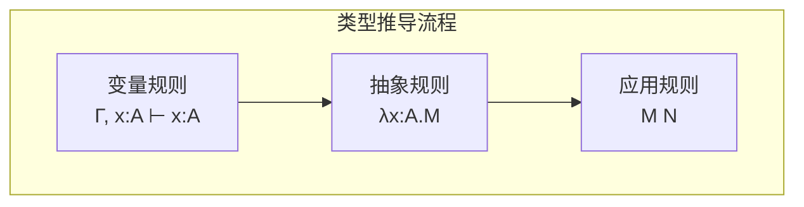

# 02.1 简单类型系统

## 1. 类型λ演算基础

### 1.1 简单类型λ演算

**定义 1.1.1** (简单类型). 类型 $A, B$ 的语法：
$$A, B ::= \iota \mid A \rightarrow B$$

其中 $\iota$ 是基本类型，$A \rightarrow B$ 是函数类型。

**定义 1.1.2** ($\lambda^\rightarrow$ 项). 带类型的λ项：

- 变量：$x : A$
- 抽象：若 $M : B$ 在假设 $x : A$ 下成立，则 $\lambda x:A. M : A \rightarrow B$
- 应用：若 $M : A \rightarrow B$ 且 $N : A$，则 $M \, N : B$

**定义 1.1.3** (上下文). **上下文** $\Gamma$ 是类型假设的有限序列：
$$\Gamma ::= \emptyset \mid \Gamma, x : A$$

**定义 1.1.4** (类型判断). **类型判断**形如 $\Gamma \vdash M : A$，读作"在上下文 $\Gamma$ 中，项 $M$ 具有类型 $A$"。

### 1.2 类型推导规则

**系统 1.2.1** ($\lambda^\rightarrow$ 自然演绎).

$$
\frac{}{\Gamma, x : A \vdash x : A} \text{(var)}
$$

$$
\frac{\Gamma, x : A \vdash M : B}{\Gamma \vdash \lambda x:A. M : A \rightarrow B} \text{(abs)}
$$

$$
\frac{\Gamma \vdash M : A \rightarrow B \quad \Gamma \vdash N : A}{\Gamma \vdash M \, N : B} \text{(app)}
$$



### 1.3 Lean 4实现

```lean4
-- 简单类型的定义
inductive Ty : Type where
  | base : Ty              -- 基本类型
  | arrow : Ty → Ty → Ty   -- 函数类型 A → B
  deriving Repr, BEq

-- 项的定义（带类型标签）
inductive Term : Type where
  | var : String → Term
  | lam : String → Ty → Term → Term  -- λx:A. M
  | app : Term → Term → Term
  deriving Repr, BEq

-- 上下文：变量到类型的映射
def Context := List (String × Ty)

-- 类型推导
inductive HasType : Context → Term → Ty → Prop where
  | var {Γ x A} : (x, A) ∈ Γ → HasType Γ (.var x) A
  | lam {Γ x A B M} : HasType ((x, A) :: Γ) M B →
                      HasType Γ (.lam x A M) (.arrow A B)
  | app {Γ A B M N} : HasType Γ M (.arrow A B) →
                      HasType Γ N A →
                      HasType Γ (.app M N) B
```

## 2. 类型安全

### 2.1 归约语义

**定义 2.1.1** (β归约). $(\lambda x:A. M) \, N \rightarrow_\beta M[x := N]$

**定义 2.1.2** (求值上下文).
$$E ::= [\cdot] \mid E \, M \mid V \, E$$

**定义 2.1.3** (小步语义).
$$\frac{M \rightarrow_\beta M'}{E[M] \rightarrow E[M']}$$

### 2.2 类型安全的两个定理

**定理 2.2.1** (保持性 / Subject Reduction). 若 $\Gamma \vdash M : A$ 且 $M \rightarrow M'$，则 $\Gamma \vdash M' : A$。

**证明**. 对归约关系归纳。关键情形：

- $(\lambda x:A. M) \, V \rightarrow M[x := V]$：由替换引理，类型保持。

```lean4
-- 替换引理
theorem substitution_lemma {Γ x A B M N} :
  HasType ((x, A) :: Γ) M B →
  HasType Γ N A →
  HasType Γ (subst x N M) B := by
  intros hM hN
  induction hM with
  | var h =>
    simp [subst]
    cases h
    · simp [‹x = _›] ; assumption
    · apply HasType.var ; assumption
  | lam h ih =>
    simp [subst]
    apply HasType.lam
    apply ih
    -- 需要处理变量捕获
    sorry
  | app h1 h2 ih1 ih2 =>
    simp [subst]
    apply HasType.app
    · apply ih1 ; assumption
    · apply ih2 ; assumption
```

**定理 2.2.2** (进展性 / Progress). 若 $\vdash M : A$（$M$ 是闭项），则要么 $M$ 是值，要么存在 $M'$ 使得 $M \rightarrow M'$。

**定义 2.2.3** (值). 值 $V$ 是范式λ抽象：$V ::= \lambda x:A. M$

**证明**. 对 $\vdash M : A$ 的推导归纳：

- 若 $M = \lambda x:A. M'$，则 $M$ 是值
- 若 $M = M_1 \, M_2$，由归纳假设 $M_1$ 要么归约，要么是值。若是值则必为 $\lambda x:A. M'$，可β归约。

**定理 2.2.3** (类型安全). 保持性 + 进展性 = 良类型程序不会"卡住"。

## 3. 扩展类型构造

### 3.1 积类型与和类型

**定义 3.1.1** (积类型). $A \times B$ 是序对类型：

- 构造：若 $M : A$ 且 $N : B$，则 $\langle M, N \rangle : A \times B$
- 消去：$\pi_1(M) : A$ 和 $\pi_2(M) : B$

**推导规则**:
$$
\frac{\Gamma \vdash M : A \quad \Gamma \vdash N : B}{\Gamma \vdash \langle M, N \rangle : A \times B}
$$

$$
\frac{\Gamma \vdash M : A \times B}{\Gamma \vdash \pi_1(M) : A}
\quad
\frac{\Gamma \vdash M : A \times B}{\Gamma \vdash \pi_2(M) : B}
$$

**定义 3.1.2** (和类型). $A + B$ 是互斥并：

- 构造：$\text{inl}(M) : A + B$（若 $M : A$），$\text{inr}(N) : A + B$（若 $N : B$）
- 消去：case 分析

**推导规则**:
$$
\frac{\Gamma \vdash M : A}{\Gamma \vdash \text{inl}(M) : A + B}
\quad
\frac{\Gamma \vdash N : B}{\Gamma \vdash \text{inr}(N) : A + B}
$$

```lean4
-- 积类型与和类型
def Ty.prod (A B : Ty) : Ty := -- 定义为语法糖或使用inductive
  sorry

inductive Sum (A B : Ty) : Ty → Prop where
  | inl : HasType Γ M A → Sum A B (.arrow A B)
  | inr : HasType Γ N B → Sum A B (.arrow A B)
```

### 3.2 单位类型与空类型

**定义 3.2.1** (单位类型). $\mathbf{1}$（或 $\top$）是只有一个元素的类型：

- 构造：$\star : \mathbf{1}$

**定义 3.2.2** (空类型). $\mathbf{0}$（或 $\bot$）是无元素的类型：

- 消去：$\text{abort}(M) : C$（若 $M : \mathbf{0}$）

### 3.3 类型同构

**定义 3.3.1** (类型同构). $A \cong B$ 如果存在 $f : A \rightarrow B$ 和 $g : B \rightarrow A$ 使得 $f \circ g = \text{id}_B$ 且 $g \circ f = \text{id}_A$。

**定理 3.3.2** (类型代数).

- $A \times B \cong B \times A$（交换律）
- $A \times (B \times C) \cong (A \times B) \times C$（结合律）
- $A \times \mathbf{1} \cong A$（单位元）
- $A + B \cong B + A$
- $A \times (B + C) \cong (A \times B) + (A \times C)$（分配律）

## 4. 规范化

### 4.1 强规范化

**定理 4.1.1** (强规范化). 所有良类型的 $\lambda^\rightarrow$ 项都是强规范化的（不存在无限归约序列）。

**证明方法**:

1. Tait可归约性方法
2. Girard可重释性方法

**定义 4.1.2** (可重释性). 定义类型 $A$ 上的可重释性关系 $R_A$：

- $R_\iota(M)$：$M$ 强规范化
- $R_{A \rightarrow B}(M)$：$M$ 强规范化，且对所有 $N$，若 $R_A(N)$ 则 $R_B(M \, N)$

### 4.2 Church-Rosser定理

**定理 4.2.1** (Church-Rosser / 合流性). 若 $M \rightarrow^* M_1$ 且 $M \rightarrow^* M_2$，则存在 $M'$ 使得 $M_1 \rightarrow^* M'$ 且 $M_2 \rightarrow^* M'$。

**推论 4.2.2** (范式唯一性). 若 $M$ 有范式，则范式唯一。

## 5. 拓展：递归类型

### 5.1 归纳类型基础

**定义 5.1.1** (自然数类型). $\text{Nat}$ 是最小类型满足：

- $0 : \text{Nat}$
- 若 $n : \text{Nat}$，则 $\text{succ}(n) : \text{Nat}$

**推导规则**（归纳原理）:
$$
\frac{\Gamma \vdash P(0) \quad \Gamma, n : \text{Nat}, P(n) \vdash P(\text{succ}(n))}{\Gamma, n : \text{Nat} \vdash P(n)}
$$

```lean4
-- 自然数类型（作为递归类型）
inductive NatTy : Type where
  | zero : NatTy
  | succ : NatTy → NatTy

-- 归纳原理/递归子
def NatTy.rec {motive : NatTy → Sort u}
  (zero : motive .zero)
  (succ : (n : NatTy) → motive n → motive (.succ n))
  (n : NatTy) : motive n :=
  match n with
  | .zero => zero
  | .succ n => succ n (NatTy.rec zero succ n)
```

## 6. 代码示例

### 6.1 Lean形式化代码

完整的简单类型系统形式化，包括类型安全性证明框架，参见：
📄 [`examples/lean/SimpleTypeSystem.lean`](../../../examples/lean/SimpleTypeSystem.lean)

包含内容：

- 简单类型语法定义（基类型、函数类型）
- 类型推导规则的形式化
- 替换引理和弱化引理
- 类型安全定理（保持性 + 进展性）
- 强规范化定理的陈述

```lean
-- 简单类型定义
inductive Ty where
  | base : String → Ty
  | arrow : Ty → Ty → Ty

-- 类型判断的归纳定义
inductive HasType : Context → Term → Ty → Prop where
  | var {Γ x A} : (x, A) ∈ Γ → HasType Γ (.var x) A
  | abs {Γ x A B M} : HasType ((x, A) :: Γ) M B →
                      HasType Γ (.abs x A M) (.arrow A B)
  | app {Γ A B M N} : HasType Γ M (.arrow A B) →
                      HasType Γ N A →
                      HasType Γ (.app M N) B

-- 类型保持性定理（Subject Reduction）
theorem preservation {Γ M M' A} :
  (Γ ⊢ M : A) → (M →β M') → (Γ ⊢ M' : A)

-- 进展性定理（Progress）
theorem progress {M A} :
  ([] ⊢ M : A) → isValue M ∨ ∃ M', M →β M'

-- 强规范化定理
theorem strong_normalization {M A} :
  ([] ⊢ M : A) → StronglyNormalizing M
```

---

## 参考

- [01.4 图灵机与计算](../01_形式语言基础/01.4_图灵机与计算.md) - 计算理论基础
- [02.2 多态类型](./02.2_多态类型.md) - 类型系统扩展
- [02.3 依赖类型](./02.3_依赖类型.md) - 更强大的类型系统
- [02.4 类型论与逻辑](./02.4_类型论与逻辑.md) - Curry-Howard同构
