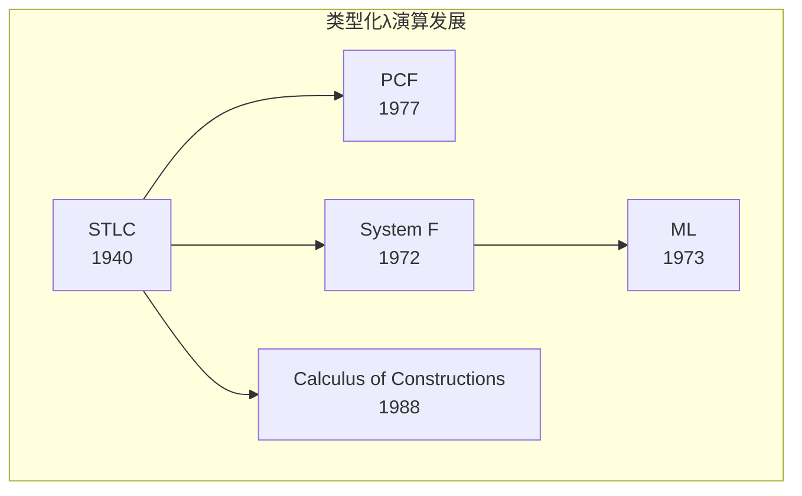
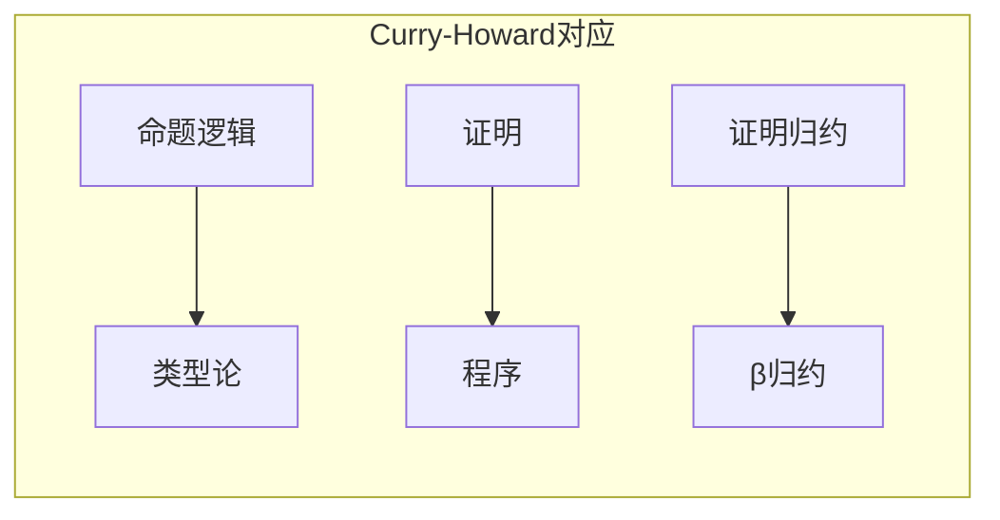

# 2.1 简单类型论 (Simply Typed Lambda Calculus)

## 目录

- [2.1 简单类型论 (Simply Typed Lambda Calculus)](#21-简单类型论-simply-typed-lambda-calculus)
  - [目录](#目录)
  - [2.1.1 引言](#211-引言)
  - [2.1.2 STLC的语法](#212-stlc的语法)
    - [2.1.2.1 类型语法](#2121-类型语法)
    - [2.1.2.2 项语法](#2122-项语法)
  - [2.1.3 类型推导](#213-类型推导)
    - [2.1.3.1 类型上下文](#2131-类型上下文)
    - [2.1.3.2 推导规则](#2132-推导规则)
    - [2.1.3.3 推导的唯一性](#2133-推导的唯一性)
  - [2.1.4 归约与求值](#214-归约与求值)
    - [2.1.4.1 βη归约](#2141-βη归约)
    - [2.1.4.2 求值策略](#2142-求值策略)
  - [2.1.5 类型安全性](#215-类型安全性)
    - [2.1.5.1 进展性定理](#2151-进展性定理)
    - [2.1.5.2 类型保持定理](#2152-类型保持定理)
    - [2.1.5.3 强正规化](#2153-强正规化)
  - [2.1.6 Curry-Howard对应](#216-curry-howard对应)
    - [2.1.6.1 命题即类型](#2161-命题即类型)
    - [2.1.6.2 证明即程序](#2162-证明即程序)
  - [2.1.7 扩展与变体](#217-扩展与变体)
  - [2.1.8 形式化证明](#218-形式化证明)
    - [Lean 4：STLC的形式化](#lean-4stlc的形式化)
    - [Haskell：STLC解释器](#haskellstlc解释器)
  - [2.1.9 总结](#219-总结)

---

## 2.1.1 引言

简单类型λ演算(Simply Typed Lambda Calculus, STLC)由阿隆佐·邱奇于1940年提出，是λ演算的类型化版本。
它在保持计算能力的同时，通过类型系统排除了无类型λ演算中的病态项（如自应用导致的发散）。

**STLC的核心特性**：

- 每个良类型项都有唯一的类型
- 良类型程序必然归约到范式（强正规化）
- 与直觉主义命题逻辑存在深刻的Curry-Howard对应



> **引用**: 无类型λ演算见 [../01_形式语言基础/01.3_λ演算.md](../01_形式语言基础/01.3_λ演算.md)，多态类型见 [02.2_多态类型论.md](./02.2_多态类型论.md)。

---

## 2.1.2 STLC的语法

### 2.1.2.1 类型语法

**定义 2.1.1 (简单类型)** 类型 $\tau$ 的语法：

$$\tau ::= b \mid \tau \rightarrow \tau$$

其中：

- $b \in \mathcal{B}$：基类型集合（如 $\text{Bool}$, $\text{Nat}$）
- $\tau_1 \rightarrow \tau_2$：函数类型

**约定**：

- $\rightarrow$ 右结合：$\tau_1 \rightarrow \tau_2 \rightarrow \tau_3 = \tau_1 \rightarrow (\tau_2 \rightarrow \tau_3)$
- 多重参数：$\tau_1 \rightarrow \cdots \rightarrow \tau_n \rightarrow \tau$

### 2.1.2.2 项语法

**定义 2.1.2 (STLC项)** 项 $t$ 的语法：

$$t ::= x \mid \lambda x:\tau.t \mid t\, t \mid c$$

其中：

- $x$：变量
- $\lambda x:\tau.t$：带类型标注的λ抽象
- $t_1\, t_2$：函数应用
- $c$：常量（如 $0, \text{true}, \text{succ}$）

**显式类型标注**：与无类型λ演算不同，STLC要求λ抽象中的参数必须标注类型。

---

## 2.1.3 类型推导

### 2.1.3.1 类型上下文

**定义 2.1.3 (类型上下文)** 类型上下文 $\Gamma$ 是从变量到类型的有限映射：

$$\Gamma ::= \emptyset \mid \Gamma, x:\tau$$

**记号**：

- $\text{dom}(\Gamma)$：$\Gamma$ 中定义的变量集合
- $\Gamma(x) = \tau$：变量 $x$ 在 $\Gamma$ 中的类型

### 2.1.3.2 推导规则

**定义 2.1.4 (类型推导关系)** 判断 $\Gamma \vdash t : \tau$ 表示在上下文 $\Gamma$ 中项 $t$ 具有类型 $\tau$。

推导规则：

$$\frac{x:\tau \in \Gamma}{\Gamma \vdash x : \tau} \text{(T-VAR)}$$

$$\frac{\Gamma, x:\tau_1 \vdash t : \tau_2}{\Gamma \vdash \lambda x:\tau_1.t : \tau_1 \rightarrow \tau_2} \text{(T-ABS)}$$

$$\frac{\Gamma \vdash t_1 : \tau_1 \rightarrow \tau_2 \quad \Gamma \vdash t_2 : \tau_1}{\Gamma \vdash t_1\, t_2 : \tau_2} \text{(T-APP)}$$

**常量规则**（示例）：

$$\overline{\Gamma \vdash \text{true} : \text{Bool}} \quad \overline{\Gamma \vdash \text{false} : \text{Bool}}$$

$$\frac{\Gamma \vdash t_1 : \text{Bool} \quad \Gamma \vdash t_2 : \tau \quad \Gamma \vdash t_3 : \tau}{\Gamma \vdash \text{if } t_1 \text{ then } t_2 \text{ else } t_3 : \tau}$$

### 2.1.3.3 推导的唯一性

**定理 2.1.1 (类型唯一性)** 若 $\Gamma \vdash t : \tau_1$ 且 $\Gamma \vdash t : \tau_2$，则 $\tau_1 = \tau_2$。

**证明**：对 $t$ 的结构归纳。

**推论 2.1.1 (类型推断的可判定性)** 给定 $\Gamma$ 和 $t$，判定是否存在 $\tau$ 使得 $\Gamma \vdash t : \tau$ 是可判定的。

**类型推断算法**（Hindley-Milner风格）：

```haskell
-- 伪代码
typeInfer :: Context -> Term -> Either TypeError Type
typeInfer gamma (Var x) =
  case lookup x gamma of
    Just tau -> Right tau
    Nothing -> Left (UnboundVariable x)
typeInfer gamma (Abs x tau1 t) = do
  tau2 <- typeInfer ((x, tau1):gamma) t
  return (tau1 :-> tau2)
typeInfer gamma (App t1 t2) = do
  tau1 <- typeInfer gamma t1
  tau2 <- typeInfer gamma t2
  case tau1 of
    tau2' :-> tau | tau2' == tau2 -> Right tau
    _ -> Left (TypeMismatch t1 t2)
```

---

## 2.1.4 归约与求值

### 2.1.4.1 βη归约

**定义 2.1.5 (β归约)**

$$(\lambda x:\tau.t_1)\, t_2 \rightarrow_\beta t_1[t_2/x]$$

**定义 2.1.6 (η归约)** 若 $x \notin \text{FV}(t)$：

$$\lambda x:\tau.(t\, x) \rightarrow_\eta t$$

**定理 2.1.2 (Church-Rosser)** STLC的βη归约是合流的。

### 2.1.4.2 求值策略

| 策略 | 特性 | STLC适用性 |
|------|------|-----------|
| **正规序** | 最左最外优先 | 能找到范式（若存在） |
| **应用序** | 先求值参数 | 可能导致额外求值 |
| **惰性求值** | 按需+共享 | Haskell采用 |
| **急切求值** | 先求值后应用 | ML族语言采用 |

---

## 2.1.5 类型安全性

### 2.1.5.1 进展性定理

**定义 2.1.7 (值)** 值是不能再继续归约的项：

$$v ::= \lambda x:\tau.t \mid c$$

**定理 2.1.3 (进展性)** 若 $\vdash t : \tau$，则 $t$ 是值，或存在 $t'$ 使得 $t \rightarrow t'$。

**证明**：对推导 $\vdash t : \tau$ 的结构归纳。

### 2.1.5.2 类型保持定理

**定理 2.1.4 (类型保持 / 主题规约)** 若 $\Gamma \vdash t : \tau$ 且 $t \rightarrow t'$，则 $\Gamma \vdash t' : \tau$。

**证明**：对归约关系 $t \rightarrow t'$ 归纳。

- 情况β归约：使用替换引理
- 其他情况：直接应用归纳假设

**引理 2.1.1 (替换引理)** 若 $\Gamma, x:\tau_1 \vdash t : \tau_2$ 且 $\Gamma \vdash s : \tau_1$，则 $\Gamma \vdash t[s/x] : \tau_2$。

### 2.1.5.3 强正规化

**定理 2.1.5 (强正规化)** 若 $\Gamma \vdash t : \tau$，则不存在无限归约链 $t \rightarrow t_1 \rightarrow t_2 \rightarrow \cdots$。

**证明方法**：

1. Tait可计算性方法
2. 逻辑关系法
3. 归约长度的归纳

**推论 2.1.2 (停机性)** STLC中的所有良类型程序都必然终止。

> **注意**：STLC不是图灵完全的，这是停机性的代价。

---

## 2.1.6 Curry-Howard对应

Curry-Howard同构揭示了类型理论与逻辑之间的深刻联系。

### 2.1.6.1 命题即类型

**对应关系**：

| 逻辑 | 类型论 |
|------|--------|
| 命题 $A$ | 类型 $A$ |
| 证明 $p : A$ | 项 $t : A$ |
| $A \Rightarrow B$ | 函数类型 $A \rightarrow B$ |
| $A \land B$ | 积类型 $A \times B$ |
| $A \lor B$ | 和类型 $A + B$ |
| $\forall x:A. B(x)$ | 依赖积 $\Pi x:A. B(x)$ |
| $\exists x:A. B(x)$ | 依赖和 $\Sigma x:A. B(x)$ |

**命题逻辑中的蕴涵与函数类型**：

$$\frac{A \Rightarrow B \quad A}{B} \text{(Modus Ponens)} \quad \leftrightarrow \quad \frac{f : A \rightarrow B \quad x : A}{f\, x : B} \text{(T-APP)}$$

### 2.1.6.2 证明即程序

**示例**：证明 $A \Rightarrow A$ 对应恒等函数

- 逻辑证明：$\frac{[A]^1}{A \Rightarrow A} \Rightarrow I^1$
- 程序：$\lambda x:A.x : A \rightarrow A$

**示例**：证明 $(A \Rightarrow B) \Rightarrow (B \Rightarrow C) \Rightarrow (A \Rightarrow C)$ 对应函数复合

```haskell
compose :: (b -> c) -> (a -> b) -> (a -> c)
compose f g = \x -> f (g x)
```



---

## 2.1.7 扩展与变体

**积类型**：

$$\tau ::= \cdots \mid \tau \times \tau$$

$$t ::= \cdots \mid (t, t) \mid \text{fst}\, t \mid \text{snd}\, t$$

**和类型**：

$$\tau ::= \cdots \mid \tau + \tau$$

$$t ::= \cdots \mid \text{inl}\, t \mid \text{inr}\, t \mid \text{case } t \text{ of } \text{inl } x \Rightarrow t_1 \mid \text{inr } y \Rightarrow t_2$$

**递归类型**（在纯STLC中不允许）：

$$\tau ::= \cdots \mid \mu \alpha.\tau$$

| 扩展 | 逻辑对应 | 计算特性 |
|------|---------|---------|
| 积类型 $\times$ | 合取 $\land$ | 二元组 |
| 和类型 $+$ | 析取 $\lor$ | 互斥并 |
| 递归类型 $\mu$ | 无（可引入矛盾） | 无限数据结构 |
| 多态 $\forall$ | 全称量词 | 参数多态函数 |

---

## 2.1.8 形式化证明

### Lean 4：STLC的形式化

```lean4
-- 简单类型
def BaseType := String
inductive SimpleType where
  | base : BaseType → SimpleType
  | arrow : SimpleType → SimpleType → SimpleType
  deriving Repr, BEq

notation τ₁ " → " τ₂ => SimpleType.arrow τ₁ τ₂

-- 项
def Var := String

inductive Term where
  | var : Var → Term
  | abs : Var → SimpleType → Term → Term
  | app : Term → Term → Term
  deriving Repr, BEq

notation "λ " x " : " τ " => " t => Term.abs x τ t

-- 类型上下文
def Context := List (Var × SimpleType)

-- 类型推导
def Context.lookup (Γ : Context) (x : Var) : Option SimpleType :=
  Γ.findSome? (fun (y, τ) => if x = y then some τ else none)

inductive Typing : Context → Term → SimpleType → Prop where
  | var {Γ x τ} :
      Γ.lookup x = some τ →
      Typing Γ (Term.var x) τ
  | abs {Γ x τ₁ t τ₂} :
      Typing ((x, τ₁) :: Γ) t τ₂ →
      Typing Γ (Term.abs x τ₁ t) (τ₁ → τ₂)
  | app {Γ t₁ t₂ τ₁ τ₂} :
      Typing Γ t₁ (τ₁ → τ₂) →
      Typing Γ t₂ τ₁ →
      Typing Γ (Term.app t₁ t₂) τ₂

notation Γ " ⊢ " t " : " τ => Typing Γ t τ

-- 类型唯一性定理
theorem typing_uniqueness {Γ : Context} {t : Term} {τ₁ τ₂ : SimpleType}
  (h₁ : Γ ⊢ t : τ₁) (h₂ : Γ ⊢ t : τ₂) : τ₁ = τ₂ := by
  induction h₁ generalizing τ₂ with
  | var h => cases h₂; simp_all
  | abs _ ih =>
      cases h₂ with
      | abs h₂' => simp [ih h₂']
  | app _ _ ih₁ ih₂ =>
      cases h₂ with
      | app h₃ h₄ => simp [ih₁ h₃]
```

### Haskell：STLC解释器

```haskell
{-# LANGUAGE GADTs #-}

type Name = String

-- 类型
data Type = TBase String
          | TArrow Type Type
          deriving (Eq, Show)

type Context = [(Name, Type)]

-- 项
data Term where
  Var :: Name -> Term
  Abs :: Name -> Type -> Term -> Term
  App :: Term -> Term -> Term
  deriving (Show, Eq)

-- 类型推断
typeInfer :: Context -> Term -> Either String Type
typeInfer ctx (Var x) =
  case lookup x ctx of
    Just t -> Right t
    Nothing -> Left $ "Unbound variable: " ++ x

typeInfer ctx (Abs x ty body) = do
  tyBody <- typeInfer ((x, ty) : ctx) body
  return $ TArrow ty tyBody

typeInfer ctx (App t1 t2) = do
  ty1 <- typeInfer ctx t1
  ty2 <- typeInfer ctx t2
  case ty1 of
    TArrow arg ret | arg == ty2 -> Right ret
    TArrow arg _ -> Left $ "Type mismatch in application"
    _ -> Left $ "Expected function type"

-- β归约
subst :: Name -> Term -> Term -> Term
subst x s (Var y) | x == y = s
                  | otherwise = Var y
subst x s (Abs y ty t)
  | x == y = Abs y ty t
  | y `elem` freeVars s = let y' = fresh y (freeVars s ++ freeVars t)
                          in subst x s (Abs y' ty (rename y y' t))
  | otherwise = Abs y ty (subst x s t)
  where
    freeVars (Var z) = [z]
    freeVars (Abs z _ t') = filter (/= z) (freeVars t')
    freeVars (App t1 t2) = freeVars t1 ++ freeVars t2
    rename a b (Var c) | a == c = Var b
                       | otherwise = Var c
    rename a b (Abs c ty t') = Abs (if a == c then b else c) ty (rename a b t')
    rename a b (App t1 t2) = App (rename a b t1) (rename a b t2)
    fresh y vars = if y `elem` vars then fresh (y ++ "'") vars else y
subst x s (App t1 t2) = App (subst x s t1) (subst x s t2)

reduce :: Term -> Term
reduce (App (Abs x _ body) arg) = subst x arg body
reduce (App t1 t2) = App (reduce t1) (reduce t2)
reduce t = t
```

---

## 2.1.9 总结

**STLC的核心定理**：

| 定理 | 陈述 |
|------|------|
| **类型唯一性** | 每个项有唯一类型 |
| **进展性** | 良类型项要么已是值，要么可规约 |
| **类型保持** | 归约保持类型 |
| **强正规化** | 良类型项必然终止 |

**Curry-Howard对应**：

| 逻辑概念 | 类型论概念 |
|---------|-----------|
| 命题 | 类型 |
| 证明 | 程序 |
| 蕴涵 $A \Rightarrow B$ | 函数类型 $A \rightarrow B$ |
| 证明消除 | β归约 |

**延伸阅读**：

- [../01_形式语言基础/01.3_λ演算.md](../01_形式语言基础/01.3_λ演算.md) - 无类型版本
- [02.2_多态类型论.md](./02.2_多态类型论.md) - 参数多态扩展
- [02.3_依赖类型论.md](./02.3_依赖类型论.md) - 依赖类型扩展
- [../04_范畴论/04.4_范畴论语义.md](../04_范畴论/04.4_范畴论语义.md) - 笛闭范畴语义

---

_文档版本: 1.0 | 最后更新: 2026-04-11_
