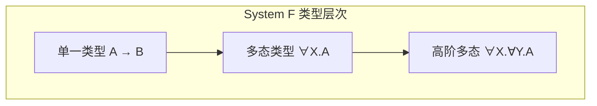
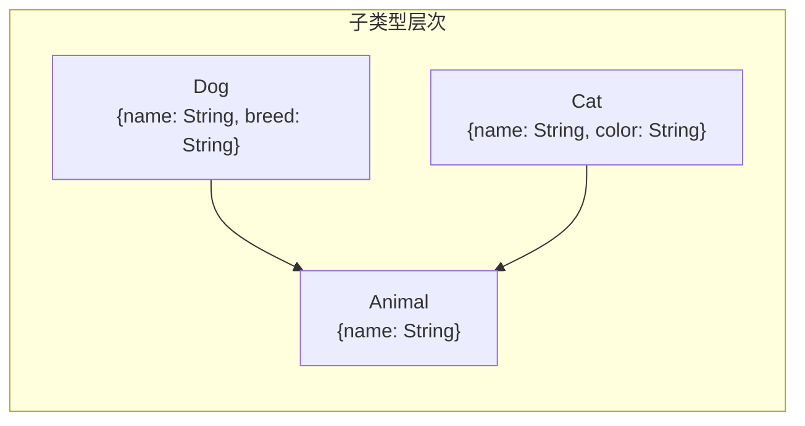

# 02.2 多态类型

## 1. 参数多态

### 1.1 系统F (Girard-Reynolds多态)

**定义 1.1.1** (类型抽象). 扩展类型语法，允许**类型变量**和**全称量词**：
$$A, B ::= X \mid A \rightarrow B \mid \forall X. A$$

其中 $X$ 是类型变量，$\forall X. A$ 是多态类型（读作"对所有类型 $X$，$A$")

**定义 1.1.2** (项语法). 扩展项语法：

- 类型抽象：$\Lambda X. M$（多态函数）
- 类型应用：$M [A]$（类型实例化）

**定义 1.1.3** ($\lambda 2$ / System F). 类型推导规则：

$$
\frac{\Gamma \vdash M : A}{\Gamma \vdash \Lambda X. M : \forall X. A} \text{(Λ-intro)} \quad (X \notin FV(\Gamma))
$$

$$
\frac{\Gamma \vdash M : \forall X. A}{\Gamma \vdash M [B] : A[X := B]} \text{(Λ-elim)}
$$



### 1.2 Lean 4实现

```lean4
-- System F 的多态类型
inductive PolyTy (var : Type) : Type where
  | var : var → PolyTy var
  | arrow : PolyTy var → PolyTy var → PolyTy var
  | forall : var → PolyTy var → PolyTy var  -- ∀X.A
  deriving Repr, BEq

-- 多态项
inductive PolyTerm (var : Type) : Type where
  | var : String → PolyTerm var
  | lam : String → PolyTy var → PolyTerm var → PolyTerm var
  | app : PolyTerm var → PolyTerm var → PolyTerm var
  | tlam : var → PolyTerm var → PolyTerm var   -- ΛX.M
  | tapp : PolyTerm var → PolyTy var → PolyTerm var  -- M[A]
  deriving Repr, BEq

-- 类型替换
def substTy {var} [BEq var] (X : var) (B : PolyTy var) : PolyTy var → PolyTy var
  | .var Y => if X == Y then B else .var Y
  | .arrow A1 A2 => .arrow (substTy X B A1) (substTy X B A2)
  | .forall Y A => if X == Y then .forall Y A else .forall Y (substTy X B A)
```

### 1.3  Church编码

**定义 1.3.1** (自然数的Church编码).
$$\text{Nat} := \forall X. (X \rightarrow X) \rightarrow X \rightarrow X$$

**编码**:

- $0 := \Lambda X. \lambda f:X\rightarrow X. \lambda x:X. x$
- $\text{succ} := \lambda n:\text{Nat}. \Lambda X. \lambda f:X\rightarrow X. \lambda x:X. f (n [X] f x)$

**定理 1.3.2** (Church编码的表达能力). 所有原始递归函数可在System F中编码。

```lean4
-- Church编码的自然数
abbrev ChurchNat (var : Type) := PolyTy var

-- 零
def ChurchZero {var} : PolyTerm var :=
  .tlam var (by simp) (.lam "f" (.arrow (.var (by simp)) (.var (by simp)))
    (.lam "x" (.var (by simp)) (.var "x")))

-- 后继
-- succ = λn.ΛX.λf:X→X.λx:X. f (n[X] f x)
def ChurchSucc {var} [Inhabited var] : PolyTerm var :=
  .lam "n" (.forall (default) (.arrow (.arrow (.var default) (.var default))
    (.arrow (.var default) (.var default))))
    (.tlam (default)
      (.lam "f" (.arrow (.var default) (.var default))
        (.lam "x" (.var default)
          (.app (.var "f")
            (.app (.app (.tapp (.var "n") (.var default)) (.var "f")) (.var "x"))))))
```

### 1.4 系统F的性质

**定理 1.4.1** (强规范化). System F是强规范化的。

**定理 1.4.2** (表达能力). 系统F能表示所有二阶算术可证明的函数。

**定理 1.4.3** (不可判定的类型检查). System F的类型推断是不可判定的。

## 2. Subtype多态

### 2.1 子类型关系

**定义 2.1.1** (子类型). 子类型关系 $A <: B$（$A$ 是 $B$ 的子类型）满足：

- 自反：$A <: A$
- 传递：若 $A <: B$ 且 $B <: C$，则 $A <: C$

**定义 2.1.2** (记录子类型). 记录类型的宽度子类型：
$$\{l_1 : A_1, \ldots, l_n : A_n, l_{n+1} : A_{n+1}\} <: \{l_1 : A_1, \ldots, l_n : A_n\}$$

**定义 2.1.3** (函数子类型). 逆变-协变规则：
$$\frac{B_1 <: A_1 \quad A_2 <: B_2}{A_1 \rightarrow A_2 <: B_1 \rightarrow B_2}$$



### 2.2 子类型推导规则

**系统 2.2.1** ($\lambda_{<:}$).

$$
\frac{}{A <: A} \text{(refl)}
\quad
\frac{A <: B \quad B <: C}{A <: C} \text{(trans)}
$$

$$
\frac{\Gamma \vdash M : A \quad A <: B}{\Gamma \vdash M : B} \text{(subsumption)}
$$

```lean4
-- 子类型关系（作为归纳命题）
inductive Subty : PolyTy Unit → PolyTy Unit → Prop where
  | refl {A} : Subty A A
  | trans {A B C} : Subty A B → Subty B C → Subty A C
  | arrow {A1 A2 B1 B2} : Subty B1 A1 → Subty A2 B2 →
                          Subty (.arrow A1 A2) (.arrow B1 B2)
  | record {fields1 fields2} : fields1 ⊇ fields2 →
    Subty (.record fields1) (.record fields2)

-- 带subsumption的类型推导
inductive HasTypeSub (Γ : Context) : Term → PolyTy Unit → Prop where
  | var : (x, A) ∈ Γ → HasTypeSub Γ (.var x) A
  | sub {A B} : HasTypeSub Γ M A → Subty A B → HasTypeSub Γ M B
  -- ... 其他规则
```

### 2.3 有界多态

**定义 2.3.1** (有界量化). $F$-有界多态：
$$\forall X <: F(X). A$$

**应用**：解决多态递归类型的问题。

## 3. 特设多态 (Ad-hoc Polymorphism)

### 3.1 类型类

**定义 3.1.1** (类型类). 类型类 $C$ 是一组类型，每个类型需实现特定操作。

**例 3.1.2**. `Eq` 类型类：

```
class Eq a where
  eq :: a -> a -> Bool
```

```lean4
-- 类型类作为类型层面的谓词
class HasEq (A : Type) where
  eq : A → A → Bool

-- 实例声明
instance : HasEq Nat where
  eq := Nat.beq

-- 多态函数使用类型类约束
def polymorphicEq {A : Type} [HasEq A] (x y : A) : Bool :=
  HasEq.eq x y
```

### 3.2 隐含参数

**定义 3.2.1** (隐含实例解析). 编译器自动搜索合适的类型类实例。

```lean4
-- Lean中的类型类（隐含参数版本）
class Monoid (M : Type) where
  unit : M
  mul : M → M → M
  mul_assoc : ∀ x y z, mul (mul x y) z = mul x (mul y z)
  unit_left : ∀ x, mul unit x = x
  unit_right : ∀ x, mul x unit = x

-- 使用类型类约束
open Monoid

def pow {M : Type} [Monoid M] (x : M) : Nat → M
  | 0 => unit
  | n+1 => mul x (pow x n)
```

## 4. 高阶多态

### 4.1 类型算子

**定义 4.1.1** (类型算子). 类型层面的函数：
$$F ::= \lambda X. A \mid F \, A$$

**定义 4.1.2** (类型构造子). 如 `List`, `Option` 等：
$$\text{List} := \lambda X. \mu Y. \mathbf{1} + X \times Y$$

### 4.2 System F_ω

**定义 4.2.1** ($F_\omega$). 扩展System F，允许类型层面的λ演算。

**类型层次**:

- 类型 ($*$)：如 `Nat`, `Bool`, `A → B`
- 类型算子 ($* \Rightarrow *$)：如 `List`, `Option`
- 高阶算子：如 `(List ∘ Option) A = List (Option A)`

```lean4
-- System F_ω 的类型层次
inductive Kind : Type where
  | star : Kind          -- *
  | arrow : Kind → Kind → Kind  -- K1 ⇒ K2

def TypeOfKind (k : Kind) : Type :=
  match k with
  | .star => Type
  | .arrow k1 k2 => TypeOfKind k1 → TypeOfKind k2

-- 类型构造子示例
abbrev ListConstructor : Type → Type := List
abbrev OptionConstructor : Type → Type := Option
```

## 5. 多态与数学

### 5.1 参数性定理

**定理 5.1.1** (Reynolds参数性). 类型为 $\forall X. A$ 的项必须"统一地"在所有类型上行为。

**推论 5.1.2** (自由定理). 从类型可推导出程序的性质。

**例 5.1.3**. 对 $f : \forall X. X \rightarrow X$，必有 $f_A = \text{id}_A$ 对所有 $A$。

### 5.2 关系参数性

**定义 5.2.1** (逻辑关系). 定义类型上的二元关系 $R_A \subseteq A \times A$：

- $R_{X}$：给定的关系
- $R_{A \rightarrow B}(f, g) := \forall x, y. R_A(x, y) \rightarrow R_B(f x, g y)$
- $R_{\forall X. A}(t, u) := \forall B, C, R \subseteq B \times C. R_A[X:=R](t{[B]}, u{[C]})$

## 参考

- [02.1 简单类型系统](./02.1_简单类型系统.md) - 类型系统基础
- [02.3 依赖类型](./02.3_依赖类型.md) - 依赖类型扩展
- [02.4 类型论与逻辑](./02.4_类型论与逻辑.md) - Curry-Howard同构
- [04.3 伴随与单子](../04_范畴论/04.3_伴随与单子.md) - 单子与类型系统
