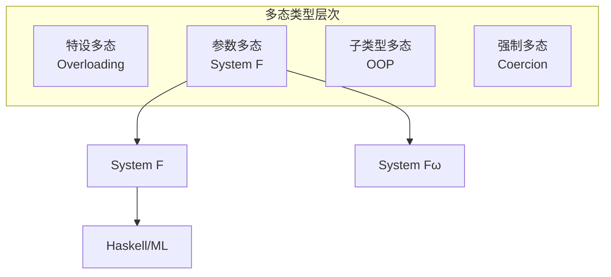

# 2.2 多态类型论 (Polymorphic Type Theory)

## 目录

- [2.2 多态类型论 (Polymorphic Type Theory)](#22-多态类型论-polymorphic-type-theory)
  - [目录](#目录)
  - [2.2.1 引言](#221-引言)
  - [2.2.2 System F的语法](#222-system-f的语法)
    - [2.2.2.1 类型语法](#2221-类型语法)
    - [2.2.2.2 项语法](#2222-项语法)
  - [2.2.3 类型推导](#223-类型推导)
    - [2.2.3.1 类型上下文](#2231-类型上下文)
    - [2.2.3.2 推导规则](#2232-推导规则)
  - [2.2.4 多态的类型抽象](#224-多态的类型抽象)
    - [2.2.4.1 全称类型](#2241-全称类型)
    - [2.2.4.2 类型擦除](#2242-类型擦除)
  - [2.2.5 存在类型](#225-存在类型)
    - [2.2.5.1 抽象数据类型](#2251-抽象数据类型)
    - [2.2.5.2 包与开包](#2252-包与开包)
  - [2.2.6 表达力分析](#226-表达力分析)
    - [2.2.6.1 编码归纳类型](#2261-编码归纳类型)
    - [2.2.6.2 Church编码](#2262-church编码)
  - [2.2.7 性质与定理](#227-性质与定理)
  - [2.2.8 形式化证明](#228-形式化证明)
    - [Lean 4：System F的形式化](#lean-4system-f的形式化)
    - [Haskell：System F解释器](#haskellsystem-f解释器)
  - [2.2.9 总结](#229-总结)

---

## 2.2.1 引言

多态类型论(Polymorphic Type Theory)，特别是System F（又称多态λ演算），由Jean-Yves Girard（1972）和John Reynolds（1974）独立发现。
它在简单类型λ演算的基础上引入了**参数多态**，允许定义对任意类型工作的函数。

**多态类型的重要性**：

- 支持代码复用（如通用列表操作）
- 保持类型安全的同时恢复表达能力
- 与二阶逻辑存在Curry-Howard对应



> **引用**: 简单类型论见 [02.1_简单类型论.md](./02.1_简单类型论.md)，依赖类型见 [02.3_依赖类型论.md](./02.3_依赖类型论.md)。

---

## 2.2.2 System F的语法

### 2.2.2.1 类型语法

**定义 2.2.1 (System F类型)** 类型 $\tau$ 的语法：

$$\tau ::= \alpha \mid \tau \rightarrow \tau \mid \forall \alpha. \tau$$

其中：

- $\alpha$：类型变量
- $\tau_1 \rightarrow \tau_2$：函数类型
- $\forall \alpha. \tau$：全称类型（全称量化）

**自由类型变量**：

$$\text{FTV}(\alpha) = \{\alpha\}$$
$$\text{FTV}(\tau_1 \rightarrow \tau_2) = \text{FTV}(\tau_1) \cup \text{FTV}(\tau_2)$$
$$\text{FTV}(\forall \alpha. \tau) = \text{FTV}(\tau) \setminus \{\alpha\}$$

### 2.2.2.2 项语法

**定义 2.2.2 (System F项)** 项 $t$ 的语法：

$$t ::= x \mid \lambda x:\tau.t \mid t\, t \mid \Lambda \alpha.t \mid t\, [\tau]$$

其中：

- $\Lambda \alpha.t$：类型抽象（大写Lambda）
- $t\, [\tau]$：类型应用（类型实例化）

**类型擦除**：运行时仅保留项部分，类型信息被擦除。

---

## 2.2.3 类型推导

### 2.2.3.1 类型上下文

**定义 2.2.3 (类型上下文)**

$$\Gamma ::= \emptyset \mid \Gamma, x:\tau \mid \Gamma, \alpha\, \text{type}$$

上下文可包含：

- 变量类型绑定 $x:\tau$
- 类型变量声明 $\alpha\, \text{type}$

### 2.2.3.2 推导规则

**定义 2.2.4 (System F推导规则)**

$$\frac{x:\tau \in \Gamma}{\Gamma \vdash x : \tau} \text{(T-VAR)}$$

$$\frac{\Gamma, x:\tau_1 \vdash t : \tau_2}{\Gamma \vdash \lambda x:\tau_1.t : \tau_1 \rightarrow \tau_2} \text{(T-ABS)}$$

$$\frac{\Gamma \vdash t_1 : \tau_1 \rightarrow \tau_2 \quad \Gamma \vdash t_2 : \tau_1}{\Gamma \vdash t_1\, t_2 : \tau_2} \text{(T-APP)}$$

$$\frac{\Gamma, \alpha\, \text{type} \vdash t : \tau}{\Gamma \vdash \Lambda \alpha.t : \forall \alpha. \tau} \text{(T-TABS)} \quad \text{(α ∉ FTV(Γ))}$$

$$\frac{\Gamma \vdash t : \forall \alpha. \tau_1}{\Gamma \vdash t\, [\tau_2] : \tau_1[\tau_2/\alpha]} \text{(T-TAPP)}$$

---

## 2.2.4 多态的类型抽象

### 2.2.4.1 全称类型

**定义 2.2.5 (全称量化)** $\forall \alpha. \tau$ 表示"对所有类型$\alpha$，类型$\tau$"：

**示例**：多态恒等函数

$$\text{id} = \Lambda \alpha. \lambda x:\alpha.x : \forall \alpha. \alpha \rightarrow \alpha$$

**使用**：

- $\text{id}\, [\text{Nat}] : \text{Nat} \rightarrow \text{Nat}$
- $\text{id}\, [\text{Bool}] : \text{Bool} \rightarrow \text{Bool}$

**示例**：多态函数组合

$$
\text{compose} = \Lambda \alpha. \Lambda \beta. \Lambda \gamma.
\lambda f:\beta \rightarrow \gamma. \lambda g:\alpha \rightarrow \beta.
\lambda x:\alpha. f\, (g\, x)
$$

类型：$\forall \alpha \beta \gamma. (\beta \rightarrow \gamma) \rightarrow (\alpha \rightarrow \beta) \rightarrow \alpha \rightarrow \gamma$

### 2.2.4.2 类型擦除

**定义 2.2.6 (类型擦除)** 将System F项转换为无类型λ项：

$$
\begin{aligned}
|x| &= x \\
|\lambda x:\tau.t| &= \lambda x.|t| \\
|t_1\, t_2| &= |t_1|\, |t_2| \\
|\Lambda \alpha.t| &= |t| \\
|t\, [\tau]| &= |t|
\end{aligned}
$$

**定理 2.2.1 (类型擦除保持归约)** 若 $t \rightarrow t'$ 在System F中，则 $|t| \rightarrow |t'|$ 在无类型λ演算中。

---

## 2.2.5 存在类型

### 2.2.5.1 抽象数据类型

**定义 2.2.7 (存在类型)** 存在类型 $\exists \alpha. \tau$ 表示"存在某个类型$\alpha$使得$\tau$成立"：

$$\tau ::= \cdots \mid \exists \alpha. \tau$$

**项扩展**：

$$t ::= \cdots \mid \text{pack } \tau, t \text{ as } \exists \alpha. \tau' \mid \text{unpack } t_1 \text{ as } \alpha, x \text{ in } t_2$$

### 2.2.5.2 包与开包

**形成规则**：

$$\frac{\Gamma \vdash \tau_1 \, \text{type} \quad \Gamma \vdash t : \tau[\tau_1/\alpha]}{\Gamma \vdash \text{pack } \tau_1, t \text{ as } \exists \alpha. \tau : \exists \alpha. \tau} \text{(T-PACK)}$$

$$\frac{\Gamma \vdash t_1 : \exists \alpha. \tau_1 \quad \Gamma, \alpha\, \text{type}, x:\tau_1 \vdash t_2 : \tau_2 \quad \alpha \notin \text{FTV}(\tau_2)}{\Gamma \vdash \text{unpack } t_1 \text{ as } \alpha, x \text{ in } t_2 : \tau_2} \text{(T-UNPACK)}$$

**示例**：抽象计数器ADT

```
CounterSig = ∃Counter.
  { new : Counter
  , inc : Counter → Counter
  , get : Counter → Nat }

counterImpl = pack Nat,
  { new = 0
  , inc = λn:Nat. n+1
  , get = λn:Nat. n } as CounterSig
```

---

## 2.2.6 表达力分析

### 2.2.6.1 编码归纳类型

**定理 2.2.2 (System F表达力)** System F可编码：

- 积类型（二元组）
- 和类型（互斥并）
- 自然数（Church编码）
- 列表
- 任意归纳类型

### 2.2.6.2 Church编码

**自然数的Church编码**：

$$\text{Nat} = \forall \alpha. (\alpha \rightarrow \alpha) \rightarrow \alpha \rightarrow \alpha$$

$$\overline{0} = \Lambda \alpha. \lambda f:\alpha \rightarrow \alpha. \lambda x:\alpha. x$$

$$\overline{1} = \Lambda \alpha. \lambda f:\alpha \rightarrow \alpha. \lambda x:\alpha. f\, x$$

$$\overline{n} = \Lambda \alpha. \lambda f:\alpha \rightarrow \alpha. \lambda x:\alpha. f^n\, x$$

**后继**：

$$\text{succ} = \lambda n:\text{Nat}. \Lambda \alpha. \lambda f:\alpha \rightarrow \alpha. \lambda x:\alpha. f\, (n\, [\alpha]\, f\, x)$$

**列表编码**：

$$\text{List } \tau = \forall \alpha. (\tau \rightarrow \alpha \rightarrow \alpha) \rightarrow \alpha \rightarrow \alpha$$

$$\text{nil} = \Lambda \tau. \Lambda \alpha. \lambda c:\tau \rightarrow \alpha \rightarrow \alpha. \lambda n:\alpha. n$$

$$
\text{cons} = \Lambda \tau. \lambda h:\tau. \lambda t:\text{List } \tau.
\Lambda \alpha. \lambda c:\tau \rightarrow \alpha \rightarrow \alpha. \lambda n:\alpha. c\, h\, (t\, [\alpha]\, c\, n)
$$

---

## 2.2.7 性质与定理

**定理 2.2.3 (类型安全性)**

- **进展性**：若 $\vdash t : \tau$，则 $t$ 是值或存在 $t'$ 使得 $t \rightarrow t'$
- **类型保持**：若 $\Gamma \vdash t : \tau$ 且 $t \rightarrow t'$，则 $\Gamma \vdash t' : \tau$

**定理 2.2.4 (强正规化)** 若 $\Gamma \vdash t : \tau$，则 $t$ 必然归约到范式。

**定理 2.2.5 (类型推断的不可判定性)** System F的类型推断是不可判定的。

| 性质 | STLC | System F |
|------|------|----------|
| 类型推断 | 可判定 | 不可判定 |
| 强正规化 | 是 | 是 |
| 图灵完全 | 否 | 否* |
| 多态 | 无 | 参数多态 |

*注：添加不动点组合子后可图灵完全。

---

## 2.2.8 形式化证明

### Lean 4：System F的形式化

```lean4
-- 类型变量
def TyVar := String

-- System F类型
inductive FType where
  | tyVar : TyVar → FType
  | arrow : FType → FType → FType
  | forall_ : TyVar → FType → FType
  deriving Repr, BEq

notation τ₁ " → " τ₂ => FType.arrow τ₁ τ₂
notation "∀ " α " => " τ => FType.forall_ α τ

-- 项变量
def TmVar := String

-- System F项
inductive FTerm where
  | var : TmVar → FTerm
  | abs : TmVar → FType → FTerm → FTerm
  | app : FTerm → FTerm → FTerm
  | tyAbs : TyVar → FTerm → FTerm
  | tyApp : FTerm → FType → FTerm
  deriving Repr, BEq

notation "λ " x " : " τ " => " t => FTerm.abs x τ t
notation "Λ " α " => " t => FTerm.tyAbs α t

-- 自由类型变量
def ftv : FType → List TyVar
  | .tyVar α => [α]
  | .arrow τ₁ τ₂ => ftv τ₁ ++ ftv τ₂
  | .forall_ α τ => (ftv τ).erase α

-- 类型替换
def tySubst (τ : FType) (α : TyVar) (σ : FType) : FType :=
  match τ with
  | .tyVar β => if α = β then σ else .tyVar β
  | .arrow τ₁ τ₂ => .arrow (tySubst τ₁ α σ) (tySubst τ₂ α σ)
  | .forall_ β τ₁ => if α = β then .forall_ β τ₁ else .forall_ β (tySubst τ₁ α σ)

-- 类型上下文
def TyContext := List (TmVar × FType)

def TyContext.lookup (Γ : TyContext) (x : TmVar) : Option FType :=
  Γ.findSome? (fun (y, τ) => if x = y then some τ else none)

-- 类型推导
def TyContext.ftv (Γ : TyContext) : List TyVar :=
  Γ.foldr (fun (_, τ) acc => ftv τ ++ acc) []

inductive FTyping : TyContext → FTerm → FType → Prop where
  | var {Γ x τ} :
      Γ.lookup x = some τ →
      FTyping Γ (.var x) τ
  | abs {Γ x τ₁ t τ₂} :
      FTyping ((x, τ₁) :: Γ) t τ₂ →
      FTyping Γ (.abs x τ₁ t) (τ₁ → τ₂)
  | app {Γ t₁ t₂ τ₁ τ₂} :
      FTyping Γ t₁ (τ₁ → τ₂) →
      FTyping Γ t₂ τ₁ →
      FTyping Γ (.app t₁ t₂) τ₂
  | tyAbs {Γ α t τ} :
      FTyping Γ t τ →
      α ∉ Γ.ftv →
      FTyping Γ (.tyAbs α t) (.forall_ α τ)
  | tyApp {Γ t α τ σ} :
      FTyping Γ t (.forall_ α τ) →
      FTyping Γ (.tyApp t σ) (tySubst τ α σ)
```

### Haskell：System F解释器

```haskell
{-# LANGUAGE GADTs #-}

type TyVar = String
type TmVar = String

-- 类型
data Type where
  TyVar :: TyVar -> Type
  TyArrow :: Type -> Type -> Type
  TyForall :: TyVar -> Type -> Type
  deriving (Eq, Show)

type TyContext = [(TmVar, Type)]

-- 项
data Term where
  TmVar :: TmVar -> Term
  TmAbs :: TmVar -> Type -> Term -> Term
  TmApp :: Term -> Term -> Term
  TmTyAbs :: TyVar -> Term -> Term
  TmTyApp :: Term -> Type -> Term
  deriving (Show, Eq)

-- 自由类型变量
ftv :: Type -> [TyVar]
ftv (TyVar α) = [α]
ftv (TyArrow τ1 τ2) = ftv τ1 ++ ftv τ2
ftv (TyForall α τ) = filter (/= α) (ftv τ)

-- 类型替换
tySubst :: Type -> TyVar -> Type -> Type
tySubst (TyVar β) α σ = if α == β then σ else TyVar β
tySubst (TyArrow τ1 τ2) α σ = TyArrow (tySubst τ1 α σ) (tySubst τ2 α σ)
tySubst (TyForall β τ) α σ
  | α == β = TyForall β τ
  | otherwise = TyForall β (tySubst τ α σ)

-- 类型推断
typeInfer :: TyContext -> Term -> Either String Type
typeInfer ctx (TmVar x) =
  case lookup x ctx of
    Just τ -> Right τ
    Nothing -> Left $ "Unbound variable: " ++ x

typeInfer ctx (TmAbs x τ body) = do
  τBody <- typeInfer ((x, τ) : ctx) body
  return $ TyArrow τ τBody

typeInfer ctx (TmApp t1 t2) = do
  τ1 <- typeInfer ctx t1
  τ2 <- typeInfer ctx t2
  case τ1 of
    TyArrow arg ret | arg == τ2 -> Right ret
    _ -> Left "Type mismatch in application"

typeInfer ctx (TmTyAbs α t) = do
  τ <- typeInfer ctx t
  return $ TyForall α τ

typeInfer ctx (TmTyApp t σ) = do
  τ <- typeInfer ctx t
  case τ of
    TyForall α τ' -> Right $ tySubst τ' α σ
    _ -> Left "Expected polymorphic type"

-- Church编码的自然数
typeNat :: Type
typeNat = TyForall "a" (TyArrow (TyArrow (TyVar "a") (TyVar "a")) (TyArrow (TyVar "a") (TyVar "a")))

churchZero :: Term
churchZero = TmTyAbs "a" (TmAbs "f" (TyArrow (TyVar "a") (TyVar "a"))
                          (TmAbs "x" (TyVar "a") (TmVar "x")))

churchSucc :: Term
churchSucc = TmAbs "n" typeNat
               (TmTyAbs "a"
                 (TmAbs "f" (TyArrow (TyVar "a") (TyVar "a"))
                   (TmAbs "x" (TyVar "a")
                     (TmApp (TmVar "f")
                            (TmApp (TmApp (TmTyApp (TmVar "n") (TyVar "a")) (TmVar "f")) (TmVar "x"))))))
```

---

## 2.2.9 总结

**System F核心特性**：

| 特性 | 说明 |
|------|------|
| **全称类型** | $\forall \alpha. \tau$ 参数多态 |
| **存在类型** | $\exists \alpha. \tau$ 抽象数据类型 |
| **类型擦除** | 运行时无类型信息 |
| **编码能力** | 可编码积、和、归纳类型 |

**Curry-Howard对应（二阶逻辑）**：

| 二阶逻辑 | System F |
|---------|----------|
| $\forall \alpha. A$ | $\forall \alpha. \tau$ |
| $\exists \alpha. A$ | $\exists \alpha. \tau$ |
| 二阶蕴涵 | 高阶类型 |

**延伸阅读**：

- [02.1_简单类型论.md](./02.1_简单类型论.md) - 基础类型论
- [02.3_依赖类型论.md](./02.3_依赖类型论.md) - 依赖类型扩展
- [../04_范畴论/04.3_伴随与单子.md](../04_范畴论/04.3_伴随与单子.md) - 多态的范畴论解释（伴随函子）

---

_文档版本: 1.0 | 最后更新: 2026-04-11_
