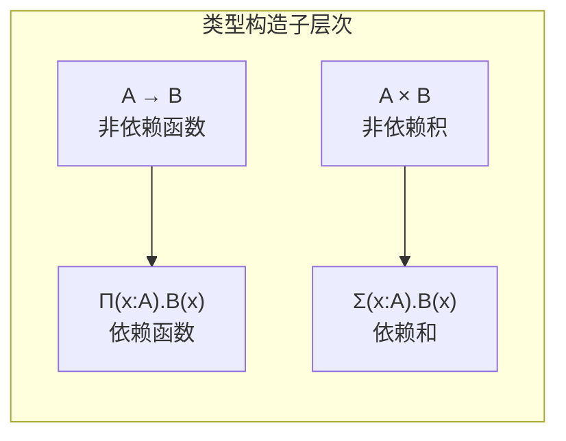

# 02.3 依赖类型

## 1. 依赖类型基础

### 1.1 依赖函数类型 (Π类型)

**定义 1.1.1** (依赖函数类型). $\Pi(x:A). B(x)$ 表示：对每个 $x:A$，返回值类型为 $B(x)$ 的函数。

**直觉**：当 $B$ 不依赖于 $x$ 时，$\Pi(x:A). B = A \rightarrow B$。

**例 1.1.2**. 向量长度的类型化：

```
replicate : Π(n : Nat). A → Vec A n
```

**定义 1.1.3** (依赖对类型 / Σ类型). $\Sigma(x:A). B(x)$ 表示：第一个分量为 $x:A$，第二个分量为 $B(x)$ 的有依赖的序对。

**直觉**：当 $B$ 不依赖于 $x$ 时，$\Sigma(x:A). B = A \times B$。



### 1.2 类型与项的统一

**定义 1.2.1** (依赖类型理论的核心). 在依赖类型中：

- **类型也是项**：每个类型 $A$ 有类型 $\text{Type}$（或 $U$，宇宙）
- **项可以出现在类型中**：类型可以依赖于项的值

**层次结构**:
$$\text{Term} : \text{Type} : \text{Type}_1 : \text{Type}_2 : \cdots$$

```lean4
-- 依赖函数类型 (Π类型)
def Vec (A : Type) (n : Nat) : Type :=
  { l : List A // l.length = n }

-- 依赖函数：返回类型依赖于参数值
def replicate (A : Type) : (n : Nat) → A → Vec A n
  | 0, _ => ⟨[], rfl⟩
  | n+1, a =>
    let ⟨tail, h⟩ := replicate A n a
    ⟨a :: tail, by simp [h]⟩

-- Σ类型 (依赖对)
def Σ (A : Type) (B : A → Type) : Type :=
  Σ' a : A, B a

-- 存在量词作为Σ类型的特例
def Exists (A : Type) (P : A → Prop) : Prop :=
  ∃ a : A, P a
```

## 2. 归纳族与归纳类型

### 2.1 归纳族定义

**定义 2.1.1** (归纳族). 带有索引的归纳类型，其中索引可以依赖于其他参数。

**例 2.1.2** (长度索引向量).

```
data Vec (A : Type) : Nat → Type where
  | nil : Vec A 0
  | cons : A → Vec A n → Vec A (n+1)
```

**推导规则**:
$$
\frac{}{\Gamma \vdash \text{nil} : \text{Vec} \, A \, 0}
\quad
\frac{\Gamma \vdash a : A \quad \Gamma \vdash v : \text{Vec} \, A \, n}{\Gamma \vdash \text{cons} \, a \, v : \text{Vec} \, A \, (n+1)}
$$

```lean4
-- 长度索引向量（归纳族）
inductive Vec (A : Type) : Nat → Type where
  | nil : Vec A 0
  | cons : A → {n : Nat} → Vec A n → Vec A (n + 1)

deriving Repr

-- 安全取元素（类型保证索引不越界）
def Vec.get {A : Type} {n : Nat} (v : Vec A n) (i : Fin n) : A :=
  match v, i with
  | .cons x _, ⟨0, _⟩ => x
  | .cons _ xs, ⟨i+1, h⟩ => xs.get ⟨i, by omega⟩
  | .nil, ⟨i, h⟩ => by simp [Vec.nil] at h; contradiction

-- 类型安全的append
def Vec.append {A : Type} {m n : Nat} : Vec A m → Vec A n → Vec A (m + n)
  | .nil, ys => ys
  | .cons x xs, ys => .cons x (append xs ys)
```

### 2.2 索引类型族

**定义 2.2.1** (有限类型). 恰好有 $n$ 个元素的类型：

```
Fin : Nat → Type
Fin n = { k : Nat | k < n }
```

**定义 2.2.2** (等式类型 / 等同类型).

```
Eq {A : Type} : A → A → Prop
refl {A : Type} {a : A} : Eq a a
```

```lean4
-- 有限类型 Fin n = {0, 1, ..., n-1}
inductive Fin : Nat → Type where
  | zero : {n : Nat} → Fin (n + 1)
  | succ : {n : Nat} → Fin n → Fin (n + 1)

-- 等同类型 (恒等类型)
inductive Eq {A : Type} : A → A → Prop where
  | refl {a : A} : Eq a a

-- 基于 J 规则的 eliminator
def Eq.rec' {A : Type} {a : A} {motive : (b : A) → Eq a b → Sort u}
  (refl : motive a (.refl)) {b : A} (h : Eq a b) : motive b h :=
  match h with
  | .refl => refl
```

### 2.3 归纳原理

**定理 2.3.1** (依赖消除规则). 对归纳族 $I : \Delta \rightarrow \text{Type}$，归纳原理形如：

$$
\frac{\Gamma, \vec{x}:\Delta, y:I(\vec{x}) \vdash P(\vec{x}, y) : \text{Type} \quad \text{（方法）}}{\Gamma, \vec{x}:\Delta, y:I(\vec{x}) \vdash \text{rec}(\text{methods}, y) : P(\vec{x}, y)}
$$

## 3. 证明即程序

### 3.1 Curry-Howard深化

**对应关系**：

| 逻辑 | 类型 |
|:---:|:---|
| 命题 $P$ | 类型 `P : Prop` |
| 证明 $p : P$ | 项 `p : P` |
| $P \rightarrow Q$ | 函数类型 `P → Q` |
| $\forall x:A. P(x)$ | 依赖函数 `∀ x : A, P x` |
| $\exists x:A. P(x)$ | 依赖对 `Σ x : A, P x` |
| $P \land Q$ | 积类型 `P × Q` |
| $P \lor Q$ | 和类型 `P ⊕ Q` |

```lean4
-- 证明作为程序示例
-- 命题：若 P → Q 且 P，则 Q
def modusPonens {P Q : Prop} (h1 : P → Q) (h2 : P) : Q :=
  h1 h2

-- 命题：∀x, P(x) → ∃x, P(x)
def existence {A : Type} {P : A → Prop} (a : A) (h : P a) : ∃ x, P x :=
  ⟨a, h⟩

-- 命题：P ∧ Q → P
def proj1 {P Q : Prop} (h : P ∧ Q) : P :=
  h.1
```

### 3.2 等式证明

**定义 3.2.1** (等式重写).

```
Eq.subst : {A : Type} {P : A → Prop} {a b : A} → Eq a b → P a → P b
```

**定理 3.2.2** (对称性、传递性).

```
Eq.symm : Eq a b → Eq b a
Eq.trans : Eq a b → Eq b c → Eq a c
```

```lean4
-- 等式证明示例
def Vec.length_append {A : Type} {m n : Nat}
  (xs : Vec A m) (ys : Vec A n) :
  Eq (Vec.append xs ys).length (m + n) :=
  match xs with
  | .nil => by simp [Vec.append, Vec.length]
  | .cons x xs' => by
    simp [Vec.append, Vec.length]
    rw [Vec.length_append xs' ys]
    rfl

-- 使用内置等式简化证明
example {A : Type} {n : Nat} (v : Vec A n) :
  Vec.append v Vec.nil = v := by
  induction v with
  | nil => rfl
  | cons x xs ih =>
    simp [Vec.append, ih]
```

## 4. 通用代数与类型

### 4.1 签名与代数

**定义 4.1.1** (单类签名). $\Sigma = (S, F)$，其中：

- $S$：排序集合
- $F$：操作符号，每个带有元数 $(s_1, \ldots, s_n) \rightarrow s$

**定义 4.1.2** ($\Sigma$-代数). 为每个排序 $s \in S$ 分配载体集 $A_s$，为每个操作 $f$ 分配函数 $f^A$。

```lean4
-- 群签名作为类型类
class GroupSig (G : Type) where
  unit : G
  mul : G → G → G
  inv : G → G

-- 群公理
class Group (G : Type) extends GroupSig G where
  mul_assoc : ∀ x y z, mul (mul x y) z = mul x (mul y z)
  unit_left : ∀ x, mul unit x = x
  unit_right : ∀ x, mul x unit = x
  inv_left : ∀ x, mul (inv x) x = unit
  inv_right : ∀ x, mul x (inv x) = unit
```

### 4.2 初始代数与终结代数

**定义 4.2.1** (初始代数). 代数 $A$ 是**初始**的，如果对任意代数 $B$，存在唯一的同态 $h : A \rightarrow B$。

**定理 4.2.2** (语法代数是初始的). 归纳类型（如 `Nat`, `List A`）构成其签名的初始代数。

## 5. 高级依赖类型特性

### 5.1 宇宙层级

**定义 5.1.1** (宇宙). `Type`（或 `Sort 1`）是类型的类型。

**定义 5.1.2** (宇宙层级).

```
Sort 0 = Prop  -- 证明无关宇宙
Sort 1 = Type  -- 数据类型宇宙
Sort 2 = Type 1  -- 更高层级
...
```

**定义 5.1.3** (宇宙多态). 定义对所有层级有效的多态定义：

```
{id {α : Sort u} (a : α) : α := a}
```

```lean4
-- 宇宙多态示例
universe u v

def id' {α : Sort u} (a : α) : α := a

def const {α : Sort u} {β : Sort v} (a : α) (b : β) : α := a

-- 类型构造函数
structure Functor (F : Type u → Type v) : Type (max u+1 v) where
  map : {α β : Type u} → (α → β) → F α → F β
  map_id : {α : Type u} → map (id : α → α) = id
  map_comp : {α β γ : Type u} (f : α → β) (g : β → γ) →
             map (g ∘ f) = map g ∘ map f
```

### 5.2 互归纳与嵌套归纳

**定义 5.2.1** (互归纳类型). 同时定义多个相互引用的归纳类型。

```lean4
-- 互归纳：表达式与语句
mutual
  inductive Expr : Type where
    | const : Nat → Expr
    | var : String → Expr
    | add : Expr → Expr → Expr
    | call : String → List Expr → Expr  -- 互引用

  inductive Stmt : Type where
    | assign : String → Expr → Stmt
    | seq : Stmt → Stmt → Stmt
    | if_ : Expr → Stmt → Stmt → Stmt
    | while : Expr → Stmt → Stmt
end
```

## 参考

- [02.1 简单类型系统](./02.1_简单类型系统.md) - 类型系统基础
- [02.2 多态类型](./02.2_多态类型.md) - 参数多态
- [02.4 类型论与逻辑](./02.4_类型论与逻辑.md) - Curry-Howard同构深入
- [03.1 HoTT基础](../03_同伦类型论_HoTT/03.1_HoTT基础.md) - 同伦类型论
