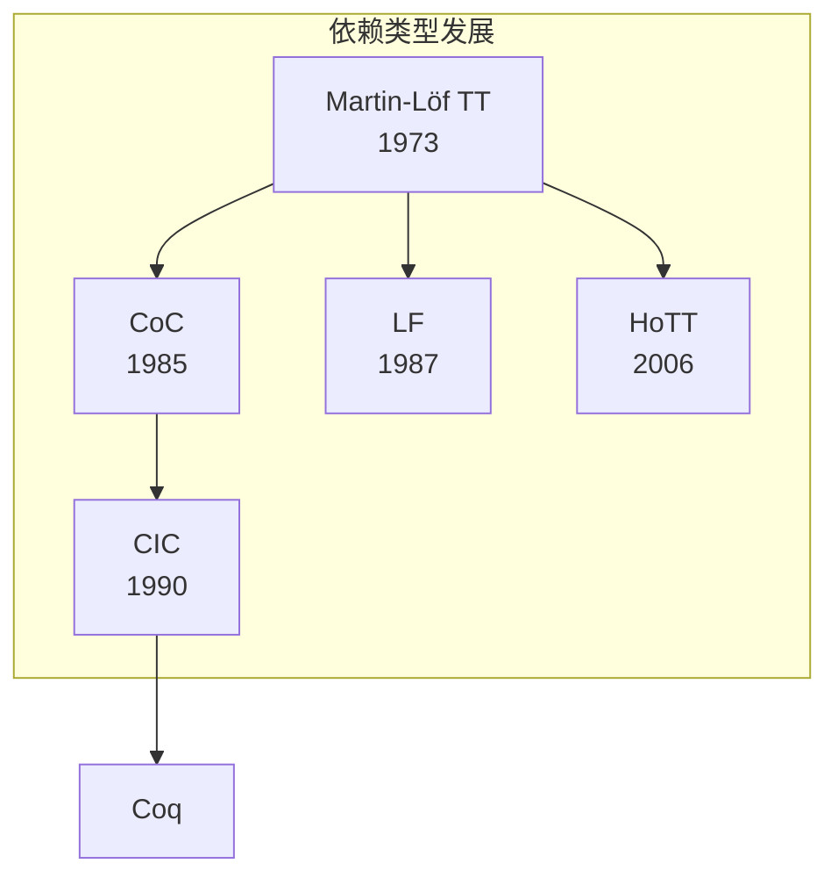

# 2.3 依赖类型论 (Dependent Type Theory)

## 目录

- [2.3 依赖类型论 (Dependent Type Theory)](#23-依赖类型论-dependent-type-theory)
  - [目录](#目录)
  - [2.3.1 引言](#231-引言)
  - [2.3.2 Martin-Löf类型论](#232-martin-löf类型论)
    - [2.3.2.1 判断与类型](#2321-判断与类型)
    - [2.3.2.2 类型构造子](#2322-类型构造子)
  - [2.3.3 Π类型（依赖函数类型）](#233-π类型依赖函数类型)
    - [2.3.3.1 全称量化](#2331-全称量化)
    - [2.3.3.2 函数类型作为特例](#2332-函数类型作为特例)
  - [2.3.4 Σ类型（依赖对类型）](#234-σ类型依赖对类型)
    - [2.3.4.1 存在量化](#2341-存在量化)
    - [2.3.4.2 积类型作为特例](#2342-积类型作为特例)
  - [2.3.5 归纳类型](#235-归纳类型)
    - [2.3.5.1 归纳定义](#2351-归纳定义)
    - [2.3.5.2 递归与归纳](#2352-递归与归纳)
  - [2.3.6 类型作为命题](#236-类型作为命题)
    - [2.3.6.1 Curry-Howard深化](#2361-curry-howard深化)
    - [2.3.6.2 证明携带代码](#2362-证明携带代码)
  - [2.3.7 依赖类型系统的实现](#237-依赖类型系统的实现)
  - [2.3.8 形式化证明](#238-形式化证明)
    - [Lean 4：依赖类型基础](#lean-4依赖类型基础)
    - [Agda风格伪代码](#agda风格伪代码)
  - [2.3.9 总结](#239-总结)

---

## 2.3.1 引言

依赖类型论(Dependent Type Theory)由Per Martin-Löf在1970年代发展，是类型论的扩展，允许**类型依赖于项的值**。
这种依赖关系使得类型系统能够表达更丰富的规范，实现"证明即程序，类型即命题"的完整Curry-Howard对应。

**依赖类型的核心特性**：

- 类型可以包含（依赖于）项
- 支持形式化数学证明
- 实现证明携带代码(Proof-Carrying Code)



> **引用**: 简单类型论见 [02.1_简单类型论.md](./02.1_简单类型论.md)，多态类型见 [02.2_多态类型论.md](./02.2_多态类型论.md)，同伦类型论见 [../03_同伦类型论_HoTT/03.2_恒等类型.md](../03_同伦类型论_HoTT/03.2_恒等类型.md)。

---

## 2.3.2 Martin-Löf类型论

### 2.3.2.1 判断与类型

**定义 2.3.1 (判断)** MLTT基于四种判断形式：

| 判断 | 含义 |
|------|------|
| $\Gamma \vdash A\, \text{type}$ | $A$ 是一个良形类型 |
| $\Gamma \vdash A \equiv B\, \text{type}$ | $A$ 和 $B$ 是定义相等的类型 |
| $\Gamma \vdash a : A$ | $a$ 是类型 $A$ 的项 |
| $\Gamma \vdash a \equiv b : A$ | $a$ 和 $b$ 在类型 $A$ 中定义相等 |

**定义 2.3.2 (上下文)** 上下文 $\Gamma$ 是变量声明的序列：

$$\Gamma ::= \emptyset \mid \Gamma, x:A$$

### 2.3.2.2 类型构造子

**基本类型构造子**：

| 构造子 | 符号 | 说明 |
|--------|------|------|
| 函数类型 | $\Pi x:A. B$ | 依赖函数 |
| 对类型 | $\Sigma x:A. B$ | 依赖对/存在量词 |
| 和类型 | $A + B$ | 互斥并/析取 |
| 空类型 | $\mathbf{0}$ | 假命题 |
| 单元类型 | $\mathbf{1}$ | 真命题 |
| 自然数 | $\mathbb{N}$ | 归纳类型 |
| 恒等类型 | $\text{Id}_A(a, b)$ | 相等证明 |

---

## 2.3.3 Π类型（依赖函数类型）

### 2.3.3.1 全称量化

**定义 2.3.3 (Π类型)** $\Pi x:A. B$ 表示对于所有 $x:A$，返回类型 $B$（可依赖于 $x$）的函数类型。

$$\frac{\Gamma \vdash A\, \text{type} \quad \Gamma, x:A \vdash B\, \text{type}}{\Gamma \vdash \Pi x:A. B\, \text{type}} \text{(Π-FORM)}$$

**引入规则**：

$$\frac{\Gamma, x:A \vdash b : B}{\Gamma \vdash \lambda x.b : \Pi x:A. B} \text{(Π-INTRO)}$$

**消去规则**：

$$\frac{\Gamma \vdash f : \Pi x:A. B \quad \Gamma \vdash a : A}{\Gamma \vdash f(a) : B[a/x]} \text{(Π-ELIM)}$$

**计算规则**：

$$(\lambda x.b)(a) \equiv b[a/x] : B[a/x]$$

### 2.3.3.2 函数类型作为特例

**定义 2.3.4 (非依赖函数)** 当 $B$ 不依赖于 $x$ 时：

$$A \rightarrow B := \Pi x:A. B \quad \text{(其中 } x \notin \text{FV}(B)\text{)}$$

**示例**：

- $\Pi n:\mathbb{N}. \text{Vec } A\, n$：返回长度为$n$的向量的函数
- $\mathbb{N} \rightarrow \mathbb{N}$：普通自然数函数

---

## 2.3.4 Σ类型（依赖对类型）

### 2.3.4.1 存在量化

**定义 2.3.5 (Σ类型)** $\Sigma x:A. B$ 表示存在 $x:A$ 使得 $B$ 成立的类型（存在量词）。

$$\frac{\Gamma \vdash A\, \text{type} \quad \Gamma, x:A \vdash B\, \text{type}}{\Gamma \vdash \Sigma x:A. B\, \text{type}} \text{(Σ-FORM)}$$

**引入规则**：

$$\frac{\Gamma \vdash a : A \quad \Gamma \vdash b : B[a/x]}{\Gamma \vdash (a, b) : \Sigma x:A. B} \text{(Σ-INTRO)}$$

**消去规则**：

$$\frac{\Gamma \vdash p : \Sigma x:A. B}{\Gamma \vdash \pi_1(p) : A} \text{(Σ-PROJ1)}$$

$$\frac{\Gamma \vdash p : \Sigma x:A. B}{\Gamma \vdash \pi_2(p) : B[\pi_1(p)/x]} \text{(Σ-PROJ2)}$$

**计算规则**：

$$\pi_1(a, b) \equiv a : A$$
$$\pi_2(a, b) \equiv b : B[a/x]$$

### 2.3.4.2 积类型作为特例

**定义 2.3.6 (非依赖积)** 当 $B$ 不依赖于 $x$ 时：

$$A \times B := \Sigma x:A. B \quad \text{(其中 } x \notin \text{FV}(B)\text{)}$$

**Curry-Howard对应**：

| 逻辑 | 类型 |
|------|------|
| $\forall x:A. B(x)$ | $\Pi x:A. B(x)$ |
| $\exists x:A. B(x)$ | $\Sigma x:A. B(x)$ |
| $A \Rightarrow B$ | $A \rightarrow B$ |
| $A \land B$ | $A \times B$ |

---

## 2.3.5 归纳类型

### 2.3.5.1 归纳定义

**定义 2.3.7 (归纳类型)** 通过引入规则生成的类型，具有归纳原理。

**自然数的归纳定义**：

$$\frac{}{\Gamma \vdash \mathbb{N}\, \text{type}} \text{(N-FORM)}$$

$$\frac{}{\Gamma \vdash 0 : \mathbb{N}} \text{(N-INTRO-0)}$$

$$\frac{\Gamma \vdash n : \mathbb{N}}{\Gamma \vdash \text{succ}(n) : \mathbb{N}} \text{(N-INTRO-SUCC)}$$

**归纳原理（消去规则）**：

$$\frac{\Gamma \vdash n : \mathbb{N} \quad \Gamma \vdash c_0 : C[0/x] \quad \Gamma \vdash c_s : \Pi n:\mathbb{N}. C[n/x] \rightarrow C[\text{succ}(n)/x]}{\Gamma \vdash \text{rec}_\mathbb{N}(C, c_0, c_s, n) : C[n/x]}$$

### 2.3.5.2 递归与归纳

**定义 2.3.8 (原始递归)** 自然数上的递归函数：

$$\text{rec}_\mathbb{N}(C, c_0, c_s, 0) \equiv c_0$$
$$\text{rec}_\mathbb{N}(C, c_0, c_s, \text{succ}(n)) \equiv c_s(n, \text{rec}_\mathbb{N}(C, c_0, c_s, n))$$

**示例**：加法

$$\text{add} := \lambda m. \lambda n. \text{rec}_\mathbb{N}(\mathbb{N}, n, \lambda x. \lambda y. \text{succ}(y), m)$$

---

## 2.3.6 类型作为命题

### 2.3.6.1 Curry-Howard深化

在依赖类型论中，Curry-Howard对应更加完整：

| 逻辑概念 | 类型概念 |
|---------|---------|
| 命题 | 类型 |
| 证明 | 项 |
| $A \Rightarrow B$ | $A \rightarrow B$ |
| $A \land B$ | $A \times B$ |
| $A \lor B$ | $A + B$ |
| $\forall x:A. B(x)$ | $\Pi x:A. B(x)$ |
| $\exists x:A. B(x)$ | $\Sigma x:A. B(x)$ |
| $\neg A$ | $A \rightarrow \mathbf{0}$ |
| $a =_A b$ | $\text{Id}_A(a, b)$ |

**命题即类型**：一个命题为真当且仅当其对应的类型有元素。

### 2.3.6.2 证明携带代码

**定义 2.3.9 (证明携带代码)** 类型中包含正确性证明的程序：

$$\text{sort} : \Pi xs:\text{List } A. \Sigma ys:\text{List } A. \text{Sorted}(ys) \times \text{Perm}(xs, ys)$$

其中：

- $\text{Sorted}(ys)$：$ys$ 是有序的证明
- $\text{Perm}(xs, ys)$：$ys$ 是 $xs$ 排列的证明

---

## 2.3.7 依赖类型系统的实现

**主要系统**：

| 系统 | 核心类型论 | 特点 |
|------|-----------|------|
| **Coq** | CIC (归纳构造演算) | 证明助手，提取可执行代码 |
| **Agda** | 依赖类型λ演算 | 通用编程，依赖类型原生支持 |
| **Idris** | 依赖类型λ演算 | 工业级编程语言 |
| **Lean** | 依赖类型论 | 现代化证明助手，元编程 |
| **Twelf** | LF (逻辑框架) | 元逻辑框架 |

**CIC (归纳构造演算)** 扩展了：

- 宇宙层级(Type, Type₁, Type₂, ...)
- 归纳定义族
- 互归纳和嵌套归纳

---

## 2.3.8 形式化证明

### Lean 4：依赖类型基础

```lean4
-- Π类型（依赖函数）
def Vec (A : Type) (n : Nat) : Type :=
  { l : List A // l.length = n }

-- 返回特定长度向量的函数
def replicate {A : Type} (n : Nat) (a : A) : Vec A n :=
  ⟨List.replicate n a, by simp⟩

-- Σ类型（依赖对）
def Σ' (A : Type) (B : A → Type) : Type :=
  Σ a : A, B a

-- 存在量词作为Σ类型
def Exists' {A : Type} (P : A → Prop) : Prop :=
  Σ' A P

-- 证明携带的排序函数结构
def Sorted (l : List Nat) : Prop :=
  ∀ i j, i < j → j < l.length → l[i]! ≤ l[j]!

def Permutation (l1 l2 : List Nat) : Prop :=
  l1 ~ l2  -- 使用Lean的排列关系

-- 证明携带的排序函数类型
def SortResult (input : List Nat) : Type :=
  { output : List Nat // Sorted output ∧ Permutation input output }

def sortSpec : List Nat → Type := SortResult

-- 自然数归纳示例
def natInduction {P : Nat → Prop}
  (base : P 0)
  (step : ∀ n, P n → P (n + 1))
  (n : Nat) : P n :=
  Nat.rec base step n

-- 向量操作（类型安全）
def vhead {A : Type} {n : Nat} (v : Vec A (n + 1)) : A :=
  v.val.head (by have := v.property; simp at this; omega)
```

### Agda风格伪代码

```agda
-- 依赖类型向量
module DependentTypes where

open import Data.Nat
open import Data.List

-- 向量：长度索引的列表
data Vec (A : Set) : ℕ → Set where
  []  : Vec A zero
  _∷_ : {n : ℕ} → A → Vec A n → Vec A (suc n)

-- 安全head：类型保证非空
head : {A : Set} {n : ℕ} → Vec A (suc n) → A
head (x ∷ xs) = x

-- 安全tail
tail : {A : Set} {n : ℕ} → Vec A (suc n) → Vec A n
tail (x ∷ xs) = xs

-- 依赖类型append
_++_ : {A : Set} {m n : ℕ} → Vec A m → Vec A n → Vec A (m + n)
[]       ++ ys = ys
(x ∷ xs) ++ ys = x ∷ (xs ++ ys)

-- Fin类型：有限自然数
data Fin : ℕ → Set where
  zero : {n : ℕ} → Fin (suc n)
  suc  : {n : ℕ} → Fin n → Fin (suc n)

-- 安全lookup
lookup : {A : Set} {n : ℕ} → Fin n → Vec A n → A
lookup zero    (x ∷ xs) = x
lookup (suc i) (x ∷ xs) = lookup i xs

-- Σ类型
record Σ (A : Set) (B : A → Set) : Set where
  constructor _,_
  field
    proj₁ : A
    proj₂ : B proj₁

open Σ public

-- 存在量词
∃ : {A : Set} → (A → Set) → Set
∃ = Σ _

-- 证明携带的排序
postulate
  _≤_ : ℕ → ℕ → Set
  Sorted : {n : ℕ} → Vec ℕ n → Set
  Permutation : {n : ℕ} → Vec ℕ n → Vec ℕ n → Set

-- 排序规格
SortResult : {n : ℕ} → Vec ℕ n → Set
SortResult {n} xs = ∃ λ ys → Sorted ys × Permutation xs ys

sort : {n : ℕ} (xs : Vec ℕ n) → SortResult xs
sort xs = ?  -- 实现省略
```

---

## 2.3.9 总结

**依赖类型核心概念**：

| 类型 | 形式 | 对应逻辑 |
|------|------|---------|
| Π类型 | $\Pi x:A. B$ | 全称量词 $\forall$ |
| Σ类型 | $\Sigma x:A. B$ | 存在量词 $\exists$ |
| 函数 | $A \rightarrow B$ | 蕴涵 |
| 积 | $A \times B$ | 合取 |
| 和 | $A + B$ | 析取 |
| 恒等 | $\text{Id}_A(a,b)$ | 相等 |

**依赖类型系统的特性**：

| 特性 | 说明 |
|------|------|
| **证明即程序** | 数学证明可直接执行 |
| **类型即规范** | 类型精确定义程序行为 |
| **编译时验证** | 错误在编译期捕获 |
| **零开销抽象** | 证明在运行时被擦除 |

**延伸阅读**：

- [02.4_类型论进阶.md](./02.4_类型论进阶.md) - 宇宙层级、归纳递归
- [../03_同伦类型论_HoTT/03.1_同伦基础.md](../03_同伦类型论_HoTT/03.1_同伦基础.md) - 同伦视角的类型论
- [../04_范畴论/04.4_范畴论语义.md](../04_范畴论/04.4_范畴论语义.md) - 依赖类型的范畴论语义

---

_文档版本: 1.0 | 最后更新: 2026-04-11_
