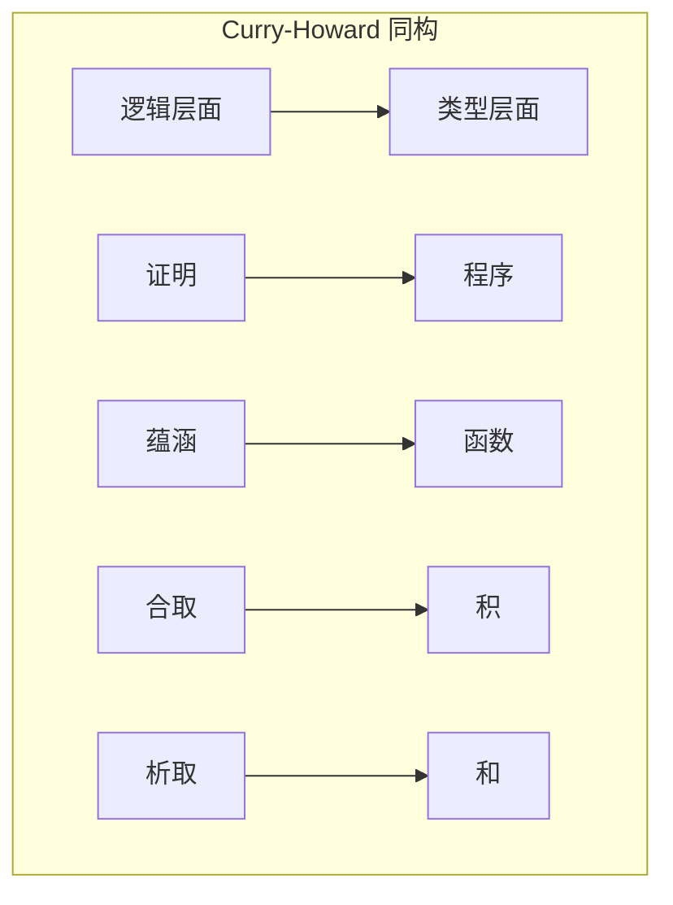

# 02.4 类型论与逻辑

---

📌 **内容摘要**

本文档深入探讨类型论与逻辑的核心原理和关键方法。内容涵盖类型论领域的主要知识点，包括函数式, λ演算, 归约, 简单类型等关键主题。适合具备相关基础的学习者进行深入研究。

**关键词**: 函数式, λ演算, 类型论, 归约, 简单类型, 类型安全

📚 **学习目标**
- 深入理解类型论与逻辑的理论体系和形式化方法
- 能够进行相关定理的形式化证明
- 建立该领域的系统性知识框架

🎯 **难度级别**: 高级

⏱️ **预计阅读时间**: 15分钟

**前置知识**: 该领域的中级知识, 形式化方法基础, 离散数学

---


## 1. Curry-Howard同构

### 1.1 核心对应

**定理 1.1.1** (Curry-Howard同构). 直觉主义命题逻辑与简单类型λ演算之间存在一一对应：

| 逻辑 | 类型论 |
|:---:|:---|
| 命题 | 类型 |
| 证明 | 项/程序 |
| 蕴涵 P → Q | 函数类型 `P → Q` |
| 合取 P ∧ Q | 积类型 `P × Q` |
| 析取 P ∨ Q | 和类型 `P ⊕ Q` |
| 假 ⊥ | 空类型 `Empty` |
| 真 ⊤ | 单位类型 `Unit` |

**推论 1.1.2**. 证明规范化对应程序求值，证明检查对应类型检查。



### 1.2 命题即类型

**定义 1.2.1** (命题作为类型).

- 若 P 是命题，则它也是类型，其元素是 P 的证明
- 类型 `True`（或 `Unit`）有且只有一个证明 `trivial`
- 类型 `False`（或 `Empty`）无证明

```lean4
-- 命题作为类型
inductive True : Prop where
  | intro : True

inductive False : Prop where
-- 无构造子

-- 否定定义为蕴涵假
def Not (P : Prop) : Prop := P → False

-- 经典逻辑中的排中律
axiom em (P : Prop) : P ∨ ¬P
-- 注意：这在直觉主义逻辑中不可证
```

### 1.3 证明规范化

**定理 1.3.1** (证明规范化). 直觉主义自然演绎中的证明可以规范化为标准形式（无冗余步骤）。

**对应关系**：

- 证明的规范化 ↔ λ项的β归约
- 证明的合流性 ↔ Church-Rosser定理
- 证明的范式唯一性 ↔ 规范化性质

## 2. 量词的对应

### 2.1 全称量词与Π类型

**定理 2.1.1**. 全称量词 ∀x:A.P(x) 对应依赖函数类型 Π(x:A).P(x)。

**证明构造**：

- 引入规则：假设 x:A，证明 P(x) ↔ λ抽象 λx:A.p
- 消去规则：对特定 a:A，得到 P(a) ↔ 函数应用 p a

```lean4
-- ∀引入（λ抽象）
def forallIntro {A : Type} {P : A → Prop}
  (h : ∀ x : A, P x) : ∀ x : A, P x := h

-- ∀消去（函数应用）
def forallElim {A : Type} {P : A → Prop}
  (h : ∀ x : A, P x) (a : A) : P a := h a

-- 全称量词的证明作为函数
example {A : Type} {P Q : A → Prop}
  (h1 : ∀ x, P x → Q x) (h2 : ∀ x, P x) : ∀ x, Q x :=
  λ x => h1 x (h2 x)
```

### 2.2 存在量词与Σ类型

**定理 2.2.1**. 存在量词 ∃x:A.P(x) 对应依赖对类型 Σ(x:A).P(x)。

**证明构造**：

- 引入规则：给出证据 a:A 和证明 p:P(a) ↔ 序对 `⟨a, p⟩`
- 消去规则：从存在证明提取证据 ↔ 投影运算

```lean4
-- ∃引入（构造序对）
def existsIntro {A : Type} {P : A → Prop}
  (a : A) (h : P a) : ∃ x, P x := ⟨a, h⟩

-- ∃消去（依赖模式匹配）
def existsElim {A : Type} {P : A → Prop} {Q : Prop}
  (h : ∃ x, P x) (f : ∀ x, P x → Q) : Q :=
  match h with
  | ⟨a, ha⟩ => f a ha

-- 存在量词与Σ类型的关系
example {A : Type} {P : A → Prop} :
  (∃ x, P x) ↔ Nonempty (Σ x, P x) := by
  constructor
  · intro ⟨a, ha⟩
    exact ⟨⟨a, ha⟩⟩
  · intro ⟨⟨a, ha⟩⟩
    exact ⟨a, ha⟩
```

## 3. 不同的逻辑系统

### 3.1 直觉主义逻辑

**定义 3.1.1** (直觉主义逻辑特征).

- 拒绝排中律 P ∨ ¬P
- 拒绝双重否定消去 ¬¬P → P
- 存在证明必须构造性地给出证据

**定理 3.1.2**. 在直觉主义逻辑中，以下等价：

- ¬P 可证
- P → ⊥ 可证

```lean4
-- 直觉主义逻辑中可证的定律
example (P : Prop) : P → ¬¬P :=
  λ p np => np p

example (P Q : Prop) : (P → Q) → (¬Q → ¬P) :=
  λ h nq p => nq (h p)

-- 这些在直觉主义中不可证（需要经典公理）
-- example (P : Prop) : ¬¬P → P
-- example (P : Prop) : P ∨ ¬P
```

### 3.2 经典逻辑的嵌入

**定理 3.2.1** (双重否定翻译). 任何经典逻辑命题 P 可翻译为直觉主义逻辑命题 P*，使得：

- P 在经典逻辑中可证 ⇔ P* 在直觉主义逻辑中可证

**翻译规则**:

- P* = ¬¬P（原子命题）
- (A ∧ B)_= A_ ∧ B*
- (A ∨ B)_= ¬(¬A_ ∧ ¬B*)
- (A → B)_= A_ → B*

```lean4
-- 双重否定翻译
def DNTranslation (P : Prop) : Prop := ¬¬P

-- 证明：经典排中律的双重否定是直觉主义可证的
theorem dn_em (P : Prop) : DNTranslation (P ∨ ¬P) :=
  λ h => h (.inr λ p => h (.inl p))

-- 从经典逻辑到直觉主义的转换
def classicalToIntuitionistic {P : Prop}
  (h : DNTranslation P) : DNTranslation P := h
```

### 3.3 线性逻辑

**定义 3.3.1** (线性逻辑). 资源敏感的逻辑，区分：

- **线性蕴涵** A ⊸ B：使用 A 一次得到 B
- **乘法合取** A ⊗ B：同时拥有 A 和 B
- **加法合取** A & B：选择拥有 A 或 B

**对应**：线性类型系统，追踪资源使用。

## 4. 证明助手与形式化

### 4.1 Lean的推理机制

```lean4
-- 基本证明策略
theorem andComm {P Q : Prop} : P ∧ Q → Q ∧ P := by
  intro h           -- 引入假设
  cases h with      -- 情况分析
  | intro hp hq =>  -- 解构合取
    constructor     -- 构造目标
    · exact hq      -- 精确匹配
    · exact hp

-- 使用模式匹配
theorem orComm {P Q : Prop} : P ∨ Q → Q ∨ P
  | .inl hp => .inr hp
  | .inr hq => .inl hq

-- 归纳证明
theorem natAddComm (n m : Nat) : n + m = m + n := by
  induction n with
  | zero => simp
  | succ n ih =>
    simp [Nat.add_succ, ih]
```

### 4.2 公理与可计算性

**定义 4.2.1** (选择公理).

```
axiom choice {α : Sort u} {β : α → Sort v}
  {r : ∀ x, β x → Prop} (∀ x, ∃ y, r x y) → ∃ f, ∀ x, r x (f x)
```

**定义 4.2.2** (命题外延性).

```
axiom propext {P Q : Prop} : (P ↔ Q) → P = Q
```

**定理 4.2.3** (函数外延性).

```
axiom funext {α : Sort u} {β : α → Sort v} {f g : ∀ x, β x}
  (∀ x, f x = g x) → f = g
```

```lean4
-- 命题外延性的使用
example {P Q : Prop} (h : P ↔ Q) : P = Q :=
  propext h

-- 函数外延性示例
def f (x : Nat) := x + 1
def g (x : Nat) := 1 + x

example : f = g := by
  funext x
  simp [f, g, Nat.add_comm]
```

## 5. 高阶类型论

### 5.1 谓词逻辑的高阶编码

**定义 5.1.1** (谓词作为函数).

- 一阶谓词 P : A → Prop
- 高阶谓词 Q : (A → Prop) → Prop

**例 5.1.2**. 归纳定义的性质：

```
Even : Nat → Prop
Even 0 = True
Even (n+1) = ¬Even n
```

```lean4
-- 偶数的归纳定义
inductive Even : Nat → Prop where
  | zero : Even 0
  | add2 : {n : Nat} → Even n → Even (n + 2)

-- 奇数的定义
def Odd (n : Nat) : Prop := ∃ m, n = 2 * m + 1

-- 证明偶数性质
theorem evenAddEven {n m : Nat} (h1 : Even n) (h2 : Even m) : Even (n + m) := by
  induction h1 with
  | zero => simpa
  | add2 n h ih =>
    simp [Nat.add_assoc]
    apply Even.add2
    exact ih
```

### 5.2 集合论与类型论

**定理 5.2.1** (集合作为类型). 在类型论中：

- 集合 {x ∈ A | P(x)} 对应子类型 {x : A // P x}
- 集合运算对应类型构造：
  - 并：和类型 `A ⊕ B`（不交并）
  - 交：依赖对 `Σ x, P x ∧ Q x`

```lean4
-- 子类型（集合表示）
def Set (A : Type) : Type := A → Prop

def Set.mem {A} (a : A) (s : Set A) : Prop := s a

-- 子集包含
def Set.subset {A} (s t : Set A) : Prop := ∀ x, s x → t x

-- 交集
def Set.inter {A} (s t : Set A) : Set A := λ x => s x ∧ t x

-- 并集（需要选择）
def Set.union {A} (s t : Set A) : Set A := λ x => s x ∨ t x
```

## 参考

- [02.1 简单类型系统](./02.1_简单类型系统.md) - 类型系统基础
- [02.2 多态类型](./02.2_多态类型.md) - 参数多态
- [02.3 依赖类型](./02.3_依赖类型.md) - 依赖类型系统
- [03.1 HoTT基础](../03_同伦类型论_HoTT/03.1_HoTT基础.md) - 同伦类型论扩展

---

## 📋 前置知识

- [02.3 依赖类型](../02_类型论/02.3_依赖类型.md)
- [1.2 数理逻辑](./01_数学基础/01_元数学基础/01.2_数理逻辑.md)

---

## 📚 延伸阅读

- [1.1 集合论基础](./01_数学基础/01_元数学基础/01.1_集合论基础.md)
- [02.1 简单类型系统](../02_类型论/02.1_简单类型系统.md)
- [2.1 简单类型论 (Simply Typed Lambda Calculus)](../02_类型论/02.1_简单类型论.md)
- [02.3 依赖类型](../02_类型论/02.3_依赖类型.md)
- [2.3 依赖类型论 (Dependent Type Theory)](../02_类型论/02.3_依赖类型论.md)
