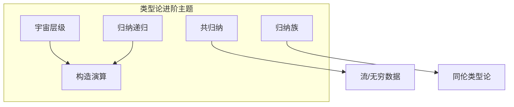
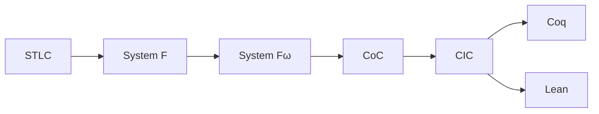

# 2.4 类型论进阶 (Advanced Type Theory)

---

📌 **内容摘要**

本文档深入探讨类型论进阶的核心原理和关键方法。内容涵盖类型论领域的主要知识点，包括相关理论、方法及应用。适合具备相关基础的学习者进行深入研究。

**关键词**: 类型论

📚 **学习目标**

- 深入理解类型论进阶的理论体系和形式化方法
- 能够进行相关定理的形式化证明
- 建立该领域的系统性知识框架

🎯 **难度级别**: 高级

⏱️ **预计阅读时间**: 15分钟

**前置知识**: 该领域的中级知识, 形式化方法基础, 离散数学

---


## 目录

- [2.4 类型论进阶 (Advanced Type Theory)](#24-类型论进阶-advanced-type-theory)
  - [目录](#目录)
  - [2.4.1 引言](#241-引言)
  - [2.4.2 宇宙层级](#242-宇宙层级)
    - [2.4.2.1 宇宙的层级结构](#2421-宇宙的层级结构)
    - [2.4.2.2 宇宙的多态](#2422-宇宙的多态)
  - [2.4.3 归纳递归定义](#243-归纳递归定义)
    - [2.4.3.1 归纳定义族](#2431-归纳定义族)
    - [2.4.3.2 归纳递归](#2432-归纳递归)
  - [2.4.4 共归纳类型](#244-共归纳类型)
    - [2.4.4.1 共归纳定义](#2441-共归纳定义)
    - [2.4.4.2 无穷数据结构](#2442-无穷数据结构)
  - [2.4.5 类型族的归纳](#245-类型族的归纳)
  - [2.4.6 高级归纳原理](#246-高级归纳原理)
  - [2.4.7 构造演算](#247-构造演算)
  - [2.4.8 形式化证明](#248-形式化证明)
    - [Lean 4：宇宙层级与归纳](#lean-4宇宙层级与归纳)
    - [归纳原理的形式化](#归纳原理的形式化)
  - [2.4.9 总结](#249-总结)
  - [_文档版本: 1.0 | 最后更新: 2026-04-11_](#文档版本-10--最后更新-2026-04-11)
  - [📚 延伸阅读](#-延伸阅读)

---

## 2.4.1 引言

本章探讨类型论的高级主题，包括宇宙层级、归纳递归定义、共归纳类型等。
这些概念是现代依赖类型系统（如Coq、Agda、Lean）的理论基础，也是形式化数学和验证编程的核心工具。



> **引用**: 依赖类型论见 [02.3_依赖类型论.md](./02.3_依赖类型论.md)，HoTT见 [../03_同伦类型论_HoTT/03.3_高阶归纳类型.md](../03_同伦类型论_HoTT/03.3_高阶归纳类型.md)。

---

## 2.4.2 宇宙层级

### 2.4.2.1 宇宙的层级结构

**定义 2.4.1 (宇宙层级)** 为避免罗素悖论和保持一致性，类型被组织在宇宙层级中：

$$\mathcal{U}_0 : \mathcal{U}_1 : \mathcal{U}_2 : \cdots$$

其中：

- $\mathcal{U}_0$（或 $\text{Set}$）：小类型（数据类型）
- $\mathcal{U}_1$：大类型（包含 $\mathcal{U}_0$）
- 以此类推

**累积性**：

$$\frac{A : \mathcal{U}_i}{A : \mathcal{U}_{i+1}} \text{(CUMUL)}$$

### 2.4.2.2 宇宙的多态

**定义 2.4.2 (宇宙多态)** 允许定义在所有宇宙层次上的函数：

$$\text{id} : \Pi (i:\text{Level}) (A:\mathcal{U}_i). A \rightarrow A$$

**典型系统的宇宙处理**：

| 系统 | 宇宙机制 |
|------|---------|
| Coq | 非累积宇宙，显式多态 |
| Agda | 累积宇宙，隐式级别 |
| Lean | 累积宇宙， universe 关键字 |

---

## 2.4.3 归纳递归定义

### 2.4.3.1 归纳定义族

**定义 2.4.3 (归纳族)** 由索引参数化的归纳类型：

$$\text{Vec} : \mathcal{U} \rightarrow \mathbb{N} \rightarrow \mathcal{U}$$

$$\frac{A : \mathcal{U}}{\text{Vec}_A(0) : \mathcal{U}} \quad \frac{A : \mathcal{U} \quad n : \mathbb{N} \quad a : A \quad xs : \text{Vec}_A(n)}{\text{cons}(a, xs) : \text{Vec}_A(\text{succ}(n))}$$

### 2.4.3.2 归纳递归

**定义 2.4.4 (归纳递归定义, IRD)** 同时定义类型和该类型上的递归函数。

**示例**：类型化的抽象语法树，其中类型环境动态计算：

```
data TExp : Type where
  | num : ℕ → TExp ℕ
  | plus : TExp ℕ → TExp ℕ → TExp ℕ
  | bool : 𝔹 → TExp 𝔹
  | if_then_else_ : TExp 𝔹 → TExp A → TExp A → TExp A
```

**一般形式**：

$$\text{IR}(D) = \Sigma (A : \text{Set}). (A \rightarrow (D + \text{IR}(D)))$$

---

## 2.4.4 共归纳类型

### 2.4.4.1 共归纳定义

**定义 2.4.5 (共归纳类型)** 由观察器(observations)而非构造子定义的类型，支持无穷元素。

**对偶性**：

| 归纳 | 共归纳 |
|------|--------|
| 构造子 | 观察器/消解子 |
| 递归 | 共递归 |
| 最小不动点 | 最大不动点 |
| 良基 | 未必良基 |

### 2.4.4.2 无穷数据结构

**定义 2.4.6 (流/Stream)** 无穷序列：

$$\text{Stream}(A) = \nu X. A \times X$$

**观察器**：

- $\text{head} : \text{Stream}(A) \rightarrow A$
- $\text{tail} : \text{Stream}(A) \rightarrow \text{Stream}(A)$

**共递归构造**：

$$\text{iterate} : (A \rightarrow A) \rightarrow A \rightarrow \text{Stream}(A)$$
$$\text{iterate}(f, a) = \text{cons}(a, \text{iterate}(f, f(a)))$$

---

## 2.4.5 类型族的归纳

**定义 2.4.7 (索引归纳类型)** 依赖于值的类型族：

$$\text{Fin} : \mathbb{N} \rightarrow \mathcal{U}$$

- $\text{Fin}(0) = \mathbf{0}$（空类型）
- $\text{Fin}(n+1) = \mathbf{1} + \text{Fin}(n)$

**应用**：

- 安全数组索引
- 有限状态机
- 维度安全的线性代数

**归纳原理的推广**：

$$\text{ind}_{\text{Vec}} : \Pi (P : \Pi (n:\mathbb{N}). \text{Vec}_A(n) \rightarrow \mathcal{U}).$$
$$P(0, \text{nil}) \rightarrow$$
$$(\Pi (n:\mathbb{N}) (x:A) (xs:\text{Vec}_A(n)). P(n, xs) \rightarrow P(\text{succ}(n), \text{cons}(x, xs))) \rightarrow$$
$$\Pi (n:\mathbb{N}) (xs:\text{Vec}_A(n)). P(n, xs)$$

---

## 2.4.6 高级归纳原理

**依赖归纳**：

$$\text{ind}_{=} : \Pi (A:\mathcal{U}) (a:A) (P : \Pi (x:A). a = x \rightarrow \mathcal{U}).$$
$$P(a, \text{refl}_a) \rightarrow \Pi (x:A) (p:a=x). P(x, p)$$

这是路径归纳（Path Induction）的基础，在同伦类型论中起核心作用。

**高阶归纳类型预览**（详见HoTT章节）：

$$\text{Circle} : \mathcal{U}$$

- 点构造子：$\text{base} : \text{Circle}$
- 路径构造子：$\text{loop} : \text{base} = \text{base}$

---

## 2.4.7 构造演算

**定义 2.4.8 (构造演算, CoC)** Thierry Coquand提出的类型论核心：

$$\text{CoC} = \lambda\text{-calculus} + \text{dependent types} + \text{polymorphism} + \text{type operators}$$

**语法**：

$$
\begin{aligned}
s &::= \text{Prop} \mid \text{Type}_i \mid s \rightarrow s \\
t &::= x \mid \lambda x:t. t \mid t\, t \mid \Pi x:t. t \mid t \rightarrow t
\end{aligned}
$$

**CIC (归纳构造演算)** = CoC + 归纳定义



---

## 2.4.8 形式化证明

### Lean 4：宇宙层级与归纳

```lean4
-- 宇宙多态函数
universe u v

def identity {A : Type u} (a : A) : A := a

-- 宇宙层级
# check Type 0  -- Type
# check Type 1  -- Type₁
# check Type 2  -- Type₂

-- 归纳族：有限类型
def Fin' : Nat → Type
  | 0 => Empty
  | n + 1 => Unit ⊕ Fin' n

-- 归纳族：向量
def Vec (A : Type u) (n : Nat) : Type u :=
  { l : List A // l.length = n }

-- 归纳递归定义示例
def Syntax : Type :=
  { t : List Nat // t ≠ [] }

mutual
  -- 互归纳定义
  inductive Even : Nat → Prop
    | zero : Even 0
    | succ : ∀ n, Odd n → Even (n + 1)

  inductive Odd : Nat → Prop
    | succ : ∀ n, Even n → Odd (n + 1)
end

-- 共归纳类型（使用部分函数模拟）
def Stream (A : Type u) : Type u :=
  Nat → A

def Stream.head {A} (s : Stream A) : A := s 0
def Stream.tail {A} (s : Stream A) : Stream A := fun n => s (n + 1)
def Stream.cons {A} (a : A) (s : Stream A) : Stream A
  | 0 => a
  | n + 1 => s n

-- 共递归定义
def iterate {A} (f : A → A) (a : A) : Stream A :=
  fun n => Nat.iterate f n a

-- 归纳原理的显式使用
def natStrongInduction {P : Nat → Prop}
  (h : ∀ n, (∀ m, m < n → P m) → P n)
  (n : Nat) : P n := by
  have h' : ∀ k, ∀ m, m < k → P m := by
    intro k
    induction k with
    | zero => intro m hm; cases hm
    | succ k ih =>
        intro m hm
        cases Nat.lt_or_eq_of_le (Nat.le_of_lt_succ hm) with
        | inl hlt => exact ih m hlt
        | inr heq => rw [heq]; exact h k ih
  exact h' (n + 1) n (Nat.lt_succ_self n)
```

### 归纳原理的形式化

```lean4
-- 一般归纳原理
structure InductivePrinciple (F : Type u → Type u) where
  -- F是一个函子
  map {A B} : (A → B) → F A → F B
  -- 初始代数
  Mu : Type u
  construct : F Mu → Mu
  -- 归纳原理
  rec : {P : Mu → Sort v} → ((x : F Mu) → ((y : Mu) → y < x → P y) → P (construct x)) → (x : Mu) → P x

-- W类型（良基树）
inductive W (A : Type u) (B : A → Type v) : Type (max u v)
  | sup (a : A) (f : B a → W A B) : W A B

-- W类型编码所有归纳类型
```

---

## 2.4.9 总结

**类型论进阶概念对比**：

| 概念 | 核心思想 | 应用场景 |
|------|---------|---------|
| **宇宙层级** | 避免悖论的类型层次 | 元理论、大数学 |
| **归纳递归** | 同时定义类型和函数 | 语义学、编译器 |
| **共归纳** | 最大不动点、观察器 | 无穷数据、进程 |
| **归纳族** | 索引化归纳类型 | 类型安全编程 |
| **构造演算** | 统一的类型框架 | 证明助手 |

**类型论层次结构**：

```
CIC (归纳构造演算)
├── 宇宙层级 (Type₀ : Type₁ : ...)
├── 依赖类型 (Π, Σ)
├── 归纳定义 (inductive)
├── 共归纳定义 (coinductive)
└── 互归纳/嵌套归纳
```

**延伸阅读**：

- [02.3_依赖类型论.md](./02.3_依赖类型论.md) - 依赖类型基础
- [../03_同伦类型论_HoTT/03.3_高阶归纳类型.md](../03_同伦类型论_HoTT/03.3_高阶归纳类型.md) - 几何视角的归纳类型
- [../04_范畴论/04.2_极限与余极限.md](../04_范畴论/04.2_极限与余极限.md) - 归纳/共归纳的范畴论基础

---

_文档版本: 1.0 | 最后更新: 2026-04-11_
---

## 📚 延伸阅读

- [04.1 范畴基本概念](../04_范畴论/04.1_范畴基本概念.md)
- [4.1 范畴基础 (Category Theory Foundations)](../04_范畴论/04.1_范畴基础.md)
- [02.4 类型论与逻辑](../02_类型论/02.4_类型论与逻辑.md)
- [2.2 线性代数](../../01_数学基础/02_代数学/02.2_线性代数.md)
- [2.3 线性代数](../../01_数学基础/02_代数学/02.3_线性代数.md)
