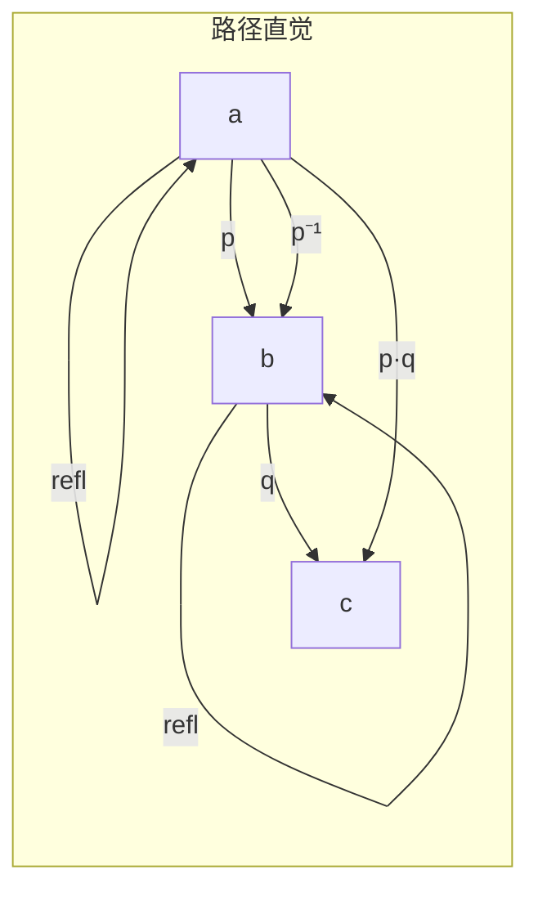
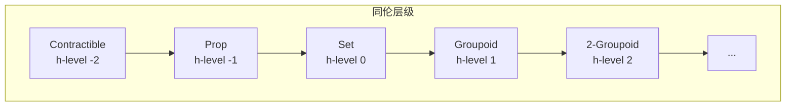

# 03.1 HoTT基础

---

📌 **内容摘要**

本文档系统介绍HoTT的基础理论和核心概念。内容涵盖同伦类型论领域的主要知识点，包括恒等类型, HoTT等关键主题。适合具备相关基础的学习者进行深入研究。

**关键词**: 同伦类型论, 恒等类型, HoTT

📚 **学习目标**

- 深入理解HoTT的理论体系和形式化方法
- 能够进行相关定理的形式化证明
- 建立该领域的系统性知识框架

🎯 **难度级别**: 高级

⏱️ **预计阅读时间**: 15分钟

**前置知识**: 该领域的中级知识, 形式化方法基础, 离散数学

---


## 1. 等同类型 (Identity Types)

### 1.1 Martin-Lof等同类型

**定义 1.1.1** (等同类型). 对类型 A : U 和元素 a, b : A，等同类型 a =_A b（或 Id_A(a,b)）是 a 与 b 相等的证明类型。

**构造子**:

- **自反性** refl : Π(a:A). a = a

**归纳原理** (J规则):

```
J : Π(a:A). Π(C:Π(b:A).(a=b)→U). C a refl → Π(b:A). Π(p:a=b). C b p
```

```lean4
-- Lean 4中的等同类型（内建）
inductive Eq {A : Type} : A → A → Prop where
  | refl {a : A} : Eq a a

-- J规则实现
def Eq.rec' {A : Type} {a : A}
  {motive : (b : A) → Eq a b → Sort u}
  (refl : motive a .refl)
  {b : A} (p : Eq a b) : motive b p :=
  match p with
  | .refl => refl

-- 基于 J 的性质证明
theorem Eq.symm {A : Type} {a b : A} (p : Eq a b) : Eq b a :=
  Eq.rec' (motive := λ b _ => Eq b a) .refl p

theorem Eq.trans {A : Type} {a b c : A}
  (p : Eq a b) (q : Eq b c) : Eq a c :=
  Eq.rec' (motive := λ b _ => Eq b c → Eq a c) (λ r => r) p q
```

### 1.2 路径的直觉

**HoTT视角**: 等同 p : a = b 被视为从 a 到 b 的**路径**。



**路径操作**:

- **逆路径** p⁻¹ : b = a
- **路径连接** p · q : a = c（若 p : a = b, q : b = c）

```lean4
-- 路径操作（基于J规则）
def Eq.inverse {A : Type} {a b : A} (p : Eq a b) : Eq b a :=
  Eq.rec' (motive := λ y _ => Eq y a) Eq.refl p

notation p "⁻¹" => Eq.inverse p

def Eq.concat {A : Type} {a b c : A}
  (p : Eq a b) (q : Eq b c) : Eq a c :=
  Eq.rec' (motive := λ y _ => Eq y c → Eq a c) id p q

infixl:65 " ⬝ " => Eq.concat

-- 路径的群oid结构
theorem Eq.assoc {A : Type} {a b c d : A}
  (p : Eq a b) (q : Eq b c) (r : Eq c d) :
  (p ⬝ q) ⬝ r = p ⬝ (q ⬝ r) := by
  induction p
  induction q
  induction r
  rfl
```

### 1.3 基于路径的归纳

**定理 1.3.1** (路径归纳). 要证明对所有 p : a = b 的某个性质，只需证明对 refl_a 的情况。

```lean4
-- 路径归纳原理
theorem path_induction {A : Type} {a : A}
  {P : {b : A} → Eq a b → Prop}
  (hrefl : P Eq.refl)
  {b : A} (p : Eq a b) : P p := by
  induction p
  exact hrefl

-- 基于路径的函数扩展性
theorem funext {A : Type} {B : A → Type} {f g : ∀ a, B a}
  (h : ∀ a, Eq (f a) (g a)) : Eq f g := by
  -- 在HoTT中，这是公理；在Lean中也是公理
  apply funext
  intro a
  exact h a
```

## 2. 同伦层次

### 2.1 同伦的概念

**定义 2.1.1** (同伦). 对函数 f, g : A → B，同伦 f ~ g 是逐点等同的族：

```
f ~ g := Π(x:A). f x = g x
```

**定义 2.1.2** (等价). 函数 f : A → B 是等价，如果存在 g : B → A 使得：

```
f ∘ g ~ id_B 且 g ∘ f ~ id_A
```

```lean4
-- 同伦定义
def Homotopy {A : Type} {B : A → Type}
  (f g : ∀ x, B x) : Type :=
  ∀ x, Eq (f x) (g x)

infixl:80 " ~ " => Homotopy

-- 等价定义（quasi-inverse）
structure IsEquiv {A B : Type} (f : A → B) where
  inv : B → A
  left_inv : ∀ x, Eq (inv (f x)) x
  right_inv : ∀ y, Eq (f (inv y)) y

-- 类型等价
def Equiv (A B : Type) : Type :=
  Σ f : A → B, IsEquiv f

infixl:60 " ≃ " => Equiv
```

### 2.2 同伦层级 (h-levels)

**定义 2.2.1** (截断层次). 类型 A 的 h-level 归纳定义：

- **h-level -2** (contractible): 存在 a : A 使得所有 x : A 满足 x = a
- **h-level n+1**: 对所有 x, y : A，(x = y) 是 h-level n



```lean4
-- h-level定义
inductive HLevel : Type where
  | contr : HLevel        -- -2
  | succ : HLevel → HLevel

def HLevel.toNat : HLevel → Nat
  | .contr => 0
  | .succ n => (toNat n) + 1

-- Contractible类型
def IsContr (A : Type) : Type :=
  Σ center : A, ∀ x, Eq x center

-- Proposition类型（最多一个元素的类型）
def IsProp (A : Type) : Type :=
  ∀ (x y : A), Eq x y

-- Set类型（等同是命题）
def IsSet (A : Type) : Type :=
  ∀ (x y : A), IsProp (Eq x y)

-- h-level的归纳
theorem propIsSet {A : Type} (h : IsProp A) : IsSet A := by
  intros x y p q
  have h' := h x y
  -- 在命题中，所有证明都相等
  sorry
```

## 3. 等同的类型论

### 3.1 等同的归纳定义

**定理 3.1.1** (等同的群oid结构). 对每个类型 A，其等同关系构成群oid：

- 对象：A 的元素
- 态射：p : a = b
- 复合：路径连接
- 单位：refl
- 逆：路径逆

**定理 3.1.2** (更高群oid). 对 n ≥ 1，第 n 层等同形成 n-群oid。

```lean4
-- 2-路径（路径之间的等同）
def Path2 {A : Type} {a b : A} {p q : Eq a b} : Type :=
  Eq p q

-- Eckmann-Hilton论证：2-路径交换
theorem eckmannHilton {A : Type} {a : A}
  (α β : Path2 (Eq.refl a) (Eq.refl a)) :
  Eq (α ⬝ β) (β ⬝ α) := by
  -- 高阶路径的交换性
  sorry
```

### 3.2 等同的归纳原理

**定理 3.2.1** (基于路径的归纳). 对类型族 C : Π(b:A).(a=b) → U，给定 c : C a refl，存在唯一 f : Π(b:A).Π(p:a=b).C b p 使得 f a refl = c。

```lean4
-- 基于路径的归纳（J规则的依赖版本）
def J {A : Type} {a : A}
  {C : (b : A) → Eq a b → Sort u}
  (c : C a .refl)
  {b : A} (p : Eq a b) : C b p :=
  match p with
  | .refl => c

-- 基于路径的递归
def recPath {A B : Type} {a : A}
  (b : B) {a' : A} (p : Eq a a') : B :=
  J b p
```

## 4. 单值性公理 (Univalence)

### 4.1 等价引发等同

**定义 4.1.1** (idtoeqv). 函数将等同映射为等价：

```
idtoeqv : (A =_U B) → (A ≃ B)
```

**定义 4.1.2** (单值性公理). idtoeqv 自身是等价：

```
(A =_U B) ≃ (A ≃ B)
```

```lean4
-- idtoeqv：等同到等价的映射
def idtoeqv {A B : Type} (p : Eq A B) : Equiv A B :=
  match p with
  | .refl => ⟨id, ⟨id, λ _ => rfl, λ _ => rfl⟩⟩

-- 单值性公理（作为公理声明）
axiom univalence (A B : Type) : IsEquiv (@idtoeqv A B)

-- 等价引发等同
def ua {A B : Type} (e : Equiv A B) : Eq A B :=
  (univalence A B).inv e

-- ua的计算规则
-- transport (ua e) = coe e
```

### 4.2 单值性的推论

**定理 4.2.1** (同构等同). 若 A 和 B 是同构的（结构等价），则 A = B。

**定理 4.2.2** (结构不变性). 同构的结构满足相同的性质。

```lean4
-- 结构传递性示例
theorem structureInvariance {A B : Type}
  (e : Equiv A B) (P : Type → Prop)
  (hA : P A) : P B := by
  -- 使用单值性，A = B，故 P A → P B
  have h : Eq A B := ua e
  rw [h]
  exact hA
```

## 5. 等同的计算行为

### 5.1 传输 (Transport)

**定义 5.1.1** (传输). 对类型族 P : A → U 和路径 p : a = b，传输操作：

```
transport^P(p, -) : P(a) → P(b)
```

```lean4
-- 传输操作
def transport {A : Type} {P : A → Type}
  {a b : A} (p : Eq a b) : P a → P b :=
  Eq.rec' (motive := λ y _ => P a → P y) id p

notation:65 " transport[" P "] " p => transport (P := P) p

-- 传输在路径上的行为
theorem transportConcat {A : Type} {P : A → Type}
  {a b c : A} (p : Eq a b) (q : Eq b c) (x : P a) :
  transport (p ⬝ q) x = transport q (transport p x) := by
  induction p
  induction q
  rfl
```

### 5.2 依赖 ap (apd)

**定义 5.2.1** (apd). 对依赖函数 f : Π(x:A).P(x) 和路径 p : a = b：

```
apd_f(p) : transport^P(p, f(a)) =_{P(b)} f(b)
```

```lean4
-- apd：依赖函数的等同保持
def apd {A : Type} {P : A → Type}
  (f : ∀ x, P x) {a b : A} (p : Eq a b) :
  Eq (transport p (f a)) (f b) :=
  Eq.rec' (motive := λ y q => Eq (transport q (f a)) (f y)) rfl p
```

## 参考

- [02.3 依赖类型](../02_类型论/02.3_依赖类型.md) - 依赖类型基础
- [02.4 类型论与逻辑](../02_类型论/02.4_类型论与逻辑.md) - Curry-Howard同构
- [03.2 高阶归纳类型](./03.2_高阶归纳类型.md) - 高阶归纳类型
- [03.3 同伦层次](./03.3_同伦层次.md) - 同伦层次的深入研究
- [04.1 范畴基本概念](../04_范畴论/04.1_范畴基本概念.md) - 范畴论基础

---

## 📋 前置知识

- [02.3 依赖类型](../02_类型论/02.3_依赖类型.md)
- [3.3 代数拓扑](../../01_数学基础/03_几何学/03.3_代数拓扑.md)

---

## 📚 延伸阅读

- [03.3 同伦层次](../03_同伦类型论_HoTT/03.3_同伦层次.md)
- [04.1 范畴基本概念](../04_范畴论/04.1_范畴基本概念.md)
- [4.1 范畴基础 (Category Theory Foundations)](../04_范畴论/04.1_范畴基础.md)
- [02.4 类型论与逻辑](../02_类型论/02.4_类型论与逻辑.md)
- [2.4 类型论进阶 (Advanced Type Theory)](../02_类型论/02.4_类型论进阶.md)
