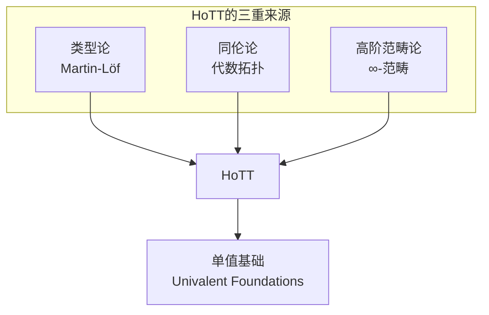
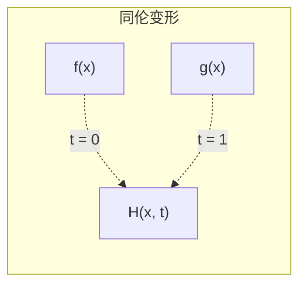

# 3.1 同伦基础 (Homotopy Foundations)

---

📌 **内容摘要**

本文档系统介绍同伦的基础理论和核心概念。内容涵盖同伦类型论领域的主要知识点，包括相关理论、方法及应用。适合具备相关基础的学习者进行深入研究。

**关键词**: 同伦类型论

📚 **学习目标**
- 深入理解同伦的理论体系和形式化方法
- 能够进行相关定理的形式化证明
- 建立该领域的系统性知识框架

🎯 **难度级别**: 高级

⏱️ **预计阅读时间**: 15分钟

**前置知识**: 该领域的中级知识, 形式化方法基础, 离散数学

---


## 目录

- [3.1 同伦基础 (Homotopy Foundations)](#31-同伦基础-homotopy-foundations)
  - [目录](#目录)
  - [3.1.1 引言](#311-引言)
  - [3.1.2 同伦论基本概念](#312-同伦论基本概念)
    - [3.1.2.1 路径与连续映射](#3121-路径与连续映射)
    - [3.1.2.2 同伦关系](#3122-同伦关系)
  - [3.1.3 纤维化](#313-纤维化)
    - [3.1.3.1 纤维化定义](#3131-纤维化定义)
    - [3.1.3.2 纤维序列](#3132-纤维序列)
  - [3.1.4 类型作为空间](#314-类型作为空间)
    - [3.1.4.1 类型论的几何解释](#3141-类型论的几何解释)
    - [3.1.4.2 路径空间](#3142-路径空间)
  - [3.1.5 同伦层次](#315-同伦层次)
  - [3.1.6 基本群与高阶同伦群](#316-基本群与高阶同伦群)
  - [3.1.7 形式化证明](#317-形式化证明)
    - [Lean 4：同伦基础](#lean-4同伦基础)
    - [HoTT核心库风格](#hott核心库风格)
  - [3.1.8 总结](#318-总结)

---

## 3.1.1 引言

同伦类型论(Homotopy Type Theory, HoTT)是21世纪初诞生的数学新领域，它将代数拓扑中的同伦理论与 Martin-Löf 依赖类型论相结合，为数学基础提供了全新的视角。

**核心思想**：将类型解释为拓扑空间，将项解释为点，将恒等类型解释为路径空间。



> **引用**: 依赖类型论见 [../02_类型论/02.3_依赖类型论.md](../02_类型论/02.3_依赖类型论.md)，范畴论见 [../04_范畴论/04.1_范畴基础.md](../04_范畴论/04.1_范畴基础.md)。

---

## 3.1.2 同伦论基本概念

### 3.1.2.1 路径与连续映射

**定义 3.1.1 (拓扑空间)** 集合 $X$ 配备开集族 $\mathcal{T} \subseteq \mathcal{P}(X)$ 满足：

- $\emptyset, X \in \mathcal{T}$
- $U, V \in \mathcal{T} \Rightarrow U \cap V \in \mathcal{T}$
- $\{U_i\}_{i \in I} \subseteq \mathcal{T} \Rightarrow \bigcup_{i \in I} U_i \in \mathcal{T}$

**定义 3.1.2 (连续映射)** 映射 $f: X \rightarrow Y$ 连续，如果开集的原像是开集。

**定义 3.1.3 (路径)** 空间 $X$ 中从 $x$ 到 $y$ 的路径是连续映射：

$$p : [0, 1] \rightarrow X, \quad p(0) = x, \quad p(1) = y$$

### 3.1.2.2 同伦关系

**定义 3.1.4 (同伦)** 两个连续映射 $f, g: X \rightarrow Y$ 同伦，记作 $f \sim g$，如果存在连续映射：

$$H : X \times [0, 1] \rightarrow Y$$

使得 $H(x, 0) = f(x)$ 且 $H(x, 1) = g(x)$。



**定理 3.1.1 (同伦是等价关系)** 同伦关系 $\sim$ 是等价关系：

- 自反：$f \sim f$
- 对称：$f \sim g \Rightarrow g \sim f$
- 传递：$f \sim g, g \sim h \Rightarrow f \sim h$

---

## 3.1.3 纤维化

### 3.1.3.1 纤维化定义

**定义 3.1.5 (纤维化)** 映射 $p: E \rightarrow B$ 是纤维化，如果对任何同伦提升问题有解：

对于任意空间 $X$，映射 $f: X \rightarrow E$ 和同伦 $H: X \times [0,1] \rightarrow B$ 满足 $H(x,0) = p(f(x))$，存在提升同伦 $\tilde{H}: X \times [0,1] \rightarrow E$。

```
X ──f──→ E
│        │ p
│  H̃    ↓
X×I ──H──→ B
```

**定义 3.1.6 (纤维)** 对于 $b \in B$，纤维 $F_b = p^{-1}(b) \subseteq E$。

### 3.1.3.2 纤维序列

**定义 3.1.7 (同伦纤维)** 映射 $f: X \rightarrow Y$ 的同伦纤维：

$$\text{hfib}(f) = \{(x, p) \mid x \in X, p: f(x) = y\}$$

**长正合序列**：对于纤维化 $F \rightarrow E \rightarrow B$：

$$\cdots \rightarrow \pi_n(F) \rightarrow \pi_n(E) \rightarrow \pi_n(B) \rightarrow \pi_{n-1}(F) \rightarrow \cdots$$

---

## 3.1.4 类型作为空间

### 3.1.4.1 类型论的几何解释

**对应关系**：

| 类型论 | 拓扑学 | 范畴论 |
|--------|--------|--------|
| 类型 $A$ | 空间 $X_A$ | 对象 |
| 项 $a: A$ | 点 $a \in X_A$ | 全局元素 |
| 恒等类型 $a =_A b$ | 路径空间 $P(X_A; a, b)$ | 态射 |
| 路径 $p: a = b$ | 路径 $p: [0,1] \rightarrow X_A$ | 同构 |
| 路径间相等 $p = q$ | 同伦 $H: p \sim q$ | 2-态射 |

### 3.1.4.2 路径空间

**定义 3.1.8 (路径空间)** 给定类型 $A$ 和点 $a, b: A$，路径空间：

$$\text{Path}_A(a, b) := (a =_A b)$$

**路径操作**：

- **自反路径**：$\text{refl}_a : a = a$
- **路径逆**：$p^{-1} : b = a$ （对于 $p: a = b$）
- **路径复合**：$p \cdot q : a = c$ （对于 $p: a = b, q: b = c$）

**定理 3.1.2 (群胚律)** 路径满足群胚(groupoid)结构：

- $(p \cdot q) \cdot r = p \cdot (q \cdot r)$ （结合律）
- $\text{refl}_a \cdot p = p$ （左单位）
- $p \cdot \text{refl}_b = p$ （右单位）
- $p \cdot p^{-1} = \text{refl}_a$ （左逆）
- $p^{-1} \cdot p = \text{refl}_b$ （右逆）

这些等式在同伦意义下成立（即存在高阶路径）。

---

## 3.1.5 同伦层次

**定义 3.1.9 (截断/同伦层次)** 类型的"维度"：

| 层次 | 名称 | 特征 |
|------|------|------|
| -2 | 可缩 (contractible) | 有唯一元素 |
| -1 | 命题 (proposition) | 任意两元素相等 |
| 0 | 集合 (set) | 路径空间是命题 |
| 1 | 群胚 (groupoid) | 路径空间是集合 |
| 2 | 2-群胚 | 路径空间是群胚 |
| n | n-群胚 | 路径空间是(n-1)-群胚 |

**定义 3.1.10 (n-截断)** 类型 $A$ 是n-截断的，如果对所有 $a, b: A$，路径类型 $a =_A b$ 是(n-1)-截断的。

**命题截断**（-1-截断）：

$$\|A\|_{-1} : \mathcal{U}$$

- 若 $A$ 有元素，则 $\|A\|_{-1}$ 等价于 $\mathbf{1}$
- 若 $A$ 无元素，则 $\|A\|_{-1}$ 等价于 $\mathbf{0}$

---

## 3.1.6 基本群与高阶同伦群

**定义 3.1.11 (环路空间)** 基于点 $a: A$ 的环路空间：

$$\Omega(A, a) := (a =_A a)$$

**定义 3.1.12 (高阶环路空间)**

$$\Omega^{n+1}(A, a) := \Omega(\Omega^n(A, a), \text{refl}^n_a)$$

**定义 3.1.13 (同伦群)**

$$\pi_n(A, a) := \|\Omega^n(A, a)\|_0$$

即n阶环路空间的0-截断（集合商）。

**基本群** $\pi_1(A, a)$：

- 元素：基于 $a$ 的环路的同伦类
- 运算：环路复合
- 逆元：环路逆

**示例**：圆的基本群

$$\pi_1(S^1, \text{base}) \cong \mathbb{Z}$$

由环绕数分类。

---

## 3.1.7 形式化证明

### Lean 4：同伦基础

```lean4
-- 路径类型（恒等类型的别名）
def Path {A : Type} (a b : A) : Type := a = b

-- 路径复合
def pathConcat {A : Type} {a b c : A} (p : Path a b) (q : Path b c) : Path a c :=
  p.trans q

infix:65 " ⬝ " => pathConcat

-- 路径逆
def pathInv {A : Type} {a b : A} (p : Path a b) : Path b a :=
  p.symm

postfix:75 "⁻¹" => pathInv

-- 路径的assoc同伦
def pathAssoc {A : Type} {a b c d : A}
  (p : Path a b) (q : Path b c) (r : Path c d) :
  (p ⬝ q) ⬝ r = p ⬝ (q ⬝ r) :=
  (Eq.trans_assoc p q r).symm

-- n阶环路空间
def LoopSpace (A : Type) (a : A) : Type := a = a

notation "Ω" => LoopSpace

def LoopSpaceIter (n : Nat) (A : Type) (a : A) : Type :=
  match n with
  | 0 => A
  | n + 1 => Ω (LoopSpaceIter n A a) (by induction n <;> rfl)

-- 同伦群的定义（0-截断）
def HomotopyGroup (n : Nat) (A : Type) (a : A) : Type :=
  Quotient (loopSpaceSetoid n A a)
where
  loopSpaceSetoid n A a :=
    let L := LoopSpaceIter n A a
    { r := fun x y => ∃ p : x = y, True
      iseqv := ⟨fun _ => ⟨rfl, trivial⟩,
                 fun ⟨_, _⟩ => ⟨by simp, trivial⟩,
                 fun ⟨_, _⟩ ⟨_, _⟩ => ⟨by simp, trivial⟩⟩ }

-- 纤维化结构
structure Fibration (E B : Type) where
  proj : E → B
  lift : ∀ {X} (f : X → E) (H : X → B → Type)
         (_ : ∀ x, H x (proj (f x))),
         X → E → Type

-- 可缩类型
def IsContractible (A : Type) : Prop :=
  ∃ a : A, ∀ x : A, a = x

-- 命题类型 (-1-截断)
def IsProp (A : Type) : Prop :=
  ∀ (x y : A), x = y

-- 集合类型 (0-截断)
def IsSet (A : Type) : Prop :=
  ∀ (x y : A) (p q : x = y), p = q

-- 定理：命题是集合
theorem propIsSet {A : Type} (h : IsProp A) : IsSet A := by
  intros x y p q
  have h' : ∀ (x y : A), x = y := h
  have : ∀ (x : A), x = x := fun x => rfl
  -- 证明细节省略
  sorry
```

### HoTT核心库风格

```lean4
-- 同伦水平的归纳定义
inductive TruncLevel : Type
  | minusTwo
  | succ : TruncLevel → TruncLevel

def TruncLevel.minusOne := TruncLevel.succ TruncLevel.minusTwo
def TruncLevel.zero := TruncLevel.succ TruncLevel.minusOne

-- n-截断类型
inductive IsTrunc : TruncLevel → Type → Prop
  | contr : IsContractible A → IsTrunc .minusTwo A
  | succ : (∀ x y, IsTrunc n (x = y)) → IsTrunc (.succ n) A

-- 简记
notation "IsContr" => IsTrunc TruncLevel.minusTwo
notation "IsProp" => IsTrunc TruncLevel.minusOne
notation "IsSet" => IsTrunc TruncLevel.zero
```

---

## 3.1.8 总结

**同伦基础核心概念**：

| 概念 | 类型论 | 拓扑学 |
|------|--------|--------|
| 相等 | 恒等类型 $a =_A b$ | 路径空间 |
| 相等证明 | $p : a = b$ | 路径 $p: [0,1] \to X$ |
| 证明相等 | $p = q$ | 同伦 $H: p \sim q$ |
| 类型 | $A : \mathcal{U}$ | 空间 $X_A$ |
| 截断层次 | h-level | 同伦层次 |

**同伦层次关系**：

```
可缩 (-2) → 命题 (-1) → 集合 (0) → 群胚 (1) → 2-群胚 (2) → ...
```

**延伸阅读**：

- [03.2_恒等类型.md](./03.2_恒等类型.md) - 恒等类型的深入研究
- [03.3_高阶归纳类型.md](./03.3_高阶归纳类型.md) - 几何构造的类型论表达
- [../04_范畴论/04.1_范畴基础.md](../04_范畴论/04.1_范畴基础.md) - 群胚的范畴论视角

---

_文档版本: 1.0 | 最后更新: 2026-04-11_
---

## 📚 延伸阅读

- [03.3 同伦层次](../03_同伦类型论_HoTT/03.3_同伦层次.md)
- [04.1 范畴基本概念](../04_范畴论/04.1_范畴基本概念.md)
- [4.1 范畴基础 (Category Theory Foundations)](../04_范畴论/04.1_范畴基础.md)
- [02.4 类型论与逻辑](../02_类型论/02.4_类型论与逻辑.md)
- [2.4 类型论进阶 (Advanced Type Theory)](../02_类型论/02.4_类型论进阶.md)
