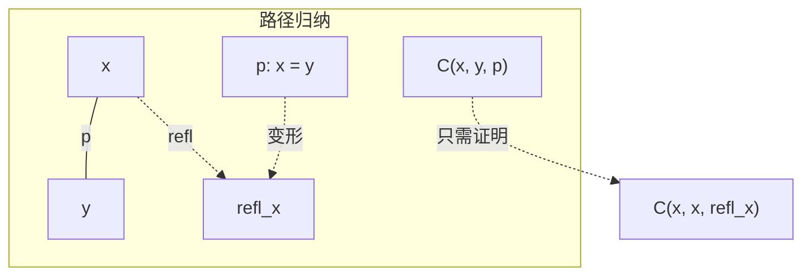

# 3.2 恒等类型 (Identity Types)

## 目录

- [3.2 恒等类型 (Identity Types)](#32-恒等类型-identity-types)
  - [目录](#目录)
  - [3.2.1 引言](#321-引言)
  - [3.2.2 恒等类型的定义](#322-恒等类型的定义)
    - [3.2.2.1 形成规则](#3221-形成规则)
    - [3.2.2.2 引入规则](#3222-引入规则)
    - [3.2.2.3 消去规则](#3223-消去规则)
  - [3.2.3 路径归纳](#323-路径归纳)
    - [3.2.3.1 J消去器](#3231-j消去器)
    - [3.2.3.2 路径归纳原理](#3232-路径归纳原理)
  - [3.2.4 运输](#324-运输)
    - [3.2.4.1 类型族上的运输](#3241-类型族上的运输)
    - [3.2.4.2 基于路径的替换](#3242-基于路径的替换)
  - [3.2.5 函子性](#325-函子性)
  - [3.2.6 恒等类型的结构](#326-恒等类型的结构)
  - [3.2.7 形式化证明](#327-形式化证明)
    - [Lean 4：恒等类型核心](#lean-4恒等类型核心)
    - [恒等类型的归纳定义风格](#恒等类型的归纳定义风格)
  - [3.2.8 总结](#328-总结)

---

## 3.2.1 引言

恒等类型(Identity Types)是Martin-Löf类型论的核心构造，也是同伦类型论的基石。在HoTT中，恒等类型被解释为**路径空间**，使得相等的概念具有了几何内涵。

**关键洞察**：

- 传统观点：相等是命题（是/否）
- HoTT观点：相等是结构（路径空间）

> **引用**: 同伦基础见 [03.1_同伦基础.md](./03.1_同伦基础.md)，高阶归纳类型见 [03.3_高阶归纳类型.md](./03.3_高阶归纳类型.md)。

---

## 3.2.2 恒等类型的定义

### 3.2.2.1 形成规则

**定义 3.2.1 (恒等类型)** 给定类型 $A : \mathcal{U}$ 和项 $a, b : A$，形成恒等类型：

$$\frac{\Gamma \vdash A : \mathcal{U} \quad \Gamma \vdash a : A \quad \Gamma \vdash b : A}{\Gamma \vdash (a =_A b) : \mathcal{U}} \text{(=-FORM)}$$

**记号**：$a =_A b$、$\text{Id}_A(a, b)$、$\text{Path}_A(a, b)$

### 3.2.2.2 引入规则

**定义 3.2.2 (自反路径)** 每个元素有自反路径：

$$\frac{\Gamma \vdash a : A}{\Gamma \vdash \text{refl}_a : a =_A a} \text{(=-INTRO)}$$

在传统类型论中，自反性是唯一的构造子（外延观点）。在HoTT中，其他路径可以通过高阶归纳类型引入。

### 3.2.2.3 消去规则

**定义 3.2.3 (路径归纳 / J规则)**

$$\frac{\Gamma \vdash C : \Pi (x,y:A). (x =_A y) \rightarrow \mathcal{U} \quad \Gamma \vdash c : \Pi (x:A). C(x, x, \text{refl}_x)}{\Gamma \vdash J(C, c) : \Pi (x,y:A). \Pi (p: x =_A y). C(x, y, p)}$$

计算规则：

$$J(C, c, x, x, \text{refl}_x) \equiv c(x) : C(x, x, \text{refl}_x)$$

---

## 3.2.3 路径归纳

### 3.2.3.1 J消去器

**定理 3.2.1 (基于路径的归纳)** 要证明对所有 $x, y: A$ 和 $p: x = y$ 的某个性质 $C(x, y, p)$，只需证明 $C(x, x, \text{refl}_x)$ 对所有 $x$ 成立。

**几何解释**：

- 路径空间是"可缩的"（从自反点出发）
- 任何路径可以连续变形为自反路径



### 3.2.3.2 路径归纳原理

**推论 3.2.1 (路径操作的可定义性)** 通过J规则可定义：

**路径逆** ($^{-1}$):

$$\text{inv} : \Pi (x,y:A). (x = y) \rightarrow (y = x)$$

定义：$\text{inv}(x, x, \text{refl}_x) := \text{refl}_x$

**路径复合** ($\cdot$):

$$\text{concat} : \Pi (x,y,z:A). (x = y) \rightarrow (y = z) \rightarrow (x = z)$$

定义：$\text{concat}(x, x, z, \text{refl}_x, q) := q$

**定理 3.2.2 (群胚结构)** 路径形成群胚：

| 操作 | 性质 |
|------|------|
| $\text{refl}$ | 单位元 |
| $\cdot$ | 复合（二元运算） |
| $^{-1}$ | 逆元 |

这些满足群胚定律，但仅在同伦意义下（即存在高阶路径证明结合律等）。

---

## 3.2.4 运输

### 3.2.4.1 类型族上的运输

**定义 3.2.4 (运输 / Transport)** 给定类型族 $P : A \rightarrow \mathcal{U}$ 和路径 $p : x =_A y$，有：

$$\text{transport}^P(p, -) : P(x) \rightarrow P(y)$$

定义为：$\text{transport}^P(\text{refl}_x, u) := u$

**几何解释**：类型族 $P$ 是纤维化，$\text{transport}$ 是沿路径的"平行移动"。

```
P(x) ──transport(p)──→ P(y)
  │                      │
  │ fiber at x          │ fiber at y
  ▼                      ▼
  x ───────p──────────→ y

      base space A
```

### 3.2.4.2 基于路径的替换

**定理 3.2.3 (路径替换)** 若 $p : x =_A y$ 且 $u : P(x)$，则：

$$\text{transport}^P(p, u) : P(y)$$

**应用**：相等元素的替换原理。

---

## 3.2.5 函子性

**定义 3.2.5 (ap / 映射作用)** 函数保持相等：

$$\text{ap}_f : \Pi (x,y:A). (x =_A y) \rightarrow (f(x) =_B f(y))$$

定义为：$\text{ap}_f(\text{refl}_x) := \text{refl}_{f(x)}$

**定理 3.2.4 (函子性质)** 对于 $f : A \rightarrow B$：

- $\text{ap}_f(p \cdot q) = \text{ap}_f(p) \cdot \text{ap}_f(q)$
- $\text{ap}_f(p^{-1}) = (\text{ap}_f(p))^{-1}$
- $\text{ap}_f(\text{refl}_x) = \text{refl}_{f(x)}$

**定义 3.2.6 (apd / 依赖映射作用)** 对于 $f : \Pi (x:A). P(x)$：

$$\text{apd}_f : \Pi (x,y:A). \Pi (p: x = y). \text{transport}^P(p, f(x)) =_{P(y)} f(y)$$

---

## 3.2.6 恒等类型的结构

**定理 3.2.5 (恒等类型的层次)** 对于 $n$-截断类型 $A$：

- 若 $A$ 是集合(h-level 0)，则 $x =_A y$ 是命题(h-level -1)
- 若 $A$ 是群胚(h-level 1)，则 $x =_A y$ 是集合(h-level 0)
- 一般：若 $A$ 是 $n$-截断，则 $x =_A y$ 是 $(n-1)$-截断

**定理 3.2.6 (路径空间的截断)** 对于任意类型 $A$ 和 $a : A$：

$$(a =_A a) \text{ 形成 } \Omega(A, a) \text{（环路空间）}$$

---

## 3.2.7 形式化证明

### Lean 4：恒等类型核心

```lean4
-- J规则（路径归纳）
def J {A : Type} {C : (x y : A) → (p : x = y) → Type}
  (c : (x : A) → C x x rfl)
  {x y : A} (p : x = y) : C x y p :=
  match p with
  | rfl => c x

-- 路径逆
def pathInv {A : Type} {x y : A} (p : x = y) : y = x :=
  J (fun x _ _ => x = x) (fun _ => rfl) p

-- 路径复合
def pathComp {A : Type} {x y z : A} (p : x = y) (q : y = z) : x = z :=
  J (fun x y _ => (z : A) → (q : y = z) → x = z)
    (fun _ _ q => q) p z q

infix:65 " ⬝ " => pathComp
postfix:75 "⁻¹" => pathInv

-- 运输
def transport {A : Type} (P : A → Type) {x y : A} (p : x = y) : P x → P y :=
  J (fun x _ _ => P x → P _) (fun _ u => u) p

notation "transport[" P "]" => transport P

-- ap: 函数作用在路径上
def ap {A B : Type} (f : A → B) {x y : A} (p : x = y) : f x = f y :=
  J (fun x _ _ => f x = f _) (fun _ => rfl) p

-- apd: 依赖函数作用在路径上
def apd {A : Type} {P : A → Type} (f : (x : A) → P x) {x y : A} (p : x = y) :
  transport P p (f x) = f y :=
  J (fun x _ _ => transport P _ (f x) = f _) (fun _ => rfl) p

-- 群胚定律证明示例：左单位律
def pathUnitL {A : Type} {x y : A} (p : x = y) : rfl ⬝ p = p :=
  J (fun _ _ p => rfl ⬝ p = p) (fun _ => rfl) p

-- 结合律
def pathAssoc {A : Type} {x y z w : A}
  (p : x = y) (q : y = z) (r : z = w) :
  (p ⬝ q) ⬝ r = p ⬝ (q ⬝ r) :=
  J (fun x _ p => ∀ (z w : A) (q : _ = z) (r : _ = w),
       (p ⬝ q) ⬝ r = p ⬝ (q ⬝ r))
    (fun _ _ _ _ r => J (fun _ _ r => (rfl ⬝ _) ⬝ r = rfl ⬝ (_ ⬝ r))
                        (fun _ => rfl) r)
    p z w q r

-- Eckmann-Hilton: π₂是交换的
def eckmannHilton {A : Type} {a : A} (α β : rfl = rfl :> a = a) : α ⬝ β = β ⬝ α :=
  -- 这是高阶路径的组合
  sorry
```

### 恒等类型的归纳定义风格

```lean4
-- 恒等类型作为归纳族
inductive Id (A : Type) : A → A → Type where
  | refl (a : A) : Id A a a

-- 使用Id定义所有操作
def IdJ {A : Type} {a : A} {C : (x : A) → Id A a x → Type}
  (c : C a (Id.refl a))
  {b : A} (p : Id A a b) : C b p :=
  match p with
  | Id.refl _ => c

-- 基于Id的路径操作
def IdInv {A : Type} {a b : A} (p : Id A a b) : Id A b a :=
  IdJ (Id.refl a) p

def IdTrans {A : Type} {a b c : A} (p : Id A a b) (q : Id A b c) : Id A a c :=
  IdJ q p
```

---

## 3.2.8 总结

**恒等类型的核心操作**：

| 操作 | 类型 | 说明 |
|------|------|------|
| $\text{refl}$ | $a = a$ | 自反路径 |
| $^{-1}$ | $(a = b) \rightarrow (b = a)$ | 路径逆 |
| $\cdot$ | $(a = b) \rightarrow (b = c) \rightarrow (a = c)$ | 路径复合 |
| $\text{transport}$ | $(x = y) \rightarrow P(x) \rightarrow P(y)$ | 类型族上的运输 |
| $\text{ap}$ | $(x = y) \rightarrow (f(x) = f(y))$ | 函子作用 |

**J规则的核心地位**：

$$\frac{\forall x. C(x, x, \text{refl}_x)}{\forall x, y, p. C(x, y, p)}$$

**延伸阅读**：

- [03.1_同伦基础.md](./03.1_同伦基础.md) - 路径空间的几何解释
- [03.3_高阶归纳类型.md](./03.3_高阶归纳类型.md) - 引入非自反路径的方法
- [03.4_同伦论与数学基础.md](./03.4_同伦论与数学基础.md) - 单值公理

---

_文档版本: 1.0 | 最后更新: 2026-04-11_
