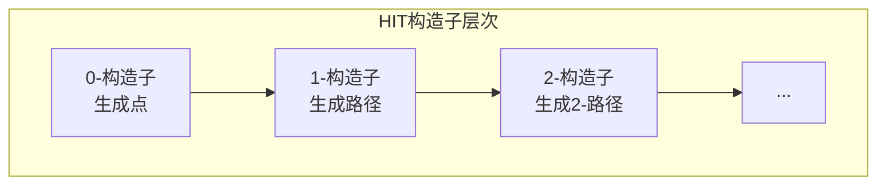
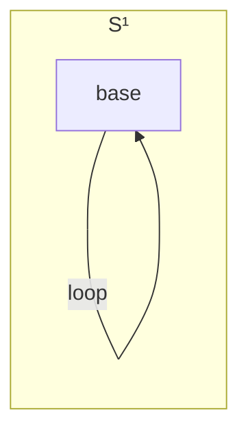
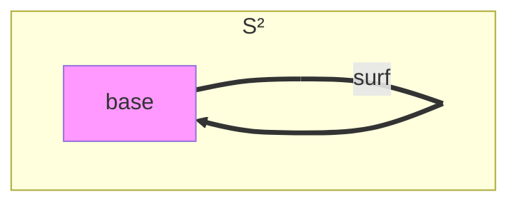
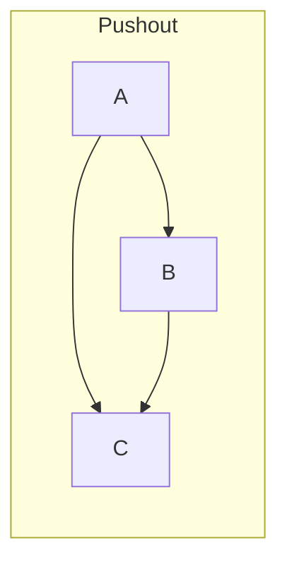

# 03.2 高阶归纳类型

---

📌 **内容摘要**

本文档深入探讨高阶归纳类型的核心原理和关键方法。内容涵盖同伦类型论领域的主要知识点，包括相关理论、方法及应用。适合具备相关基础的学习者进行深入研究。

**关键词**: 同伦类型论

📚 **学习目标**
- 深入理解高阶归纳类型的理论体系和形式化方法
- 能够进行相关定理的形式化证明
- 建立该领域的系统性知识框架

🎯 **难度级别**: 高级

⏱️ **预计阅读时间**: 15分钟

**前置知识**: 该领域的中级知识, 形式化方法基础, 离散数学

---


## 1. 高阶归纳类型 (HIT) 概述

### 1.1 从归纳类型到高阶归纳类型

**定义 1.1.1** (普通归纳类型). 由点构造子生成，如：

```
data Nat where
  | zero : Nat
  | succ : Nat → Nat
```

**定义 1.1.2** (高阶归纳类型 HIT). 除点构造子外，还包含**路径构造子**：

- 生成元素之间的等同（路径）
- 可生成高阶路径（路径之间的等同）



### 1.2 HIT的形式化定义

**定义 1.2.1** (HIT的签名). HIT由以下部分组成：

- 0-构造子：生成基本元素
- 1-构造子：生成路径（元素间的等同）
- n-构造子：生成 n-路径

```lean4
-- 注意：Lean 4原生不直接支持HIT，需要特殊处理或使用truncation
-- 以下是概念性的表示

-- 圆 S¹ 作为HIT的概念定义
-- data S1 where
--   | base : S1
--   | loop : base = base  -- 路径构造子

-- 在Lean中，可以使用商类型或truncation来模拟
```

## 2. 典型高阶归纳类型

### 2.1 圆 (Circle) S¹

**定义 2.1.1** (圆 S¹). 由以下构造子生成：

- `base : S¹` —— 基点
- `loop : base = base` —— 非平凡回路



**定理 2.1.2** (S¹的基本群). π₁(S¹, base) ≅ ℤ

**证明概要**. 通过universal cover（螺旋）证明回路等价于整数（绕数）。

```lean4
-- 使用Truncation和商类型模拟S¹
-- 在HoTT库中通常使用原生支持

-- 圆上的递归原理（概念性）
def S1Rec (B : Type) (b : B) (l : Eq b b) : S1 → B
  | .base => b
  | .loop => l

-- 圆上的归纳原理（概念性）
def S1Ind {P : S1 → Type}
  (pb : P base)
  (pl : transport (P := P) loop pb = pb)
  (x : S1) : P x
  | .base => pb
  -- pl 确保在loop上的一致性
```

### 2.2 区间 (Interval) I

**定义 2.2.1** (区间 I). 由以下构造子生成：

- `zero : I` 和 `one : I` —— 端点
- `seg : zero = one` —— 连接路径

**定理 2.2.2** (区间的收缩性). I 是 contractible 的。

**推论 2.2.3**. 区间可用于定义**函数扩展性**。

```lean4
-- 区间作为HIT（概念性）
-- data Interval where
--   | zero : Interval
--   | one : Interval
--   | seg : zero = one

-- 区间的递归
def IntervalRec {B : Type} (a b : B) (p : Eq a b) : Interval → B
  | .zero => a
  | .one => b
  | .seg => p

-- 区间证明函数扩展性
theorem funextFromInterval {A B : Type} {f g : A → B}
  (h : ∀ x, Eq (f x) (g x)) : Eq f g := by
  -- 使用区间构造同伦到等同的转换
  sorry
```

### 2.3 球面 (Sphere) S²

**定义 2.3.1** (二维球面 S²). 由以下构造子生成：

- `base : S²`
- `surf : refl_base = refl_base` —— 2-路径（曲面）



**定理 2.3.2** (S²的同伦群). π₂(S²) ≅ ℤ，由 surf 生成。

## 3. 截断 (Truncation)

### 3.1 命题截断

**定义 3.1.1** (命题截断 ||A||). 将任意类型 A 变为命题（h-level -1）：

- `|_| : A → ||A||` —— 包含映射
- 对所有 x, y : ||A||，存在路径 x = y

```lean4
-- 命题截断（在Lean 4中使用Quotient或专用库）
-- 概念性定义
inductive PropositionalTruncation (A : Type) : Prop where
  | intro : A → PropositionalTruncation A

-- 命题截断的归纳原理
-- 由于结果是Prop，不需要处理路径构造子

def TruncInd {A : Type} {P : Prop}
  (f : A → P) : PropositionalTruncation A → P
  | .intro a => f a

-- 存在量词作为命题截断
def Exists' {A : Type} (P : A → Prop) : Prop :=
  PropositionalTruncation (Σ x, P x)
```

### 3.2 n-截断

**定义 3.2.1** (n-截断 ||A||ₙ). 将类型截断到 h-level n：

- ||-2|| = A（contractible truncation）
- ||-1|| = ||A||（命题截断）
- ||0|| 将类型变为集合（set truncation）

```lean4
-- Set Truncation（h-level 0）
inductive SetTruncation (A : Type) : Type where
  | intro : A → SetTruncation A
  -- 隐含：所有路径相等（IsSet）

-- Set truncation的性质
def SetTruncation.rec {A B : Type} (hB : IsSet B)
  (f : A → B) : SetTruncation A → B
  | .intro a => f a

-- 商类型作为set truncation的特殊情况
def Quotient' {A : Type} (R : A → A → Prop) : Type :=
  SetTruncation (Quot R)
```

## 4. 商类型作为HIT

### 4.1 集合商

**定义 4.1.1** (集合商 A/R). 对集合 A 和等价关系 R：

- `[a] : A/R` —— 等价类
- `eqv : R(a,b) → [a] = [b]` —— 相关元素等同
- 商是集合（0-truncated）

```lean4
-- Lean 4中的Quotient类型就是set quotient
def QuotientExample : Type :=
  Quot (λ (a b : Int) => Eq (a % 2) (b % 2))

-- ℤ/2ℤ
def ZMod2 : Type := QuotientExample

def ZMod2.add : ZMod2 → ZMod2 → ZMod2 :=
  Quot.lift₂ (λ a b => Quot.mk _ (a + b))
    (by intros; simp; omega)
    (by intros; simp; omega)
```

### 4.2 高阶商

**定义 4.2.1** (群oid商). 不截断到集合，保留路径结构：

- 对象：A 的元素
- 态射：由 R 生成的自由群oid

```lean4
-- 群oid商（概念性）
-- 保留路径信息，不只是命题等同
inductive GroupoidQuotient {A : Type} (R : A → A → Type) : Type where
  | incl : A → GroupoidQuotient R
  | glue : {a b : A} → R a b → Eq (incl a) (incl b)
  -- 不添加set truncation构造子
```

## 5. HIT的应用

### 5.1 代数拓扑构造

**定理 5.1.1** (使用HIT构造空间).

- 楔和 (Wedge sum)
- Smash积
- 余纤维 (Cofiber)
- 推移 (Pushout)



```lean4
-- 推移 (Pushout) 作为HIT
inductive Pushout {A B C : Type}
  (f : C → A) (g : C → B) : Type where
  | inl : A → Pushout f g
  | inr : B → Pushout f g
  | glue : (c : C) → Eq (inl (f c)) (inr (g c))

-- 楔和作为特例
def Wedge (A B : Type) (a : A) (b : B) : Type :=
  Pushout (λ _ : Unit => a) (λ _ : Unit => b)
```

### 5.2 代数结构

**定义 5.2.1** (Cayley图). 群可以作为HIT表示：

- 生成元作为路径
- 关系作为2-路径

```lean4
-- 自由群作为HIT（概念性）
inductive FreeGroup (A : Type) : Type where
  | unit : FreeGroup A
  | gen : A → FreeGroup A
  | mul : FreeGroup A → FreeGroup A → FreeGroup A
  | inv : FreeGroup A → FreeGroup A
  -- 群公理作为路径构造子
  | assoc : ∀ x y z, mul (mul x y) z = mul x (mul y z)
  | unitL : ∀ x, mul unit x = x
  | unitR : ∀ x, mul x unit = x
  | invL : ∀ x, mul (inv x) x = unit
  | invR : ∀ x, mul x (inv x) = unit
```

## 参考

- [03.1 HoTT基础](./03.1_HoTT基础.md) - 同伦类型论基础
- [03.3 同伦层次](./03.3_同伦层次.md) - 同伦层次理论
- [03.4 HoTT与数学基础](./03.4_HoTT与数学基础.md) - 统一基础
- [04.2 极限与余极限](../04_范畴论/04.2_极限与余极限.md) - 范畴论极限
---

## 📚 延伸阅读

- [03.3 同伦层次](../03_同伦类型论_HoTT/03.3_同伦层次.md)
- [04.1 范畴基本概念](../04_范畴论/04.1_范畴基本概念.md)
- [4.1 范畴基础 (Category Theory Foundations)](../04_范畴论/04.1_范畴基础.md)
- [02.4 类型论与逻辑](../02_类型论/02.4_类型论与逻辑.md)
- [2.4 类型论进阶 (Advanced Type Theory)](../02_类型论/02.4_类型论进阶.md)
