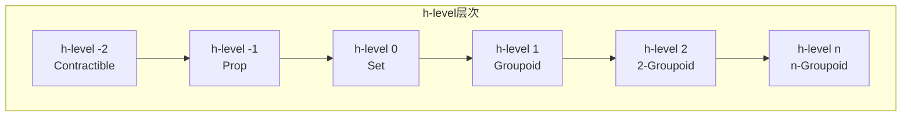

# 03.3 同伦层次

## 1. 同伦层次的定义

### 1.1 截断层次

**定义 1.1.1** (h-level). 类型 A 的同伦层次（h-level）归纳定义：

- **h-level -2**: A 是 **contractible**（可缩的），即存在中心点 c : A 使得 ∀(x:A). x = c
- **h-level n+1**: 对所有 x, y : A，路径类型 x =_A y 是 h-level n



### 1.2 各层次的特征

| h-level | 名称 | 特征 | 例子 |
|:---:|:---|:---|:---|
| -2 | Contractible | 本质上是单点 | Unit, 区间 I |
| -1 | Proposition (Prop) | 最多一个元素 | True, False, a = b (当 IsSet A) |
| 0 | Set | 等同是命题 | Nat, Bool, 任何离散类型 |
| 1 | Groupoid | 等同构成集合 | 基本群oid |
| n | n-Groupoid | 等同是 (n-1)-groupoid | n-类型 |

```lean4
-- h-level的定义（归纳定义）
inductive HLevel : Type where
  | contr : HLevel
  | succ : HLevel → HLevel

def HLevel.toNat : HLevel → Nat
  | .contr => 0
  | .succ n => (HLevel.toNat n) + 1

-- 各层次的定义
def IsContr (A : Type) : Type :=
  Σ center : A, ∀ x, Eq x center

def IsProp (A : Type) : Type :=
  ∀ (x y : A), Eq x y

def IsSet (A : Type) : Type :=
  ∀ (x y : A), IsProp (Eq x y)

def IsGroupoid (A : Type) : Type :=
  ∀ (x y : A), IsSet (Eq x y)

-- 一般h-level的递归定义
def HasHLevel : HLevel → Type → Type
  | .contr => IsContr
  | .succ n => λ A => ∀ (x y : A), HasHLevel n (Eq x y)
```

## 2. 层次间的关系

### 2.1 蕴含关系

**定理 2.1.1** (层次下降). 若 A 是 h-level n，则 A 是 h-level (n+1)。

**证明**. 对 n 归纳。

- n = -2: contractible 类型显然是 prop（任何两个元素都等于中心点，故相等）
- n+1: 由定义，h-level n+1 要求路径类型是 h-level n。若 A 是 h-level n+1，则路径是 h-level n，故也是 h-level n+1。

```lean4
-- 层次下降定理
theorem hLevelSucc {n : HLevel} {A : Type}
  (h : HasHLevel n A) : HasHLevel (.succ n) A := by
  induction n with
  | contr =>
    -- contractible → prop
    intros x y
    let ⟨c, hc⟩ := h
    have hx : Eq x c := hc x
    have hy : Eq y c := hc y
    exact Eq.trans hx (Eq.symm hy)
  | succ n ih =>
    -- h-level n+1 → h-level n+2
    intros x y
    apply ih
    apply h
```

### 2.2 类型构造保持层次

**定理 2.2.1** (层次保持).

- 若 A 是 prop，B : A → Type 且每个 B(x) 是 prop，则 Σ(x:A).B(x) 是 prop
- 若 A 是 set，B : A → Set，则 Σ(x:A).B(x) 是 set
- 若 A, B 是 n-type，则 A × B 是 n-type
- 若 A 是 n-type，B : A → n-type，则 Π(x:A).B(x) 是 n-type

```lean4
-- 积类型保持set层次
theorem prodIsSet {A B : Type}
  (hA : IsSet A) (hB : IsSet B) : IsSet (A × B) := by
  intros x y p q
  have h1 : IsProp (Eq x.1 y.1) := hA x.1 y.1
  have h2 : IsProp (Eq x.2 y.2) := hB x.2 y.2
  -- 使用投影和积的等同分解
  sorry

-- 函数类型保持set层次
theorem funIsSet {A B : Type}
  (hB : IsSet B) : IsSet (A → B) := by
  intros f g p q
  apply funext
  intro x
  exact hB (f x) (g x) (congrFun p x) (congrFun q x)
```

## 3. n-类型与截断

### 3.1 n-截断操作

**定义 3.1.1** (n-截断 ||A||ₙ). 将任意类型 A 转化为 n-type：

- ||-1||：命题截断
- ||0||：集合截断
- ||n||：n-type截断

**定理 3.1.2** (截断的泛性质). ||A||ₙ 是 n-type，且映射 |·| : A → ||A||ₙ 在 n-type 上具有泛性质。

```lean4
-- n-截断的概念性定义
inductive Trunc (n : HLevel) (A : Type) : Type where
  | intro : A → Trunc n A
  -- 添加构造子使结果成为h-level n

-- 截断的递归原理
def Trunc.rec {n : HLevel} {A B : Type}
  (hB : HasHLevel n B)
  (f : A → B) : Trunc n A → B
  | .intro a => f a

-- 命题截断特例
def PropTrunc (A : Type) : Prop :=
  Trunc .contr A  -- 实际上是Subsingleton

-- 集合截断
def SetTrunc (A : Type) : Type :=
  Trunc (.succ .contr) A
```

### 3.2 截断的应用

**定理 3.2.1** (像的因子分解). 任何函数 f : A → B 可分解为：

```
A → ||A||₀ → B
```

其中 ||A||₀ → B 是单射（当 B 是 set）。

**定理 3.2.2** (命题解析). 对命题 P，P 等价于 ||P||₋₁。

```lean4
-- 命题截断与逻辑连接词
def TruncAnd {P Q : Prop} : PropTrunc (P × Q) ↔ (P ∧ Q) := by
  constructor
  · intro h
    cases h with
    | intro h => exact ⟨h.1, h.2⟩
  · intro h
    exact ⟨h.1, h.2⟩

def TruncOr {P Q : Prop} : PropTrunc (P ⊕ Q) ↔ (P ∨ Q) := by
  constructor
  · intro h
    cases h with
    | inl p => left; exact p
    | inr q => right; exact q
  · intro h
    cases h with
    | inl p => exact (.inl p)
    | inr q => exact (.inr q)
```

## 4. Set-层次数学

### 4.1 集合作为0-类型

**定义 4.1.1** (Set-数学). 在 Set（h-level 0）层次上，同伦类型论退化为传统集合论数学。

**定理 4.1.2** (集合的等同判定). 对集合 A，等同类型 x = y 是命题，可使用命题证明不可区分性。

```lean4
-- 集合上的等同是命题
theorem setEqIsProp {A : Type} (hA : IsSet A)
  (x y : A) : IsProp (Eq x y) :=
  hA x y

-- 集合的商构造
def SetQuotient {A : Type} (hA : IsSet A)
  (R : A → A → Prop) (hR : IsEquivalence R) : Type :=
  Trunc (.succ .contr) (Quot R)
```

### 4.2 范畴作为1-类型

**定义 4.2.1** (Pregroupoid). 1-type 可视为 pregroupoid（范畴的推广，所有态射可逆）。

**定义 4.2.2** (范畴作为 Set-层次结构). 传统范畴论中：

- 对象是集合（或类）
- 态射集合 Hom(a,b)
- 态射复合是集合函数

```lean4
-- 范畴的结构（在Set层次上）
structure Category : Type 1 where
  Obj : Type
  Hom : Obj → Obj → Type
  id : ∀ X, Hom X X
  comp : ∀ {X Y Z}, Hom Y Z → Hom X Y → Hom X Z
  -- 在HoTT中，要求 Obj 是 1-type，Hom 是 set
```

## 5. 同伦层次的计算

### 5.1 路径层次的提升

**定理 5.1.1** (路径类型层次). 若 A 是 n-type，则 x =_A y 是 (n-1)-type（当 n ≥ 0）。

**定理 5.1.2** (路径空间层次). 循环空间的层次：

- Ω(A, a) := a = a
- Ωⁿ⁺¹(A, a) := Ω(Ωⁿ(A, a), reflⁿ)

```lean4
-- 循环空间
def LoopSpace (A : Type) (a : A) : Type :=
  Eq a a

def LoopSpace.iter (n : Nat) (A : Type) (a : A) : Type :=
  match n with
  | 0 => A
  | n+1 => LoopSpace (iter n A a) (Eq.refl a)

notation:max "Ω[" n:max "]" => LoopSpace.iter n

-- 高阶同伦群
def PiN (n : Nat) (A : Type) (a : A) : Type :=
  Trunc .contr (Ω[n] A a)
```

### 5.2 Suspension与循环

**定义 5.2.1** (悬置 Suspension). ΣA 是 A 的悬置，满足：

- Ω(ΣA) ≃ A（对连通类型）

**定理 5.2.2** (Freudenthal悬置定理). 对 n-连通的 A，映射 A → Ω(ΣA) 是 (2n)-连通的。

```lean4
-- 悬置作为HIT（概念性）
inductive Suspension (A : Type) : Type where
  | north : Suspension A
  | south : Suspension A
  | merid : A → Eq north south

-- 悬置递归
def Suspension.rec {A B : Type}
  (n s : B) (m : A → Eq n s) : Suspension A → B
  | .north => n
  | .south => s
  | .merid a => m a
```

## 参考

- [03.1 HoTT基础](./03.1_HoTT基础.md) - 同伦类型论基础
- [03.2 高阶归纳类型](./03.2_高阶归纳类型.md) - HIT构造
- [03.4 HoTT与数学基础](./03.4_HoTT与数学基础.md) - 统一基础
- [04.1 范畴基本概念](../04_范畴论/04.1_范畴基本概念.md) - 范畴论基础
