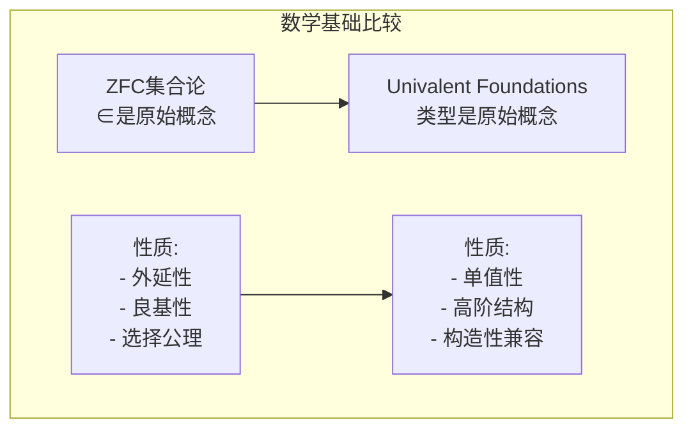

# 03.4 HoTT与数学基础

## 1. 统一基础 (Univalent Foundations)

### 1.1 同伦类型论作为基础

**定义 1.1.1** (UF/HoTT). 同伦类型论配合单值性公理提供了一种新的数学基础：

- **原始概念**：类型（而非集合）
- **等同概念**：路径（而非相等谓词）
- **结构保持**：同构即等同



### 1.2 单值性基础的核心特征

| 特征 | ZFC | HoTT/UF |
|:---:|:---|:---|
| 基础对象 | 集合 | 类型 |
| 等同 | 外延相等 | 路径/等价 |
| 结构 | 附加在集合上 | 内建于类型中 |
| 同构 | 需要额外证明相同 | 自动引发等同 |
| 层次 | 单一层次 | 无限层次结构 |

```lean4
-- 单值性公理在Lean 4中的影响
-- 注意：Lean使用经典逻辑，但支持同伦类型论概念

-- 单值性公理（作为公理）
axiom univalence (A B : Type) :
  IsEquiv (idtoeqv : Eq A B → Equiv A B)

-- 同构引发等同
def isoToEq {A B : Type} (e : Equiv A B) : Eq A B :=
  (univalence A B).inv e

-- 结构不变性原理
theorem structureInvariance
  {A B : Type} (e : Equiv A B)
  (P : Type → Type 1) : Equiv (P A) (P B) := by
  have h : Eq A B := isoToEq e
  rw [h]
  exact ⟨id, ⟨id, λ _ => rfl, λ _ => rfl⟩⟩
```

## 2. 集合论在同伦类型论中

### 2.1 集合作为0-类型

**定义 2.1.1** (集合). 在HoTT中，**集合**定义为 h-level 0 的类型（即 IsSet）。

**性质**：

- 等同是命题（UIP - Uniqueness of Identity Proofs）
- 传统数学可在Set层次上进行

```lean4
-- 集合定义（0-type）
def IsSet (A : Type) : Type :=
  ∀ (x y : A) (p q : Eq x y), Eq p q

-- 集合的子集
def Subset (A : Type) : Type :=
  A → Prop  -- 特征函数

-- 集合的幂集
def PowerSet (A : Type) : Type :=
  Subset A

-- 集合的并、交、补
def Set.union {A : Type} (S T : Subset A) : Subset A :=
  λ x => S x ∨ T x

def Set.inter {A : Type} (S T : Subset A) : Subset A :=
  λ x => S x ∧ T x

def Set.compl {A : Type} (S : Subset A) : Subset A :=
  λ x => ¬(S x)
```

### 2.2 替代公理与收集

**定理 2.2.1** (HoTT中的替代). 对集合 A 和类型族 B : A → Type，若每个 B(x) 是集合，则 Σ(x:A).B(x) 是集合。

**定理 2.2.2** (分离公理). 对集合 A 和谓词 P : A → Prop，{x : A | P x} 是集合。

```lean4
-- 分离公理作为子类型
def subtype {A : Type} (P : A → Prop) : Type :=
  {x : A // P x}

theorem subtypeIsSet {A : Type} (hA : IsSet A)
  (P : A → Prop) : IsSet (subtype P) := by
  intro x y p q
  apply Subtype.ext
  apply hA
```

## 3. 数学结构的同构传递

### 3.1 结构等同原理

**定理 3.1.1** (结构等同). 同构的群、环、拓扑空间等满足相同的性质。

**证明思路**. 使用单值性：

1. 结构（如群）作为 Σ 类型定义
2. 结构同构作为等价
3. 单值性给出结构等同
4. 依赖类型保持等同

```lean4
-- 群结构
def Magma : Type 1 :=
  Σ G : Type, G → G → G

structure Group extends Magma where
  unit : fst
  inv : fst → fst
  mul_assoc : ∀ x y z, snd (snd x y) z = snd x (snd y z)
  unit_left : ∀ x, snd unit x = x
  unit_right : ∀ x, snd x unit = x
  inv_left : ∀ x, snd (inv x) x = unit
  inv_right : ∀ x, snd x (inv x) = unit

-- 群同构
def GroupIso (G H : Group) : Type :=
  Σ f : G.fst → H.fst,
    IsEquiv f ×
    (∀ x y, f (G.snd x y) = H.snd (f x) (f y))

-- 结构传递性
theorem groupInvariance {G H : Group} (iso : GroupIso G H)
  (P : Group → Prop) : P G ↔ P H := by
  -- 使用单值性和结构等同
  sorry
```

### 3.2 范畴论的结构

**定义 3.2.1** (范畴的等同). 两个范畴等价（在范畴论意义下）当且仅当它们在HoTT中等同。

```lean4
-- 范畴的等价
def CatEquiv (C D : Category) : Type :=
  Σ F : Functor C D,
    Σ G : Functor D C,
      NatIso (F ⋙ G) (idFunctor C) ×
      NatIso (G ⋙ F) (idFunctor D)

-- 范畴的单值性
theorem categoryUnivalence {C D : Category} :
  CatEquiv C D → Eq C D := by
  intro equiv
  -- 使用更高层次的单值性
  sorry
```

## 4. 高阶归纳类型与数学构造

### 4.1 拓扑空间的类型论表示

**定理 4.1.1** (CW复形). 许多拓扑空间可作为HIT构造：

- 圆 S¹：带有一个回路的基本空间
- 球面 Sⁿ：高维回路
- 胞腔附加：通过推移构造

```lean4
-- 实射影空间作为HIT（概念性）
inductive RealProjective (n : Nat) : Type where
  | base : RealProjective n
  -- 附加n维胞腔的构造子

-- 无穷维实射影空间
inductive RPInf : Type where
  | incl : (n : Nat) → RealProjective n → RPInf
  | glue : (n : Nat) → (x : RealProjective n) →
           Eq (incl n x) (incl (n+1) (inclRP n x))
```

### 4.2 代数几何的类型论

**定义 4.2.1** (概形的类型论). 使用层和位象的类型论表示。

```lean4
-- 位象（Locale）作为命题代数
def Locale : Type 1 :=
  Σ L : Type,                    -- 开集
    CompleteLatticeStructure L × -- 完备格结构
    (IsFrame L)                  -- 框架条件

-- 层作为预层满足下降条件
def Presheaf (C : Category) (D : Category) : Type 2 :=
  Functor (Cᵒᵖ) D

def IsSheaf {C : Category} {D : Category}
  (F : Presheaf C D) : Prop :=
  -- 满足下降条件
  sorry
```

## 5. 构造性与经典数学

### 5.1 构造性数学在HoTT中

**定理 5.1.1** (构造性存在). 在HoTT中，∃x.P(x) 意味着可以构造性地提供证据。

**定理 5.1.2** (排中律的可加性). 可为特定类型假设排中律而不破坏单值性。

```lean4
-- 构造性存在（Σ类型）
def ConstructiveExists {A : Type} (P : A → Type) : Type :=
  Σ x, P x

-- 经典存在（截断）
def ClassicalExists {A : Type} (P : A → Prop) : Prop :=
  ∃ x, P x  -- 实际上是PropTrunc (Σ x, P x)

-- 构造性选择原理
def ConstructiveChoice {A B : Type} {R : A → B → Type}
  (h : ∀ x, Σ y, R x y) : Σ f : A → B, ∀ x, R x (f x) :=
  ⟨λ x => (h x).1, λ x => (h x).2⟩
```

### 5.2 可计算内容

**定义 5.2.1** (可计算提取). HoTT中的构造性证明可提取为可执行程序。

```lean4
-- 可计算的真实数
def RealNumber : Type :=
  {f : Nat → Rational //
    -- Cauchy序列条件
    ∀ n m, n ≤ m → |f m - f n| < 1/n}

-- 可计算的实数运算
instance : Add RealNumber where
  add x y := by
    -- 构造Cauchy序列的和
    sorry
```

## 6. 形式化数学项目

### 6.1 数学的形式化状态

**项目 6.1.1** (形式化数学库).

- **Lean 4**: mathlib4 — 大规模数学形式化库
- **Coq-HoTT**: HoTT库 — 纯同伦类型论形式化
- **Cubical Agda**: 立方类型论实现

### 6.2 HoTT特定的形式化成果

**定理 6.2.1** (已形式化的结果).

- π₁(S¹) ≅ ℤ (圆的基本群)
- Freudenthal悬置定理
- Blakers-Massey定理
- 谱序列的形式化（进行中）

```lean4
-- π₁(S¹) ≅ ℤ 的证明结构（概念性）
theorem fundamentalGroupOfCircle :
  Eq (FundamentalGroup S1 base) Int := by
  -- 1. 定义通用覆盖（螺旋）
  -- 2. 证明覆盖的纤维是 ℤ
  -- 3. 证明回路提升对应整数
  -- 4. 构造同构
  sorry
```

## 参考

- [03.1 HoTT基础](./03.1_HoTT基础.md) - 同伦类型论基础
- [03.2 高阶归纳类型](./03.2_高阶归纳类型.md) - HIT构造
- [03.3 同伦层次](./03.3_同伦层次.md) - 同伦层次理论
- [02.4 类型论与逻辑](../02_类型论/02.4_类型论与逻辑.md) - 类型论与逻辑基础
