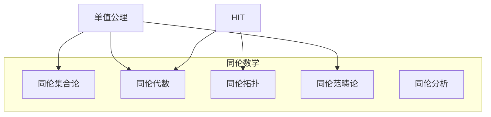

# 3.4 同伦论与数学基础 (Homotopy and Mathematical Foundations)

---

📌 **内容摘要**

本文档系统介绍同伦论与数学的基础理论和核心概念。内容涵盖同伦类型论领域的主要知识点，包括相关理论、方法及应用。适合具备相关基础的学习者进行深入研究。

**关键词**: 同伦类型论

📚 **学习目标**
- 深入理解同伦论与数学的理论体系和形式化方法
- 能够进行相关定理的形式化证明
- 建立该领域的系统性知识框架

🎯 **难度级别**: 高级

⏱️ **预计阅读时间**: 15分钟

**前置知识**: 该领域的中级知识, 形式化方法基础, 离散数学

---


## 目录

- [3.4 同伦论与数学基础 (Homotopy and Mathematical Foundations)](#34-同伦论与数学基础-homotopy-and-mathematical-foundations)
  - [目录](#目录)
  - [3.4.1 引言](#341-引言)
  - [3.4.2 单值公理](#342-单值公理)
    - [3.4.2.1 等价与恒等](#3421-等价与恒等)
    - [3.4.2.2 单值公理的陈述](#3422-单值公理的陈述)
  - [3.4.3 结构恒等原理](#343-结构恒等原理)
  - [3.4.4 集合与命题截断](#344-集合与命题截断)
    - [3.4.4.1 集合层次](#3441-集合层次)
    - [3.4.4.2 命题即(-1)-类型](#3442-命题即-1-类型)
  - [3.4.5 选择公理与排中律](#345-选择公理与排中律)
  - [3.4.6 数学基础的同伦化](#346-数学基础的同伦化)
  - [3.4.7 形式化证明](#347-形式化证明)
    - [Lean 4：单值公理基础](#lean-4单值公理基础)
    - [集合与命题的形式化](#集合与命题的形式化)
  - [3.4.8 总结](#348-总结)

---

## 3.4.1 引言

同伦类型论为数学基础提供了新的范式——**单值基础(Univalent Foundations)**。
这一范式由Vladimir Voevodsky提出，核心思想是通过单值公理将结构相等与类型相等统一。

**传统数学基础的挑战**：

- 集合论中，同构的结构仍被视为不同
- 大量"无意义工作"证明同构结构间转移定理

**HoTT的解决方案**：

- 同构即相等（单值公理）
- 结构在等价意义下自动转移

> **引用**: 同伦基础见 [03.1_同伦基础.md](./03.1_同伦基础.md)，HIT见 [03.3_高阶归纳类型.md](./03.3_高阶归纳类型.md)。

---

## 3.4.2 单值公理

### 3.4.2.1 等价与恒等

**定义 3.4.1 (等价)** $f : A \rightarrow B$ 是等价，记作 $\text{isequiv}(f)$，如果：

$$\text{isequiv}(f) := \left(\Sigma (g:B \rightarrow A). f \circ g \sim \text{id}_B\right) \times \left(\Sigma (h:B \rightarrow A). h \circ f \sim \text{id}_A\right)$$

**定义 3.4.2 (类型等价)**

$$(A \simeq B) := \Sigma (f : A \rightarrow B). \text{isequiv}(f)$$

**idtoeqv**：从恒等到等价的映射

$$\text{idtoeqv} : (A =_\mathcal{U} B) \rightarrow (A \simeq B)$$

定义为：$\text{idtoeqv}(\text{refl}_A) := (\text{id}_A, \text{isequiv}(\text{id}_A))$

### 3.4.2.2 单值公理的陈述

**公理 3.4.1 (单值公理, UA)** 对于所有 $A, B : \mathcal{U}$：

$$\text{ua} : \text{isequiv}(\text{idtoeqv}_{A,B})$$

等价陈述：$(A =_\mathcal{U} B) \simeq (A \simeq B)$

**推论 3.4.1 (结构恒等)** 若 $e : A \simeq B$，则存在唯一的路径 $p : A = B$ 使得 $\text{idtoeqv}(p) = e$。

**记号**：$\text{ua}(e) : A = B$（将等价提升为路径）

---

## 3.4.3 结构恒等原理

**定理 3.4.1 (结构恒等原理)** 对于任何一阶结构 $S$，有：

$$(S(A) = S(B)) \simeq (A \simeq B \text{ 保持结构})$$

**示例**：

| 结构 | 等价 = 结构保持双射 |
|------|-------------------|
| 半群 | 乘法保持双射 |
| 群 | 群同构 |
| 环 | 环同构 |
| 序集 | 序同构 |
| 拓扑空间 | 同胚 |
| 范畴 | 范畴等价 |

**定理 3.4.2 (数学结构的自动转移)** 给定 $e : A \simeq B$ 和 $P : \mathcal{U} \rightarrow \mathcal{U}$：

$$P(A) \simeq P(B)$$

**证明**：由单值公理，$e$ 诱导 $p : A = B$，通过路径归纳，$P(A) = P(B)$。$\square$

---

## 3.4.4 集合与命题截断

### 3.4.4.1 集合层次

**定义 3.4.3 (集合)** 类型 $A$ 是集合，如果：

$$\text{isSet}(A) := \Pi (x,y:A). \Pi (p,q:x=y). p = q$$

**定理 3.4.3 (集合的等价保持集合结构)** 若 $A \simeq B$ 且 $A$ 是集合，则 $B$ 是集合。

### 3.4.4.2 命题即(-1)-类型

**定义 3.4.4 (命题)** 类型 $P$ 是命题，如果：

$$\text{isProp}(P) := \Pi (x,y:P). x = y$$

**逻辑连接词的构造**：

| 逻辑 | 类型构造 |
|------|---------|
| $\top$ | $\mathbf{1}$ |
| $\bot$ | $\mathbf{0}$ |
| $P \land Q$ | $P \times Q$ |
| $P \lor Q$ | $\|P + Q\|_{-1}$ |
| $P \Rightarrow Q$ | $P \rightarrow Q$ |
| $\neg P$ | $P \rightarrow \mathbf{0}$ |
| $\forall x:A. P(x)$ | $\Pi (x:A). P(x)$ |
| $\exists x:A. P(x)$ | $\|\Sigma (x:A). P(x)\|_{-1}$ |

**排中律与选择公理**：

在HoTT中，这些可以作为公理选择性地添加：

- LEM：$\Pi (P:\mathcal{U}). \text{isProp}(P) \rightarrow (P + \neg P)$
- AC：传统选择公理的提升版本

---

## 3.4.5 选择公理与排中律

**公理 3.4.2 (排中律, LEM)**

$$\Pi (A:\mathcal{U}). \text{isProp}(A) \rightarrow (A + \neg A)$$

**公理 3.4.3 (选择公理, AC)**

$$\left(\Pi (x:A). \|\Sigma (y:B). R(x,y)\|_{-1}\right) \rightarrow \left\|\Sigma (f:A \rightarrow B). \Pi (x:A). R(x, f(x))\right\|_{-1}$$

**性质**：

- 在纯HoTT中，这些公理与单值公理一致
- 添加LEM可恢复经典数学
- 保持构造性，可选择性使用

---

## 3.4.6 数学基础的同伦化

**集合论 vs 单值基础**：

| 方面 | ZFC集合论 | 单值基础 |
|------|----------|---------|
| 基本对象 | 集合 | 类型/空间 |
| 相等 | 完全同一性 | 路径空间 |
| 同构 | 不同对象 | 相等（UA）|
| 基础逻辑 | 一阶逻辑 | 类型论 |
| 构造性 | 否 | 是（可选LEM）|

**数学分支的同伦化**：



**同伦范畴论**：

- 范畴是1-截断类型
- 函子是函数
- 自然变换是路径
- 范畴等价 = 范畴相等（UA）

---

## 3.4.7 形式化证明

### Lean 4：单值公理基础

```lean4
-- 等价定义
structure Equiv (A B : Type) where
  toFun : A → B
  invFun : B → A
  leftInv : invFun ∘ toFun = id
  rightInv : toFun ∘ invFun = id

infix:25 " ≃ " => Equiv

-- idtoeqv：从恒等到等价
def idToEquiv {A B : Type} (p : A = B) : A ≃ B :=
  match p with
  | rfl => ⟨id, id, rfl, rfl⟩

-- 单值公理
axiom univalence (A B : Type) : Function.Bijective (idToEquiv : (A = B) → (A ≃ B))

-- ua：从等价到恒等
def ua {A B : Type} (e : A ≃ B) : A = B :=
  (univalence A B).choose e

-- ua的计算规则
@[simp]
def uaId {A : Type} : ua (Equiv.refl A) = rfl := by
  unfold ua
  -- 依赖于单值公理的具体实现
  sorry

-- 等价诱导的函数
def transportEquiv {A B : Type} (e : A ≃ B) {P : Type → Type} : P A → P B :=
  congrArg P (ua e) ▸ id

-- 结构恒等原理示例：半群
def SemiGroup : Type₁ :=
  Σ (A : Type) (mul : A → A → A),
    (∀ x y z, mul (mul x y) z = mul x (mul y z))

-- 半群的同构是半群相等
def semiGroupEquiv (S₁ S₂ : SemiGroup) :
  (Σ (e : S₁.1 ≃ S₂.1), ∀ x y, e.1 (S₁.2.1 x y) = S₂.2.1 (e.1 x) (e.1 y)) ≃
  (S₁ = S₂) :=
  sorry
```

### 集合与命题的形式化

```lean4
-- 命题类型 (-1-截断)
def IsProp (A : Type) : Prop :=
  ∀ (x y : A), x = y

-- 集合类型 (0-截断)
def IsSet (A : Type) : Prop :=
  ∀ (x y : A) (p q : x = y), p = q

-- 命题截断 (使用高阶归纳类型风格)
inductive PropositionalTruncation (A : Type) : Type where
  | intro : A → PropositionalTruncation A
  | eq : ∀ (x y : PropositionalTruncation A), x = y

notation "∥ " A " ∥₋₁" => PropositionalTruncation A

-- 存在量词
def ExistsProp {A : Type} (P : A → Type) : Type :=
  ∥ Σ x, P x ∥₋₁

-- 逻辑或
def OrProp (A B : Type) : Type :=
  ∥ A ⊕ B ∥₋₁

-- 排中律（作为公理）
axiom LEM : ∀ (A : Type), IsProp A → A ⊕ (A → Empty)

-- 从LEM证明双重否定消除
def dne {A : Type} (hProp : IsProp A) : ((A → Empty) → Empty) → A := by
  intro h
  cases LEM A hProp with
  | inl a => exact a
  | inr na => exact (h na).elim
```

---

## 3.4.8 总结

**单值基础的核心**：

| 概念 | 含义 |
|------|------|
| **单值公理** | 等价 = 恒等 |
| **结构恒等** | 同构结构自动相等 |
| **命题截断** | 将类型转化为命题 |
| **集合层次** | 恢复传统集合论 |

**同伦类型论作为数学基础**：

1. **构造性**：所有证明都是构造性的（除非添加LEM）
2. **计算性**：证明可以执行
3. **不变性**：数学在等价意义下不变
4. **统一性**：逻辑、类型、空间统一

**延伸阅读**：

- [03.1_同伦基础.md](./03.1_同伦基础.md) - 同伦的拓扑学基础
- [03.2_恒等类型.md](./03.2_恒等类型.md) - 路径空间理论
- [../04_范畴论/04.1_范畴基础.md](../04_范畴论/04.1_范畴基础.md) - 范畴论视角的数学结构

---

_文档版本: 1.0 | 最后更新: 2026-04-11_
---

## 📚 延伸阅读

- [04.1 范畴基本概念](../04_范畴论/04.1_范畴基本概念.md)
- [4.1 范畴基础 (Category Theory Foundations)](../04_范畴论/04.1_范畴基础.md)
- [1.1 集合论基础](./01_数学基础/01_元数学基础/01.1_集合论基础.md)
- [02.4 类型论与逻辑](../02_类型论/02.4_类型论与逻辑.md)
- [2.4 类型论进阶 (Advanced Type Theory)](../02_类型论/02.4_类型论进阶.md)
