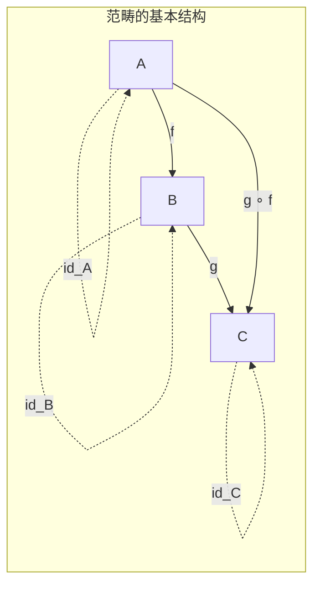
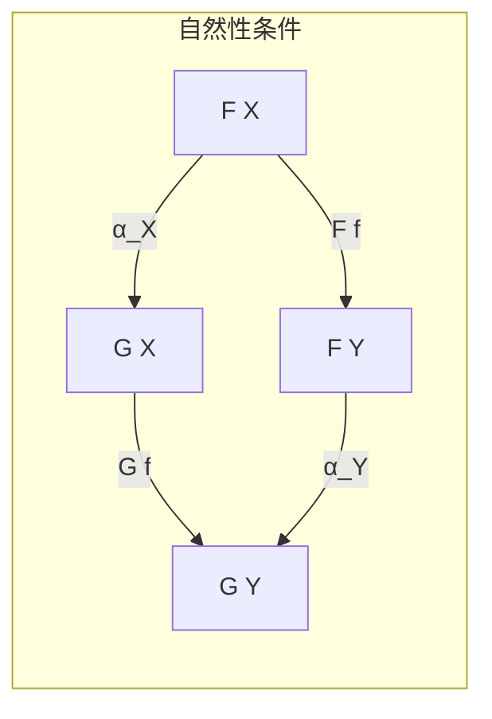

# 04.1 范畴基本概念

---

📌 **内容摘要**

本文档深入探讨范畴基本概念的核心原理和关键方法。内容涵盖范畴论领域的主要知识点，包括范畴, 函子等关键主题。适合具备相关基础的学习者进行深入研究。

**关键词**: 范畴, 范畴论, 函子

📚 **学习目标**

- 深入理解范畴基本概念的理论体系和形式化方法
- 能够进行相关定理的形式化证明
- 建立该领域的系统性知识框架

🎯 **难度级别**: 高级

⏱️ **预计阅读时间**: 15分钟

**前置知识**: 该领域的中级知识, 形式化方法基础, 离散数学

---


## 1. 范畴的定义

### 1.1 范畴的形式化定义

**定义 1.1.1** (范畴). 一个**范畴** $\mathcal{C}$ 由以下部分组成：

- **对象类** $\text{Ob}(\mathcal{C})$（或记为 $\mathcal{C}_0$）
- **态射类**：对任意对象 $A, B \in \text{Ob}(\mathcal{C})$，有态射集合（或类）$\text{Hom}_{\mathcal{C}}(A, B)$（或记为 $\mathcal{C}(A, B)$）
- **复合运算**：$\circ : \text{Hom}(B, C) \times \text{Hom}(A, B) \rightarrow \text{Hom}(A, C)$，记为 $g \circ f$ 或 $gf$
- **恒等态射**：对每个对象 $A$，有 $\text{id}_A \in \text{Hom}(A, A)$

满足以下公理：

1. **结合律**：$h \circ (g \circ f) = (h \circ g) \circ f$
2. **单位律**：$f \circ \text{id}_A = f = \text{id}_B \circ f$（对 $f : A \rightarrow B$）



```lean4
-- 范畴的结构定义
structure Category (Obj : Type u) : Type (max u (v+1)) where
  Hom : Obj → Obj → Type v
  id : ∀ X, Hom X X
  comp : ∀ {X Y Z}, Hom Y Z → Hom X Y → Hom X Z
  -- 结合律
  assoc : ∀ {W X Y Z} (f : Hom W X) (g : Hom X Y) (h : Hom Y Z),
    comp (comp h g) f = comp h (comp g f)
  -- 单位律
  id_comp : ∀ {X Y} (f : Hom X Y), comp f (id X) = f
  comp_id : ∀ {X Y} (f : Hom X Y), comp (id Y) f = f

notation:80 X " →[" C "] " Y => C.Hom X Y
notation:90 g " ∘[" C "] " f => C.comp g f
```

### 1.2 典型范畴示例

| 范畴 | 对象 | 态射 | 复合 |
|:---|:---|:---|:---|
| **Set** | 集合 | 函数 | 函数复合 |
| **Grp** | 群 | 群同态 | 同态复合 |
| **Top** | 拓扑空间 | 连续映射 | 映射复合 |
| **Vectₖ** | 域 $k$ 上的向量空间 | 线性映射 | 线性映射复合 |
| **Pos** | 偏序集 | 单调函数 | 函数复合 |
| **Rel** | 集合 | 关系 | 关系复合 |

```lean4
-- Set范畴
def SetCat : Category Type where
  Hom A B := A → B
  id _ := λ x => x
  comp g f := λ x => g (f x)
  assoc _ _ _ := rfl
  id_comp _ := rfl
  comp_id _ := rfl

-- 离散范畴（只有恒等态射）
def DiscreteCat (X : Type u) : Category X where
  Hom x y := Eq x y
  id x := Eq.refl x
  comp := Eq.trans
  assoc p q r := by simp [Eq.trans_assoc]
  id_comp _ := by simp
  comp_id _ := by simp
```

## 2. 函子

### 2.1 协变函子

**定义 2.1.1** (函子). 范畴 $\mathcal{C}$ 到 $\mathcal{D}$ 的**函子** $F : \mathcal{C} \rightarrow \mathcal{D}$ 包括：

- 对象映射：$F_0 : \text{Ob}(\mathcal{C}) \rightarrow \text{Ob}(\mathcal{D})$
- 态射映射：$F_1 : \text{Hom}_{\mathcal{C}}(A, B) \rightarrow \text{Hom}_{\mathcal{D}}(F_0(A), F_0(B))$

满足：

1. $F_1(\text{id}_A) = \text{id}_{F_0(A)}$
2. $F_1(g \circ f) = F_1(g) \circ F_1(f)$

```mermaid
graph LR
    subgraph "函子的保持性"
        C1[A] -->|f| C2[B]
        C2 -->|g| C3[C]
        D1[FA] -->|Ff| D2[FB]
        D2 -->|Fg| D3[FC]
        D1 -->|F(g∘f)| D3

        C1 -.->|F| D1
        C2 -.->|F| D2
        C3 -.->|F| D3
    end
```

```lean4
-- 函子结构
structure Functor {C D : Type u}
  (CatC : Category C) (CatD : Category D) where
  obj : C → D
  map : ∀ {X Y}, CatC.Hom X Y → CatD.Hom (obj X) (obj Y)
  -- 保持单位
  map_id : ∀ X, map (CatC.id X) = CatD.id (obj X)
  -- 保持复合
  map_comp : ∀ {X Y Z} (f : CatC.Hom X Y) (g : CatC.Hom Y Z),
    map (CatC.comp g f) = CatD.comp (map g) (map f)

notation:max F " ⟨ " X " ⟩ " => Functor.obj F X
```

### 2.2 函子示例

**例 2.2.1** (遗忘函子). $U : \text{Grp} \rightarrow \text{Set}$ 将群映射为其底层集合。

**例 2.2.2** (自由函子). $F : \text{Set} \rightarrow \text{Grp}$ 将集合映射为自由群。

**例 2.2.3** (恒等函子). $\text{Id}_{\mathcal{C}} : \mathcal{C} \rightarrow \mathcal{C}$

**例 2.2.4** (协变Hom函子). 对 $A \in \mathcal{C}$，$\text{Hom}(A, -) : \mathcal{C} \rightarrow \text{Set}$

```lean4
-- 恒等函子
def IdFunctor {C : Type u} (Cat : Category C) : Functor Cat Cat where
  obj X := X
  map f := f
  map_id _ := rfl
  map_comp _ _ := rfl

-- 协变Hom函子
def HomFunctor {C : Type u} (Cat : Category C) (A : C) :
  Functor Cat SetCat where
  obj X := Cat.Hom A X
  map f g := Cat.comp f g
  map_id X := by funext; simp [SetCat]
  map_comp f g := by funext; simp [SetCat, Cat.assoc]
```

### 2.3 逆变函子

**定义 2.3.1** (逆变函子). $F : \mathcal{C}^{\text{op}} \rightarrow \mathcal{D}$，其中 $\mathcal{C}^{\text{op}}$ 是 $\mathcal{C}$ 的**反范畴**（态射方向反转）。

**例 2.3.2** (逆变Hom函子). $\text{Hom}(-, A) : \mathcal{C}^{\text{op}} \rightarrow \text{Set}$

```lean4
-- 反范畴
def OppositeCat {C : Type u} (Cat : Category C) : Category C where
  Hom X Y := Cat.Hom Y X
  id := Cat.id
  comp f g := Cat.comp g f
  assoc f g h := by simp [Cat.assoc]
  id_comp _ := by simp [Cat.comp_id]
  comp_id _ := by simp [Cat.id_comp]

notation:max C "ᵒᵖ" => OppositeCat C

-- 逆变函子作为反范畴上的协变函子
def ContravariantFunctor {C D : Type u}
  (CatC : Category C) (CatD : Category D) : Type _ :=
  Functor (OppositeCat CatC) CatD
```

## 3. 自然变换

### 3.1 自然变换的定义

**定义 3.1.1** (自然变换). 函子 $F, G : \mathcal{C} \rightarrow \mathcal{D}$ 之间的**自然变换** $\alpha : F \Rightarrow G$ 是态射族：
$$\alpha_X : F(X) \rightarrow G(X) \text{ 对每个 } X \in \mathcal{C}$$

使得对任意 $f : X \rightarrow Y$，下图交换：



即：$G(f) \circ \alpha_X = \alpha_Y \circ F(f)$

```lean4
-- 自然变换结构
structure NatTrans {C D : Type u} {CatC : Category C} {CatD : Category D}
  (F G : Functor CatC CatD) where
  app : ∀ X, CatD.Hom (F.obj X) (G.obj X)
  -- 自然性条件
  naturality : ∀ {X Y} (f : CatC.Hom X Y),
    CatD.comp (app Y) (F.map f) = CatD.comp (G.map f) (app X)

notation:max α " ⟨ ” X " ⟩ " => NatTrans.app α X
```

### 3.2 函子范畴

**定理 3.2.1** (函子范畴). 范畴 $\mathcal{C}$ 到 $\mathcal{D}$ 的函子和自然变换构成范畴 $[\mathcal{C}, \mathcal{D}]$（或 $\mathcal{D}^{\mathcal{C}}$）。

```lean4
-- 自然变换的垂直复合
def NatTrans.vcomp {C D : Type u} {CatC : Category C} {CatD : Category D}
  {F G H : Functor CatC CatD}
  (α : NatTrans G H) (β : NatTrans F G) : NatTrans F H where
  app X := CatD.comp (α.app X) (β.app X)
  naturality f := by
    simp [CatD.assoc]
    rw [← CatD.assoc, β.naturality]
    simp [CatD.assoc, α.naturality]

-- 函子范畴
def FunctorCategory {C D : Type u}
  (CatC : Category C) (CatD : Category D) : Category _ where
  Hom F G := NatTrans F G
  id F := {
    app := λ X => CatD.id (F.obj X)
    naturality := by simp [CatD.id_comp, CatD.comp_id]
  }
  comp := NatTrans.vcomp
  -- 结合律和单位律的证明省略
```

## 4. 特殊态射

### 4.1 同构

**定义 4.1.1** (同构). 态射 $f : A \rightarrow B$ 是**同构**，如果存在 $g : B \rightarrow A$ 使得：
$$g \circ f = \text{id}_A \quad \text{且} \quad f \circ g = \text{id}_B$$

**定理 4.1.2** (同构的唯一逆). 同构的逆是唯一的。

```lean4
-- 同构结构
structure Iso {C : Type u} (Cat : Category C) (A B : C) where
  hom : Cat.Hom A B
  inv : Cat.Hom B A
  hom_inv_id : Cat.comp inv hom = Cat.id A
  inv_hom_id : Cat.comp hom inv = Cat.id B

notation:max A " ≅[" Cat "] " B => Iso Cat A B

-- 同构的复合
def Iso.comp {C : Type u} {Cat : Category C} {A B C' : C}
  (f : Iso Cat A B) (g : Iso Cat B C') : Iso Cat A C' where
  hom := Cat.comp g.hom f.hom
  inv := Cat.comp f.inv g.inv
  hom_inv_id := by
    simp [Cat.assoc]
    rw [← Cat.assoc g.hom, g.inv_hom_id]
    simp [f.hom_inv_id]
  inv_hom_id := by
    simp [Cat.assoc]
    rw [← Cat.assoc f.inv, f.hom_inv_id]
    simp [g.inv_hom_id]
```

### 4.2 单态射与满态射

**定义 4.2.1** (单态射). $f : A \rightarrow B$ 是**单态射**，如果对任意 $g, h : C \rightarrow A$：
$$f \circ g = f \circ h \Rightarrow g = h$$

**定义 4.2.2** (满态射). $f : A \rightarrow B$ 是**满态射**，如果对任意 $g, h : B \rightarrow C$：
$$g \circ f = h \circ f \Rightarrow g = h$$

```lean4
-- 单态射
def IsMonomorphism {C : Type u} {Cat : Category C}
  {A B : C} (f : Cat.Hom A B) : Prop :=
  ∀ {C'} (g h : Cat.Hom C' A),
    Cat.comp f g = Cat.comp f h → g = h

-- 满态射
def IsEpimorphism {C : Type u} {Cat : Category C}
  {A B : C} (f : Cat.Hom A B) : Prop :=
  ∀ {C'} (g h : Cat.Hom B C'),
    Cat.comp g f = Cat.comp h f → g = h
```

## 5. 对偶性

### 5.1 对偶原理

**原理 5.1.1** (对偶原理). 范畴论中任何关于范畴、函子、自然变换的定理，若将所有箭头方向反转，得到的陈述也是定理。

**应用**：单态射与满态射通过对偶关联。

```lean4
-- 对偶定理的自动推导（概念性）
def dualizeTheorem {C : Type u} {Cat : Category C}
  (P : Category C → Prop) : Category (OppositeCat Cat) → Prop :=
  P

-- 单态射的对偶是满态射
theorem monoDualEpi {C : Type u} {Cat : Category C}
  {A B : C} (f : Cat.Hom A B) :
  IsMonomorphism f ↔ IsEpimorphism (C := Cᵒᵖ Cat) f := by
  rfl
```

### 5.2 初始对象与终结对象

**定义 5.2.1** (初始对象). 对象 $I \in \mathcal{C}$ 是**初始**的，如果对任意 $A \in \mathcal{C}$，存在唯一的 $I \rightarrow A$。

**定义 5.2.2** (终结对象). 对象 $T \in \mathcal{C}$ 是**终结**的，如果对任意 $A \in \mathcal{C}$，存在唯一的 $A \rightarrow T$。

**对偶性**：初始对象在 $\mathcal{C}^{\text{op}}$ 中是终结对象。

```lean4
-- 初始对象
def IsInitial {C : Type u} {Cat : Category C} (I : C) : Prop :=
  ∀ A, ∃! f : Cat.Hom I A, True

-- 终结对象
def IsTerminal {C : Type u} {Cat : Category C} (T : C) : Prop :=
  ∀ A, ∃! f : Cat.Hom A T, True

-- 对偶关系
theorem initialDualTerminal {C : Type u} {Cat : Category C} {I : C} :
  IsInitial (Cat := Cat) I ↔ IsTerminal (Cat := Cᵒᵖ Cat) I := by
  rfl
```

## 参考

- [01.1 文法与语言](../01_形式语言基础/01.1_文法与语言.md) - 形式语言基础
- [02.3 依赖类型](../02_类型论/02.3_依赖类型.md) - 依赖类型系统
- [04.2 极限与余极限](./04.2_极限与余极限.md) - 范畴论核心构造
- [04.3 伴随与单子](./04.3_伴随与单子.md) - 高级范畴论

---

## 📋 前置知识

- [2.1 抽象代数](../../01_数学基础/02_代数学/02.1_抽象代数.md)

---

## 📚 延伸阅读

- [4.1 范畴基础 (Category Theory Foundations)](../04_范畴论/04.1_范畴基础.md)
- [1. 单子与函子](../../03_编程范式/04_函数式编程/04.2_单子与函子.md)
- [04.3 单子与函子](../../03_编程范式/04_函数式编程/04.3_单子与函子.md)
- [02.4 类型论与逻辑](../02_类型论/02.4_类型论与逻辑.md)
- [2.4 类型论进阶 (Advanced Type Theory)](../02_类型论/02.4_类型论进阶.md)
