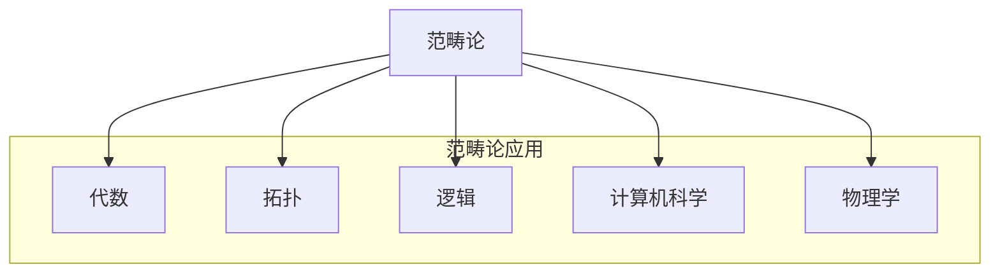

# 4.1 范畴基础 (Category Theory Foundations)

---

📌 **内容摘要**

本文档系统介绍范畴的基础理论和核心概念。内容涵盖范畴论领域的主要知识点，包括范畴, 函子等关键主题。适合具备相关基础的学习者进行深入研究。

**关键词**: 范畴, 范畴论, 函子

📚 **学习目标**

- 深入理解范畴的理论体系和形式化方法
- 能够进行相关定理的形式化证明
- 建立该领域的系统性知识框架

🎯 **难度级别**: 高级

⏱️ **预计阅读时间**: 15分钟

**前置知识**: 该领域的中级知识, 形式化方法基础, 离散数学

---


## 目录

- [4.1 范畴基础 (Category Theory Foundations)](#41-范畴基础-category-theory-foundations)
  - [目录](#目录)
  - [4.1.1 引言](#411-引言)
  - [4.1.2 范畴的定义](#412-范畴的定义)
    - [4.1.2.1 范畴的公理](#4121-范畴的公理)
    - [4.1.2.2 小范畴与局部小范畴](#4122-小范畴与局部小范畴)
  - [4.1.3 态射](#413-态射)
    - [4.1.3.1 特殊态射](#4131-特殊态射)
    - [4.1.3.2 同构](#4132-同构)
  - [4.1.4 函子](#414-函子)
    - [4.1.4.1 共变与逆变函子](#4141-共变与逆变函子)
    - [4.1.4.2 函子范畴](#4142-函子范畴)
  - [4.1.5 自然变换](#415-自然变换)
    - [4.1.5.1 垂直与水平复合](#4151-垂直与水平复合)
    - [4.1.5.2 Yoneda引理](#4152-yoneda引理)
  - [4.1.6 重要范畴示例](#416-重要范畴示例)
  - [4.1.7 形式化证明](#417-形式化证明)
    - [Lean 4：范畴的形式化](#lean-4范畴的形式化)
    - [Haskell：范畴论语义](#haskell范畴论语义)
  - [4.1.8 总结](#418-总结)
  - [_文档版本: 1.0 | 最后更新: 2026-04-11_](#文档版本-10--最后更新-2026-04-11)
  - [📚 延伸阅读](#-延伸阅读)

---

## 4.1.1 引言

范畴论(Category Theory)由Samuel Eilenberg和Saunders Mac Lane于1945年提出，为研究数学结构及其关系提供了统一的框架。
范畴论关注对象之间的关系而非对象本身的内部结构，被称为"数学的数学"。

**范畴论的核心思想**：

- 数学结构由对象和它们之间的关系（态射）组成
- 通过泛性质(Universal Properties)刻画结构
- 使用函子和自然变换研究结构间的映射



> **引用**: 类型论见 [../02_类型论/02.1_简单类型论.md](../02_类型论/02.1_简单类型论.md)，同伦类型论见 [../03_同伦类型论_HoTT/03.1_同伦基础.md](../03_同伦类型论_HoTT/03.1_同伦基础.md)。

---

## 4.1.2 范畴的定义

**定义 4.1.1 (范畴)** 范畴 $\mathcal{C}$ 由以下部分组成：

1. **对象类** $\text{Ob}(\mathcal{C})$（或记作 $\mathcal{C}_0$）
2. **态射集** 对任意 $A, B \in \text{Ob}(\mathcal{C})$，有态射集合 $\text{Hom}_{\mathcal{C}}(A, B)$（或 $\mathcal{C}(A, B)$）
3. **复合运算** 对任意 $A, B, C \in \text{Ob}(\mathcal{C})$，有：
   $$\circ : \text{Hom}(B, C) \times \text{Hom}(A, B) \rightarrow \text{Hom}(A, C)$$
4. **单位态射** 对任意 $A \in \text{Ob}(\mathcal{C})$，有 $\text{id}_A \in \text{Hom}(A, A)$

### 4.1.2.1 范畴的公理

**结合律**：对任意 $f: A \rightarrow B$, $g: B \rightarrow C$, $h: C \rightarrow D$：

$$(h \circ g) \circ f = h \circ (g \circ f)$$

**单位律**：对任意 $f: A \rightarrow B$：

$$f \circ \text{id}_A = f = \text{id}_B \circ f$$

**记号**：$f: A \rightarrow B$ 或 $A \xrightarrow{f} B$

### 4.1.2.2 小范畴与局部小范畴

**定义 4.1.2 (小范畴)** 范畴 $\mathcal{C}$ 是小范畴，如果 $\text{Ob}(\mathcal{C})$ 是集合（而非真类）。

**定义 4.1.3 (局部小范畴)** 范畴 $\mathcal{C}$ 是局部小的，如果对任意 $A, B$，$\text{Hom}(A, B)$ 是集合。

---

## 4.1.3 态射

### 4.1.3.1 特殊态射

**定义 4.1.4 (单态射, Monomorphism)** $f: A \rightarrow B$ 是单态射，如果：

$$\forall g, h: C \rightarrow A. f \circ g = f \circ h \Rightarrow g = h$$

**定义 4.1.5 (满态射, Epimorphism)** $f: A \rightarrow B$ 是满态射，如果：

$$\forall g, h: B \rightarrow C. g \circ f = h \circ f \Rightarrow g = h$$

**定义 4.1.6 (双态射, Bimorphism)** 既是单态射又是满态射的态射。

| 范畴 | 单态射 | 满态射 |
|------|--------|--------|
| **Set** | 单射函数 | 满射函数 |
| **Grp** | 单射同态 | 满射同态 |
| **Top** | 单射连续映射 | 满射连续映射 |
| **Ring** | 单射环同态 | 满射环同态 |

### 4.1.3.2 同构

**定义 4.1.7 (同构)** $f: A \rightarrow B$ 是同构，如果存在 $g: B \rightarrow A$ 使得：

$$g \circ f = \text{id}_A \quad \text{且} \quad f \circ g = \text{id}_B$$

此时记 $A \cong B$，称 $g = f^{-1}$ 为 $f$ 的逆。

**定理 4.1.1 (逆的唯一性)** 若 $f$ 是同构，则其逆唯一。

**证明**：设 $g, h$ 都是 $f$ 的逆，则：
$$g = g \circ \text{id}_B = g \circ (f \circ h) = (g \circ f) \circ h = \text{id}_A \circ h = h$$
$\square$

---

## 4.1.4 函子

**定义 4.1.8 (函子)** 函子 $F: \mathcal{C} \rightarrow \mathcal{D}$ 包括：

1. **对象映射**：$F: \text{Ob}(\mathcal{C}) \rightarrow \text{Ob}(\mathcal{D})$
2. **态射映射**：$F: \text{Hom}_{\mathcal{C}}(A, B) \rightarrow \text{Hom}_{\mathcal{D}}(F(A), F(B))$

满足：

- **保持单位**：$F(\text{id}_A) = \text{id}_{F(A)}$
- **保持复合**：$F(g \circ f) = F(g) \circ F(f)$

### 4.1.4.1 共变与逆变函子

**定义 4.1.9 (共变函子)** 上述定义的函子（保持态射方向）。

**定义 4.1.10 (逆变函子)** 反转态射方向的函子 $F: \mathcal{C}^{\text{op}} \rightarrow \mathcal{D}$：

- 对象映射：$F: \text{Ob}(\mathcal{C}) \rightarrow \text{Ob}(\mathcal{D})$
- 态射映射：$F: \text{Hom}_{\mathcal{C}}(A, B) \rightarrow \text{Hom}_{\mathcal{D}}(F(B), F(A))$

满足：$F(g \circ f) = F(f) \circ F(g)$

### 4.1.4.2 函子范畴

**定义 4.1.11 (函子范畴)** $[\mathcal{C}, \mathcal{D}]$ 或 $\mathcal{D}^{\mathcal{C}}$：

- 对象：从 $\mathcal{C}$ 到 $\mathcal{D}$ 的函子
- 态射：自然变换

---

## 4.1.5 自然变换

**定义 4.1.12 (自然变换)** 给定函子 $F, G: \mathcal{C} \rightarrow \mathcal{D}$，自然变换 $\alpha: F \Rightarrow G$ 是一族态射：

$$\alpha_A : F(A) \rightarrow G(A) \quad \text{对每个 } A \in \text{Ob}(\mathcal{C})$$

使得对任意 $f: A \rightarrow B$，下图交换：

```
F(A) ──α_A──→ G(A)
 │              │
 │F(f)          │G(f)
 ▼              ▼
F(B) ──α_B──→ G(B)
```

即：$\alpha_B \circ F(f) = G(f) \circ \alpha_A$

### 4.1.5.1 垂直与水平复合

**垂直复合**：给定 $\alpha: F \Rightarrow G$ 和 $\beta: G \Rightarrow H$：

$$(\beta \circ \alpha)_A := \beta_A \circ \alpha_A$$

**水平复合**：给定 $\alpha: F \Rightarrow G$（$F, G: \mathcal{C} \rightarrow \mathcal{D}$）和 $\beta: H \Rightarrow K$（$H, K: \mathcal{D} \rightarrow \mathcal{E}$）：

$$(\beta * \alpha)_A := \beta_{G(A)} \circ H(\alpha_A) = K(\alpha_A) \circ \beta_{F(A)}$$

### 4.1.5.2 Yoneda引理

**定理 4.1.2 (Yoneda引理)** 对任意函子 $F: \mathcal{C}^{\text{op}} \rightarrow \text{Set}$ 和对象 $A \in \mathcal{C}$：

$$\text{Nat}(\text{Hom}(-, A), F) \cong F(A)$$

**推论 4.1.1 (Yoneda嵌入)** 函子 $y: \mathcal{C} \rightarrow [\mathcal{C}^{\text{op}}, \text{Set}]$，$A \mapsto \text{Hom}(-, A)$ 是完全忠实的。

**意义**：

- 对象由其与其他对象的关系完全确定
- "一个对象由其与其他对象的相互作用完全描述"

---

## 4.1.6 重要范畴示例

| 范畴 | 对象 | 态射 |
|------|------|------|
| **Set** | 集合 | 函数 |
| **FinSet** | 有限集合 | 函数 |
| **Grp** | 群 | 群同态 |
| **Ab** | 阿贝尔群 | 群同态 |
| **Ring** | 环 | 环同态 |
| **Vect$_k$** | $k$-向量空间 | 线性映射 |
| **Top** | 拓扑空间 | 连续映射 |
| **Man** | 光滑流形 | 光滑映射 |
| **Pos** | 偏序集 | 单调函数 |
| **Cat** | 小范畴 | 函子 |
| **Hask** | Haskell类型 | Haskell函数 |

**离散范畴**：对象是集合，态射仅有恒等态射。

**预序范畴**：对象是预序集的元素，存在唯一态射 $a \rightarrow b$ 当且仅当 $a \leq b$。

**单对象范畴**：对象只有一个，态射形成幺半群。

---

## 4.1.7 形式化证明

### Lean 4：范畴的形式化

```lean4
-- 范畴定义
structure Category where
  Obj : Type u
  Hom : Obj → Obj → Type v
  id : ∀ X, Hom X X
  comp : ∀ {X Y Z}, Hom Y Z → Hom X Y → Hom X Z
  -- 公理
  id_comp : ∀ {X Y} (f : Hom X Y), comp (id Y) f = f
  comp_id : ∀ {X Y} (f : Hom X Y), comp f (id X) = f
  assoc : ∀ {W X Y Z} (f : Hom W X) (g : Hom X Y) (h : Hom Y Z),
    comp (comp h g) f = comp h (comp g f)

notation X " → " Y => Category.Hom _ X Y
notation g " ∘ " f => Category.comp _ g f

-- 函子定义
structure Functor (C D : Category) where
  obj : C.Obj → D.Obj
  map : ∀ {X Y}, (X → Y) → (obj X → obj Y)
  map_id : ∀ X, map (C.id X) = D.id (obj X)
  map_comp : ∀ {X Y Z} (f : X → Y) (g : Y → Z),
    map (C.comp g f) = D.comp (map g) (map f)

notation C " ⥤ " D => Functor C D

-- 自然变换
structure NaturalTransformation {C D : Category} (F G : C ⥤ D) where
  app : ∀ X, F.obj X → G.obj X
  naturality : ∀ {X Y} (f : X → Y),
    D.comp (app Y) (F.map f) = D.comp (G.map f) (app X)

notation F " ⟹ " G => NaturalTransformation F G

-- Set范畴
def SetCat : Category where
  Obj := Type u
  Hom X Y := X → Y
  id _ := fun x => x
  comp g f := g ∘ f
  id_comp _ := rfl
  comp_id _ := rfl
  assoc _ _ _ := rfl

-- 离散范畴
def Discrete (α : Type u) : Category where
  Obj := α
  Hom X Y := PLift (X = Y)
  id X := PLift.up rfl
  comp := by intros; cases ‹PLift (_ = _)›; assumption
  id_comp := by intros; rfl
  comp_id := by intros; rfl
  assoc := by intros; rfl
```

### Haskell：范畴论语义

```haskell
{-# LANGUAGE TypeOperators #-}
{-# LANGUAGE PolyKinds #-}

-- 范畴类型类
class Category (cat :: k -> k -> *) where
  id :: cat a a
  (.) :: cat b c -> cat a b -> cat a c

-- (->)作为范畴
instance Category (->) where
  id = \x -> x
  g . f = \x -> g (f x)

-- 函子类型类（与Haskell Functor不同）
class (Category c, Category d) => CFunctor f c d where
  fmap :: c a b -> d (f a) (f b)

-- 自然变换（作为类型族间的多态函数）
type NatTrans f g = forall a. f a -> g a

-- Yoneda嵌入
data Yoneda f a = Yoneda (forall r. (a -> r) -> f r)

-- Coyoneda
data Coyoneda f a where
  Coyoneda :: f b -> (b -> a) -> Coyoneda f a

-- 伴随（简化）
class (CFunctor f c d, CFunctor g d c) => Adjunction f g c d where
  unit :: c a (g (f a))
  counit :: d (f (g b)) b
```

---

## 4.1.8 总结

**范畴论基本构造**：

| 概念 | 说明 |
|------|------|
| **范畴** | 对象 + 态射 + 复合 + 单位 |
| **函子** | 范畴间的结构保持映射 |
| **自然变换** | 函子间的映射 |
| **Yoneda引理** | 对象由Hom函子完全刻画 |

**范畴论核心原则**：

```
对象 ←→ 结构
态射 ←→ 结构保持映射
函子 ←→ 范畴间的映射
自然变换 ←→ 函子间的映射
```

**延伸阅读**：

- [04.2_极限与余极限.md](./04.2_极限与余极限.md) - 泛性质与极限
- [04.3_伴随与单子.md](./04.3_伴随与单子.md) - 函子间的关系
- [04.4_范畴论语义.md](./04.4_范畴论语义.md) - 类型论的范畴论语义

---

_文档版本: 1.0 | 最后更新: 2026-04-11_
---

## 📚 延伸阅读

- [04.1 范畴基本概念](../04_范畴论/04.1_范畴基本概念.md)
- [1. 单子与函子](../../03_编程范式/04_函数式编程/04.2_单子与函子.md)
- [04.3 单子与函子](../../03_编程范式/04_函数式编程/04.3_单子与函子.md)
- [02.4 类型论与逻辑](../02_类型论/02.4_类型论与逻辑.md)
- [2.4 类型论进阶 (Advanced Type Theory)](../02_类型论/02.4_类型论进阶.md)
