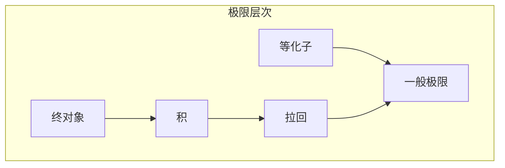

# 4.2 极限与余极限 (Limits and Colimits)

## 目录

- [4.2 极限与余极限 (Limits and Colimits)](#42-极限与余极限-limits-and-colimits)
  - [目录](#目录)
  - [4.2.1 引言](#421-引言)
  - [4.2.2 图式与锥](#422-图式与锥)
    - [4.2.2.1 图式](#4221-图式)
    - [4.2.2.2 锥](#4222-锥)
  - [4.2.3 极限](#423-极限)
    - [4.2.3.1 极限的泛性质](#4231-极限的泛性质)
    - [4.2.3.2 特殊极限](#4232-特殊极限)
  - [4.2.4 余极限](#424-余极限)
    - [4.2.4.1 泛性质](#4241-泛性质)
    - [4.2.4.2 特殊余极限](#4242-特殊余极限)
  - [4.2.5 完备范畴](#425-完备范畴)
  - [4.2.6 伴随与极限](#426-伴随与极限)
  - [4.2.7 形式化证明](#427-形式化证明)
    - [Lean 4：极限的形式化](#lean-4极限的形式化)
    - [Haskell：极限构造](#haskell极限构造)
  - [4.2.8 总结](#428-总结)

---

## 4.2.1 引言

极限(Limits)和余极限(Colimits)是范畴论中描述**泛性质(Universal Properties)**的核心概念。
它们统一了数学中众多构造，如积、和、等化子、核等。

**核心思想**：

- 极限：从"上方"逼近图式的最佳对象
- 余极限：从"下方"逼近图式的最佳对象



> **引用**: 范畴基础见 [04.1_范畴基础.md](./04.1_范畴基础.md)，伴随见 [04.3_伴随与单子.md](./04.3_伴随与单子.md)。

---

## 4.2.2 图式与锥

### 4.2.2.1 图式

**定义 4.2.1 (图式)** 范畴 $\mathcal{C}$ 中的图式是由小范畴 $\mathcal{J}$（索引范畴）索引的函子：

$$D : \mathcal{J} \rightarrow \mathcal{C}$$

**示例**：

- 离散图式：$\mathcal{J}$ 是离散范畴（仅有恒等态射）
- 等化子图式：$\bullet \rightrightarrows \bullet$
- 拉回图式：$\bullet \rightarrow \bullet \leftarrow \bullet$

### 4.2.2.2 锥

**定义 4.2.2 (锥)** 图式 $D: \mathcal{J} \rightarrow \mathcal{C}$ 的锥由对象 $C \in \mathcal{C}$ 和一族态射 $\{\psi_j: C \rightarrow D(j)\}_{j \in \mathcal{J}}$ 组成，使得对任意 $\alpha: j \rightarrow k$：

$$D(\alpha) \circ \psi_j = \psi_k$$

```
        C
       /|\
      / | \
    ψⱼ/  |  \ψₖ
    /   |   \
   ↓    |    ↓
 D(j) ──→ D(k)
    D(α)
```

---

## 4.2.3 极限

### 4.2.3.1 极限的泛性质

**定义 4.2.3 (极限)** 图式 $D$ 的极限是锥 $(L, \{\pi_j\})$ 满足泛性质：

对任意锥 $(C, \{\psi_j\})$，存在唯一的态射 $u: C \rightarrow L$ 使得：

$$\pi_j \circ u = \psi_j \quad \text{对所有 } j \in \mathcal{J}$$

```
        C
       /|\
      / | \
    ψⱼ/  |u \ψₖ
    /   ↓   \
   ↓    L    ↓
 D(j) ←πⱼ─πₖ→ D(k)
```

**记号**：$\varprojlim D$ 或 $\lim D$

### 4.2.3.2 特殊极限

**终对象 (Terminal Object)**：空图式的极限

$$\mathbf{1} \text{ 满足 } \forall C. \exists! f: C \rightarrow \mathbf{1}$$

**积 (Product)**：离散图式 $\{A, B\}$ 的极限

$$A \times B \xrightarrow{\pi_1} A, \quad A \times B \xrightarrow{\pi_2} B$$

泛性质：对任意 $f: C \rightarrow A$, $g: C \rightarrow B$，存在唯一的 $\langle f, g \rangle: C \rightarrow A \times B$。

**等化子 (Equalizer)**：图式 $A \rightrightarrows^f_g B$ 的极限

$$E \xrightarrow{e} A \rightrightarrows^f_g B$$

满足 $f \circ e = g \circ e$，且对任意满足 $f \circ h = g \circ h$ 的 $h$，存在唯一的 $u$ 使得 $e \circ u = h$。

**拉回 (Pullback)**：图式 $A \xrightarrow{f} C \xleftarrow{g} B$ 的极限

$$
\begin{array}{ccc}
P & \xrightarrow{p_2} & B \\
p_1 \downarrow & & \downarrow g \\
A & \xrightarrow{f} & C
\end{array}
$$

满足 $f \circ p_1 = g \circ p_2$。

| 极限 | 图式 | Set中的构造 |
|------|------|------------|
| 终对象 | 空 | 单元素集合 |
| 积 | 离散 $\{A,B\}$ | 笛卡尔积 |
| 等化子 | $A \rightrightarrows B$ | $\{a \in A \mid f(a) = g(a)\}$ |
| 拉回 | $A \rightarrow C \leftarrow B$ | $\{(a,b) \mid f(a) = g(b)\}$ |

---

## 4.2.4 余极限

### 4.2.4.1 泛性质

**定义 4.2.4 (余锥)** 余锥是锥的对偶：对象 $C$ 和 $\{\iota_j: D(j) \rightarrow C\}$。

**定义 4.2.5 (余极限)** 余极限 $(L, \{\iota_j\})$ 满足：对任意余锥 $(C, \{\psi_j\})$，存在唯一的 $u: L \rightarrow C$ 使得 $u \circ \iota_j = \psi_j$。

**记号**：$\varinjlim D$ 或 $\text{colim } D$

### 4.2.4.2 特殊余极限

**始对象 (Initial Object)**：空图式的余极限

$$\mathbf{0} \text{ 满足 } \forall C. \exists! f: \mathbf{0} \rightarrow C$$

**余积 (Coproduct)**：

$$A \xrightarrow{\text{inl}} A + B \xleftarrow{\text{inr}} B$$

泛性质：对任意 $f: A \rightarrow C$, $g: B \rightarrow C$，存在唯一的 $[f, g]: A + B \rightarrow C$。

**余等化子 (Coequalizer)**：

$$A \rightrightarrows^f_g B \xrightarrow{c} Q$$

**推出 (Pushout)**：拉回的对偶

$$
\begin{array}{ccc}
C & \xrightarrow{g} & B \\
f \downarrow & & \downarrow \\nA & \longrightarrow & P
\end{array}
$$

| 余极限 | Set中的构造 |
|--------|------------|
| 始对象 | 空集 |
| 余积 | 不交并 |
| 余等化子 | $B / \sim$，其中 $\sim$ 由 $f(a) \sim g(a)$ 生成 |
| 推出 | $A \sqcup B / (f(c) \sim g(c))$ |

---

## 4.2.5 完备范畴

**定义 4.2.6 (完备范畴)** 范畴 $\mathcal{C}$ 是完备的，如果所有小图式在 $\mathcal{C}$ 中都有极限。

**定义 4.2.7 (余完备范畴)** 所有小图式有余极限。

**定理 4.2.1 (Set是完备且余完备的)** 集合范畴Set对所有小图式有极限和余极限。

**定理 4.2.2 (完备性的判定)** 范畴完备当且仅当它有：

- 所有积
- 所有等化子

（对偶地，余完备需要余积和余等化子）

---

## 4.2.6 伴随与极限

**定理 4.2.3 (右伴随保持极限)** 若 $G: \mathcal{D} \rightarrow \mathcal{C}$ 是右伴随，则 $G$ 保持所有存在的极限：

$$G(\varprojlim D) \cong \varprojlim (G \circ D)$$

**定理 4.2.4 (左伴随保持余极限)** 若 $F: \mathcal{C} \rightarrow \mathcal{D}$ 是左伴随，则 $F$ 保持所有余极限：

$$F(\varinjlim D) \cong \varinjlim (F \circ D)$$

---

## 4.2.7 形式化证明

### Lean 4：极限的形式化

```lean4
-- 锥的定义
structure Cone {C J : Category} (F : Functor J C) where
  vertex : C.Obj
  π : (j : J.Obj) → C.Hom vertex (F.obj j)
  comm : ∀ {j k} (f : J.Hom j k),
    C.comp (F.map f) (π j) = π k

-- 极限定义：泛锥
structure Limit {C J : Category} (F : Functor J C) extends Cone F where
  isLimit : ∀ (c : Cone F),
    ∃! u : C.Hom c.vertex vertex,
      ∀ j, C.comp (π j) u = c.π j

-- 积作为二元离散图式的极限
def BinaryProduct {C : Category} (A B : C.Obj) :=
  let J : Category := {  -- 离散范畴2
    Obj := Bool,
    Hom X Y := PLift (X = Y),
    id _ := PLift.up rfl,
    comp := by intros; cases ‹PLift (_ = _)›; assumption
    id_comp := by intros; rfl
    comp_id := by intros; rfl
    assoc := by intros; rfl
  }
  let F : Functor J C := {
    obj := fun b => if b then A else B
    map := fun h => by cases h; exact C.id _
    map_id := by intros; rfl
    map_comp := by intros; rfl
  }
  Limit F

-- 等化子
def Equalizer {C : Category} {A B : C.Obj} (f g : C.Hom A B) :=
  let J : Category := {  -- 范畴 • ⇉ •
    Obj := Bool,
    Hom := fun X Y => if X = false ∧ Y = true
                      then PLift (f = g)  -- 简化为两个态射
                      else PLift (X = Y)
    -- ... 范畴结构定义省略
  }
  Limit (Functor.mk sorry sorry sorry sorry)
```

### Haskell：极限构造

```haskell
{-# LANGUAGE GADTs #-}
{-# LANGUAGE RankNTypes #-}

-- 锥（使用类型族）
data Cone (f :: k -> *) (a :: *) where
  Cone :: (forall (j :: k). a -> f j) -> Cone f a

-- 极限：泛锥
data Limit f = Limit {
  limitVertex :: forall a. Cone f a -> a,
  limitCone :: Cone f (Limit f)
}

-- 积作为极限
data PairF a b i where
  Fst :: PairF a b a
  Snd :: PairF a b b

type Product a b = Limit (PairF a b)

-- 积的构造
mkProduct :: a -> b -> Product a b
mkProduct a b = Limit {
  limitVertex = \c -> case c of
    Cone proj -> proj Fst a,  -- 简化
  limitCone = Cone $ \case
    Fst -> a
    Snd -> b
}

-- 等化子
data EqF f g i where
  EqA :: EqF f g a
  EqB :: EqF f g b

type Equalizer f g = Limit (EqF f g)
```

---

## 4.2.8 总结

**极限与余极限对比**：

| 概念 | 极限 | 余极限 |
|------|------|--------|
| 方向 | 从上方逼近 | 从下方逼近 |
| 泛性质 | 唯一的态射到极限 | 唯一的态射从余极限 |
| Set构造 | 子集/关系 | 商/不交并 |
| 保持 | 右伴随保持 | 左伴随保持 |

**极限层次**：

```
一般极限
  ├── 积 ←── 终对象（空积）
  ├── 等化子
  └── 拉回 ←── 积 + 等化子

一般余极限
  ├── 余积 ←── 始对象（空余积）
  ├── 余等化子
  └── 推出
```

**延伸阅读**：

- [04.1_范畴基础.md](./04.1_范畴基础.md) - 范畴论基础
- [04.3_伴随与单子.md](./04.3_伴随与单子.md) - 伴随函子
- [../02_类型论/02.4_类型论进阶.md](../02_类型论/02.4_类型论进阶.md) - 归纳类型与余极限

---

_文档版本: 1.0 | 最后更新: 2026-04-11_
