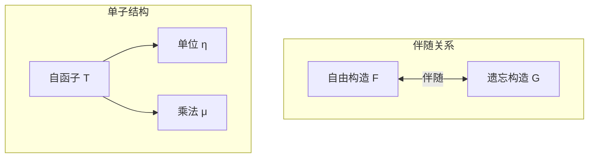
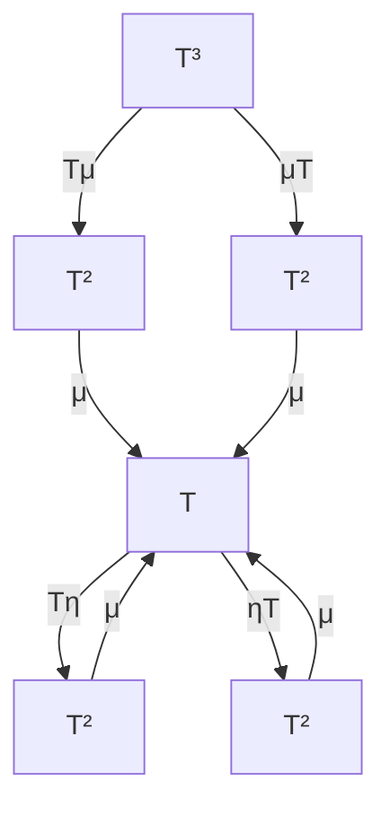

# 4.3 伴随与单子 (Adjunctions and Monads)

---

📌 **内容摘要**

本文档深入探讨伴随与单子的核心原理和关键方法。内容涵盖范畴论领域的主要知识点，包括范畴, 函子等关键主题。适合具备相关基础的学习者进行深入研究。

**关键词**: 范畴, 范畴论, 函子

📚 **学习目标**
- 深入理解伴随与单子的理论体系和形式化方法
- 能够进行相关定理的形式化证明
- 建立该领域的系统性知识框架

🎯 **难度级别**: 高级

⏱️ **预计阅读时间**: 15分钟

**前置知识**: 该领域的中级知识, 形式化方法基础, 离散数学

---


## 目录

- [4.3 伴随与单子 (Adjunctions and Monads)](#43-伴随与单子-adjunctions-and-monads)
  - [目录](#目录)
  - [4.3.1 引言](#431-引言)
  - [4.3.2 伴随函子](#432-伴随函子)
    - [4.3.2.1 伴随的定义](#4321-伴随的定义)
    - [4.3.2.2 伴随的等价刻画](#4322-伴随的等价刻画)
  - [4.3.3 单子](#433-单子)
    - [4.3.3.1 单子的定义](#4331-单子的定义)
    - [4.3.3.2 Kleisli范畴](#4332-kleisli范畴)
  - [4.3.4 余单子](#434-余单子)
  - [4.3.5 伴随与单子的关系](#435-伴随与单子的关系)
  - [4.3.6 应用](#436-应用)
    - [4.3.6.1 自由-遗忘伴随](#4361-自由-遗忘伴随)
    - [4.3.6.2 计算效应](#4362-计算效应)
  - [4.3.7 形式化证明](#437-形式化证明)
    - [Lean 4：单子形式化](#lean-4单子形式化)
    - [Haskell：单子定律验证](#haskell单子定律验证)
  - [4.3.8 总结](#438-总结)

---

## 4.3.1 引言

伴随(Adjunction)是范畴论中最基本、最重要的概念之一，描述了两个函子之间的"最优近似"关系。
单子(Monad)则源于伴随，在函数式编程和计算效应建模中有广泛应用。

**核心观点**：

- 伴随："自由构造"与"遗忘构造"之间的对应
- 单子：封装计算上下文（状态、异常、非确定性等）



> **引用**: 范畴基础见 [04.1_范畴基础.md](./04.1_范畴基础.md)，极限见 [04.2_极限与余极限.md](./04.2_极限与余极限.md)。

---

## 4.3.2 伴随函子

### 4.3.2.1 伴随的定义

**定义 4.3.1 (伴随)** 函子 $F: \mathcal{C} \rightarrow \mathcal{D}$ 和 $G: \mathcal{D} \rightarrow \mathcal{C}$ 形成伴随，记作 $F \dashv G$，如果存在自然同构：

$$\Phi_{C,D} : \text{Hom}_{\mathcal{D}}(F(C), D) \cong \text{Hom}_{\mathcal{C}}(C, G(D))$$

$F$ 称为**左伴随**，$G$ 称为**右伴随**。

**单元(Counit)** 和 **余单元(Unit)**：

- 余单元 $\eta: \text{Id}_{\mathcal{C}} \Rightarrow G \circ F$
- 单元 $\varepsilon: F \circ G \Rightarrow \text{Id}_{\mathcal{D}}$

满足三角等式：

$$(\varepsilon F) \circ (F \eta) = \text{id}_F$$
$$(G \varepsilon) \circ (\eta G) = \text{id}_G$$

```
F ──Fη──→ FGF ──εF──→ F    =    F ──id──→ F
G ──ηG──→ GFG ──Gε──→ G    =    G ──id──→ G
```

### 4.3.2.2 伴随的等价刻画

**定理 4.3.1 (伴随的等价条件)** 以下条件等价：

1. $F \dashv G$（自然同构）
2. 存在余单元 $\eta$ 和单元 $\varepsilon$ 满足三角等式
3. $F$ 保持余极限，$G$ 保持极限

**常见伴随示例**：

| 左伴随 F | 右伴随 G | 范畴 |
|----------|---------|------|
| 自由群 | 遗忘到Set | Grp ⇄ Set |
| 自由幺半群 | 遗忘到Set | Mon ⇄ Set |
| 不交和 | 对角 | C ⇄ C×C |
| 积 | 对角 | C×C ⇄ C |
| 存在量化 | 弱化 | Pred ⇄ Pred |
| 全称量化 | 弱化 | Pred ⇄ Pred |

---

## 4.3.3 单子

### 4.3.3.1 单子的定义

**定义 4.3.2 (单子)** 范畴 $\mathcal{C}$ 上的单子是三元组 $(T, \eta, \mu)$：

- $T: \mathcal{C} \rightarrow \mathcal{C}$：自函子
- $\eta: \text{Id}_{\mathcal{C}} \Rightarrow T$：单位（return）
- $\mu: T^2 \Rightarrow T$：乘法（join）

满足结合律和单位律：

$$\mu \circ T\mu = \mu \circ \mu T : T^3 \Rightarrow T$$
$$\mu \circ T\eta = \mu \circ \eta T = \text{id}_T : T \Rightarrow T$$



**Haskell表示**：

```haskell
class Functor m => Monad m where
  return :: a -> m a        -- η
  join   :: m (m a) -> m a  -- μ
  -- 或 >>= (bind)
  (>>=)  :: m a -> (a -> m b) -> m b
```

### 4.3.3.2 Kleisli范畴

**定义 4.3.3 (Kleisli范畴)** 给定单子 $(T, \eta, \mu)$，Kleisli范畴 $\mathcal{C}_T$：

- 对象：与 $\mathcal{C}$ 相同
- 态射：Kleisli箭头 $A \xrightarrow{f} T(B)$，记作 $A \rightarrow_T B$
- 复合：(Kleisli复合)
  $$g \circ_T f := \mu_C \circ T(g) \circ f : A \rightarrow T(C)$$
  对于 $f: A \rightarrow T(B)$, $g: B \rightarrow T(C)$

**Kleisli三元组表示** $(T, \eta, -^*)$：

- 提升：$f^* := \mu_B \circ T(f) : T(A) \rightarrow T(B)$ 对于 $f: A \rightarrow T(B)$

---

## 4.3.4 余单子

**定义 4.3.4 (余单子)** 单子在 $\mathcal{C}^{\text{op}}$ 中的对偶：$(W, \varepsilon, \delta)$

- $W: \mathcal{C} \rightarrow \mathcal{C}$：自函子
- $\varepsilon: W \Rightarrow \text{Id}_{\mathcal{C}}$：余单位（extract）
- $\delta: W \Rightarrow W^2$：余乘法（duplicate/extend）

**Haskell表示**：

```haskell
class Functor w => Comonad w where
  extract :: w a -> a      -- ε
  duplicate :: w a -> w (w a)  -- δ
  -- 或 extend
  extend :: (w a -> b) -> w a -> w b
```

**常见余单子**：

- Stream（流）
- Store（存储）
- Nonempty列表

---

## 4.3.5 伴随与单子的关系

**定理 4.3.2 (每个伴随产生单子)** 给定伴随 $F \dashv G: \mathcal{C} \rightarrow \mathcal{D}$，则 $(G \circ F, \eta, G \varepsilon F)$ 是 $\mathcal{C}$ 上的单子。

**定理 4.3.3 (每个单子来自伴随)** 每个单子 $(T, \eta, \mu)$ 都可通过以下伴随产生：

$$\mathcal{C}_T \underset{G_T}{\stackrel{F_T}{\rightleftarrows}} \mathcal{C}$$

其中：

- $F_T(A) = A$，$F_T(f) = \eta_B \circ f$
- $G_T(A) = T(A)$，$G_T(f) = f^* = \mu_B \circ T(f)$

**Eilenberg-Moore范畴**：代数的范畴 $\mathcal{C}^T$，对象是 $T$-代数 $(A, \alpha: T(A) \rightarrow A)$。

---

## 4.3.6 应用

### 4.3.6.1 自由-遗忘伴随

**自由群-遗忘群伴随**：

$$\text{Free} : \text{Set} \rightarrow \text{Grp} \dashv U : \text{Grp} \rightarrow \text{Set}$$

诱导单子：有限字符串/列表单子

**自由幺半群**：

$$\text{List} : \text{Set} \rightarrow \text{Mon} \dashv U : \text{Mon} \rightarrow \text{Set}$$

诱导单子：列表单子

### 4.3.6.2 计算效应

**Haskell中的单子**：

| 单子 | 效应 | 计算 |
|------|------|------|
| **Maybe** | 可能失败 | 部分函数 |
| **List []** | 非确定性 | 多结果 |
| **IO** | 输入/输出 | 与外部世界交互 |
| **State s** | 可变状态 | 状态转换 |
| **Reader r** | 环境读取 | 依赖注入 |
| **Writer w** | 日志/累加 | 累积输出 |
| **Cont r** | 延续 | 控制流 |

**do表示法**：

```haskell
do
  x <- m
  y <- f x
  return (g x y)
```

等价于：$m >>= \lambda x. f x >>= \lambda y. return (g x y)$

---

## 4.3.7 形式化证明

### Lean 4：单子形式化

```lean4
-- 单子定义
structure Monad (C : Category) where
  T : Functor C C
  η : NaturalTransformation (Category.idFunctor C) T
  μ : NaturalTransformation (T.comp T) T
  -- 结合律
  assoc : ∀ X,
    C.comp (μ.app X) (T.map (μ.app X)) =
    C.comp (μ.app X) (μ.app (T.obj X))
  -- 左单位律
  leftUnit : ∀ X,
    C.comp (μ.app X) (T.map (η.app X)) = C.id (T.obj X)
  -- 右单位律
  rightUnit : ∀ X,
    C.comp (μ.app X) (η.app (T.obj X)) = C.id (T.obj X)

-- 伴随定义
structure Adjunction {C D : Category} (F : Functor C D) (G : Functor D C) where
  unit : NaturalTransformation (Category.idFunctor C) (G.comp F)
  counit : NaturalTransformation (F.comp G) (Category.idFunctor D)
  -- 三角等式
  leftId : ∀ X,
    D.comp (counit.app (F.obj X)) (F.map (unit.app X)) = D.id (F.obj X)
  rightId : ∀ Y,
    C.comp (G.map (counit.app Y)) (unit.app (G.obj Y)) = C.id (G.obj Y)

-- 伴随产生单子
def Adjunction.toMonad {C D : Category} {F : Functor C D} {G : Functor D C}
  (adj : Adjunction F G) : Monad C where
  T := G.comp F
  η := adj.unit
  μ := {
    app := fun X => G.map (adj.counit.app (F.obj X))
    naturality := by intros; simp
  }
  assoc := sorry
  leftUnit := sorry
  rightUnit := sorry

-- Kleisli范畴
structure KleisliCategory (C : Category) (M : Monad C) where
  Obj := C.Obj
  Hom X Y := C.Hom X (M.T.obj Y)
  id X := M.η.app X
  comp {X Y Z} f g := C.comp (M.μ.app Z) (M.T.map g) f
```

### Haskell：单子定律验证

```haskell
{-# LANGUAGE RankNTypes #-}

-- 单子定律作为类型类法则
class Functor m => Monad m where
  return :: a -> m a
  join   :: m (m a) -> m a

-- 或等价的 bind
(>>=) :: m a -> (a -> m b) -> m b
m >>= f = join (fmap f m)

-- 单子定律（应被实例满足）
-- 左单位: return a >>= f ≡ f a
-- 右单位: m >>= return ≡ m
-- 结合律: (m >>= f) >>= g ≡ m >>= (\x -> f x >>= g)

-- 定律的QuickCheck风格测试
monadLaws :: (Monad m, Eq (m a), Eq (m b), Eq (m c))
          => m a -> (a -> m b) -> (b -> m c) -> Bool
monadLaws m f g =
  leftIdentity && rightIdentity && associativity
  where
    leftIdentity = undefined -- 需要具体的a和Eq实例
    rightIdentity = (m >>= return) == m
    associativity = ((m >>= f) >>= g) == (m >>= (\x -> f x >>= g))

-- 常见单子实例
instance Monad Maybe where
  return = Just
  join Nothing = Nothing
  join (Just m) = m

instance Monad [] where
  return x = [x]
  join = concat

-- State单子
newtype State s a = State { runState :: s -> (a, s) }

instance Functor (State s) where
  fmap f m = State $ \s -> let (a, s') = runState m s in (f a, s')

instance Monad (State s) where
  return a = State $ \s -> (a, s)
  join m = State $ \s ->
    let (m', s') = runState m s
    in runState m' s'
```

---

## 4.3.8 总结

**伴随 vs 单子**：

| 概念 | 伴随 | 单子 |
|------|------|------|
| 结构 | 两个函子 + 自然同构 | 自函子 + 两个自然变换 |
| 关系 | 双向 | 单向（封装上下文）|
| 产生 | 每个伴随产生单子 | 每个单子来自伴随 |
| 应用 | 自由构造 | 计算效应 |

**核心定理**：

```
伴随 F ⊣ G  ──→ 单子 (GF, η, GεF)
     ↑___________________________|
     (通过Kleisli或Eilenberg-Moore范畴)
```

**延伸阅读**：

- [04.1_范畴基础.md](./04.1_范畴基础.md) - 函子与自然变换
- [04.2_极限与余极限.md](./04.2_极限与余极限.md) - 伴随与极限的关系
- [04.4_范畴论语义.md](./04.4_范畴论语义.md) - 笛闭范畴与类型论

---

_文档版本: 1.0 | 最后更新: 2026-04-11_
---

## 📋 前置知识

- [4.2 极限与余极限 (Limits and Colimits)](../04_范畴论/04.2_极限与余极限.md)

---

## 📚 延伸阅读

- [04.1 范畴基本概念](../04_范畴论/04.1_范畴基本概念.md)
- [4.1 范畴基础 (Category Theory Foundations)](../04_范畴论/04.1_范畴基础.md)
- [1. 单子与函子](./03_编程范式/04_函数式编程/04.2_单子与函子.md)
- [04.3 单子与函子](./03_编程范式/04_函数式编程/04.3_单子与函子.md)
- [02.4 类型论与逻辑](../02_类型论/02.4_类型论与逻辑.md)
