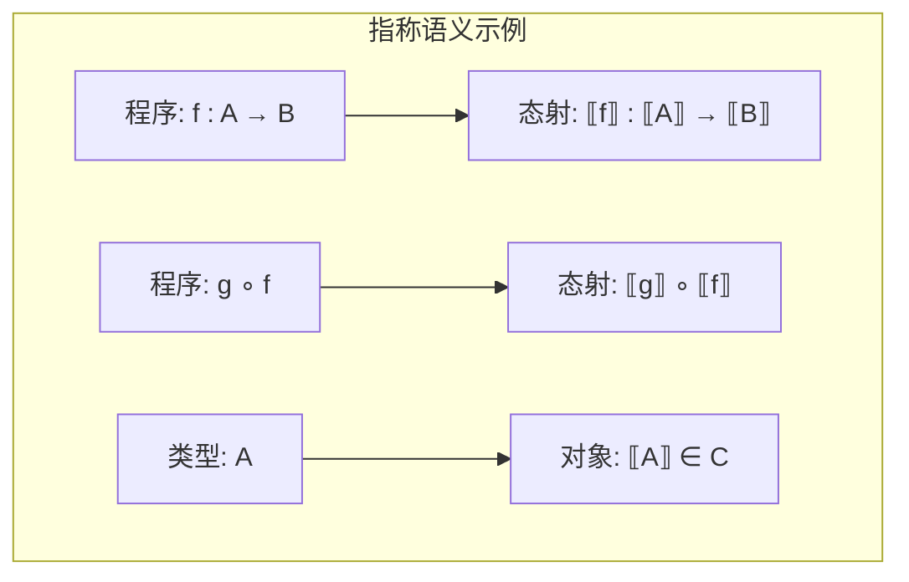
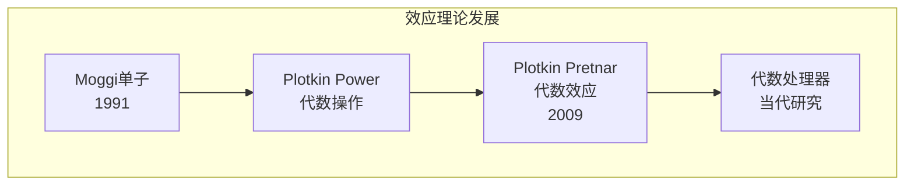

# 04.4 范畴论在PL中的应用

---

📌 **内容摘要**

本文档深入探讨范畴论在PL中的应用的核心原理和关键方法。内容涵盖范畴论领域的主要知识点，包括函子, 范畴, 不动点, 自然变换等关键主题。适合具备相关基础的学习者进行深入研究。

**关键词**: 函子, 范畴论, 范畴, 不动点, 自然变换, 域论, 指称语义

📚 **学习目标**

- 深入理解范畴论在PL中的应用的理论体系和形式化方法
- 能够进行相关定理的形式化证明
- 了解在实际系统中的应用场景

🎯 **难度级别**: 高级

⏱️ **预计阅读时间**: 15分钟

**前置知识**: 该领域的中级知识, 形式化方法基础, 离散数学

---


## 1. 语义学中的范畴论

### 1.1 指称语义

**定义 1.1.1** (指称语义). 用数学对象（通常来自范畴）表示程序的含义。

**基本对应**:

| 程序概念 | 范畴概念 |
|:---|:---|
| 类型 | 对象 |
| 程序 | 态射 |
| 复合 | 态射复合 |
| 恒等 | 恒等态射 |



```lean4
-- 指称语义的范畴论框架（概念性）
structure DenotationalSemantics where
  Ty : Type 1          -- 类型集合
  Cat : Category Ty    -- 语义范畴
  denoteType : Ty → Ty := id
  denoteTerm {A B} : (A → B) → Cat.Hom A B
```

### 1.2 笛卡尔闭范畴 (CCC)

**定义 1.2.1** (笛卡尔闭范畴). 具有有限积和指数对象的范畴。

**在PL中的意义**: CCC 是简单类型λ演算的模型。

| λ演算 | CCC |
|:---|:---|
| 积类型 $A \times B$ | 范畴积 $A \times B$ |
| 函数类型 $A \rightarrow B$ | 指数对象 $B^A$ |
| 配对 $\langle M, N \rangle$ | 积的配对态射 |
| 投影 $\pi_1, \pi_2$ | 积的投影 |
| 应用 $M \, N$ | 求值态射 $\text{ev}$ |
| 柯里化 $\lambda x.M$ | 转置态射 $\Lambda f$ |

```lean4
-- 笛卡尔闭范畴作为λ演算模型
def CCCofLambda (Cat : Category C) [CartesianClosed Cat]
  {A B : C} :
  Cat.Hom (product A B).prod B ≃
  Cat.Hom A (exponential A B) :=
  -- 伴随给出的同构
  sorry
```

## 2. 操作语义的范畴论视角

### 2.1 余代数与无限行为

**定义 2.1.1** (余代数). 函子 $F : \mathcal{C} \rightarrow \mathcal{C}$ 的**余代数**是 $(A, \alpha)$，其中 $\alpha : A \rightarrow F(A)$。

**应用**: 余代数建模无限行为：

- 流（Stream）
- 过程（Process）
- 自动机

```lean4
-- 余代数结构
structure Coalgebra {C : Type u} {Cat : Category C}
  (F : Functor Cat Cat) where
  carrier : C
  structureMap : Cat.Hom carrier (F.obj carrier)

-- 流的余代数表示
def StreamCoalgebra (A : Type) : Coalgebra (F :=
  { obj := λ X => A × X, map := λ f p => (p.1, f p.2) }) where
  carrier := Stream A
  structureMap := λ s => (s.head, s.tail)

-- 终余代数（余代数语义的核心）
def TerminalCoalgebra {C : Type u} {Cat : Category C}
  {F : Functor Cat Cat} (Ω : Coalgebra F) : Prop :=
  ∀ (A : Coalgebra F), ∃! f : Cat.Hom A.carrier Ω.carrier,
    Cat.comp Ω.structureMap f = Cat.comp (F.map f) A.structureMap
```

### 2.2 余代数双模拟

**定义 2.2.1** (双模拟). 余代数上的双模拟关系是保持结构的关系。

**意义**: 双模拟等价对应于操作语义中的行为等价。

```lean4
-- 双模拟关系（概念性）
def Bisimulation {C : Type u} {Cat : Category C}
  {F : Functor Cat Cat} {A B : Coalgebra F}
  (R : Cat.Hom A.carrier B.carrier → Prop) : Prop :=
  ∃ α : Cat.Hom A.carrier B.carrier,
    R α ∧
    -- 保持F-结构
    sorry
```

## 3. 多态λ演算的范畴论语义

### 3.1 System F的语义

**定理 3.1.1** (多态CCC). System F 需要**索引范畴**或**Per模型**。

**定义 3.1.2** (范畴积的解释).

- 类型变量解释：范畴对象
- $\forall X.A$ 解释：积 $\prod_{X \in \mathcal{C}} A(X)$

```lean4
-- 多态类型的范畴论语义（概念性）
def InterpretPolyType {C : Type u} (Cat : Category C)
  (env : Type → C) : PolyTy Unit → C
  | .var _ => sorry  -- 查环境
  | .arrow A B =>
    (Product Cat (InterpretPolyType Cat env A)
                 (InterpretPolyType Cat env B)).prod
  | .forall _ A => sorry  -- 需要积范畴或相关构造
```

### 3.2 参数性定理的范畴论证明

**定理 3.2.1** (Reynolds参数性). 使用**关系范畴**或**逻辑关系**的范畴论表述。

**核心思想**: 多态函数在所有类型上一致地作用。

## 4. 线性逻辑与线性类型系统

### 4.1 幺半范畴

**定义 4.1.1** (对称幺半范畴). 具有张量积 $\otimes$ 和单位 $I$ 的范畴。

**在PL中的对应**:

| 线性逻辑 | 范畴论 |
|:---|:---|
| 多重合取 $A \otimes B$ | 张量积 |
| 加法合取 $A \& B$ | 积 |
| 线性蕴涵 $A \multimap B$ | 线性函数对象 |
| 指数 $!A$ | 余单子 |

```lean4
-- 对称幺半范畴
def SymmetricMonoidalCategory {C : Type u} (Cat : Category C) :=
  Σ tensor : C → C → C,  -- 张量积
  Σ unit : C,             -- 单位对象
  Σ associator : ∀ A B C,
    Cat.Hom (tensor (tensor A B) C) (tensor A (tensor B C)),
  -- 更多结构：左右单位子、辫子等
  sorry
```

### 4.2 线性类型系统的范畴模型

**定理 4.2.1** (线性λ演算). 线性λ演算在*-自洽范畴中有模型。

**应用**:

- 资源管理（Rust的所有权系统）
- 量子计算
- 并发性分析

## 5. 代数数据类型的范畴论

### 5.1 初始代数与数据类型

**定理 5.1.1** (初始代数语义). 归纳数据类型是函子的**初始代数**。

**例 5.1.2**.

- `Nat` 是 $F(X) = 1 + X$ 的初始代数
- `List A` 是 $F(X) = 1 + A \times X$ 的初始代数
- `Tree A` 是 $F(X) = A + X \times X$ 的初始代数

```lean4
-- 初始代数结构
structure InitialAlgebra {C : Type u} {Cat : Category C}
  (F : Functor Cat Cat) extends Algebra F where
  initial : ∀ (A : Algebra F), ∃! f : Cat.Hom carrier A.carrier,
    Cat.comp A.structureMap f = Cat.comp (F.map f) structureMap

-- Nat作为初始代数
def NatInitialAlg : InitialAlgebra
  { obj := λ X => Unit ⊕ X,  -- 1 + X
    map := λ f => Sum.map id f } :=
  sorry  -- 使用Lean的Nat
```

### 5.2 余代数与协同数据类型

**定义 5.2.1** (协同数据类型). 由观察定义的类型（如流、无限树）是**终余代数**。

```lean4
-- 余代数数据类型示例：无限流
coinductive Stream (A : Type) where
  | cons : A → Stream A → Stream A

-- 流的观察器
def Stream.head : Stream A → A
  | .cons a _ => a

def Stream.tail : Stream A → Stream A
  | .cons _ s => s
```

## 6. 依赖类型的范畴语义

### 6.1 局部笛卡尔闭范畴 (LCCC)

**定义 6.1.1** (LCCC). 切片范畴都是CCC的范畴。

**定理 6.1.2** (LCCC与依赖类型). LCCC 提供依赖类型论的语义：

- 依赖积 $\Pi$ 对应于右伴随
- 依赖和 $\Sigma$ 对应于左伴随

```lean4
-- 切片范畴
def SliceCategory {C : Type u} (Cat : Category C) (I : C) :
  Category (Σ X : C, Cat.Hom X I) where
  Hom := λ ⟨X, f⟩ ⟨Y, g⟩ =>
    Σ h : Cat.Hom X Y, Cat.comp g h = f
  -- 其他定义省略

-- LCCC定义
class LCCC {C : Type u} (Cat : Category C) where
  sliceCCC : ∀ I, CartesianClosed (SliceCategory Cat I)
```

### 6.2 显示映射范畴

**定义 6.2.1** (显示映射). 依赖类型对应于**纤维化**或**显示映射**。

**定理 6.2.2** (CTT语义). 构造性类型论可在显示映射范畴中解释。

## 7. 效应系统与单子变换器

### 7.1 单子在语义学中的作用

**定理 7.1.1** (单子语义). Moggi证明计算效应可用单子在CCC中建模。

**效应组合**: 单子变换器允许组合多个效应。

```lean4
-- 单子变换器（概念性）
structure MonadTransformer where
  T : (Type → Type) → (Type → Type)  -- 变换器
  lift : ∀ {M} [Monad M] {A}, M A → T M A
  [monadM : ∀ {M} [Monad M], Monad (T M)]
```

### 7.2 代数效应的范畴论

**现代发展**: 代数效应由**代数理论**描述，效应处理器由**余代数**建模。



## 8. 编译器的范畴论视角

### 8.1 编译作为解释器

**定理 8.1.1** (编译正确性). 编译器可看作保持语义的解释器，正确性对应自然性条件。

### 8.2 优化作为自然变换

**定义 8.2.1** (程序优化). 优化是保持语义的程序变换，可看作自然变换。

```lean4
-- 优化作为自然变换（概念性）
def Optimization {C : Type u} {Cat : Category C}
  (F G : Functor Cat Cat) :=
  NatTrans F G  -- 保持结构的变换
```

## 参考

- [04.1 范畴基本概念](./04.1_范畴基本概念.md) - 范畴论基础
- [04.2 极限与余极限](./04.2_极限与余极限.md) - 极限理论
- [04.3 伴随与单子](./04.3_伴随与单子.md) - 伴随与单子深入
- [02.1 简单类型系统](../02_类型论/02.1_简单类型系统.md) - 类型系统基础
- [02.2 多态类型](../02_类型论/02.2_多态类型.md) - 多态类型
- [02.3 依赖类型](../02_类型论/02.3_依赖类型.md) - 依赖类型
- [03.1 HoTT基础](../03_同伦类型论_HoTT/03.1_HoTT基础.md) - 同伦类型论

---

## 📚 延伸阅读

- [04.1 范畴基本概念](../04_范畴论/04.1_范畴基本概念.md)
- [4.1 范畴基础 (Category Theory Foundations)](../04_范畴论/04.1_范畴基础.md)
- [01.1 操作语义](../../03_编程范式/01_编程语言理论/01.1_操作语义.md)
- [1. 单子与函子](../../03_编程范式/04_函数式编程/04.2_单子与函子.md)
- [04.3 单子与函子](../../03_编程范式/04_函数式编程/04.3_单子与函子.md)
