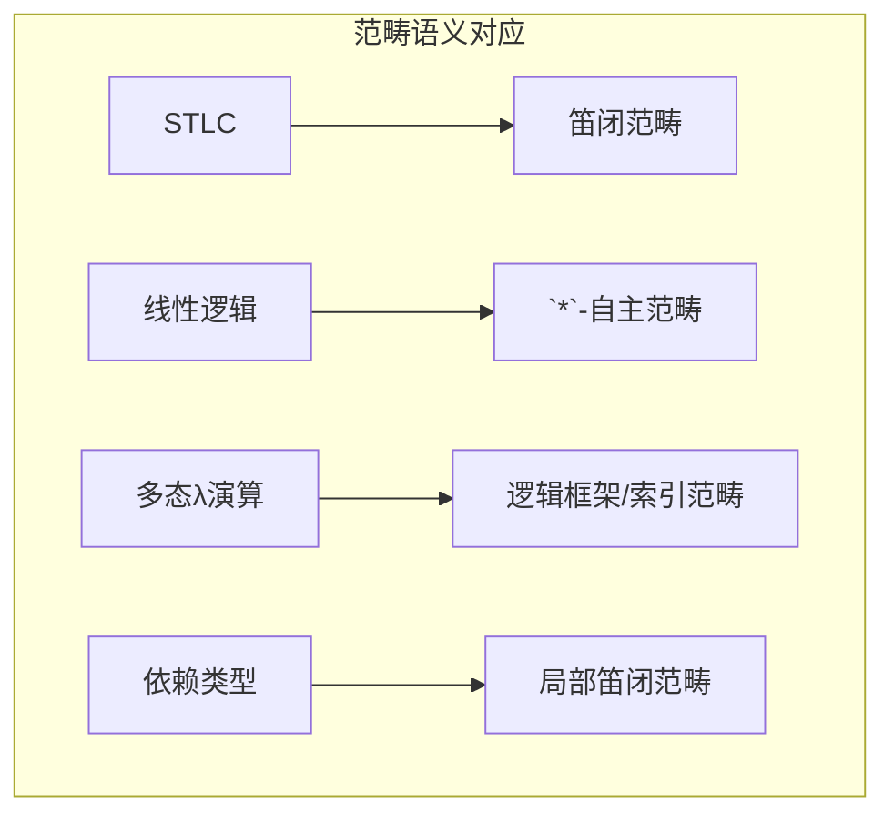

# 4.4 范畴论语义 (Categorical Semantics)

## 目录

- [4.4 范畴论语义 (Categorical Semantics)](#44-范畴论语义-categorical-semantics)
  - [目录](#目录)
  - [4.4.1 引言](#441-引言)
  - [4.4.2 笛闭范畴](#442-笛闭范畴)
    - [4.4.2.1 CCC的定义](#4421-ccc的定义)
    - [4.4.2.2 指数对象](#4422-指数对象)
  - [4.4.3 简单类型λ演算的CCC语义](#443-简单类型λ演算的ccc语义)
  - [4.4.4 笛闭范畴与逻辑](#444-笛闭范畴与逻辑)
    - [4.4.4.1 双闭范畴](#4441-双闭范畴)
    - [4.4.4.2 直觉主义逻辑](#4442-直觉主义逻辑)
  - [4.4.5 线性逻辑](#445-线性逻辑)
    - [4.4.5.1 线性蕴含](#4451-线性蕴含)
    - [4.4.5.2 线性连接词](#4452-线性连接词)
  - [4.4.6 多态与范畴论](#446-多态与范畴论)
  - [4.4.7 高阶范畴](#447-高阶范畴)
  - [4.4.8 形式化证明](#448-形式化证明)
    - [Lean 4：笛闭范畴](#lean-4笛闭范畴)
    - [线性逻辑语义草图](#线性逻辑语义草图)
  - [4.4.9 总结](#449-总结)

---

## 4.4.1 引言

范畴论语义是连接类型论与范畴论的桥梁，揭示了类型系统的深层数学结构。
笛闭范畴(Cartesian Closed Categories, CCC)为简单类型λ演算提供了标准语义，而线性逻辑则对应着*-自主范畴。

**核心思想**：

- 类型 = 对象
- 项 = 态射
- 类型构造子 = 范畴构造子



> **引用**: 简单类型论见 [../02_类型论/02.1_简单类型论.md](../02_类型论/02.1_简单类型论.md)，伴随见 [04.3_伴随与单子.md](./04.3_伴随与单子.md)。

---

## 4.4.2 笛闭范畴

### 4.4.2.1 CCC的定义

**定义 4.4.1 (笛闭范畴)** 范畴 $\mathcal{C}$ 是笛闭的，如果：

1. **有终对象**：存在 $\mathbf{1}$ 使得 $\forall C. \exists! f: C \rightarrow \mathbf{1}$
2. **有二元积**：对任意 $A, B$，存在 $A \times B$ 及投影 $\pi_1, \pi_2$
3. **有指数对象**：对任意 $A, B$，存在 $B^A$（也记作 $A \Rightarrow B$）及求值态射：
   $$\text{ev}: B^A \times A \rightarrow B$$
   使得对任意 $f: C \times A \rightarrow B$，存在唯一的 $\lambda f: C \rightarrow B^A$ 满足：
   $$\text{ev} \circ (\lambda f \times \text{id}_A) = f$$

```
      C × A
       /|
    λf×id |
     /    | f
    ↓     |
  B^A × A──ev──→ B
```

### 4.4.2.2 指数对象

**定义 4.4.2 (Currying)** CCC中的Currying同构：

$$\text{Hom}(C \times A, B) \cong \text{Hom}(C, B^A)$$

这是伴随 $- \times A \dashv (-)^A$ 的体现。

**CCC示例**：

| 范畴 | 积 | 指数 |
|------|-----|------|
| **Set** | 笛卡尔积 | 函数集 $B^A$ |
| **Cat** | 积范畴 | 函子范畴 $[A, B]$ |
| **Hask** | 积类型 (a, b) | 函数类型 a -> b |
| **Pos** | 积偏序集 | 单调函数偏序 |

---

## 4.4.3 简单类型λ演算的CCC语义

**语义解释**：

| STLC | CCC |
|------|-----|
| 基类型 $b$ | 对象 $b$ |
| 函数类型 $\tau_1 \rightarrow \tau_2$ | 指数对象 $\tau_2^{\tau_1}$ |
| 积类型 $\tau_1 \times \tau_2$ | 积对象 $\tau_1 \times \tau_2$ |
| 项 $t$ | 态射 $t$ |
| 变量 $x$ | 投影态射 |
| λ抽象 $\lambda x.t$ | 转置态射 $\lambda t$ |
| 应用 $t_1\, t_2$ | $\text{ev} \circ \langle t_1, t_2 \rangle$ |

**定理 4.4.1 (语义正确性)** 若 $t \rightarrow t'$ 在STLC中，则 $t = t'$ 在CCC中。

**定理 4.4.2 (完备性)** CCC是STLC的完备语义范畴。

---

## 4.4.4 笛闭范畴与逻辑

### 4.4.4.1 双闭范畴

**定义 4.4.3 (双闭范畴)** 既有有限余积又有有限积，且两种结构都是闭的：

- **笛闭**：积闭 $-\times A \dashv (-)^A$
- **余笛闭**：余积闭 $(-)^A \dashv A + -$（较少见）

### 4.4.4.2 直觉主义逻辑

**定义 4.4.4 (Heyting代数)** 作为笛闭偏序集的逻辑代数：

- $\top$：最大元（真）
- $\bot$：最小元（假）
- $\land$：交（合取）
- $\lor$：并（析取）
- $\Rightarrow$：蕴含（相对伪补）

**Curry-Howard-Lambek对应**：

| 逻辑 | 类型论 | 范畴论 |
|------|--------|--------|
| 命题 | 类型 | 对象 |
| 证明 | 项 | 态射 |
| 合取 | 积类型 | 积 |
| 析取 | 和类型 | 余积 |
| 蕴含 | 函数类型 | 指数 |
| 真 | 单位类型 | 终对象 |
| 假 | 空类型 | 始对象 |

---

## 4.4.5 线性逻辑

### 4.4.5.1 线性蕴含

**定义 4.4.5 (线性逻辑)** Girard提出的资源敏感逻辑。

**线性蕴含**：$A \multimap B$（使用A一次产生B）

**语义**：在*-自主范畴中，线性映射对象。

### 4.4.5.2 线性连接词

| 连接词 | 名称 | 说明 |
|--------|------|------|
| $\otimes$ | 张量积 | 多集合并 |
| $\par$ | _par_ | 对偶的张量 |
| $\&$ | with | 可加合取（选择）|
| $\oplus$ | plus | 可加析取 |
| $!A$ | of course | 指数模态（复制）|
| $?A$ | why not | 对偶模态 |

**结构规则**：

| 规则 | 经典/直觉主义 | 线性逻辑 |
|------|--------------|---------|
| 弱化 | 允许 | 仅对 $?A$ |
| 收缩 | 允许 | 仅对 $!A$ |
| 交换 | 允许 | 允许 |

**资源解释**：

- $A \otimes B$：有A和B各一份
- $A \& B$：可选择A或B
- $!A$：有A的无限复制权

---

## 4.4.6 多态与范畴论

**System F的语义**：

- 类型变量解释为对象变量
- $\forall \alpha. \tau$ 解释为积或端（end）
- 需要索引范畴或纤维范畴

**局部笛闭范畴(LCCC)**：

**定义 4.4.6 (LCCC)** 对每个对象 $A$，切片范畴 $\mathcal{C}/A$ 是笛闭的。

LCCC对应Martin-Löf类型论的语义：

- 依赖类型 = 纤维
- Π类型 = 右伴随（依赖积）
- Σ类型 = 左伴随（依赖和）

---

## 4.4.7 高阶范畴

**定义 4.4.7 (2-范畴)** 范畴的推广，有：

- 对象
- 1-态射（对象间）
- 2-态射（1-态射间）

**定义 4.4.8 (∞-范畴)** 有任意高阶态射的范畴。

**与HoTT的联系**：

| HoTT | ∞-范畴论 |
|------|---------|
| 类型 | ∞-群胚 |
| 恒等类型 | 路径空间 |
| 路径相等 | 高阶同伦 |
| h-level | 截断 |

---

## 4.4.8 形式化证明

### Lean 4：笛闭范畴

```lean4
-- 笛闭范畴定义
structure CartesianClosedCategory extends Category where
  -- 终对象
  terminal : Obj
  isTerminal : ∀ X, ∃! f : Hom X terminal, True

  -- 二元积
  prod : Obj → Obj → Obj
  proj1 : ∀ X Y, Hom (prod X Y) X
  proj2 : ∀ X Y, Hom (prod X Y) Y
  pair : ∀ {X Y Z}, Hom X Y → Hom X Z → Hom X (prod Y Z)
  -- 积的泛性质...

  -- 指数对象
  exp : Obj → Obj → Obj
  eval : ∀ Y X, Hom (prod (exp Y X) X) Y
  curry : ∀ {X Y Z}, Hom (prod X Y) Z → Hom X (exp Z Y)
  -- 指数泛性质...

-- 积的泛性质检查
def prodUniversal (C : CartesianClosedCategory) {X Y Z : C.Obj}
  (f : C.Hom Z X) (g : C.Hom Z Y) : Prop :=
  C.comp (C.proj1 X Y) (C.pair f g) = f ∧
  C.comp (C.proj2 X Y) (C.pair f g) = g ∧
  ∀ (h : C.Hom Z (C.prod X Y)),
    (C.comp (C.proj1 X Y) h = f ∧ C.comp (C.proj2 X Y) h = g) →
    h = C.pair f g

-- Set是CCC
def SetCCC : CartesianClosedCategory where
  Obj := Type u
  Hom X Y := X → Y
  id _ := fun x => x
  comp g f := g ∘ f
  id_comp _ := rfl
  comp_id _ := rfl
  assoc _ _ _ := rfl

  terminal := Unit
  isTerminal := fun X => ⟨fun _ => (), by intro; funext; simp⟩

  prod X Y := X × Y
  proj1 _ _ := Prod.fst
  proj2 _ _ := Prod.snd
  pair f g := fun z => (f z, g z)

  exp Y X := X → Y
  eval _ _ := fun p => p.1 p.2
  curry f := fun x y => f (x, y)
```

### 线性逻辑语义草图

```lean4
-- `*`-自主范畴（简化）
structure StarAutonomousCategory extends Category where
  -- 张量积结构（幺半范畴）
  tensor : Obj → Obj → Obj
  tensorUnit : Obj
  -- 结合子、单位子...

  -- 对偶
  dual : Obj → Obj
  -- $A^* \otimes A → I$ 和 $I → A \otimes A^*$

  -- 线性蕴含：$A \multimap B := (A \otimes B^*)^*$
  lollipop (A B : Obj) : Obj := dual (tensor A (dual B))
```

---

## 4.4.9 总结

**范畴论语义的核心对应**：

| 类型论 | 范畴论 | 逻辑 |
|--------|--------|------|
| 简单类型 | 笛闭范畴 | 直觉主义命题逻辑 |
| 线性类型 | `*`-自主范畴 | 线性逻辑 |
| 依赖类型 | 局部笛闭范畴 | 一阶逻辑 |
| 多态 | 索引范畴/纤维范畴 | 二阶逻辑 |

**CCC的关键性质**：

```
CCC = 有限积 + 指数对象
    = 代数 + 闭包
    = 类型论语义
```

**延伸阅读**：

- [04.1_范畴基础.md](./04.1_范畴基础.md) - 范畴论基础
- [04.2_极限与余极限.md](./04.2_极限与余极限.md) - 积与余积
- [04.3_伴随与单子.md](./04.3_伴随与单子.md) - 闭包与指数
- [../02_类型论/02.1_简单类型论.md](../02_类型论/02.1_简单类型论.md) - 类型论基础

---

_文档版本: 1.0 | 最后更新: 2026-04-11_
