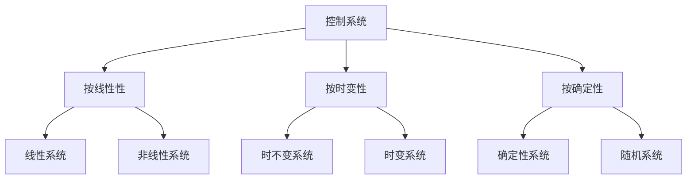

# 03. 控制理论与时态逻辑：系统动态与稳定性

## 目录

1. [3.1 控制系统基础](#31-控制系统基础)
2. [3.2 系统建模与分析](#32-系统建模与分析)
3. [3.3 稳定性理论](#33-稳定性理论)
4. [3.4 时态逻辑控制](#34-时态逻辑控制)
5. [3.5 控制器设计](#35-控制器设计)
6. [3.6 鲁棒控制理论](#36-鲁棒控制理论)
7. [3.7 最优控制理论](#37-最优控制理论)
8. [3.8 系统验证与应用](#38-系统验证与应用)

## 3.1 控制系统基础

### 3.1.1 控制系统定义

**定义 3.1.1** (控制系统) 控制系统是一个四元组 $\mathcal{S} = (X, U, f, g)$，其中：

- $X$ 是状态空间
- $U$ 是控制输入空间
- $f: X \times U \to X$ 是状态转移函数
- $g: X \to Y$ 是输出函数

**定义 3.1.2** (线性系统) 线性系统是状态转移函数为线性的系统：

$$\dot{x}(t) = Ax(t) + Bu(t)$$
$$y(t) = Cx(t) + Du(t)$$

其中 $A, B, C, D$ 是常数矩阵。

**定理 3.1.1** (线性系统的性质) 线性系统具有叠加性和齐次性。

**证明** 通过线性性质：

1. 对于输入 $u_1, u_2$，输出为 $y_1, y_2$
2. 对于输入 $\alpha u_1 + \beta u_2$，输出为 $\alpha y_1 + \beta y_2$
3. 因此满足叠加性和齐次性

### 3.1.2 系统分类

**定义 3.1.3** (系统分类) 控制系统按不同维度分类：



**定义 3.1.4** (连续时间系统) 连续时间系统的状态方程：

$$\dot{x}(t) = f(x(t), u(t), t)$$

**定义 3.1.5** (离散时间系统) 离散时间系统的状态方程：

$$x(k+1) = f(x(k), u(k), k)$$

### 3.1.3 系统特性

**定义 3.1.6** (可控性) 系统在状态 $x$ 可控，如果存在控制序列将 $x$ 转移到任意目标状态。

**定义 3.1.7** (可观性) 系统可观，如果初始状态可以通过输出序列唯一确定。

**定理 3.1.2** (线性系统可控性) 线性系统可控当且仅当可控性矩阵满秩。

**证明** 通过线性代数：

1. 可控性矩阵的列空间等于可达空间
2. 满秩意味着列空间等于整个状态空间
3. 因此系统可控

## 3.2 系统建模与分析

### 3.2.1 系统建模

**定义 3.2.1** (数学模型) 数学模型是系统行为的数学描述。

**定义 3.2.2** (状态空间模型) 状态空间模型是系统的状态方程和输出方程：

```text
$$\begin{align}
\dot{x} &= f(x, u, t) \\
y &= g(x, u, t)
\end{align}$$
```

**定理 3.2.1** (模型完备性) 状态空间模型完全描述系统动态行为。

**证明** 通过状态定义：

1. 状态包含系统的完整信息
2. 状态方程描述状态演化
3. 输出方程描述观测关系

### 3.2.2 传递函数

**定义 3.2.3** (传递函数) 传递函数是系统输入输出的拉普拉斯变换比：

$$G(s) = \frac{Y(s)}{U(s)} = C(sI - A)^{-1}B + D$$

**定义 3.2.4** (极点) 极点是传递函数分母多项式的根。

**定义 3.2.5** (零点) 零点是传递函数分子多项式的根。

**定理 3.2.2** (极点与稳定性) 系统稳定的充分必要条件是所有极点都在左半平面。

**证明** 通过拉普拉斯变换：

1. 极点决定系统响应模式
2. 左半平面极点对应衰减响应
3. 右半平面极点对应增长响应

### 3.2.3 频率响应

**定义 3.2.6** (频率响应) 频率响应是系统在正弦输入下的稳态响应。

**定义 3.2.7** (伯德图) 伯德图是频率响应的对数幅频和相频图。

**定理 3.2.3** (频率响应特性) 频率响应反映系统的动态特性。

**证明** 通过傅里叶分析：

1. 任意信号可以分解为正弦分量
2. 频率响应描述各分量的响应
3. 因此反映系统动态特性

## 3.3 稳定性理论

### 3.3.1 稳定性定义

**定义 3.3.1** (李雅普诺夫稳定性) 平衡点 $x_e$ 是李雅普诺夫稳定的，如果对于任意 $\epsilon > 0$，存在 $\delta > 0$，使得：

$$\|x(0) - x_e\| < \delta \Rightarrow \|x(t) - x_e\| < \epsilon, \forall t \geq 0$$

**定义 3.3.2** (渐近稳定性) 平衡点 $x_e$ 是渐近稳定的，如果它是李雅普诺夫稳定的，且：

$$\lim_{t \to \infty} x(t) = x_e$$

**定理 3.3.1** (李雅普诺夫稳定性定理) 如果存在正定函数 $V(x)$ 使得 $\dot{V}(x) \leq 0$，则系统稳定。

**证明** 通过李雅普诺夫函数：

1. $V(x)$ 正定保证能量有界
2. $\dot{V}(x) \leq 0$ 保证能量不增
3. 因此系统稳定

### 3.3.2 线性系统稳定性

**定义 3.3.3** (特征值) 特征值是矩阵 $A$ 的特征多项式的根。

**定理 3.3.2** (线性系统稳定性) 线性系统渐近稳定当且仅当所有特征值实部为负。

**证明** 通过特征值分解：

1. 系统响应由特征值决定
2. 负实部特征值对应衰减响应
3. 因此系统渐近稳定

### 3.3.3 鲁棒稳定性

**定义 3.3.4** (鲁棒稳定性) 系统在参数不确定性下保持稳定。

**定义 3.3.5** (结构奇异值) 结构奇异值 $\mu$ 是鲁棒稳定性的度量。

**定理 3.3.3** (小增益定理) 如果 $\|M\|_\infty < 1$，则反馈系统稳定。

**证明** 通过小增益条件：

1. 小增益条件保证信号不放大
2. 信号不放大保证系统稳定
3. 因此系统稳定

## 3.4 时态逻辑控制

### 3.4.1 时态逻辑基础

**定义 3.4.1** (线性时态逻辑) 线性时态逻辑包含以下时态算子：

- $\Box$ (全局)
- $\Diamond$ (未来)
- $\bigcirc$ (下一个)
- $\mathcal{U}$ (直到)

**定义 3.4.2** (时态公式) 时态公式的语法：

$$\phi ::= p \mid \neg \phi \mid \phi \land \psi \mid \phi \lor \psi \mid \phi \to \psi \mid \Box \phi \mid \Diamond \phi \mid \bigcirc \phi \mid \phi \mathcal{U} \psi$$

**定理 3.4.1** (时态逻辑的可判定性) 线性时态逻辑的可满足性问题是PSPACE完全的。

**证明** 通过自动机构造：

1. 将时态公式转换为Büchi自动机
2. 时态逻辑可满足性等价于自动机非空性
3. 自动机非空性是PSPACE完全的

### 3.4.2 时态逻辑控制

**定义 3.4.3** (时态控制规范) 时态控制规范是使用时态逻辑描述的控制要求。

**定义 3.4.4** (控制器合成) 控制器合成是从规范自动生成控制器。

**定理 3.4.2** (控制器存在性) 如果规范是可实现的，则存在控制器满足规范。

**证明** 通过博弈论：

1. 控制问题可以建模为博弈
2. 可实现性对应博弈有解
3. 因此存在控制器

### 3.4.3 时态逻辑验证

**定义 3.4.5** (模型检查) 模型检查是验证系统是否满足时态逻辑规范。

**定义 3.4.6** (反例) 反例是系统不满足规范的执行路径。

**定理 3.4.3** (模型检查的完备性) 模型检查可以找到所有违反规范的反例。

**证明** 通过状态空间搜索：

1. 模型检查搜索整个状态空间
2. 找到所有可能的执行路径
3. 因此找到所有反例

## 3.5 控制器设计

### 3.5.1 经典控制方法

**定义 3.5.1** (PID控制器) PID控制器的传递函数：

$$G_c(s) = K_p + \frac{K_i}{s} + K_d s$$

**定义 3.5.2** (根轨迹法) 根轨迹法是分析参数变化对极点位置影响的方法。

**定理 3.5.1** (PID控制器的性能) PID控制器可以提供良好的稳态和动态性能。

**证明** 通过控制器特性：

1. 比例项提供快速响应
2. 积分项消除稳态误差
3. 微分项改善动态特性

### 3.5.2 现代控制方法

**定义 3.5.3** (状态反馈) 状态反馈控制律：

$$u(t) = -Kx(t)$$

**定义 3.5.4** (极点配置) 极点配置是设计状态反馈使闭环极点位于指定位置。

**定理 3.5.2** (极点配置的存在性) 如果系统可控，则可以通过状态反馈任意配置极点。

**证明** 通过可控性：

1. 可控性保证状态反馈矩阵可逆
2. 可逆矩阵可以任意配置特征值
3. 因此可以任意配置极点

### 3.5.3 自适应控制

**定义 3.5.5** (自适应控制) 自适应控制是控制器参数在线调整的控制方法。

**定义 3.5.6** (模型参考自适应) 模型参考自适应控制使系统输出跟踪参考模型输出。

**定理 3.5.3** (自适应控制的稳定性) 在适当条件下，自适应控制系统稳定。

**证明** 通过李雅普诺夫理论：

1. 构造李雅普诺夫函数
2. 证明函数导数负定
3. 因此系统稳定

## 3.6 鲁棒控制理论

### 3.6.1 不确定性建模

**定义 3.6.1** (不确定性) 不确定性是系统模型与实际系统之间的差异。

**定义 3.6.2** (加性不确定性) 加性不确定性模型：

$$G(s) = G_0(s) + \Delta(s)$$

**定义 3.6.3** (乘性不确定性) 乘性不确定性模型：

$$G(s) = G_0(s)(1 + \Delta(s))$$

**定理 3.6.1** (不确定性影响) 不确定性影响系统性能和稳定性。

**证明** 通过扰动分析：

1. 不确定性引入扰动
2. 扰动影响系统响应
3. 因此影响性能和稳定性

### 3.6.2 H∞控制

**定义 3.6.4** (H∞范数) H∞范数是传递函数的最大奇异值：

$$\|G\|_\infty = \sup_{\omega} \sigma_{\max}(G(j\omega))$$

**定义 3.6.5** (H∞控制) H∞控制是使闭环系统H∞范数最小的控制方法。

**定理 3.6.2** (H∞控制的存在性) 如果广义对象满足某些条件，则存在H∞控制器。

**证明** 通过Riccati方程：

1. H∞控制问题等价于Riccati方程
2. Riccati方程在适当条件下有解
3. 因此存在H∞控制器

### 3.6.3 μ-综合

**定义 3.6.6** (结构奇异值) 结构奇异值 $\mu$ 是鲁棒稳定性的度量。

**定义 3.6.7** (μ-综合) μ-综合是使结构奇异值最小的控制方法。

**定理 3.6.3** (μ-综合的保守性) μ-综合比H∞控制更精确。

**证明** 通过保守性分析：

1. H∞控制忽略不确定性结构
2. μ-综合考虑不确定性结构
3. 因此μ-综合更精确

## 3.7 最优控制理论

### 3.7.1 最优控制问题

**定义 3.7.1** (最优控制) 最优控制是使性能指标最小的控制。

**定义 3.7.2** (性能指标) 性能指标是控制质量的度量：

$$J = \int_0^T L(x, u, t) dt + \phi(x(T))$$

**定理 3.7.1** (最优控制的存在性) 在适当条件下，最优控制存在。

**证明** 通过变分法：

1. 最优控制问题等价于变分问题
2. 变分问题在适当条件下有解
3. 因此最优控制存在

### 3.7.2 动态规划

**定义 3.7.3** (价值函数) 价值函数是最优性能指标：

$$V(x, t) = \min_u \int_t^T L(x, u, \tau) d\tau + \phi(x(T))$$

**定义 3.7.4** (贝尔曼方程) 贝尔曼方程是价值函数的偏微分方程：

$$-\frac{\partial V}{\partial t} = \min_u \left[ L(x, u, t) + \frac{\partial V}{\partial x} f(x, u, t) \right]$$

**定理 3.7.2** (动态规划原理) 最优控制满足动态规划原理。

**证明** 通过最优性原理：

1. 最优路径的子路径也是最优的
2. 动态规划基于最优性原理
3. 因此最优控制满足动态规划

### 3.7.3 线性二次型控制

**定义 3.7.5** (LQR问题) 线性二次型调节器问题是使二次型性能指标最小的控制。

**定义 3.7.6** (Riccati方程) Riccati方程是LQR问题的解：

$$\dot{P} + PA + A^T P - PBR^{-1}B^T P + Q = 0$$

**定理 3.7.3** (LQR的最优性) LQR控制器是最优的。

**证明** 通过变分法：

1. LQR问题可以通过变分法求解
2. 变分解是最优的
3. 因此LQR控制器是最优的

## 3.8 系统验证与应用

### 3.8.1 系统验证

**定义 3.8.1** (形式化验证) 形式化验证是通过数学方法验证系统正确性。

**定义 3.8.2** (可达性分析) 可达性分析是计算系统可达状态集的方法。

**定理 3.8.1** (验证的可靠性) 形式化验证的结果是可靠的。

**证明** 通过数学基础：

1. 形式化验证基于数学逻辑
2. 数学逻辑是可靠的
3. 因此形式化验证是可靠的

### 3.8.2 实际应用

**定义 3.8.3** (工业控制) 工业控制是控制理论在工业中的应用。

**定义 3.8.4** (机器人控制) 机器人控制是控制理论在机器人中的应用。

**定理 3.8.2** (控制理论的应用价值) 控制理论在实际系统中有广泛应用。

**证明** 通过应用实例：

1. 控制理论提供系统设计方法
2. 实际系统需要控制
3. 因此控制理论有广泛应用

### 3.8.3 未来发展方向

**定义 3.8.5** (智能控制) 智能控制是结合人工智能的控制方法。

**定义 3.8.6** (网络控制) 网络控制是通过网络进行控制的方法。

**定理 3.8.3** (控制理论的发展趋势) 控制理论向智能化、网络化方向发展。

**证明** 通过技术发展：

1. 人工智能技术快速发展
2. 网络技术广泛应用
3. 因此控制理论向这些方向发展

---

**参考文献**：

1. Ogata, K. (2010). *Modern Control Engineering*. Prentice Hall.
2. Franklin, G. F., Powell, J. D., & Emami-Naeini, A. (2015). *Feedback Control of Dynamic Systems*. Pearson.
3. Doyle, J. C., Francis, B. A., & Tannenbaum, A. R. (2013). *Feedback Control Theory*. Dover Publications.
4. Pnueli, A. (1977). The temporal logic of programs. *Foundations of Computer Science*, 46-57.
5. Clarke, E. M., Grumberg, O., & Peled, D. A. (1999). *Model Checking*. MIT Press.
