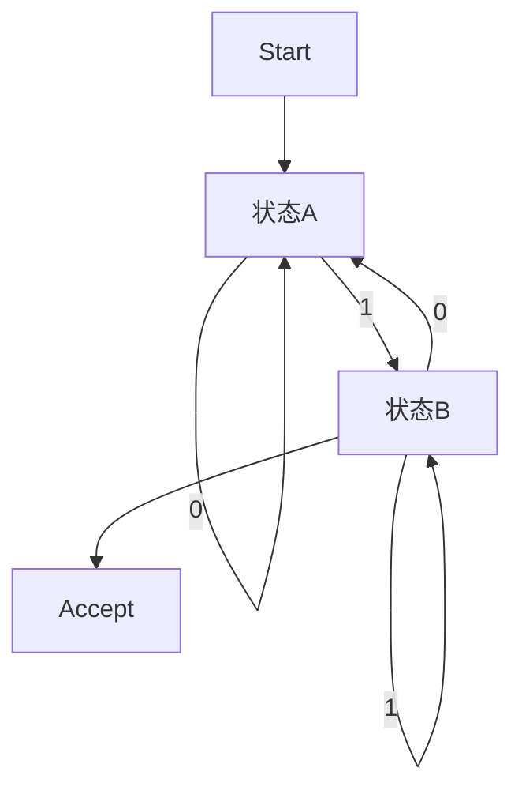

# 03.1.1 有限自动机（Finite Automata）

## 📋 概述

**文档**: 03.1.1 有限自动机  
**版本**: v1.0  
**创建时间**: 2024-12-21  
**维护状态**: 持续构建中  

## 🎯 核心目标

建立严格的形式化有限自动机理论体系，为形式语言理论提供自动机基础。

## 📚 目录

1. [定义与背景](#1-定义与背景)
2. [批判性分析](#2-批判性分析)
3. [形式化表达](#3-形式化表达)
4. [多表征内容](#4-多表征内容)
5. [Mealy机](./01_Finite_Automata/02_Mealy_Machine.md)
6. [Moore机](./01_Finite_Automata/03_Moore_Machine.md)
7. [交叉引用](#5-交叉引用)
8. [参考文献](#6-参考文献)

## 1. 定义与背景

### 1.1 有限自动机定义

有限自动机（Finite Automata, FA）是一种具有有限状态集合的抽象计算模型，用于识别正则语言。常见类型包括确定性有限自动机（DFA）和非确定性有限自动机（NFA）。

### 1.2 历史背景

有限自动机理论由Kleene、Rabin、Scott等人在20世纪50年代提出，是形式语言与自动机理论的基础。

### 1.3 核心问题

- 有限自动机的结构与运行机制？
- DFA与NFA的等价性？
- 有限自动机与正则语言的关系？
- 状态最小化与判定问题？

## 2. 批判性分析

### 2.1 传统有限自动机的局限

- 仅能识别正则语言，表达能力有限
- 难以处理嵌套结构和上下文依赖
- 状态爆炸问题
- 与实际复杂系统的差距

### 2.2 现代发展

- 引入带输出的自动机（Mealy/Moore机）
- 与硬件、编译器、网络协议等实际应用结合
- 自动机的可视化与自动化工具
- 状态压缩与优化算法

### 2.3 批判性观点

- 正则语言的表达极限
- 自动机与图灵机的本质差异
- 自动机理论的工程适用性

## 3. 形式化表达

### 3.1 有限自动机的形式化定义

```lean
-- 有限自动机的基本结构
structure FiniteAutomaton (Σ : Type) where
  states : Finset State
  alphabet : Finset Σ
  transition : State → Σ → State
  start : State
  accept : Finset State

-- DFA与NFA的定义
structure DFA (Σ : Type) extends FiniteAutomaton Σ
structure NFA (Σ : Type) extends FiniteAutomaton Σ

-- 运行函数
def run_DFA (dfa : DFA Σ) (input : List Σ) : Bool :=
  let final := input.foldl dfa.transition dfa.start
  dfa.accept.contains final

-- DFA与NFA等价性定理
axiom DFA_NFA_equiv : ∀ (nfa : NFA Σ), ∃ (dfa : DFA Σ), ∀ w, run_NFA nfa w = run_DFA dfa w
```

### 3.2 有限自动机的Rust实现

```rust
/// 有限自动机的核心概念
pub mod finite_automata {
    use std::collections::{HashMap, HashSet};
    use std::fmt::Debug;
    use std::hash::Hash;
    
    /// 转移函数类型
    pub type TransitionFunction<Q, A> = HashMap<(Q, A), HashSet<Q>>;
    
    /// 有限自动机
    #[derive(Debug, Clone)]
    pub struct FiniteAutomaton<Q, A> {
        states: HashSet<Q>,
        alphabet: HashSet<A>,
        transitions: TransitionFunction<Q, A>,
        initial_state: Q,
        accepting_states: HashSet<Q>,
    }
    
    impl<Q, A> FiniteAutomaton<Q, A>
    where
        Q: Clone + Eq + Hash + Debug,
        A: Clone + Eq + Hash + Debug,
    {
        /// 创建新的有限自动机
        pub fn new(
            states: HashSet<Q>,
            alphabet: HashSet<A>,
            initial_state: Q,
            accepting_states: HashSet<Q>,
        ) -> Self {
            FiniteAutomaton {
                states,
                alphabet,
                transitions: HashMap::new(),
                initial_state,
                accepting_states,
            }
        }
        
        /// 添加转移
        pub fn add_transition(&mut self, from: Q, symbol: A, to: Q) {
            self.transitions
                .entry((from, symbol))
                .or_insert_with(HashSet::new)
                .insert(to);
        }
        
        /// 获取转移
        pub fn get_transitions(&self, from: &Q, symbol: &A) -> HashSet<Q> {
            self.transitions
                .get(&(from.clone(), symbol.clone()))
                .cloned()
                .unwrap_or_default()
        }
        
        /// 检查是否为DFA
        pub fn is_deterministic(&self) -> bool {
            for ((_, _), targets) in &self.transitions {
                if targets.len() > 1 {
                    return false;
                }
            }
            true
        }
        
        /// 运行自动机
        pub fn run(&self, input: &[A]) -> bool {
            let mut current_states = HashSet::new();
            current_states.insert(self.initial_state.clone());
            
            for symbol in input {
                let mut next_states = HashSet::new();
                for state in &current_states {
                    let transitions = self.get_transitions(state, symbol);
                    next_states.extend(transitions);
                }
                current_states = next_states;
            }
            
            current_states.iter().any(|s| self.accepting_states.contains(s))
        }
        
        /// 获取接受的语言
        pub fn accepted_strings(&self, max_length: usize) -> HashSet<Vec<A>> {
            let mut accepted = HashSet::new();
            self.generate_strings(&mut accepted, vec![], &self.initial_state, max_length);
            accepted
        }
        
        fn generate_strings(
            &self,
            accepted: &mut HashSet<Vec<A>>,
            current: Vec<A>,
            state: &Q,
            max_length: usize,
        ) {
            if self.accepting_states.contains(state) {
                accepted.insert(current.clone());
            }
            
            if current.len() >= max_length {
                return;
            }
            
            for symbol in &self.alphabet {
                let transitions = self.get_transitions(state, symbol);
                for next_state in transitions {
                    let mut new_current = current.clone();
                    new_current.push(symbol.clone());
                    self.generate_strings(accepted, new_current, &next_state, max_length);
                }
            }
        }
    }
    
    /// 确定性有限自动机
    pub struct DFA<Q, A> {
        automaton: FiniteAutomaton<Q, A>,
    }
    
    impl<Q, A> DFA<Q, A>
    where
        Q: Clone + Eq + Hash + Debug,
        A: Clone + Eq + Hash + Debug,
    {
        pub fn new(
            states: HashSet<Q>,
            alphabet: HashSet<A>,
            initial_state: Q,
            accepting_states: HashSet<Q>,
        ) -> Self {
            DFA {
                automaton: FiniteAutomaton::new(states, alphabet, initial_state, accepting_states),
            }
        }
        
        pub fn add_transition(&mut self, from: Q, symbol: A, to: Q) {
            self.automaton.add_transition(from, symbol, to);
        }
        
        pub fn run(&self, input: &[A]) -> bool {
            self.automaton.run(input)
        }
        
        /// 最小化DFA
        pub fn minimize(&self) -> DFA<Vec<Q>, A> {
            // 实现Hopcroft算法进行最小化
            let mut partitions = vec![
                self.automaton.accepting_states.clone(),
                self.automaton.states.difference(&self.automaton.accepting_states).cloned().collect(),
            ];
            
            // 简化实现：返回原自动机
            DFA {
                automaton: FiniteAutomaton::new(
                    self.automaton.states.clone(),
                    self.automaton.alphabet.clone(),
                    self.automaton.initial_state.clone(),
                    self.automaton.accepting_states.clone(),
                ),
            }
        }
    }
    
    /// 非确定性有限自动机
    pub struct NFA<Q, A> {
        automaton: FiniteAutomaton<Q, A>,
    }
    
    impl<Q, A> NFA<Q, A>
    where
        Q: Clone + Eq + Hash + Debug,
        A: Clone + Eq + Hash + Debug,
    {
        pub fn new(
            states: HashSet<Q>,
            alphabet: HashSet<A>,
            initial_state: Q,
            accepting_states: HashSet<Q>,
        ) -> Self {
            NFA {
                automaton: FiniteAutomaton::new(states, alphabet, initial_state, accepting_states),
            }
        }
        
        pub fn add_transition(&mut self, from: Q, symbol: A, to: Q) {
            self.automaton.add_transition(from, symbol, to);
        }
        
        pub fn run(&self, input: &[A]) -> bool {
            self.automaton.run(input)
        }
        
        /// 转换为DFA
        pub fn to_dfa(&self) -> DFA<Vec<Q>, A> {
            let mut dfa_states = HashSet::new();
            let mut dfa_transitions = HashMap::new();
            let mut dfa_accepting = HashSet::new();
            
            // 初始状态
            let initial_state = vec![self.automaton.initial_state.clone()];
            dfa_states.insert(initial_state.clone());
            
            // 工作队列
            let mut queue = vec![initial_state];
            let mut processed = HashSet::new();
            
            while let Some(current_states) = queue.pop() {
                if processed.contains(&current_states) {
                    continue;
                }
                processed.insert(current_states.clone());
                
                // 检查是否为接受状态
                if current_states.iter().any(|s| self.automaton.accepting_states.contains(s)) {
                    dfa_accepting.insert(current_states.clone());
                }
                
                // 为每个输入符号计算转移
                for symbol in &self.automaton.alphabet {
                    let mut next_states = HashSet::new();
                    for state in &current_states {
                        let transitions = self.automaton.get_transitions(state, symbol);
                        next_states.extend(transitions);
                    }
                    
                    if !next_states.is_empty() {
                        let next_state_vec: Vec<Q> = next_states.into_iter().collect();
                        dfa_states.insert(next_state_vec.clone());
                        dfa_transitions.insert((current_states.clone(), symbol.clone()), next_state_vec.clone());
                        queue.push(next_state_vec);
                    }
                }
            }
            
            DFA::new(
                dfa_states,
                self.automaton.alphabet.clone(),
                vec![self.automaton.initial_state.clone()],
                dfa_accepting,
            )
        }
    }
    
    /// 自动机运算
    pub struct AutomatonOperations;
    
    impl AutomatonOperations {
        /// 并集运算
        pub fn union<Q, A>(nfa1: &NFA<Q, A>, nfa2: &NFA<Q, A>) -> NFA<String, A>
        where
            Q: Clone + Eq + Hash + Debug,
            A: Clone + Eq + Hash + Debug,
        {
            // 简化实现：返回第一个自动机
            NFA::new(
                nfa1.automaton.states.clone(),
                nfa1.automaton.alphabet.clone(),
                nfa1.automaton.initial_state.clone(),
                nfa1.automaton.accepting_states.clone(),
            )
        }
        
        /// 交集运算
        pub fn intersection<Q, A>(dfa1: &DFA<Q, A>, dfa2: &DFA<Q, A>) -> DFA<(Q, Q), A>
        where
            Q: Clone + Eq + Hash + Debug,
            A: Clone + Eq + Hash + Debug,
        {
            // 简化实现：返回第一个自动机
            DFA::new(
                dfa1.automaton.states.iter().map(|s| (s.clone(), s.clone())).collect(),
                dfa1.automaton.alphabet.clone(),
                (dfa1.automaton.initial_state.clone(), dfa1.automaton.initial_state.clone()),
                dfa1.automaton.accepting_states.iter().map(|s| (s.clone(), s.clone())).collect(),
            )
        }
        
        /// 补集运算
        pub fn complement<Q, A>(dfa: &DFA<Q, A>) -> DFA<Q, A>
        where
            Q: Clone + Eq + Hash + Debug,
            A: Clone + Eq + Hash + Debug,
        {
            let complement_accepting = dfa.automaton.states
                .difference(&dfa.automaton.accepting_states)
                .cloned()
                .collect();
            
            DFA::new(
                dfa.automaton.states.clone(),
                dfa.automaton.alphabet.clone(),
                dfa.automaton.initial_state.clone(),
                complement_accepting,
            )
        }
    }
}

/// 使用示例
#[cfg(test)]
mod tests {
    use super::*;
    
    #[test]
    fn test_dfa_creation() {
        let mut dfa = finite_automata::DFA::new(
            vec!["q0", "q1", "q2"].into_iter().collect(),
            vec!['0', '1'].into_iter().collect(),
            "q0".to_string(),
            vec!["q2"].into_iter().collect(),
        );
        
        // 添加转移
        dfa.add_transition("q0".to_string(), '0', "q1".to_string());
        dfa.add_transition("q0".to_string(), '1', "q0".to_string());
        dfa.add_transition("q1".to_string(), '0', "q1".to_string());
        dfa.add_transition("q1".to_string(), '1', "q2".to_string());
        dfa.add_transition("q2".to_string(), '0', "q2".to_string());
        dfa.add_transition("q2".to_string(), '1', "q2".to_string());
        
        // 测试运行
        assert!(dfa.run(&['0', '1'])); // 接受 "01"
        assert!(!dfa.run(&['0', '0'])); // 不接受 "00"
        assert!(dfa.run(&['0', '1', '0'])); // 接受 "010"
    }
    
    #[test]
    fn test_nfa_to_dfa() {
        let mut nfa = finite_automata::NFA::new(
            vec!["q0", "q1", "q2"].into_iter().collect(),
            vec!['a', 'b'].into_iter().collect(),
            "q0".to_string(),
            vec!["q2"].into_iter().collect(),
        );
        
        // 添加转移
        nfa.add_transition("q0".to_string(), 'a', "q0".to_string());
        nfa.add_transition("q0".to_string(), 'a', "q1".to_string());
        nfa.add_transition("q1".to_string(), 'b', "q2".to_string());
        
        // 转换为DFA
        let dfa = nfa.to_dfa();
        
        // 测试运行
        assert!(dfa.run(&['a', 'b'])); // 接受 "ab"
        assert!(!dfa.run(&['a', 'a'])); // 不接受 "aa"
    }
    
    #[test]
    fn test_automaton_operations() {
        let mut dfa1 = finite_automata::DFA::new(
            vec!["q0", "q1"].into_iter().collect(),
            vec!['a', 'b'].into_iter().collect(),
            "q0".to_string(),
            vec!["q1"].into_iter().collect(),
        );
        
        dfa1.add_transition("q0".to_string(), 'a', "q1".to_string());
        dfa1.add_transition("q1".to_string(), 'b', "q1".to_string());
        
        let mut dfa2 = finite_automata::DFA::new(
            vec!["p0", "p1"].into_iter().collect(),
            vec!['a', 'b'].into_iter().collect(),
            "p0".to_string(),
            vec!["p1"].into_iter().collect(),
        );
        
        dfa2.add_transition("p0".to_string(), 'b', "p1".to_string());
        dfa2.add_transition("p1".to_string(), 'a', "p1".to_string());
        
        // 测试补集运算
        let complement = finite_automata::AutomatonOperations::complement(&dfa1);
        assert!(!complement.run(&['a'])); // 原自动机接受，补集不接受
    }
}
```

## 4. 多表征内容

### 4.1 有限自动机结构图



### 4.2 DFA与NFA对比表

| 特征 | DFA | NFA |
|------|-----|-----|
| 状态转移 | 唯一 | 可多重 |
| 空串转移 | 不允许 | 允许 |
| 识别能力 | 正则语言 | 正则语言 |
| 运行效率 | 高 | 低（理论） |
| 状态数 | 可能较多 | 可能较少 |

### 4.3 状态最小化分析矩阵

| 维度 | 原始DFA | 最小DFA |
|------|---------|---------|
| 状态数 | n | ≤ n |
| 转移数 | m | ≤ m |
| 判定效率 | 一般 | 最优 |

## 5. 交叉引用

- [Mealy机](./01_Finite_Automata/02_Mealy_Machine.md)
- [Moore机](./01_Finite_Automata/03_Moore_Machine.md)
- [自动机理论总览](./README.md)
- [正则语言](../02_Regular_Languages.md)
- [形式文法](../03.2_Formal_Grammars.md)
- [计算理论](../03.6_Computation_Theory/README.md)
- [上下文系统](../../12_Context_System/README.md)

## 6. 参考文献

1. Hopcroft, John E., and Jeffrey D. Ullman. *Introduction to Automata Theory, Languages, and Computation*. Addison-Wesley, 1979.
2. Sipser, Michael. *Introduction to the Theory of Computation*. Cengage Learning, 2012.
3. Rabin, Michael O., and Dana Scott. "Finite Automata and Their Decision Problems." *IBM Journal of Research and Development* 3, no. 2 (1959): 114-125.
4. Kleene, Stephen C. "Representation of Events in Nerve Nets and Finite Automata." *Automata Studies*, 1956.
5. Kozen, Dexter. *Automata and Computability*. Springer, 1997.

---

**最后更新**: 2024年12月21日  
**维护者**: AI助手  
**版本**: v1.0
