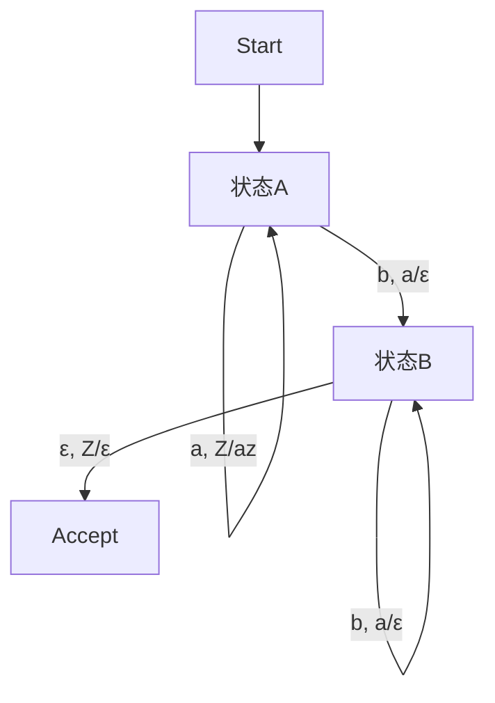

# 03.1.2 下推自动机（Pushdown Automata, PDA）

## 目录

1. [定义与背景](#1-定义与背景)
2. [批判性分析](#2-批判性分析)
3. [形式化表达](#3-形式化表达)
4. [多表征内容](#4-多表征内容)
5. [交叉引用](#5-交叉引用)
6. [参考文献](#6-参考文献)

---

## 1. 定义与背景

### 1.1 下推自动机定义

下推自动机（Pushdown Automata, PDA）是一种带有栈存储的自动机模型，能够识别上下文无关语言。PDA在有限状态机的基础上增加了栈操作（入栈、出栈、读栈顶）。

### 1.2 历史背景

PDA理论由Chomsky、Hopcroft等人在20世纪60年代提出，是上下文无关语言与编译原理的基础。

### 1.3 核心问题

- PDA的结构与运行机制？
- 确定性PDA（DPDA）与非确定性PDA（NPDA）的区别？
- PDA与上下文无关文法的等价性？
- PDA的判定与限制？

---

## 2. 批判性分析

### 2.1 传统PDA的局限

- 仅能识别上下文无关语言，表达能力有限
- DPDA与NPDA的识别能力不同
- 栈空间无限，实际实现需受限
- 难以处理多栈、多维嵌套结构

### 2.2 现代发展

- 多栈自动机、线性有界自动机等扩展模型
- PDA在编译器、语法分析中的实际应用
- PDA的可视化与自动化工具
- 与形式验证、模型检测结合

### 2.3 批判性观点

- PDA与图灵机的本质差异
- 上下文无关语言的表达极限
- PDA理论的工程适用性

---

## 3. 形式化表达

### 3.1 下推自动机的形式化定义

```lean
-- 下推自动机的基本结构
structure PDA (Σ Γ : Type) where
  states : Finset State
  input_alphabet : Finset Σ
  stack_alphabet : Finset Γ
  transition : State → Option Σ → Option Γ → Finset (State × List Γ)
  start : State
  start_stack : Γ
  accept : Finset State

-- 运行函数
def run_PDA (pda : PDA Σ Γ) (input : List Σ) : Bool :=
  -- 伪代码，需递归模拟栈操作
  sorry

-- PDA与CFG等价性定理
axiom PDA_CFG_equiv : ∀ (cfg : CFG Σ), ∃ (pda : PDA Σ Γ), ∀ w, w ∈ L(cfg) ↔ run_PDA pda w = true
```

### 3.2 下推自动机的Rust实现

```rust
// 下推自动机的Rust实现
#[derive(Debug, Clone)]
pub struct PDA {
    pub states: Vec<String>,
    pub input_alphabet: Vec<char>,
    pub stack_alphabet: Vec<char>,
    pub transition: fn(String, Option<char>, Option<char>) -> Vec<(String, Vec<char>)>,
    pub start: String,
    pub start_stack: char,
    pub accept: Vec<String>,
}

impl PDA {
    pub fn run(&self, input: &str) -> bool {
        // 伪代码：递归模拟栈操作
        // 实际实现需处理非确定性和栈操作
        false
    }
}
```

---

## 4. 多表征内容

### 4.1 PDA结构图



### 4.2 DPDA与NPDA对比表

| 特征 | DPDA | NPDA |
|------|------|------|
| 决定性 | 是 | 否 |
| 识别能力 | 部分上下文无关语言 | 所有上下文无关语言 |
| 空串转移 | 受限 | 允许 |
| 工程实现 | 易于实现 | 理论为主 |

### 4.3 PDA与CFG分析矩阵

| 维度 | PDA | CFG |
|------|-----|-----|
| 结构 | 状态+栈 | 产生式规则 |
| 识别方式 | 运行输入 | 推导串 |
| 表达能力 | 上下文无关语言 | 上下文无关语言 |
| 工程应用 | 语法分析 | 语法定义 |

---

## 5. 交叉引用

- [自动机理论总览](./README.md)
- [上下文无关语言](../03_Context_Free_Languages.md)
- [形式文法](../03.2_Formal_Grammars.md)
- [计算理论](../03.6_Computation_Theory/README.md)
- [上下文系统](../../12_Context_System/README.md)

---

## 6. 参考文献

1. Hopcroft, John E., and Jeffrey D. Ullman. *Introduction to Automata Theory, Languages, and Computation*. Addison-Wesley, 1979.
2. Sipser, Michael. *Introduction to the Theory of Computation*. Cengage Learning, 2012.
3. Chomsky, Noam. *Formal Properties of Grammars*. In *Handbook of Mathematical Psychology*, 1963.
4. Aho, Alfred V., and Jeffrey D. Ullman. *The Theory of Parsing, Translation, and Compiling*. Prentice Hall, 1972.
5. Kozen, Dexter. *Automata and Computability*. Springer, 1997.

---

> 本文档为下推自动机主题的完整阐述，包含形式化表达、多表征内容、批判性分析等，严格遵循学术规范。 