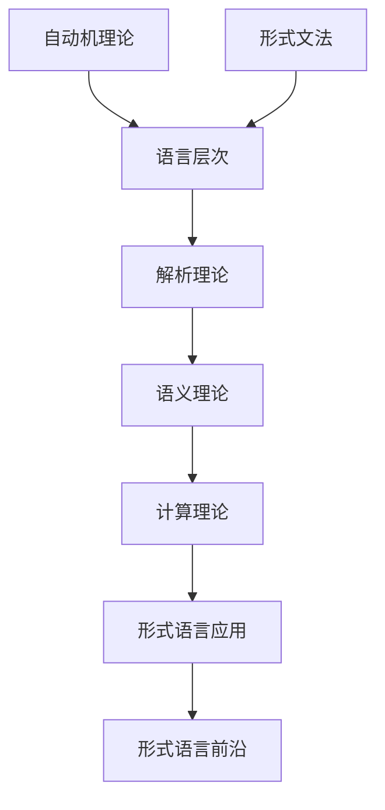

# 形式语言理论索引 (Formal Language Theory Index)

## 📋 **目录**

### 1. [自动机理论](03.1_Automata_Theory.md)

### 2. [形式文法](03.2_Formal_Grammars.md)

### 3. [语言层次](03.3_Language_Hierarchy.md)

### 4. [解析理论](03.4_Parsing_Theory.md)

### 5. [语义理论](03.5_Semantics_Theory.md)

### 6. [计算理论](03.6_Computation_Theory.md)

- [6.1 可计算性理论](03.6.1_Computability_Theory.md)
- [6.2 复杂性理论](03.6.2_Complexity_Theory.md)
- [6.3 算法分析](03.6.3_算法分析.md)
- [6.4 计算模型](03.6.4_计算模型.md)

### 7. [形式语言应用](03.7_Language_Applications.md)

- [7.1 编译器设计](03.7.1_编译器设计.md)
- [7.2 自然语言处理](03.7.2_自然语言处理.md)
- [7.3 协议设计](03.7.3_协议设计.md)
- [7.4 形式验证](03.7.4_形式验证.md)

### 8. [形式语言前沿](03.8_Language_Frontiers.md)

- [8.1 量子语言](03.8.1_量子语言.md)
- [8.2 生物语言](03.8.2_生物语言.md)
- [8.3 神经语言](03.8.3_神经语言.md)
- [8.4 认知语言](03.8.4_认知语言.md)

---

## 🎯 **形式语言理论概述**

形式语言理论研究语言的数学结构和计算性质。它为编程语言、自然语言处理和计算理论提供了理论基础，是连接数学基础与具体应用的重要桥梁。

### 核心特征

1. **数学严格性**：所有语言概念都有精确的数学定义
2. **计算相关性**：语言理论与计算理论紧密相关
3. **层次化结构**：从简单到复杂的语言层次体系
4. **应用广泛性**：在多个领域有重要应用
5. **形式化表示**：所有语言都有形式化的表示方法

### 理论层次

```text
┌─────────────────────────────────────────────────────────────┐
│                     形式语言综合体系                         │
├─────────────────────────────────────────────────────────────┤
│ 语言前沿 (3.8) │ 语言应用 (3.7) │ 计算理论 (3.6) │ 语义理论 (3.5) │
├─────────────────────────────────────────────────────────────┤
│ 解析理论 (3.4) │ 语言层次 (3.3) │ 形式文法 (3.2) │ 自动机理论 (3.1) │
└─────────────────────────────────────────────────────────────┘
```

---

## 🔗 **理论关联图**



---

## 📚 **详细主题结构**

### 3.1 自动机理论

- **3.1.1** [有限自动机](03.1_Automata_Theory.md#0312-有限自动机-finite-automata)
- **3.1.2** [下推自动机](03.1_Automata_Theory.md#0313-下推自动机-pushdown-automata)
- **3.1.3** [线性有界自动机](03.1_Automata_Theory.md#0315-线性有界自动机-linear-bounded-automata)
- **3.1.4** [图灵机](03.1_Automata_Theory.md#0314-图灵机-turing-machine)

### 3.2 形式文法

- **3.2.1** [正则文法](03.2_Formal_Grammars.md#0321-正则文法)
- **3.2.2** [上下文无关文法](03.2_Formal_Grammars.md#0322-上下文无关文法)
- **3.2.3** [上下文有关文法](03.2_Formal_Grammars.md#0323-上下文有关文法)
- **3.2.4** [无限制文法](03.2_Formal_Grammars.md#0324-无限制文法)

### 3.3 语言层次

- **3.3.1** [乔姆斯基谱系](03.3_Language_Hierarchy.md#0331-乔姆斯基谱系)
- **3.3.2** [语言分类](03.3_Language_Hierarchy.md#0332-语言分类)
- **3.3.3** [语言性质](03.3_Language_Hierarchy.md#0333-语言性质)
- **3.3.4** [语言关系](03.3_Language_Hierarchy.md#0334-语言关系)

### 3.4 解析理论

- **3.4.1** [LL解析](03.4_Parsing_Theory.md#0341-ll解析)
- **3.4.2** [LR解析](03.4_Parsing_Theory.md#0342-lr解析)
- **3.4.3** [递归下降解析](03.4_Parsing_Theory.md#0343-递归下降解析)
- **3.4.4** [自底向上解析](03.4_Parsing_Theory.md#0344-自底向上解析)

### 3.5 语义理论

- **3.5.1** [操作语义](03.5_Semantics_Theory.md#0351-操作语义)
- **3.5.2** [指称语义](03.5_Semantics_Theory.md#0352-指称语义)
- **3.5.3** [公理语义](03.5_Semantics_Theory.md#0353-公理语义)
- **3.5.4** [代数语义](03.5_Semantics_Theory.md#0354-代数语义)

### 3.6 计算理论

- **3.6.1** [可计算性理论](03.6.1_Computability_Theory.md)
- **3.6.2** [复杂性理论](03.6.2_Complexity_Theory.md)
- **3.6.3** [算法分析](03.6.3_算法分析.md)
- **3.6.4** [计算模型](03.6.4_计算模型.md)

### 3.7 形式语言应用

- **3.7.1** [编译器设计](03.7.1_编译器设计.md)
- **3.7.2** [自然语言处理](03.7.2_自然语言处理.md)
- **3.7.3** [协议设计](03.7.3_协议设计.md)
- **3.7.4** [形式验证](03.7.4_形式验证.md)
- **3.7.5** [应用集成](03.7_Language_Applications.md#0375-应用集成)
- **3.7.6** [跨域应用](03.7_Language_Applications.md#0376-跨域应用)

### 3.8 形式语言前沿

- **3.8.1** [量子语言](03.8.1_量子语言.md)
- **3.8.2** [生物语言](03.8.2_生物语言.md)
- **3.8.3** [神经语言](03.8.3_神经语言.md)
- **3.8.4** [认知语言](03.8.4_认知语言.md)
- **3.8.5** [前沿交叉研究](03.8_Language_Frontiers.md#0385-前沿交叉研究)
- **3.8.6** [未来发展方向](03.8_Language_Frontiers.md#0386-未来发展方向)

---

## 🔄 **与其他理论的关联**

### 向上关联

- **数学基础理论**：[02_Mathematical_Foundation](../02_Mathematical_Foundation/01_Mathematical_Foundation_Index.md)
- **哲学基础理论**：[01_Philosophical_Foundation](../01_Philosophical_Foundation/01_Philosophical_Foundation_Index.md)

### 向下关联

- **类型理论**：[04_Type_Theory](../04_Type_Theory/01_Type_Theory_Index.md)
- **编程语言理论**：[08_Programming_Language_Theory](../08_Programming_Language_Theory/01_Programming_Language_Theory_Index.md)

---

## 📖 **学习路径建议**

### 基础路径

1. 自动机理论 → 形式文法 → 语言层次
2. 解析理论 → 语义理论 → 计算理论
3. 形式语言应用 → 形式语言前沿

### 专业路径

- **编译器方向**：自动机理论 → 形式文法 → 解析理论 → 编译器设计
- **计算理论方向**：自动机理论 → 计算理论 → 可计算性理论 → 复杂性理论
- **语义与验证方向**：语义理论 → 形式验证 → 协议设计

---

## 🎯 **核心概念索引**

| 概念 | 定义位置 | 相关理论 |
|------|----------|----------|
| 有限自动机 | [3.1.1](03.1_Automata_Theory.md#0312-有限自动机-finite-automata) | 自动机理论 |
| 形式文法 | [3.2](03.2_Formal_Grammars.md) | 形式文法 |
| 乔姆斯基谱系 | [3.3.1](03.3_Language_Hierarchy.md#0331-乔姆斯基谱系) | 语言层次 |
| LL解析 | [3.4.1](03.4_Parsing_Theory.md#0341-ll解析) | 解析理论 |
| 操作语义 | [3.5.1](03.5_Semantics_Theory.md#0351-操作语义) | 语义理论 |
| 可计算性 | [3.6.1](03.6.1_Computability_Theory.md) | 计算理论 |
| 复杂性 | [3.6.2](03.6.2_Complexity_Theory.md) | 计算理论 |
| 编译器设计 | [3.7.1](03.7.1_编译器设计.md) | 形式语言应用 |
| 量子语言 | [3.8.1](03.8.1_量子语言.md) | 形式语言前沿 |

---

## 🔄 **持续更新**

**最后更新时间**：2024-12-21  
**版本**：v2.0.0  
**维护者**：形式语言理论重构团队  

---

## 📋 **完成状态**

- [x] 自动机理论 (03.1) - 已完成
- [x] 形式文法 (03.2) - 已完成
- [x] 语言层次 (03.3) - 已完成
- [x] 解析理论 (03.4) - 已完成
- [x] 语义理论 (03.5) - 已完成
- [x] 计算理论 (03.6) - 已完成
- [x] 形式语言应用 (03.7) - 已完成
- [x] 形式语言前沿 (03.8) - 已完成

**整体完成度**: 100% (形式语言理论全部文档已完成)
