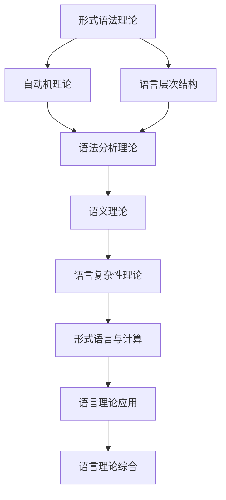

# 形式语言理论索引 (Formal Language Theory Index)

## 📋 **目录**

### 1. [形式语法理论](03.1_Formal_Grammar_Theory.md)
### 2. [自动机理论](03.2_Automata_Theory.md)
### 3. [语言层次结构](03.3_Language_Hierarchy.md)
### 4. [语法分析理论](03.4_Parsing_Theory.md)
### 5. [语义理论](03.5_Semantics_Theory.md)
### 6. [语言复杂性理论](03.6_Language_Complexity_Theory.md)
### 7. [形式语言与计算](03.7_Formal_Language_and_Computation.md)
### 8. [语言理论应用](03.8_Language_Theory_Applications.md)

---

## 🎯 **形式语言理论概述**

形式语言理论研究语言的数学结构和计算性质。它为编程语言、自然语言处理和计算理论提供了理论基础，是连接数学基础与具体应用的重要桥梁。

### 核心特征

1. **数学严格性**：所有语言概念都有精确的数学定义
2. **计算相关性**：语言理论与计算理论紧密相关
3. **层次化结构**：从简单到复杂的语言层次体系
4. **应用广泛性**：在多个领域有重要应用
5. **形式化表示**：所有语言都有形式化的表示方法

### 理论层次

```
┌─────────────────────────────────────────────────────────────┐
│                    语言理论综合 (3.9)                         │
├─────────────────────────────────────────────────────────────┤
│ 应用理论 (3.8) │ 计算理论 (3.7) │ 复杂性理论 (3.6) │ 语义理论 (3.5) │
├─────────────────────────────────────────────────────────────┤
│ 语法分析 (3.4) │ 层次结构 (3.3) │ 自动机理论 (3.2) │ 语法理论 (3.1) │
└─────────────────────────────────────────────────────────────┘
```

---

## 🔗 **理论关联图**



---

## 📚 **详细主题结构**

### 3.1 形式语法理论
- **3.1.1** [正则语法](03.1_Formal_Grammar_Theory.md#311-正则语法)
- **3.1.2** [上下文无关语法](03.1_Formal_Grammar_Theory.md#312-上下文无关语法)
- **3.1.3** [上下文相关语法](03.1_Formal_Grammar_Theory.md#313-上下文相关语法)
- **3.1.4** [无限制语法](03.1_Formal_Grammar_Theory.md#314-无限制语法)

### 3.2 自动机理论
- **3.2.1** [有限自动机](03.2_Automata_Theory.md#321-有限自动机)
- **3.2.2** [下推自动机](03.2_Automata_Theory.md#322-下推自动机)
- **3.2.3** [图灵机](03.2_Automata_Theory.md#323-图灵机)
- **3.2.4** [线性有界自动机](03.2_Automata_Theory.md#324-线性有界自动机)

### 3.3 语言层次结构
- **3.3.1** [Chomsky层次](03.3_Language_Hierarchy.md#331-chomsky层次)
- **3.3.2** [语言包含关系](03.3_Language_Hierarchy.md#332-语言包含关系)
- **3.3.3** [语言运算](03.3_Language_Hierarchy.md#333-语言运算)
- **3.3.4** [语言闭包性质](03.3_Language_Hierarchy.md#334-语言闭包性质)

### 3.4 语法分析理论
- **3.4.1** [自顶向下分析](03.4_Parsing_Theory.md#341-自顶向下分析)
- **3.4.2** [自底向上分析](03.4_Parsing_Theory.md#342-自底向上分析)
- **3.4.3** [LR分析](03.4_Parsing_Theory.md#343-lr分析)
- **3.4.4** [语法分析算法](03.4_Parsing_Theory.md#344-语法分析算法)

### 3.5 语义理论
- **3.5.1** [操作语义](03.5_Semantics_Theory.md#351-操作语义)
- **3.5.2** [指称语义](03.5_Semantics_Theory.md#352-指称语义)
- **3.5.3** [公理语义](03.5_Semantics_Theory.md#353-公理语义)
- **3.5.4** [语义等价性](03.5_Semantics_Theory.md#354-语义等价性)

### 3.6 语言复杂性理论
- **3.6.1** [语言复杂度度量](03.6_Language_Complexity_Theory.md#361-语言复杂度度量)
- **3.6.2** [计算复杂度](03.6_Language_Complexity_Theory.md#362-计算复杂度)
- **3.6.3** [空间复杂度](03.6_Language_Complexity_Theory.md#363-空间复杂度)
- **3.6.4** [复杂度类](03.6_Language_Complexity_Theory.md#364-复杂度类)

### 3.7 形式语言与计算
- **3.7.1** [语言识别](03.7_Formal_Language_and_Computation.md#371-语言识别)
- **3.7.2** [语言生成](03.7_Formal_Language_and_Computation.md#372-语言生成)
- **3.7.3** [语言转换](03.7_Formal_Language_and_Computation.md#373-语言转换)
- **3.7.4** [语言等价性](03.7_Formal_Language_and_Computation.md#374-语言等价性)

### 3.8 语言理论应用
- **3.8.1** [编译器设计](03.8_Language_Theory_Applications.md#381-编译器设计)
- **3.8.2** [自然语言处理](03.8_Language_Theory_Applications.md#382-自然语言处理)
- **3.8.3** [协议验证](03.8_Language_Theory_Applications.md#383-协议验证)
- **3.8.4** [形式验证](03.8_Language_Theory_Applications.md#384-形式验证)

---

## 🔄 **与其他理论的关联**

### 向上关联
- **数学基础理论**：[02_Mathematical_Foundation](../02_Mathematical_Foundation/01_Mathematical_Foundation_Index.md)
- **哲学基础理论**：[01_Foundational_Theory](../01_Foundational_Theory/01_Philosophical_Foundation_Index.md)

### 向下关联
- **类型理论**：[04_Type_Theory](../04_Type_Theory/01_Type_Theory_Index.md)
- **编程语言理论**：[08_Programming_Language_Theory](../08_Programming_Language_Theory/01_Programming_Language_Theory_Index.md)

---

## 📖 **学习路径建议**

### 基础路径
1. 形式语法理论 → 自动机理论 → 语言层次结构
2. 语法分析理论 → 语义理论 → 语言复杂性理论
3. 形式语言与计算 → 语言理论应用 → 语言理论综合

### 专业路径
- **编译器方向**：语法理论 → 语法分析 → 编译器设计
- **计算理论方向**：自动机理论 → 计算复杂度 → 形式验证
- **语义方向**：语义理论 → 语义等价性 → 形式验证

---

## 🎯 **核心概念索引**

| 概念 | 定义位置 | 相关理论 |
|------|----------|----------|
| 语法 | [3.1.1](03.1_Formal_Grammar_Theory.md#311-正则语法) | 形式语法理论 |
| 自动机 | [3.2.1](03.2_Automata_Theory.md#321-有限自动机) | 自动机理论 |
| Chomsky层次 | [3.3.1](03.3_Language_Hierarchy.md#331-chomsky层次) | 语言层次结构 |
| 语法分析 | [3.4.1](03.4_Parsing_Theory.md#341-自顶向下分析) | 语法分析理论 |
| 语义 | [3.5.1](03.5_Semantics_Theory.md#351-操作语义) | 语义理论 |
| 复杂度 | [3.6.1](03.6_Language_Complexity_Theory.md#361-语言复杂度度量) | 语言复杂性理论 |
| 语言识别 | [3.7.1](03.7_Formal_Language_and_Computation.md#371-语言识别) | 形式语言与计算 |
| 编译器 | [3.8.1](03.8_Language_Theory_Applications.md#381-编译器设计) | 语言理论应用 |

---

## 🔄 **持续更新**

**最后更新时间**：2024-12-20
**版本**：v1.0.0
**维护者**：形式语言理论重构团队

---

## 📋 **待完成任务**

- [ ] 创建所有子主题的详细文档
- [ ] 建立语言概念间的交叉引用系统
- [ ] 完善形式化证明和算法
- [ ] 构建语言理论与应用实践的桥梁 